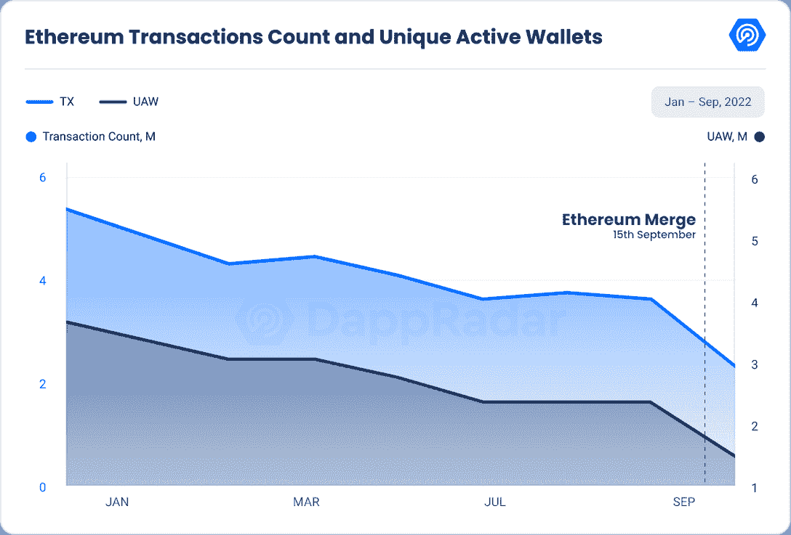
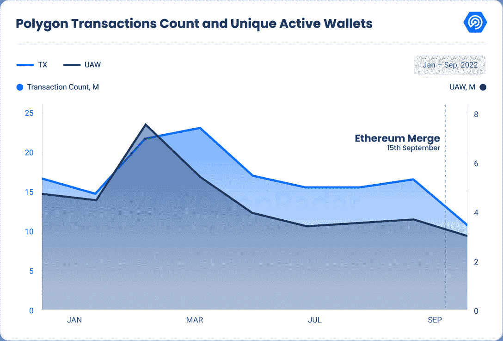
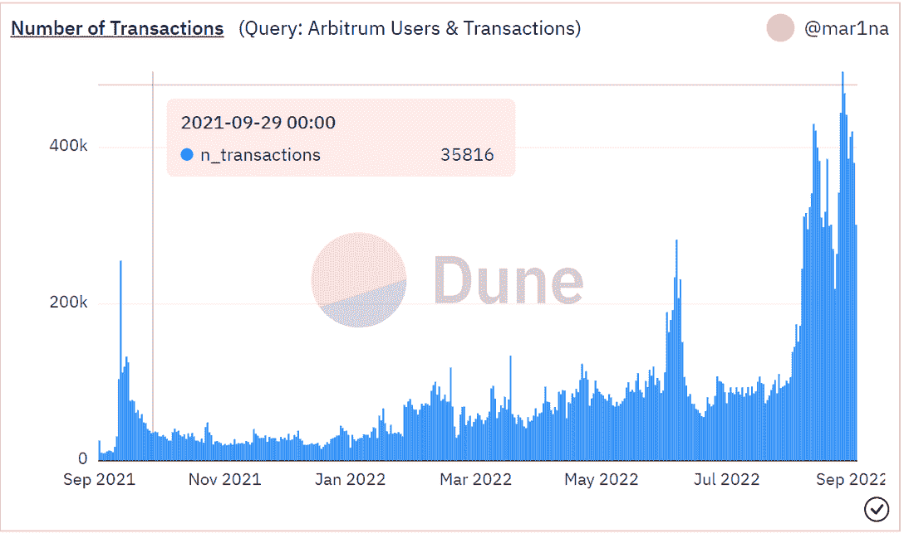
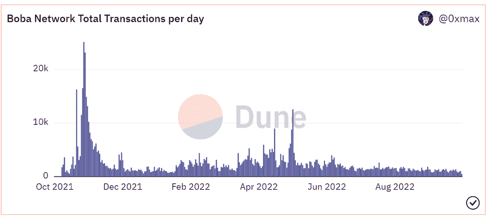

# 衡量以太坊合并对第二层的影响

> 原文：<https://web.archive.org/web/https://dappradar.com/blog/measuring-the-impact-of-ethereums-merge-on-layer-2>

## 在合并之前，第 2 层上的活动更大；然而，交易数量下降了 36%，唯一活跃钱包数量下降了 27%。

以太坊是仅次于比特币的第二大加密货币，也是数百个 DeFi 倡议的门户，它拥有一个安全的环境。由于它是可编程和可扩展的，任何人都可以用它来创建 dapps 和其他区块链产品。然而，高昂的油价、电力消耗和网络拥堵是以太坊最大的缺点。

高油价阻碍了商人、游戏玩家和艺术家在以太坊网络上进行交易。因此，一些第 2 层解决方案通过提供安全和快速的网络确认而不需要或降低油价，解决了常见的以太坊难题。

人们想知道 L2 生态系统将如何适应“合并后”的场景，考虑到以太坊正在通过合并构建其基础设施。然而，由于合并，以太坊环境得到了加强，并开辟了通往更高效的第二层的道路。

该报告将分析对最常见的第 2 层的直接影响。

*   [什么是第 1 层和第 2 层区块链？](https://web.archive.org/web/20221219213845/https://dappradar.com/blog/what-are-layer-1-and-layer-2-blockchains)

## 关键要点

*   这次合并是以太坊路线图上的一个重要里程碑，对连锁店的可扩展性影响很小。
*   从 9 月 15 日到 17 日，以太坊的平均天然气价格下降了 61%,但随后又开始上涨，现在几乎回到了合并前的水平。
*   第 2 层合并前活动显著增加，合并后活动降温；交易数量下降了 36%，唯一活跃钱包下降了 27%。
*   乐观情绪见证了 TVL 从 7 月 1 日的 2.7446 亿美元到 8 月 31 日的 9.0274 亿美元增长了 228%。经过 7 月和 8 月的大肆宣传，TVL 在 9 月仅下降了 2%(8.846 亿美元)，成为表现最好的协议之一。
*   Arbitrum 的交易量环比增长了 54.7%，而 TVL 增长了 2%(9.79 亿美元)。
*   虽然不可变更交易的数量减少了 1.1%，但 NFT 交易量增长了 101%(430 万美元)。

## 内容

*   [以太坊的燃气费用保持不变](https://web.archive.org/web/20221219213845/https://dappradar.com/blog/measuring-the-impact-of-ethereums-merge-on-layer-2/#Gas-costs-in-Ethereum-have-remained-unchanged-post-merge)
*   [以太坊合并后，layer2 活动发生了什么变化？](https://web.archive.org/web/20221219213845/https://dappradar.com/blog/measuring-the-impact-of-ethereums-merge-on-layer-2/#What-happened-with-layer2-activity-after-Ethereum’s-Merge?-)
    *   [Polygon 的交易和唯一活跃钱包分别下降了 33%和 17%](https://web.archive.org/web/20221219213845/https://dappradar.com/blog/measuring-the-impact-of-ethereums-merge-on-layer-2/#Polygon’s-transactions-and-unique-active-wallets-dropped-by-33%-and-17%)
    *   [浪人交易和活跃钱包分别下降 51%和 54%](https://web.archive.org/web/20221219213845/https://dappradar.com/blog/measuring-the-impact-of-ethereums-merge-on-layer-2/#Ronin-transactions-and-active-wallets-dropped-51%-and-54%)
    *   乐观是冬季的顶级秘密表演者
    *   与乐观主义一样，Arbitrum 在此次熊市中表现出色
    *   [Loopring，GameStop NFT 市场的本土区块链人](https://web.archive.org/web/20221219213845/https://dappradar.com/blog/measuring-the-impact-of-ethereums-merge-on-layer-2/#Loopring,-the-native-blockchain-of-GameStop-NFT-marketplace)
    *   [不可变 X 交易量下降 1.1%，而 NFT 交易量上升 101%](https://web.archive.org/web/20221219213845/https://dappradar.com/blog/measuring-the-impact-of-ethereums-merge-on-layer-2/#Immutable-X-transactions-declined-1.1%,-whereas-NFT-volume-rose-101%)
    *   [波巴的交易数和 TVL 分别下降了 42%和 35%](https://web.archive.org/web/20221219213845/https://dappradar.com/blog/measuring-the-impact-of-ethereums-merge-on-layer-2/#Boba’s-transactions-count-and-TVL-decreased-by-42%-and-35%)
    *   [梅蒂斯的 TVL 出现复苏迹象](https://web.archive.org/web/20221219213845/https://dappradar.com/blog/measuring-the-impact-of-ethereums-merge-on-layer-2/#Metis’s-TVL-shows-signs-of-recovery)
*   [结论](https://web.archive.org/web/20221219213845/https://dappradar.com/blog/measuring-the-impact-of-ethereums-merge-on-layer-2/#Conclusion)

## 合并后以太坊的天然气价格保持不变

以太坊是一个基于区块链的分散式应用程序，支持智能合约。以太坊是一个开源平台，主要用于支持世界第二大加密货币以太。以太坊允许在其区块链上创建的智能合同和应用程序在没有欺诈、停机、第三方干预或控制的情况下运行。

以太坊也是一种编程语言，方便开发人员创建分布式应用程序。微软与 ConsenSys 合作，在微软 Azure 上提供以太坊区块链作为服务，使开发者和企业客户只需点击一下，就可以访问基于云的区块链开发环境。

关于以太坊的更多细节，请阅读本[指南](https://web.archive.org/web/20221219213845/https://dappradar.com/blog/what-is-ethereum-dappradars-ultimate-guide)。

合并升级是以太坊期待已久的从“工作证明”共识机制到“利益证明”系统的迁移。由于其潜在的物质和哲学分歧，这项耗时六年的合并被许多人视为加密货币历史上的分水岭时刻。由于通货膨胀和利率上升等原因，市场经历了几个月的不稳定，这一成就可能有助于增强市场信心，并注入一些急需的乐观情绪。

有关以太坊合并的更多信息，请查看本文。

纵观 2022 年全年的独特活跃钱包和交易，我们可以看到一个下降趋势，并将 8 月份的数据与 9 月份进行比较，交易和 UAW 均环比下降 35%。

与以太坊交易和独特活跃钱包的趋势相同，以太坊的 TVL 自年初以来也呈下降趋势，与 8 月份相比，月环比下降 5.6%(314.1 亿美元)。

合并并没有立即降低天然气价格。事实上，查看平均天然气价格图表，我们可以看到，从 9 月 15 日到 17 日，平均天然气费用下降了 61%，但随后开始上升，目前几乎与合并前相同。

Source: [etherscan](https://web.archive.org/web/20221219213845/https://etherscan.io/chart/gasprice)

合并的技术进步中没有任何旨在降低成本的内容。然而，它将为未来的天然气优化提供所需的技术基础设施。

由于高度的经济不确定性和当前的宏观经济形势，并考虑到合并不是一个巨大的规模事件，而只是以太坊路线图中的一小步，指标表明合并并没有产生人们预期的巨大影响。

## Polygon 的交易和唯一活跃钱包分别下降了 33%和 17%

Polygon，以前称为 Matic，是一个侧链，用于构建以太坊兼容的区块链，并作为以太坊网络上的第 2 层解决方案。Matic 是网络的本地令牌，用于公用事业服务，如燃气费支付、治理工具和赌注激励。

Source: [Momentum6](https://web.archive.org/web/20221219213845/https://momentum6.substack.com/)

作为一个侧链协议，Polygon 有更便宜的费用和更快的交易速率，这是主流区块链的缺点。

侧链的概念需要与“主”区块链同时操作第二个区块链。然后，这两个区块链可能以允许资产在它们之间转移的方式相互通信。

有关多边形的更多信息，请阅读本[指南](https://web.archive.org/web/20221219213845/https://dappradar.com/blog/what-is-polygon-a-simple-explanation/)。

多边形交易和独特的主动钱包和以太坊有相同的下降趋势。从图表中我们可以看到，从 2022 年 6 月到 8 月，交易量增长了 6.4%，UAW 增长了 4%，这主要是由对预合并的热情和大量新闻推动的。与前一个月相比，9 月份的增长出现了大幅下降。我们的交易量下降了 33%,独立活动钱包下降了 17%。

与之前分析的指标趋势相同，Polygon 的持续下降，本月与上个月相比下降了 28%(13.3 亿美元)。

## 浪人交易和独特的活跃钱包分别下降了 51%和 54%

Ronin 是专门为 Axie 生态系统开发的以太坊侧链。它面向近即时交易和适度的成本，在视频游戏中实现数百万次微交易。

Source: [decentralized.co](https://web.archive.org/web/20221219213845/https://www.decentralised.co/p/understanding-ronin)

该网络是 Axie Infinity 的支柱，促进所有交易并保留其资产 Axie、土地、SLP、AXS 和 Wrapped ETH (WETH)。目前，该网络采用基于权威证明的共识方法。这表明验证器更少(7 个)，但是交易确认时间更快。目前，该网络的验证者包括币安，育碧，和 Animoca 品牌。

Ronin 的交易计数和唯一活跃钱包与 Polygon 和 Ethereum 具有相同的下降趋势，分别比 2022 年 8 月下降了 51%和 54%。

Ronin 的 TVL 遵循同样的趋势，与前一个月相比下降了 15%(5844 万美元)。值得一提的是，从 9 月 12 日到 9 月 15 日，它减少了 30%(4628 万美元)，然后开始增加，达到当前值。

## 乐观，一个顶级的秘密冬季表演者

乐观层-2 是一个高效的以太坊扩展解决方案，可以降低以太坊区块链的交易费用。

乐观是一种独特的技术，乐观汇总将许多加密事务合并为一个，然后将该事务发送到另一个区块链进行进一步处理。

利用数据压缩的概念，它随后将交易收据发送回以太坊，从而降低了进行以太坊交易的成本。

关于乐观的更多信息，请阅读本[指南](https://web.archive.org/web/20221219213845/https://dappradar.com/blog/optimism-data-points-to-layer-2-season)。

自 2022 年初以来，乐观主义仍处于上升趋势，即使交易计数和唯一活跃钱包与上月相比均下降了 37%。但是，从 2022 年 1 月开始，它的交易数量增加了 194%，独特的活动钱包增加了 275%。在这个加密的冬天，这是表现最好的协议之一。

乐观是 7 月和 8 月表现最好的协议之一，在 TVL 从 7 月 1 日的约 2.7446 亿美元增长到 8 月 31 日的约 9.0274 亿美元，增幅达 228%。

这种增长是由乐观情绪推动的，这种乐观情绪可能会从以太坊的“以汇总为中心的路线图”合并中受益，该路线图将其主链转换为结算和数据可用性层，并通过“danksharding”将可扩展性委托给第 2 层汇总。

经过 7 月和 8 月的大肆宣传，9 月 TVL 仅下降 2%(8.846 亿美元)，再次成为 9 月表现最好的协议之一。

## 与乐观主义一样，Arbitrum 在此次熊市中表现出色

Arbitrum 是一个第 2 层解决方案项目，旨在提高以太坊智能合约的可伸缩性，并提供额外的隐私功能。

该平台旨在使开发者在第二层执行以太坊虚拟机(EVM)合同和以太坊交易变得简单，同时保留以太坊卓越的第一层安全性。

Arbitrum 的开发是为了克服基于以太坊的智能合约的一些缺陷。至于缺点，如冗长的交易和昂贵的执行费用:

Arbitrum 记录提交给 Ethereum 主链的批量交易，并使用一个称为交易汇总的过程，在负担得起、可扩展的第 2 层侧链上执行这些交易。这种技术减轻了以太坊的大部分计算和存储开销，同时允许一类新的弹性的基于第二层的 dapps。

Source: [Dune Analytics ](https://web.archive.org/web/20221219213845/https://dune.com/browse/dashboards)

在这次熊市中，Arbitrum 和乐观主义是另一个表现良好的协议。当我们查看交易数量时，我们可以看到自年初以来一直处于上升趋势，从 8 月到 9 月增长了 54.7%。

Arbitrum 的 TVL 与交易计数的趋势不同，但从 2022 年 8 月初开始，我们看到一个新的较小的上升趋势的形成。看看 9 月份的数据，TVL 比上个月增长了 2%(9 . 79 亿美元)。

## Loopring，GameStop NFT 市场的本土区块链

Loopring 是一种基于以太坊区块链的第 2 层扩展协议，用于分散式交易所(dex ),每秒可以处理数千笔交易。虽然 Loopring 技术作为协议层适用于整个 dex，但该平台还提供 Loopring Exchange，这是一个非托管的交易平台，具有安全、高速的交易，没有气体成本。Loopring 利用零知识证明(ZKPs)，这是区块链的一项突破，它将事务捆绑在一起以提高效率，让任何人都可以创建高吞吐量、非托管的 DEX。Loopring 还用 LCR 币奖励零知识累积(zk-Rollup)运营商和流动性提供商。

Loopring 的 TVL 也呈下降趋势，环比下降 15.8%(1.3864 亿美元)。

值得一提的是，GameStop marketplace 原生运行在 Loopring 上，他们刚刚宣布了一个额外的项目，在 Loopring 的协议上创建一个 GameStop 钱包。

没有人预见到这种方法的到来。GameStop 进入 NFTs 领域较晚。它加入了旨在削弱 OpenSea 主导地位的竞争对手行列。截至 2022 年 9 月，它是第十大交易市场。

欲知 GameStop 市场的更多详情，请阅读[我们的最新报道](https://web.archive.org/web/20221219213845/https://dappradar.com/blog/new-dapps-report-gamestop-marketplace)。

## 不可变 X 交易量下降了 1.1%，而 NFT 交易量上升了 101%

不可变 X 是第二层区块链，它解决了基于以太坊的 NFTs 的可伸缩性问题。它让用户在一个安全的平台上免费构建和管理 NFT 项目。它还提供了快速交易确认、无汽油成本和可扩展性，而不会牺牲游戏、应用和市场的安全性。

使用零知识汇总技术，该网络每秒可以执行 9000 多次交易和造币。这超过了传统 NFT 项目的规模要求。不可变 X 还旨在简化 NFT 和 ERC-20 的交易、铸造和邮寄。

有关 ImmutableX 的更多信息，请阅读我们的[指南](https://web.archive.org/web/20221219213845/https://dappradar.com/blog/what-is-immutable-x)。

除了为以太坊区块链上的 NFTs 开发第二层解决方案，Immutable X 还提供了一个全面的碳中性 NFT 市场，可以补偿碳排放。换句话说，L2 方法确保了在非金融交易的创建和交易过程中不会浪费能源。Immutable X 通过与气候感知公司建立关系来实现这一点。

Immutable X 是本次熊市中的另一个最佳表现者，特别是因为 NFT 的交易量较上月增长了 101%(430 万美元)，而交易数量环比仅下降了 1.1%。

## 波巴的交易计数和 TVL 下降了 42%和 35%

Boba Network(之前的 OMGX)是以太坊的一个扩展解决方案，于 2021 年 8 月发布了其 mainnet beta。在以太坊网络上，Boba Network 承诺削减交易和计算成本，提高吞吐量，并扩展智能合约的功能。为了实现这一点，Boba Network 采用了乐观汇总(ORs ),这是一种第二层扩展机制，假设交易是真实的，直到它们有争议。如果交易有争议，可以使用计算来检查和验证交易。

区块链和人工智能(AI)基础设施业务恩雅和 OMG 基金会都在推广博巴网络(前身为 OMG Network 和 OmiseGo)。恩雅是区块链的一家基础设施企业，对以太坊最初的第二层解决方案之一 OMG 做出了重大贡献。BOBA 由恩雅和 OMG 基金会创建，旨在为应用程序开发提供一个完全兼容以太坊网络的可扩展平台。最终，BOBA 将帮助开发者快速创建强大而多样的应用。

在分散金融(DeFi)生态系统中，Boba Network 采用波霸令牌(Boba)来支持治理，并奖励网络扩展和用户采用。除了被不可替代的令牌(NFT)项目使用之外，Boba Network 还支持支持 Web3 的应用。

Source: [Dune Analytics](https://web.archive.org/web/20221219213845/https://dune.com/browse/dashboards)

分析 Boba 的交易数量，我们可以观察到，过去三个月的交易数量保持在相同的范围内，9 月份与上月相比下降了 42%。

TVL 也呈下降趋势，与上月相比下降了 35%(420 万美元)。

## 梅蒂斯的 TVL 显示出复苏的迹象

Metis 是基于以太坊区块链的第二层区块链，重点是促进分散社区(DAOs)的发展。随着技术的出现，出现了去中心化的前景——例如,“道”是一种没有首席执行官、董事长或总裁的公司、机构或组织的去中心化形式。一个组织或社区的所有规则都在“道”的智能合同中列出，所有用户都可以投票或提出修改建议，这些都记录在区块链上。

作为第二层解决方案，Metis 区块链在将大量交易同步到以太坊主网之前处理离线交易。在这方面堪比阿比特鲁姆和乐观主义。然而，Metis 和其他第 2 层系统之间的主要区别在于，它使用乐观汇总而不是 zK 汇总来处理事务。

乐观汇总是最新一代的第 2 层扩展解决方案，与 zK 汇总相比，它们提供了许多好处。由于验证器的排序层，zK 汇总需要更高级别的安全性；这些层是为了防止区块链上的欺诈性交易而设置的，但是它们使用单个序列发生器，在高交易量时会堵塞网络，导致与原始 mainnet 相同的问题。

梅蒂斯 TVL 已经开始上涨，8 月份从 3959 万美元攀升至 5653 万美元，涨幅 42.7%。这一增长与合并前的预期一致。在 8 月份上涨后，TVL 在 9 月份下跌了 9.7%(5101 万美元)，但仍比 8 月初上涨了 29%。

## 结论

合并后，以太坊仍然远远没有成为布特林所设想的最终产品。用户体验受到与乐观汇总相关联的漫长撤回期的负面影响，而分片扩展解决方案仍需要许多年才能实现。

随着新的 L1 立即提供高交易能力，但仍然缺乏以太坊所需的安全级别，世界领先的 Web3 网络必须立即为 dApp 开发者和用户提供速度和成本效益。这是因为新的 L1 立即提供了高交易能力。

尽管加密货币市场处于熊市，但不可替代代币(NFT)和区块链游戏市场仍在快速增长。正因为如此，以太坊需要准备好应对新的需求激增，在加密货币的世界里，这种情况可能随时发生，而不会堵塞和将天然气费送入轨道。因为这只能通过 L2s 来完成，所以可以有把握地假设 L2s 在未来相当长的一段时间内将继续存在。