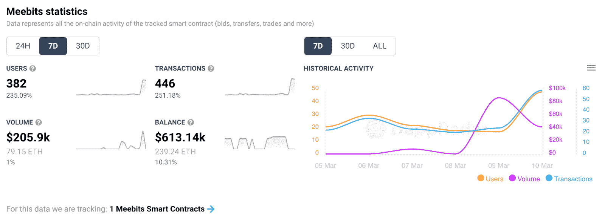
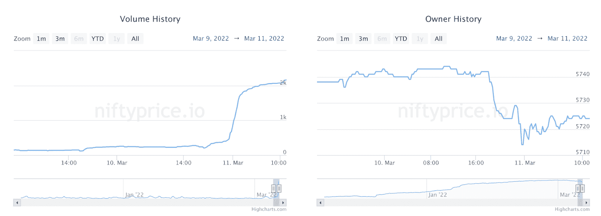
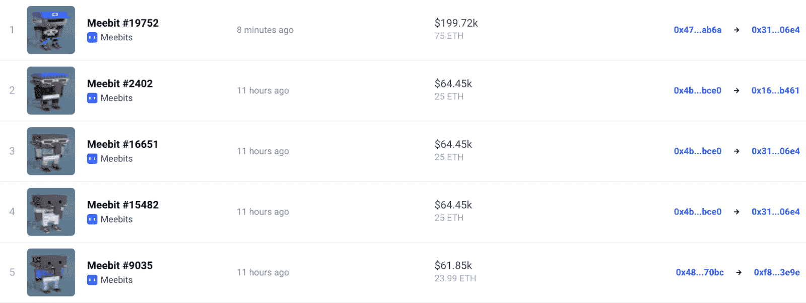

# Meebits NFTs 吸引鲸鱼活动，底价跃升 93%

> 原文：<https://web.archive.org/web/https://dappradar.com/blog/meebits-nfts-attract-whale-activity-floor-price-jumps-93>

## 过去 24 小时内，与收藏互动的交易者数量增加了 680%

**来自** [**米比特 NFT 系列**](https://web.archive.org/web/20221007192132/https://dappradar.com/ethereum/collectibles/meebits) **的 3D 头像在最近几个月的底价和活跃度方面保持了相对稳定的地位。然而，在过去的一周里，米比特的拍卖活动出现了一些严重的高峰，几乎使 NFT 藏品的底价翻了一倍。**

根据 DappRadar 的数据，在过去的七天里，该集合的智能合约处理了 250%的交易。此外，与该系列互动的钱包数量同期增长了 235%。

此外，过去 7 天，米比特 NFT 的底价几乎翻了一番。目前，二级市场上最便宜的 Meebits NFT 标价为 12720 美元。最近的活动高峰将 Meebits 系列推到了 DappRadar 顶级 NFT 系列排行榜的前列。

## 鲸鱼活动和最高销售收入

除了越来越多的交易者与收藏互动，鲸鱼活动似乎也出现了高峰。根据 DappRadar 的数据，在过去的七天里，有几个钱包一直在积极地扫地板价 Meebits。

例如，[这只钱包](https://web.archive.org/web/20221007192132/https://dappradar.com/hub/wallet/eth/0xb36592765e61e1277778ab27162f87303de803ba)在过去七天里购买了 23 只 Meebits NFTs，将投资组合中的 Meebits 总持有量提高到 29 只。这位收藏家似乎决定打造一款专属 Meebits 钱包，因为这是钱包中唯一的藏品。令人印象深刻的是，新购买的 meebits 平均价格在 2.5 ETH 左右，总投资为 16.4 万美元。这意味着在撰写本文时，钱包的所有者已经获得了相当大的利润，考虑到其中一个非功能性钱包的底价现在约为 4 ETH。另一个有趣的例子是 [Shiven 保险库地址](https://web.archive.org/web/20221007192132/https://dappradar.com/hub/wallet/eth/0xfee506a57a08bafd61fc3fda2209fd416c41752d)，它在过去的七天里购买了 11 个 Meebits NFTs。

更重要的是，在过去的 24 小时里，收藏者的总数已经明显减少了。我们可以把这种情况解释为鲸鱼从更小的持有者那里获得更多的蜂蜜。

Source: [niftyprice.io](https://web.archive.org/web/20221007192132/https://www.niftyprice.io/collections/meebits)

除了鲸鱼注意力的提高，虚拟形象也吸引了一些高收入的销售。在过去的 24 小时里，这个系列已经为超过 23 个 ETH 创造了无数的销售额，或者每个超过 6 万美元。这里有一点很重要，每一个都是大象米比特·NFT，是 NFT 收藏中最稀有的角色。

## 在 DappRadar 上监控 Meebits

Meebits 是 CryptoPunks 的创造者幼虫实验室的第二个项目。考虑到这一点，这些收藏品引起人们的兴趣也就不足为奇了。然而，最近的活动高峰令人印象深刻，即使是像这样的高价值收藏。

如果你想密切关注交易活动，请查看官方 [DappRadar Meebits 页面](https://web.archive.org/web/20221007192132/https://dappradar.com/ethereum/collectibles/meebits)。在那里你可以找到关于交易量、最近的销售、底价变化和市值估价的信息。

此外，您可以使用 [DappRadar 投资组合跟踪工具](https://web.archive.org/web/20221007192132/https://dappradar.com/hub/wallet/)查看自己的持有情况。只需用你的钱包地址登录，你所有的 NFT 就会弹出，显示购买价格和当前估值的信息。你也可以在[的 Twitter](https://web.archive.org/web/20221007192132/https://twitter.com/dappradar) 上关注 DappRadar，首先获得最新的 NFT 新闻。

 NewsletterUnsubscribe at any time. [T&Cs](https://web.archive.org/web/20221007192132/https://dappradar.com/terms) and [Privacy Policy](https://web.archive.org/web/20221007192132/https://dappradar.com/privacy-policy)