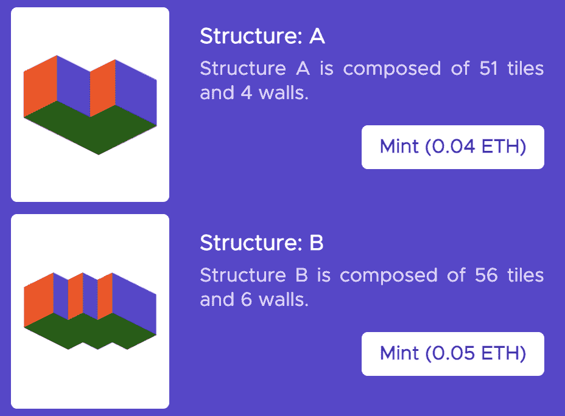

# 遇见 Isotile:元宇宙最可爱的虚拟房间

> 原文：<https://web.archive.org/web/https://dappradar.com/blog/meet-isotile-the-cutest-virtual-room-in-the-metaverse>

## Isotile 虚拟世界现在支持 Arbitrum NFTs

Isotile 是一个基于以太坊的虚拟世界，旨在让 NFT 收藏家在像素化的环境中展示他们的作品。现在，该平台已经宣布集成 Arbitrum，允许 NFT 爱好者展示他们的 Arbitrum NFTs。

虽然 Arbitrum 是最新加入 Isotile 生态系统的第二层链，但该平台已经集成了许多基于以太坊的系列。玩家也有机会使用他们的密码朋克和月饼 NFT 作为互动虚拟世界的化身。

重要的是，在集成 Arbitrum 的同时，Isotile 还推出了一个新的显示功能，显示每个 NFT 存储的链。一些新整合的 Arbitrum 系列包括《随机漫步 NFT》、《城堡岛》和《空中机器人》。

## Isotile 虚拟房间

Isotile 是一个虚拟展示室，可以检查您钱包中的 NFT 藏品，并允许您创建一个定制的虚拟画廊。重要的是，当玩家开始游戏时，基本的房间设置只有两面展示墙。

然而，如果你想购买更多的展示空间，Isotile 商店有许多选择。具有 4 面甚至 6 面展示墙和更多地面空间的结构。此外，该平台最近还引入了家具功能，为收藏家提供了更大的展示空间。

Isotile 商店也给收藏家一个改变空间背景的机会。有了几种壁纸设计，这给玩家一个机会来进一步定制他们的房间。此外，Isotile 团队正在进一步优化平台上的墙壁和展示空间。

## 查看创世纪头像收藏

除了整合各种 NFT 收藏，他们还推出了自己的 NFT 头像项目。Isotile Genesis Avatars 集合由 9000 个 NFT 组成，每个 NFT 都有独特的特质和行为特征显示在虚拟世界中。

重要的是，像素化的虚拟世界为元宇宙带来了一种创新的基于动作的特征。例如，如果你的创世纪头像 NFT 有“金吉他”特征，这将允许你在登录 Isotile 虚拟世界后实际弹奏吉他。

在撰写本文时，创世纪头像 NFT 的底价是 0.074 ETH，约合 200 美元。与该领域的知名公司如 [BAYC](https://web.archive.org/web/20230103233338/https://dappradar.com/ethereum/collectibles/bored-ape-yacht-club) 、[crypto 朋克](https://web.archive.org/web/20230103233338/https://dappradar.com/ethereum/collectibles/cryptopunks)或 [Meebits](https://web.archive.org/web/20230103233338/https://dappradar.com/ethereum/collectibles/meebits) 相比，这似乎是一个相对较低的价格。然而，Isotile 系列已经产生了 235 ETH 的终生交易量，相当于 638，824 美元。重要的是，如果你持有一个创世纪头像，你还可以获得 VIP 身份，在 Isotile 上给你更多的定制选项。

随着集成列表的不断扩大，Isotile 正在吸引更多的用户和头像所有者。随着区块链生态系统的这一边继续发展，DappRadar 将继续监测元宇宙和 NFT 空间。要首先了解最新消息，请在 [Twitter](https://web.archive.org/web/20230103233338/https://twitter.com/dappradar) 上关注 DappRadar，并查看 [DappRadar PRO](https://web.archive.org/web/20230103233338/https://dappradar.com/token/pro) 。

 NewsletterUnsubscribe at any time. [T&Cs](https://web.archive.org/web/20230103233338/https://dappradar.com/terms) and [Privacy Policy](https://web.archive.org/web/20230103233338/https://dappradar.com/privacy-policy)