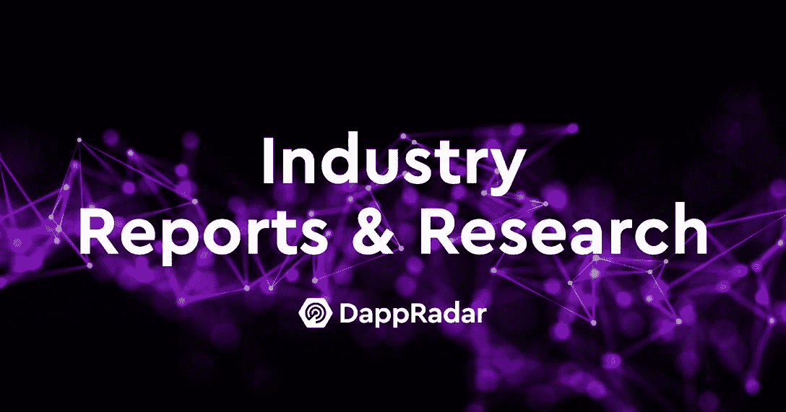

# 认识 Pedro Herrera:DappRadar 对区块链分析的见解

> 原文：<https://web.archive.org/web/https://dappradar.com/blog/meet-pedro-herrera-insights-into-blockchain-analysis-at-dappradar>

## 了解 DappRadar 报告背后的想法

**区块链历史目前正在被书写，领头的是少数人。在这一系列采访中，你将了解 DappRadar 的一些幕后策划者，以及他们如何重新定义 Web3。一旦我们的行业报告成为我们社区的重要组成部分，我们将首先向您介绍我们的研究主管 Pedro Herrera。跟着一起去见见团队吧！**

Web3 空间发展迅速。总是有新的项目，市场波动，新技术，数百万美元的投资，成千上万的人不知道他们在做什么。在错误信息的海洋里，懂得分析市场的人才是王道。

在 DappRadar，我们很幸运有专业人士将这一点做得更好。

事不宜迟，让我们了解一下我们的先驱[区块链研究员 Pedro Herrera](https://web.archive.org/web/20220930055552/https://www.linkedin.com/in/pedro-herrera-22a570a0/) 和他在 DappRadar 的轨迹。

## 你能给我们介绍一下你自己和你的职业生涯吗？

我在墨西哥城出生和长大，现在住在巴塞罗那。我本质上是一个体育迷，成长于 90 年代。除了户外活动和科幻/流行/漫画文化，密码行业已经成为我的另一个兴趣。

在职业方面，我的旅程始于 2012 年，当时我是 ey 的一名欺诈分析师，在那里我花了六年时间参与一些最知名的美国银行的金融和数据驱动计划。在完成了国外的学习和其他项目的两个短期工作后，我于 2021 年加入了 DappRadar，担任高级区块链分析师。然后，今年早些时候，我开始就如何实施他们的 Web3 战略为项目提供建议，当然，有机会领导 DappRadar 的研究团队是最大的奖励。

## 你是如何进入分散应用程序世界的？

2016 年，我了解了区块链和加密货币。从那时起，我就对这项技术的潜力深信不疑。对于我的硕士学位，2019 年夏天，我选择与另外两名同事开发一个 dapp，以追踪苏格兰当地生产商种植的有机产品的来源。我们在合同中使用了坚固性，并为我们的 dapp 建造了一个简单的正面。然后，在 DeFi 的 2020 年夏天，我了解到了几十个 dapps，因为这个行业正在离开之前的加密冬天。

## Web3、区块链和去中心化最让你兴奋的是什么？

将这些概念应用到我们的社会和经济模式中的影响。当你想到区块链在选举、供应链或建立全球卫生系统中的应用时，你可以立即想象我们的生活会有多么不同。而这一切都是因为区块链的颠覆性潜力。

我记得互联网是如何发展的，很难不看到相似之处。更有趣的是，[元宇宙](https://web.archive.org/web/20220930055552/https://dappradar.com/blog/what-is-the-metaverse)开始发挥作用。我们面前的网络 3 元宇宙经济会让许多人感到惊讶。

## 你为什么想加入 DappRadar 成为一名分析师？

我渴望在这个行业中得到一份全职工作。那时，我是一个与 Tezos 相关的项目的技术撰稿人。我在北海巨妖、币安和其他地方申请不同的职位，但当我看到区块链分析师这个职位时，我祈祷并在 LinkedIn 上发送了我的申请。我记得读到过 Skirmantas 和 Dragos 如何在一个周末内创建了 DappRadar 的第一个版本，并立即支持了他们的想法。

## 你给这个项目带来了什么？

总是试图把我最好的和积极的态度。努力保持开放，但总是考虑什么对团队最好。我在玩美式足球时就养成了这种心态。除此之外，我通常会带龙舌兰酒、墨西哥酒和其他有趣的东西。

## 在 DappRadar 工作的典型一天通常是什么样的？

我很幸运地将我的一个爱好作为工作，所以我会说，当我打开我的[投资组合](https://web.archive.org/web/20220930055552/https://dappradar.com/hub/wallet/eth/)，查看 token 和 [NFT 价格](https://web.archive.org/web/20220930055552/https://dappradar.com/nft)时，我的一天就开始了，然后去 Twitter 并继续阅读新闻，同时我准备好去晨练或坐在我的办公桌前。我花了大量时间从不同角度对我们产品的未来进行头脑风暴。

然后，我还忙于处理我们的数据以了解市场，回答媒体的问题，以及与我们团队的其他成员一起整理我们的数据和报告。

## 作为 Web3 的研究人员，你面临的主要挑战是什么？

我认为有两个主要问题:第一，数据的质量和可用性。仍然很难找到准确的 Web3 数据提供商。即使在内部，清理和协调我们的数据也是我们最大的挑战之一。这是我们在 DappRadar 的目标之一，成为我们社区和用户的资源。

第二，区分噪音和重要的。我们生活在一个对阅读时间越来越挑剔的社会。这适用于 Twitter 等社交平台。追随和阅读正确的人是被低估的。我从 Twitter 帖子中学到的比整个大学课程还多。此外，有很多人先令项目和促进金字塔或庞氏骗局，损害了行业。我们在社交媒体上关注的账户和我们阅读的作者决定了我们如何看待某些情况。

## 你会给想追随你脚步的人什么建议？

每个旅程都是不同的，但了解区块链和 dapp 行业，并在现实生活中与成千上万值得信赖的 dapp 互动是一个良好的开端。我还认为在 Web3 空间中有不同类型角色的空间，如版主、设计师、沟通者和其他几个可以走不同道路的角色，但对我来说，所有 Web3 角色的一个共同点是总是保持对最新行业新闻的好奇心，以及成为社区甚至 DAO 的一部分的兴奋感。

对于分析类型的角色、数据，我肯定会建议学习通过 Python、R 或类似语言来编码和利用数据。

## 你如何看待这个行业未来几年的发展？

潜力是巨大的，但与此同时，即使世界上最大的品牌已经转向 Web3，我们仍然至少需要几年才能看到指数级的采用突破。

我看到 NFTs 和 crypto 在我们的商业和日常生活中无处不在。Web3 将彻底颠覆视频游戏、音乐、电影和时尚产业等娱乐行业。

然而，我认为最重要的采用浪潮将来自区块链游戏，元宇宙支撑着一个万亿美元的产业。正是在这里，在元宇宙，我们将开始有意识地花费越来越多的时间，而不是在物质世界。

## 你对 10 年后的 DappRadar 有什么期待？

由 [RADAR](https://web.archive.org/web/20220930055552/https://dappradar.com/token/overview) 令牌驱动的全球 Dapp 商店是 web3 时代分销、贡献和声誉的同义词。

[<picture></picture>](https://web.archive.org/web/20220930055552/https://dappradar.com/reports)

[Find reports that provide regular deep learning, key findings, and analysis on all major blockchains supporting dapps](https://web.archive.org/web/20220930055552/https://dappradar.com/reports)

 NewsletterUnsubscribe at any time. [T&Cs](https://web.archive.org/web/20220930055552/https://dappradar.com/terms) and [Privacy Policy](https://web.archive.org/web/20220930055552/https://dappradar.com/privacy-policy)