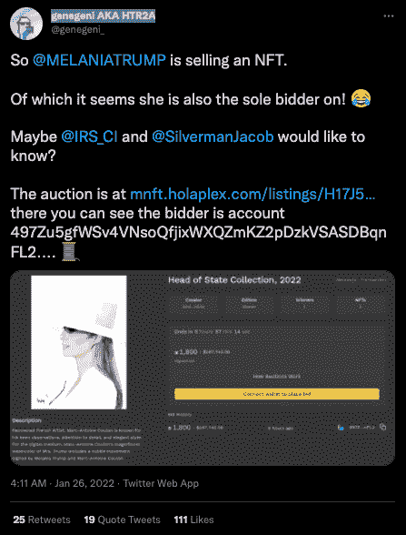
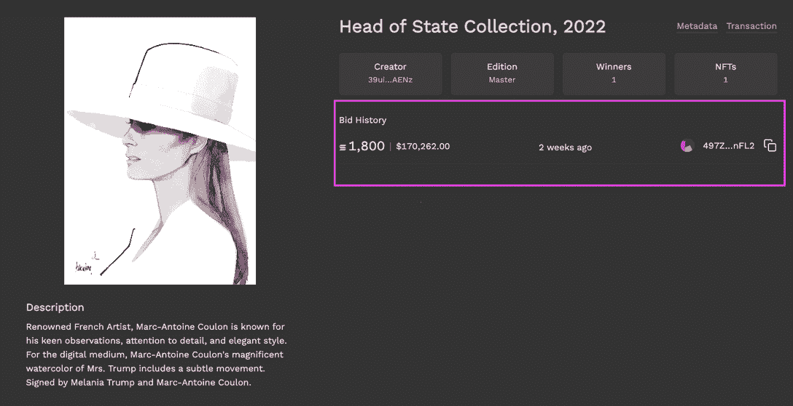
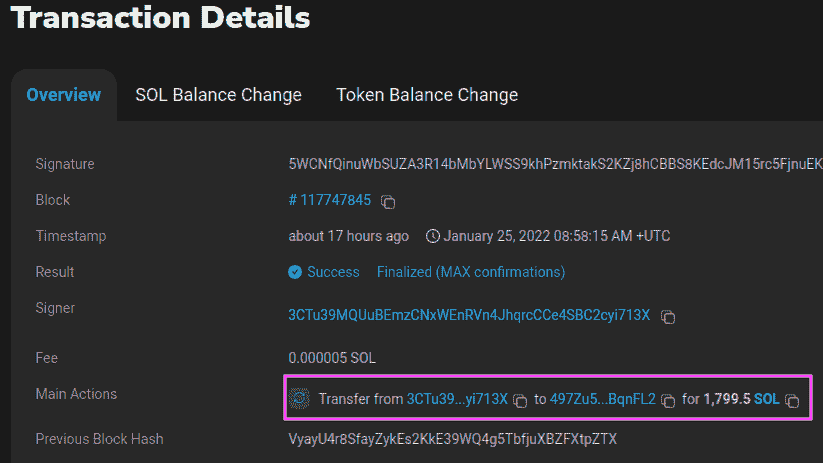
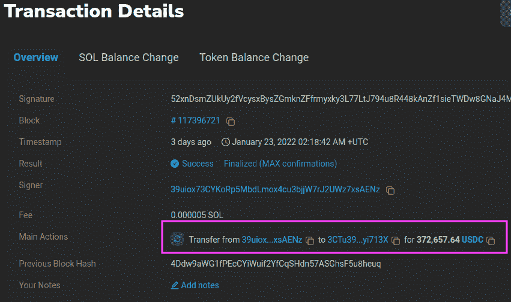
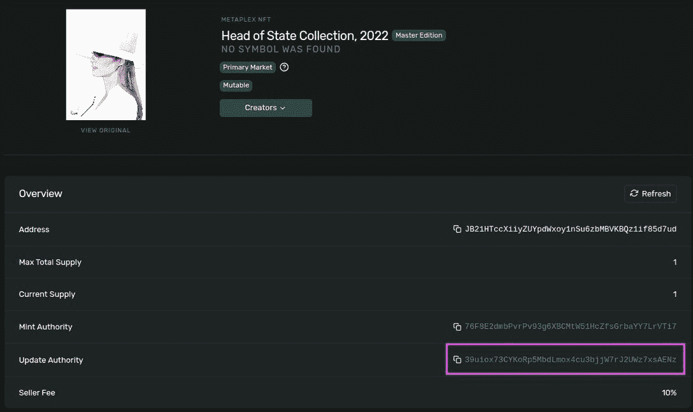

# 梅兰妮·特朗普是她自己的 NFT 的唯一竞标者

> 原文：<https://web.archive.org/web/https://dappradar.com/blog/melania-trump-is-sole-bidder-on-her-own-nft>

## 婴儿潮一代对区块链并不顺利

美国前总统梅兰妮·特朗普的妻子在竞拍她自己的 NFT 肖像画时被发现。随着婴儿潮一代开始掌握 Web3 的奇迹和透明性，这位女继承人无处可藏，因为精明的旁观者在 Twitter 上将总部位于索拉纳的 Haloplex 商店****上的交易分开，以揭露违规行为。****

 **梅兰妮·川普正在竞拍她自己的 NFT，她是唯一一个。这位在 Twitter 上被称为 genegeni AKA HTR2A 的首席评论员甚至在帖子中给国税局和《新共和国》的特约撰稿人雅各布·西尔弗曼贴上标签。

有趣的是，尽管销售 NFT，Melania 似乎并没有牢牢掌握 Web3 技术。她通过使用与列表相关的钱包地址发出要约，从根本上取代了自己。她业余的失误让推特上的旁观者很快调查出了梅拉尼娅。

## 梅兰妮·特朗普做了什么

NFT 收到了 1800 索尔的出价，约为 17 万美元。出价的钱包地址为–497 zu 5 gfwsv 4 vnsoqfjixwxqzmkz 2 pdzkvsasdbqnfl 2。

[Source](https://web.archive.org/web/20221209065057/https://mnft.holaplex.com/listings/H17J5u352jxThac9KWV9Vu18Tjx67RBM9AihhMqm81jK)

进行投标的账户由来自账户 3 CTU 39 mquubemzcnxwenrvn 4 jhqrcce 4 SBC 2 cy 713 x 的该交易提供资金

[Source](https://web.archive.org/web/20221209065057/https://solscan.io/tx/5WCNfQinuWbSUZA3R14bMbYLWSS9khPzmktakS2KZj8hCBBS8KEdcJM15rc5FjnuEK5rVdnQTwEHpSWXewtgSJZd)

该账户在 USDC 的资金来自另一个账户，钱包地址为 39 uiox 73 cykorp5mbdlmox 4 Cu 3 bjjw 7 r J2 uwz 7 xsa enz。

[Source](https://web.archive.org/web/20221209065057/https://solscan.io/tx/52xnDsmZUkUy2fVcysxBysZGmknZFfrmyxky3L77LtJ794u8R448kAnZf1sieTWDw8GNaJ4MufVnKiRY2McmN7fp)

也就是创建最初拍卖的账户。看下面，你可以看到钱包结束 AEN 作为更新权威。

[Source](https://web.archive.org/web/20221209065057/https://explorer.solana.com/address/JB21HTccXiiyZUYpdWxoy1nSu6zbMBVKBQz1if85d7ud)

## 洗盘交易

概括地说，目前最高出价 1800 索尔的钱包是由最初拍卖的同一钱包[资助的。没有比这更明显的操纵案例了。在传统金融领域，这种活动被称为“洗盘交易”，即一方试图根据交易历史或上一次销售价格人为抬高一件商品的价格。目前困扰以太坊市场的一个问题](https://web.archive.org/web/20221209065057/https://explorer.solana.com/address/39uiox73CYKoRp5MbdLmox4cu3bjjW7rJ2UWz7xsAENz)[是](https://web.archive.org/web/20221209065057/https://dappradar.com/blog/marketing-genius-or-foul-play-two-wallets-generate-1-1-billion-on-looksrare/)用户争夺交易量以获得 LOOKS token 奖励。

可以说，在这种情况下，似乎是一个过分热情的受教育不足的 Web3 Melania 被发现做了一些有点淘气的事情。事实上，同一批人控制着所有的钱包，这意味着他们为这项活动支付费用和佣金。此外，这笔交易并没有给梅拉尼娅带来任何利润。虽然这不是重点，但看到聚光灯下和聚光灯外的人们如何利用和利用区块链，以及随后它如何揭示一切——对于那些愿意看得足够深入的人来说，这是很有趣的。

 NewsletterUnsubscribe at any time. [T&Cs](https://web.archive.org/web/20221209065057/https://dappradar.com/terms) and [Privacy Policy](https://web.archive.org/web/20221209065057/https://dappradar.com/privacy-policy)

***以上不构成投资建议。此处给出的信息仅供参考。请行使尽职调查，做你的研究。作者持有 ETH、BTC、AGIX、HEX、LINK、GRT、CRO、OMI、不可变 X、GALA、AVASTR、GMEE、CUBE、RADAR、FLOW、FTM、BNB、SPS、WRLD、ATOM 和 ADA。*****