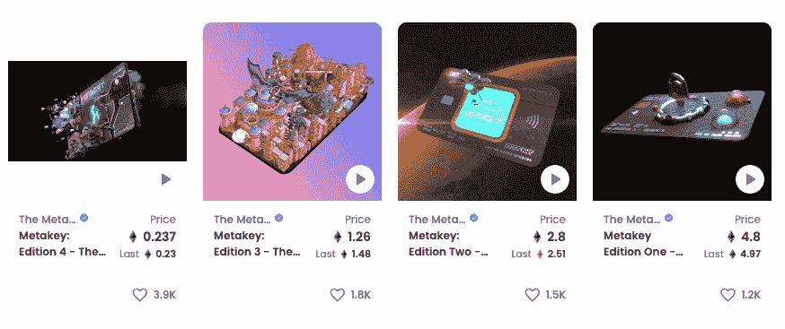
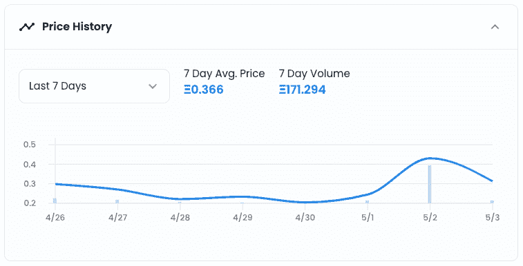
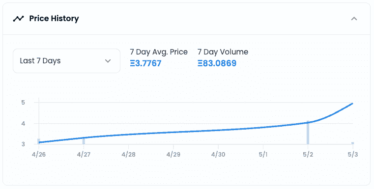
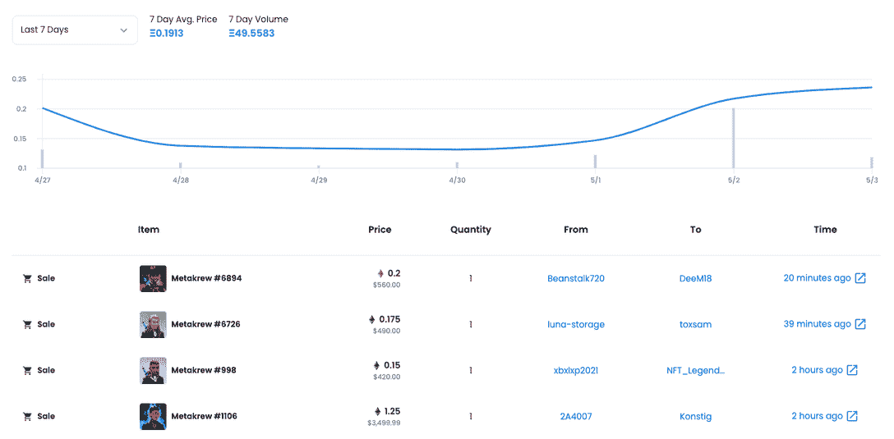
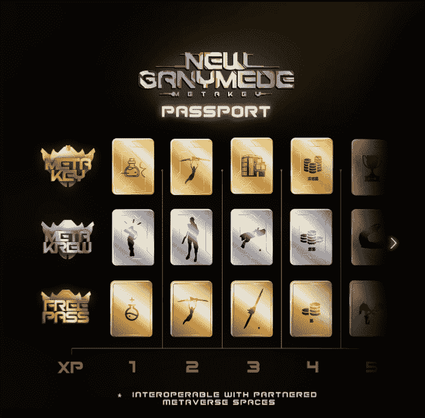

# Metakey 引入新的虚拟世界新的 Ganymede

> 原文：<https://web.archive.org/web/https://dappradar.com/blog/metakey-introduce-new-virtual-world-new-ganymede>

## Metakey 底价一飞冲天

NFT 项目 Metakey 已经宣布推出它自己的虚拟世界，新的 Ganymede。 **该公告导致 Metakey NFTs 和 Metakrew 的底价在撰写时翻了一番。元钥匙让玩家获得额外奖励，而元钥匙是一个 PFP 身份 NFT。**

元密钥是 NFT 的一个项目，它将互操作性作为其目标的核心。Metakey 社区可以访问白名单和教育材料，但最重要的是他们可以接收空投。几个月前，Metakey NFTs 的持有者收到了 Metakrew NFT 角色，并承诺这些角色将拥有自己的游戏。这个游戏变得有点大，因为团队现在已经引入了新的 Ganymede 虚拟世界。

## 摘要

*   **Metakey 于 5 月 1 日发布了新的 Ganymede 虚拟世界**
*   **Metakey 和 Metakrew 底价一夜之间暴涨 100%**

如前所述，元钥匙让持有者获得额外奖励，而元钥匙则是玩家的象征性身份。新木卫三被描述为品牌和社区的家园，愿景的证明，以及通往元宇宙最明亮世界的桥梁。此外，此举表明了 Metakey 的意图，任何 NFT 的可穿戴设备或项目都可以在新的 Ganymede 中使用。

## 四个元键

有四种不同的[元键](https://web.archive.org/web/20221007163656/https://dappradar.com/hub/assets/eth/0x10daa9f4c0f985430fde4959adb2c791ef2ccf83/1)，每种都有自己的价格，价格随着版本的增加而上涨，其中创世纪 NFT 是最有价值的。所有玩家需要的是一个元键，任何版本的元键都可以访问元键社区和新的 Ganymede。

看看 2022 年 5 月 1 日新木卫三公布以来的交易活动，我们看到地板价格突然飙升。在推出第四版元密钥之前，NFT 的平均价格一直徘徊在 0.2 ETH 左右，即 600 美元左右。5 月 2 日，该指数跃升至 0.4 ETH 左右，涨幅超过一倍。

在天平的另一端，我们看到过去几周平均售价约为 3.3 ETH 的[创世纪版 NFT](https://web.archive.org/web/20221007163656/https://dappradar.com/hub/assets/eth/0x10daa9f4c0f985430fde4959adb2c791ef2ccf83/1) 突然飙升至 4.8 ETH，约合 13，000 美元。

## Metakrew PFP 头像

Metakrew 是一个由 9750 个 PFP 头像组成的集合，这些头像是从代表 Metakey 社区成员身份的 200 多种特征中随机生成的。5 月 1 日，Metakrew 的价格还不到 0.1 ETH，到 5 月 2 日，价格已经翻了一倍，达到 0.2 ETH。你还可以看到，在过去的 48 小时内，销售额在上升。

## 为什么新木卫三是不同的

新 Ganymede 是一个元宇宙世界，但更重要的是，它旨在通过为玩家提供一个真正可互操作的虚拟世界来促进互操作性。此外，Metakey 声明他们不想与任何人正面交锋。相反，他们希望通过新的 Ganymede 来支持、提升和连接它们。

[https://web.archive.org/web/20221007163656if_/https://www.youtube.com/embed/KYihbyARx6A?feature=oembed](https://web.archive.org/web/20221007163656if_/https://www.youtube.com/embed/KYihbyARx6A?feature=oembed)

## 新的木卫三护照

季票一直是游戏行业的中坚力量——玩家在游戏中投入时间并获得奖励，为不同类型的用户提供免费和付费曲目。Metakey 希望在这一领域进行创新，让护照持有人通过玩任何游戏，而不仅仅是 Metakey，来推进他们的赛季通行证。

新的 Ganymede Passport 是第一个可互操作的季票，为与 Metakey 合作的不断扩大的游戏、应用和社区列表提供季节性奖励。

您可以在当前赛季的任何时间在新木卫三领取护照，也可以随时返回新木卫三领取您获得的奖励。新的 Ganymede 演示将与概念验证 Passport Season 0 一起推出，它将与新的 Ganymede、分散土地和沙盒互操作，更接近于其完整版本。

将会为元钥匙持有者提供侧重于装饰的奖励跟踪，为元钥匙持有者提供侧重于土地、效用和特定版本奖励的跟踪，以及为任何有兴趣获得探索和参与元宇宙奖励的人提供免费跟踪。

## 与元键的真正互操作性

虽然许多 PFP 项目试图通过空投更多兼容不同世界和游戏的 NFT 来使他们的头像具有互操作性，但 Metakey 希望采取不同的方法。一个以经济为中心，鼓励更少更高价值的非功能性服务业的政策。此外，与其跨多个网络推出，Metakey 更愿意从其中心枢纽向所有人提供一个桥梁。

空投[分散](https://web.archive.org/web/20221007163656/https://dappradar.com/ethereum/marketplaces/decentraland)和[沙盒](https://web.archive.org/web/20221007163656/https://dappradar.com/ethereum/games/the-sandbox)版本的虚拟形象给持有者只会破坏原始 NFT 的价值，并潜在地摧毁其未来的效用。如果一个接收者在收到这些空投物资后转售一个 PFP，潜在的买家就知道这个资产已经被压榨了相当大一部分的价值。梅塔基认为这是一个短期愿景。

相反，整个 Metakrew 系列正在被桥接到分散土地和沙盒——持有者将能够在这些空间中作为他们的 Krewmates 玩，而不需要额外的 NFT。此外，事情才刚刚开始，Metakey 和 Metakrew 集合将被连接到更多的世界，其他资产将被连接到新的 Ganymede。

[<picture></picture>](https://web.archive.org/web/20221007163656/https://dappradar.com/blog/what-are-non-fungible-tokens-nfts)[<picture></picture>](https://web.archive.org/web/20221007163656/https://dappradar.com/nft/marketplaces)[<picture></picture>](https://web.archive.org/web/20221007163656/https://dappradar.com/nft/sales)

*以上不构成投资建议。此处给出的信息仅供参考。请行使尽职调查，做你的研究。作者持有多种加密货币的头寸，包括 BTC、瑞士法郎和雷达。*

 NewsletterUnsubscribe at any time. [T&Cs](https://web.archive.org/web/20221007163656/https://dappradar.com/terms) and [Privacy Policy](https://web.archive.org/web/20221007163656/https://dappradar.com/privacy-policy)