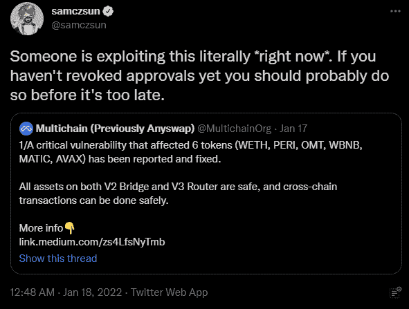
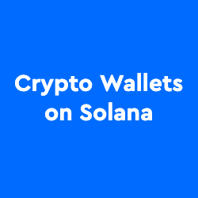

# MetaMask Mobile 进行了全面检查，ApplePay Fiat 进入匝道

> 原文：<https://web.archive.org/web/https://dappradar.com/blog/metamask-mobile-gets-an-overhaul-and-applepay-fiat-on-ramp>

## 当黑暗模式？现在黑暗模式！

meta mask Mobile 4 . 3 . 1 今天发布了一些期待已久的更新，包括最受欢迎的功能之一，黑暗模式。最值得注意的是，领先的区块链钱包的用户现在可以通过 SendWyre 集成使用 Apple Pay 购买加密货币，同时在与网站交互时更加透明，并进一步支持无气交易。

## 摘要

*   [MetaMask](https://web.archive.org/web/20221201200530/https://dappradar.com/blog/what-is-metamask) 移动 4.3.1 版今天上线。
*   多亏了 SendWyre，用户现在可以通过 Visa MasterCard 信用卡支持使用 ApplePay 购买加密货币。
*   当[与 dapps](/web/20221201200530/https://dappradar.com/blog/what-is-a-dapp-on-the-blockchain/) 和智能合同交互时，增加了透明度
*   大众的需求增加了黑暗模式

虽然听起来很原始，但 MetaMask 社区中最受欢迎的功能之一，黑暗模式，终于到来了。具有讽刺意味的是，iOS 设备最近推出了对其 light shift 技术的应用支持，该技术从根本上将黑暗模式应用于设备和设备上运行的应用。

然而，现在的大新闻是，除了借记卡支持，MetaMask Mobile 还支持 Visa MasterCard 信用卡，这要归功于 SendWyre。这使得 Apple Pay 可以在 iOS 设备上使用。

[https://web.archive.org/web/20221201200530if_/https://www.youtube.com/embed/hnzudz1BI80?feature=oembed](https://web.archive.org/web/20221201200530if_/https://www.youtube.com/embed/hnzudz1BI80?feature=oembed)

## 安全第一

当元掩码用户连接到 dapp 时，它允许 dapp 做两件事。首先，查看您的钱包地址，其次，要求您确认并从该地址发送交易。同样的道理也适用于你交换、铸造、出售、入股和耕种 dapps。当合同需要移动令牌以促进行动时，用户必须首先批准该地址才能访问或移动这些令牌。

用户可以允许通过指定的地址移动 1 个令牌或无限数量的令牌。为了让生活更轻松，节省重复交易费用，通常会使用无限量，这样就不需要重复审批和支付。但是，这意味着你说的地址可以移动无限数量的令牌…现在实际上可以移动无限数量的令牌，尽管你只想移动一小部分。

然而，除非用户指示这样做，否则它们不会这样做。但他们仍然拥有这种权力，如果他们是恶意的，或者合同被更改为恶意的，他们可以。

## 更新有什么帮助？

现在，当 dapp 请求[元掩码](/web/20221201200530/https://dappradar.com/blog/guide-on-how-to-switch-network-in-metamask/)用户授予访问权限时，他们将清楚地看到哪个合同正在请求它，并且可以进一步选择标记该合同，以便下次更好地识别它。

此外，虽然将钱包从 dapp 上断开是一个好的做法，但它不会保护你免受上述情况的影响。这只能通过撤销对合同的访问来实现。在 MetaMask 将令牌撤销直接整合到他们的钱包中之前，你可以在 [Etherscan](https://web.archive.org/web/20221201200530/https://etherscan.io/tokenapprovalchecker) 和许多其他平台上查看、调整和撤销你的津贴。

另外，有必要为不同的动作设置不同的元掩码钱包。即一个钱包用于霍德林，一个用于交易。通过这种方式，您可以采取更多措施来确保您的安全，只需在交易钱包中放入您希望立即使用的令牌。

如果这一切听起来冗长而复杂，让我们现实一点，确实如此。然而，完全控制你的财务是一项艰巨的任务，因为没有中间人在你身边，让你感到安全，并在你犯错时伸出援手，事情会变得有点可怕。归根结底，如果你想成为自己的银行，你还必须成为保安、合规官以及其他一切相关人员。但在这位作者看来，这是为金融主权付出的小小代价。

## 没有汽油了

不要太激动；MetaMask 没有取消汽油费。相反，当网络可能允许无气交易时，例如，私人区块链，或者当一个项目或协议代表你支付气费时，更新支持用户。MetaMask Mobile 现在支持这些类型的交易。

像往常一样，记住永远不要和任何人分享你的秘密恢复短语。MetaMask 永远不会请求它做任何事情。要查看所有这些更新，请将您的 MetaMask Mobile 更新到 v4.3.1，并在那里保持安全。

[<picture></picture>](https://web.archive.org/web/20221201200530/https://dappradar.com/blog/4-tips-on-blockchain-cybersecurity-stay-safe-in-crypto)[<picture></picture>](https://web.archive.org/web/20221201200530/https://dappradar.com/blog/how-to-start-using-defi-dapps-and-crypto-wallets-on-solana)[<picture></picture>](https://web.archive.org/web/20221201200530/https://dappradar.com/blog/best-cryptocurrency-wallets-for-2022)

***以上不构成投资建议。此处给出的信息仅供参考。请行使尽职调查，做你的研究。作者持有多种加密货币的头寸，包括 BTC、瑞士法郎和雷达。***

 NewsletterUnsubscribe at any time. [T&Cs](https://web.archive.org/web/20221201200530/https://dappradar.com/terms) and [Privacy Policy](https://web.archive.org/web/20221201200530/https://dappradar.com/privacy-policy)