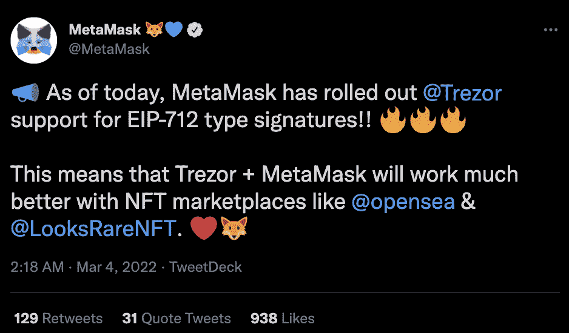

# MetaMask 推出 Trezor EIP-712 Supoprt

> 原文：<https://web.archive.org/web/https://dappradar.com/blog/metamask-rolls-out-trezor-eip-712-supoprt>

## 此次更新将提升 Trezor 用户在 NFT 市场的表现

可以说是目前最受欢迎的钱包服务 MetaMask 推出了一项重要的更新，允许 Trezor 用户与二级市场互动。随着新的 EIP-712 对 Trezor 的支持，NFT 收藏家将能够通过将他们的钱包连接到 MetaMask 浏览器扩展，在像 [OpenSea](https://web.archive.org/web/20221216202105/https://dappradar.com/ethereum/marketplaces/opensea) 和 [LooksRare](https://web.archive.org/web/20221216202105/https://dappradar.com/ethereum/marketplaces/looksrare) 这样的市场上列出，购买和交易 NFT。

Trezor 和 Ledger 等硬件钱包通常是 NFT 收藏家和密码交易员的首选。它们提供了无与伦比的安全性，这是主要的好处。然而，web3 应用程序并不像硬件钱包那样容易访问。用户必须将他们的硬件设备连接到 MetaMask 等热门钱包，才能与 dapps 和 OpenSea 及 LooksRare 等服务进行交互。

新宣布的对 Trezor 用户的 EIP-712 支持的集成将允许他们直接使用他们钱包中的 NFT，而不必首先将它们转移到热钱包。这是一个重大的改进，为 Trezor 用户带来了更高水平的易用性。

根据官方声明，Chrome 和 Firefox 用户已经可以从更新中受益。该更新将在适当的时候推广到其他浏览器。

## MetaMask 面临地理定位区块的反弹

虽然特雷佐·EIP-712 的支持是 MetaMask 朝着正确方向迈出的一步，但该项目在社交媒体上面临反弹。原因是某些国家的用户最近使用了 geoblock。据推特上的 MetaMask 用户称，例如，美国和委内瑞拉的人们昨天无法访问 MetaMask 上的功能。

根据来自 [MetaMask](https://web.archive.org/web/20221216202105/https://twitter.com/MetaMask/status/1499448223399759896) 和工具包提供商 [Infura](https://web.archive.org/web/20221216202105/https://twitter.com/infura_io/status/1499446959827931175) 的官方声明，geoblock 配置被错误地设置为比预期更大的区域。由于美国引入了新的制裁，这一封锁是必要的。这迫使元掩码限制用户从该位置访问服务。不幸的是，错误的配置也影响了其他国家的用户。

这一错误引发了人们对 MetaMask 钱包集中化本质的担忧。权力下放是区块链空间的一个关键要素。虽然 MetaMask 是最受欢迎的热门钱包之一，但它仍然是一项集中式服务。

在 Twitter 上出现负面评论后，Infura 迅速着手解决这个问题。根据官方声明，错误配置现已修复。无意中受到影响的区域中的用户现在可以访问元掩码服务。

元掩码是加密领域的一项重要服务。由于最近推出的 Trezor NFT 支持等更新，它将继续吸引用户。虽然会出现错误和问题，但这仍然是最受欢迎的热门钱包之一。例如，您可以使用元掩码钱包登录 DappRadar。如果你想了解更多关于 MetaMask 及其提供的服务，请查看本指南。此外，你可以在[的 Twitter](https://web.archive.org/web/20221216202105/https://twitter.com/dappradar) 上关注 DappRadar，首先获得最新的加密新闻。

 NewsletterUnsubscribe at any time. [T&Cs](https://web.archive.org/web/20221216202105/https://dappradar.com/terms) and [Privacy Policy](https://web.archive.org/web/20221216202105/https://dappradar.com/privacy-policy)