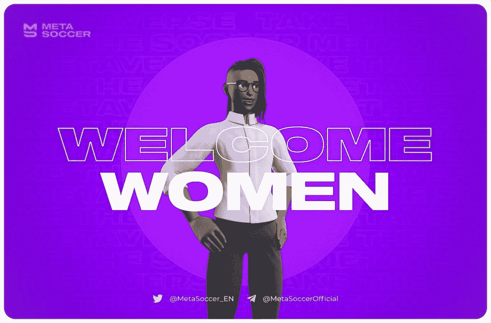

# MetaSoccer 增加女性，创造平等的竞争环境

> 原文：<https://web.archive.org/web/https://dappradar.com/blog/metasoccer-adds-women-creates-equal-playing-field>

## NFT 足球赛计划让每个人都参与到这场美丽的比赛中

[**MetaSoccer**](https://web.archive.org/web/20220930100318/https://dappradar.com/polygon/games/metasoccer) **即将把女性游戏角色引入其元宇宙竞技。还没有宣布女性角色的日期，但该平台计划很快将这项运动带入 21 世纪。**

为了配合国际妇女节，MetaSoccer [昨天宣布](https://web.archive.org/web/20220930100318/https://twitter.com/MetaSoccer_EN/status/1501165917874630660)“女性将出现在足球元宇宙中。”直到现在，游戏只有男性头像。这一最新举措正值该平台誓言“走在创新和包容性的最前沿”。

根据 Statista 的数据，2021 年，女性占美国视频游戏玩家的 45%。所以，是时候让每个想玩基于足球的区块链游戏的人都能找到一个真实反映他们的头像了。像 EA Sports 的 FIFA 22 这样的主要游戏品牌已经有了女运动员，这种发展也需要在区块链空间继续下去。

Source: Medium

到目前为止，除了创造看起来像女人的化身之外，MetaSoccer 对这些变化实际上会带来什么守口如瓶。但在[公司的博客文章](https://web.archive.org/web/20220930100318/https://metasoccer.medium.com/women-take-the-soccer-metaverse-321b2ccc9e72)中公布的一个细节说，新的女性角色将展示她们“自己的优势、能力、改进能力和价值”

想到这些新的足球明星将能做些什么，真是令人兴奋！

## 什么是 MetaSoccer？

MetaSoccer 自称为“第一个足球元宇宙”，是一个数字平台，用户可以在这里找到最好的球员，训练他们，并让他们参加与对手的比赛。玩家可以一边做这些，一边赚取奖励。

玩家可以通过多种方式获得平台的本地令牌，称为 MSU:

*   出售球探发现的球员
*   随着玩家越来越受欢迎，获得赞助和商品交易
*   赢得与其他用户或人工智能的比赛。在模拟器中，比赛的输赢取决于两队之间的统计数据。

MetaSoccer 还没有宣布女性角色的日期。但是这个平台计划很快将这项运动带入 21 世纪。与 [DappRadar](https://web.archive.org/web/20220930100318/https://dappradar.com/) 保持联系，以了解任何最新公告。

关于区块链游戏和去中心化应用世界的所有其他新闻，请继续关注我们的[博客](https://web.archive.org/web/20220930100318/https://dappradar.com/blog/)，并在[推特](https://web.archive.org/web/20220930100318/https://twitter.com/DappRadar)上关注我们。你也可以参加我们每周四下午 4 点的[不和谐](https://web.archive.org/web/20220930100318/https://discord.com/invite/QMnwjGzrkG)节目。