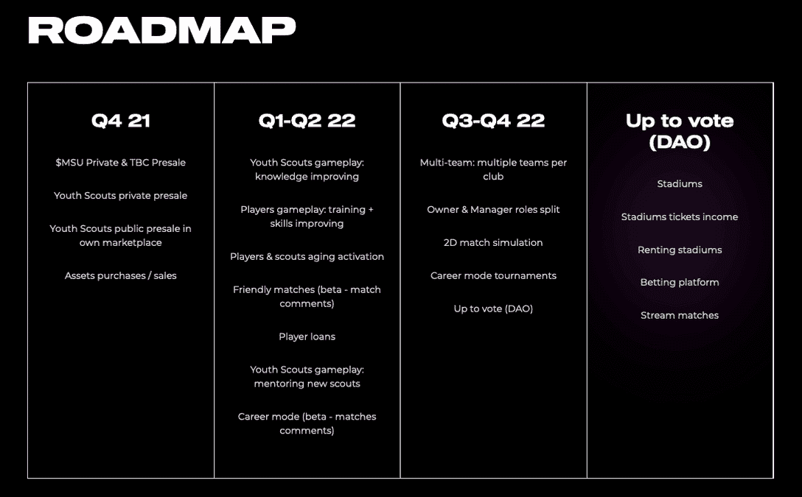

# MetaSoccer 签署瓦斯科·达·伽马合作协议

> 原文：<https://web.archive.org/web/https://dappradar.com/blog/metasoccer-signs-vasco-da-gama-partnership>

## MetaSoccer 是元宇宙的第一款足球管理游戏

**MetaSoccer 携手巴西足球队瓦斯科·达·伽马，为足球爱好者开启了一场激动人心的游戏之旅。MetaSoccer 是第一个足球虚拟世界，玩家可以管理他们的俱乐部，并从游戏中获得收入。在过去的几个月里，该团队成功地建立了一些重要的合作伙伴关系。Vasco 的签署至关重要，它将为 MetaSoccer 的近期路线图提供坚实的基础。**

足球无疑是世界上最受欢迎的运动。根据国际足联的数据，2018 年世界杯决赛有 11 亿人观看。相比之下，拥有 1.12 亿观众的 2021 年超级碗决赛就相形见绌了。现在把镜头移向元宇宙，虚拟足球是否也不负球迷的期望？答案是肯定的。 [MetaSoccer](https://web.archive.org/web/20220925083827/https://dappradar.com/polygon/games/metasoccer) ，第一款允许玩家管理自己的俱乐部并创造收入的元宇宙足球游戏，已经成为足球爱好者的最爱。

MetaSoccer 今天在其官方推特上宣布，瓦斯科·达·伽马成为第一个加入生态系统的真实世界足球俱乐部。

## 谁是瓦斯科·达·伽马？

瓦斯科·达·伽马或瓦斯科·达·伽马俱乐部是一家位于里约热内卢的巴西职业体育俱乐部。最初，一个划船俱乐部成立于 1989 年，瓦斯科·达·伽马的足球历史也是源远流长。葡萄牙移民于 1915 年 11 月 26 日创建了职业足球部，因此在里约热内卢的葡萄牙社区中享有强大的球迷基础。根据许多调查，Vasco 是巴西第五大支持俱乐部，拥有 800 多万球迷。

MetaSoccer 与瓦斯科·达·伽马的成功合作为该项目带来了巨大的曝光率。此外，这是一场针对 800 万 Vasco 支持者的营销活动，有可能吸引巴西和葡萄牙足球迷的注意力。

## MetaSoccer 雄心勃勃的路线图

体育管理模拟游戏，如世嘉的足球经理，为玩家提供了一种掌握感。从训练运动员、球员交易到商业管理，一切都在用户的掌控之中。然而，有一个要素缺失了:玩家游戏内资产的所有权。因此，玩赚游戏开始解决这个问题。

在 MetaSoccer 中，所有资产都是位于区块链上的不可替换的令牌。这种方式保证了用户对他们的资产拥有真正的所有权。更重要的是，玩家可以用这些资产从比赛和联赛中获得收入，或者用它们换取溢价。

该团队为项目制定了一个雄心勃勃的路线图，他们的努力为路线图的第一阶段带来了几个重要的里程碑。

例如，这款游戏有一个热情的社区，拥有超过 10 万名 Twitter 粉丝，而且这个数字还在不断上升。MetaSoccer 通过其 MSU 代币私人销售成功筹集了 200 多万美元。最后但并非最不重要的一点是，所有资产都在创纪录的时间内售罄。

MetaSoccor 游戏及其从玩到赚的机制将在 2022 年继续发展。与此同时，一个由道赋能的社区驱动的生态系统将逐渐形成。

元宇宙的第一场足球管理比赛值得期待。DappRadar 将继续监督项目的发展。关于 dapps 领域的最新消息，你也可以关注 DappRadar 的 [Twitter](https://web.archive.org/web/20220925083827/https://twitter.com/DappRadar) 来保持更新。