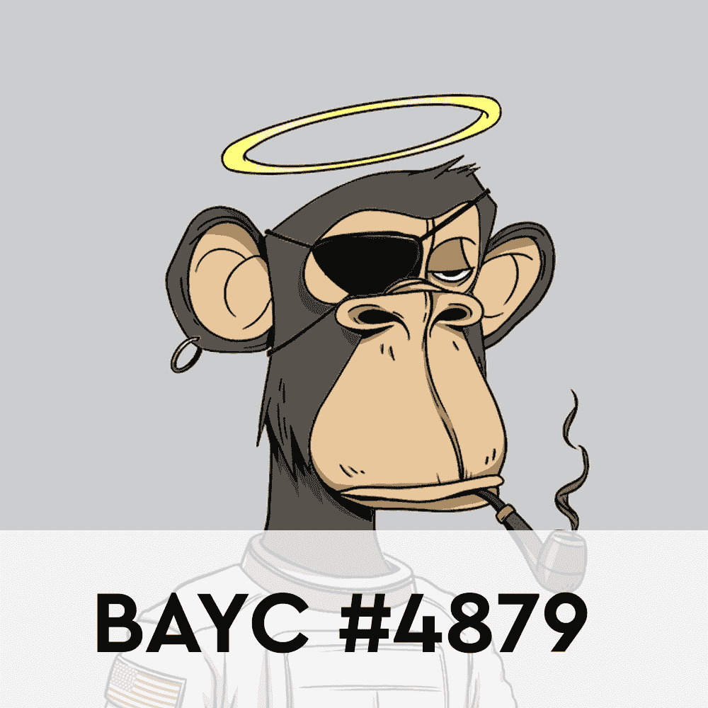
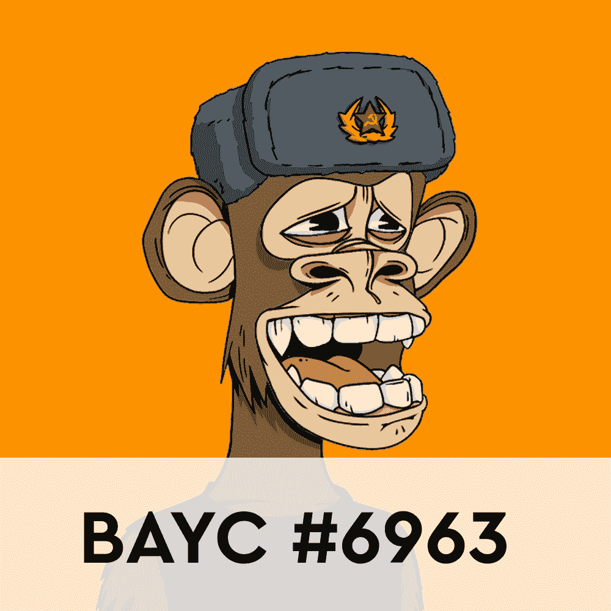

# 元宇宙在分散地的土地领先于无聊的猿类——NFT 十大销售

> 原文：<https://web.archive.org/web/https://dappradar.com/blog/metaverse-land-in-decentraland-ahead-of-bored-apes-top-10-nft-sales>

## 上周 NFT 销售额前 10 名包括 6 个 BAYC NFTs，然而第一名是分散的土地

无聊的猿类完全占据了上周 NFT 销售排行榜的前十名，但是第一名的位置被虚拟世界分散化所占据。无聊猿 NFT 系列有 6 件作品，占据了过去 7 天中前 10 名销售额的 60%。重要的是，这发生在排名中的其他常见嫌疑人 CryptoPunks 完全消失的背景下。

虽然 BAYC 在数量上占优势，但过去 7 天的最高销售额来自分散的土地。龙城的房产以不到 100 万美元的价格售出。虚拟地块现在存储在一个钱包里，里面除了 [Uniswap V3 位置 NFT](https://web.archive.org/web/20220929043841/https://dappradar.com/hub/wallet/eth/0xf06d50b6b65096acb9424b1ed24a575dbc6bc58b/nfts/1/uniswap-v3-positions)什么也没有。

除了分散的地产，上周的最高销售额包括一辆[志那都红豆 NFT](https://web.archive.org/web/20220929043841/https://dappradar.com/hub/assets/eth/0xed5af388653567af2f388e6224dc7c4b3241c544/4841) 和[双生火焰#67](https://web.archive.org/web/20220929043841/https://dappradar.com/hub/assets/eth/0x495f947276749ce646f68ac8c248420045cb7b5e/55009236754177688704712285819362994549214138196257374091251074600324737007617) 。志那都红豆在 NFT 空间正稳步获得牵引力和认可，该系列已经开始产生最大的销售收入。另一方面，Twin Flames 是贾斯汀·阿弗萨诺转向 NFTs 的 100 张照片系列的一部分，描绘了一对双胞胎兄弟姐妹。

最后，绝对值得一提的是，第四个不属于 BAYC 系列的 NFT 是艾尔·卡朋。有趣的是，艾尔·卡朋是币安智能链上黑帮朋克集合的一部分。在出售时，NFT 以 1，111 WBNB 的价格易手，约合 442，340 美元。

## NFT 十大销售额–第 7 周/2 月 14 日–2 月 20 日

1.  [龙城地产](https://web.archive.org/web/20220929043841/https://dappradar.com/hub/assets/eth/0x959e104e1a4db6317fa58f8295f586e1a978c297/1747)——93.87 万美元/31.5 万马纳—[买家的钱包](https://web.archive.org/web/20220929043841/https://dappradar.com/hub/wallet/eth/0xf06d50b6b65096acb9424b1ed24a575dbc6bc58b?utm_source=rankings&utm_medium=nft&utm_campaign=nft_sales)
2.  [Bored Ape 游艇俱乐部# 8353](https://web.archive.org/web/20220929043841/https://dappradar.com/hub/assets/eth/0xbc4ca0eda7647a8ab7c2061c2e118a18a936f13d/8353)——562，790 美元/200 WETH—[买家的钱包](https://web.archive.org/web/20220929043841/https://dappradar.com/hub/wallet/eth/0xd75233704795206de38cc58b77a1f660b5c60896?utm_source=rankings&utm_medium=nft&utm_campaign=nft_sales)
3.  [Bored Ape 游艇俱乐部# 3671](https://web.archive.org/web/20220929043841/https://dappradar.com/hub/assets/eth/0xbc4ca0eda7647a8ab7c2061c2e118a18a936f13d/3671)-498，080 美元/165 ETH-[买家的钱包](https://web.archive.org/web/20220929043841/https://dappradar.com/hub/wallet/eth/0xa8134d86bd51c7db2c4235f859835500d6481848?utm_source=rankings&utm_medium=nft&utm_campaign=nft_sales)
4.  [艾尔·卡朋](https://web.archive.org/web/20220929043841/https://dappradar.com/hub/assets/bsc/0x897fd4ce6dbcbf31039754fdc8f77ce4c3521ee0/797)——442，340 美元/ 1，111 WBNB—[买家的钱包](https://web.archive.org/web/20220929043841/https://dappradar.com/hub/wallet/bsc/0xc28f1550160478a7fb3b085f25d4b179e08e649a?utm_source=rankings&utm_medium=nft&utm_campaign=nft_sales)
5.  [Bored Ape 游艇俱乐部# 1391](https://web.archive.org/web/20220929043841/https://dappradar.com/hub/assets/eth/0xbc4ca0eda7647a8ab7c2061c2e118a18a936f13d/1391)-431，250 美元/153.66 ETH-[买家钱包](https://web.archive.org/web/20220929043841/https://dappradar.com/hub/wallet/eth/0x64ddfa770f4bcfe7358d1331d81e7f75fae9080c?utm_source=rankings&utm_medium=nft&utm_campaign=nft_sales)
6.  [志那都红豆# 4841](https://web.archive.org/web/20220929043841/https://dappradar.com/hub/assets/eth/0xed5af388653567af2f388e6224dc7c4b3241c544/4841)-399410 美元/ 150 瑞士法郎-[买家的钱包](https://web.archive.org/web/20220929043841/https://dappradar.com/hub/wallet/eth/0xdbd5fb3097632c05a5d82d3972d4f632a26b01d9?utm_source=rankings&utm_medium=nft&utm_campaign=nft_sales)
7.  双生火焰 67 号。克雷格&凯瑞·史密斯——398，640 美元/130 WETH—[买家钱包](https://web.archive.org/web/20220929043841/https://dappradar.com/hub/wallet/eth/0x8ee9e07b14dc1ca05b0957a9bfe5a48254bbb724?utm_source=rankings&utm_medium=nft&utm_campaign=nft_sales)
8.  [Bored Ape 游艇俱乐部# 3771](https://web.archive.org/web/20220929043841/https://dappradar.com/hub/assets/eth/0xbc4ca0eda7647a8ab7c2061c2e118a18a936f13d/3771)——387，610 美元/125 WETH—[买家的钱包](https://web.archive.org/web/20220929043841/https://dappradar.com/hub/wallet/eth/0x54b174179ae825ed630da40b625bb3c883cd40ae?utm_source=rankings&utm_medium=nft&utm_campaign=nft_sales)
9.  [Bored Ape 游艇俱乐部# 6583](https://web.archive.org/web/20220929043841/https://dappradar.com/hub/assets/eth/0xbc4ca0eda7647a8ab7c2061c2e118a18a936f13d/6583)——380，610 美元/121 WETH—[买家的钱包](https://web.archive.org/web/20220929043841/https://dappradar.com/hub/wallet/eth/0xe1aeacb5f91a2938ac9474fd880ec1542047b333?utm_source=rankings&utm_medium=nft&utm_campaign=nft_sales)
10.  [Bored Ape 游艇俱乐部# 3280](https://web.archive.org/web/20220929043841/https://dappradar.com/hub/assets/eth/0xbc4ca0eda7647a8ab7c2061c2e118a18a936f13d/3280)-370，790 美元/ 117.99 瑞士法郎-[买家的钱包](https://web.archive.org/web/20220929043841/https://dappradar.com/hub/wallet/eth/0x10a7330415017a71ba28cd22a5eec748b280d6ca?utm_source=rankings&utm_medium=nft&utm_campaign=nft_sales)

## 无聊的猿类统治着 NFT 空间

无聊猿 NFT 系列再次证明了它在 NFT 空间的统治地位。自去年开始受到 NFT 藏家的青睐以来，该系列一直高居销售排行榜前列。

本周，票房最高的无聊猿销售是 BAYC #8353 。NFT 以 200 WETH 的价格易手，约合 562，790 美元。令人印象深刻的是，这只是 NFT 自 10 个月前首次铸造以来的第二次出售。卖方获得了 92 ETH 的利润，约合 249，738 美元。

除了 BAYC #8535，上周 NFT 销售额前十名还包括五个 ape NFTs。值得注意的是，所有这些销售的价格都高于 117 ETH，最便宜的转换所有者为 317，602 美元。目前，Bored Apes 系列的底价是 94 ETH，约合 255167 美元。

随着 Bored Ape Yacht Club 等蓝筹股系列继续吸引高收入销售，DappRadar 将继续关注 NFT 空间。要了解该领域的最新销售数据，请查看 [DappRadar PRO](https://web.archive.org/web/20220929043841/https://dappradar.com/token/pro) 。专业让您获得最详细的信息链上 NFT 销售。此外，你可以查看下面的链接，查看过去 24 小时 NFT 销售额前三名。

[<picture></picture>](https://web.archive.org/web/20220929043841/https://dappradar.com/hub/assets/eth/0xed5af388653567af2f388e6224dc7c4b3241c544/4841)[<picture></picture>](https://web.archive.org/web/20220929043841/https://dappradar.com/hub/assets/eth/0xbc4ca0eda7647a8ab7c2061c2e118a18a936f13d/4879)[<picture></picture>](https://web.archive.org/web/20220929043841/https://dappradar.com/hub/assets/eth/0xbc4ca0eda7647a8ab7c2061c2e118a18a936f13d/6963) NewsletterUnsubscribe at any time. [T&Cs](https://web.archive.org/web/20220929043841/https://dappradar.com/terms) and [Privacy Policy](https://web.archive.org/web/20220929043841/https://dappradar.com/privacy-policy)