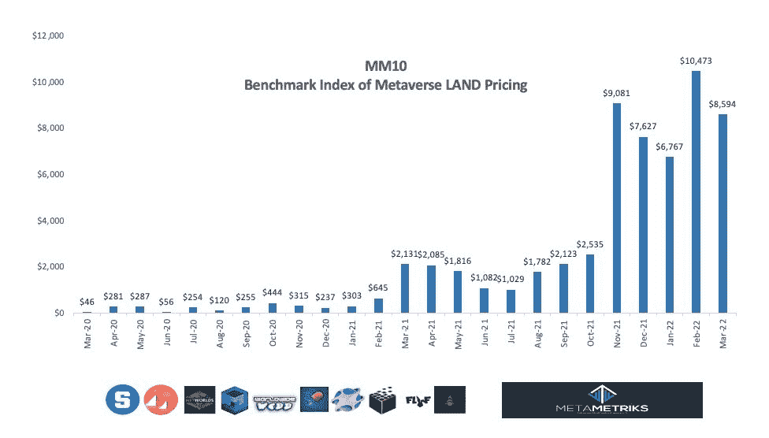
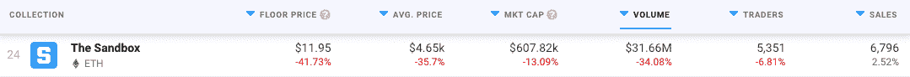
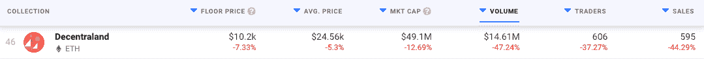
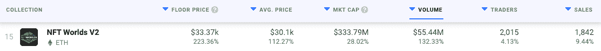
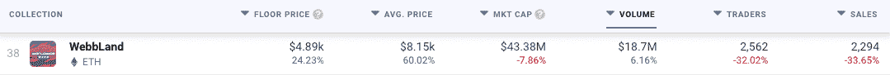

# 元宇宙的土地在 3 月份损失了 18%

> 原文：<https://web.archive.org/web/https://dappradar.com/blog/metaverse-land-lost-18-in-value-in-march>

## 此前，元宇宙土地的平均价格在 2 月份创下历史新高

过去几个月来，元宇宙地产一直是 NFT 票房收入最高的板块之一。**然而，3 月份上升趋势被逆转。分析公司 Meta Metrics 报告称，整个空间的土地 NFT 平均价格下降了 18%。**

***概要:***

*   ***[三月份土地 NFTs 价值缩水 18%](https://web.archive.org/web/20221208162503/https://dappradar.com/blog/metaverse-land-lost-18-in-value-in-march/#dropped)***
*   ***[2 月平均估值创历史新高](https://web.archive.org/web/20221208162503/https://dappradar.com/blog/metaverse-land-lost-18-in-value-in-march/#february)***
*   [***沙盒***](https://web.archive.org/web/20221208162503/https://dappradar.com/ethereum/marketplaces/the-sandbox-marketplace)*[***分散化***](https://web.archive.org/web/20221208162503/https://dappradar.com/ethereum/marketplaces/decentraland) ***引领下行趋势****
*   *[***【NFT】一亩三分地***](https://web.archive.org/web/20221208162503/https://dappradar.com/ethereum/games/nft-worlds)*[***world wide Webb***](https://web.archive.org/web/20221208162503/https://dappradar.com/ethereum/collectibles/worldwide-webb-land)***上升中的*****
*   ******陆之昂******

 **随着乌克兰战争引发的动荡，全球加密市场呈现出越来越悲观的趋势，虚拟世界也受到了负面影响。Meta Metrics 报告称，元宇宙 NFT 土地的平均价格降至 8600 美元左右。

Source: [Meta Metrics](https://web.archive.org/web/20221208162503/https://twitter.com/MetaMetriks/status/1511013758147178496/photo/1)

除了行业外不断增长的压力之外，在 2 月份平均估值超过 10，400 美元的历史高点之后，股价的下跌在一定程度上是意料之中的。重要的是，这不全是坏消息，今年迄今的比较显示虚拟世界土地的平均价格上涨了 400%。

## 沙盒和分散土地受影响最大

从单个虚拟世界来看，我们看到这种负面趋势主要是由于[沙盒](https://web.archive.org/web/20221208162503/https://dappradar.com/ethereum/marketplaces/the-sandbox-marketplace)土地 NFTs 的估值大幅下降。根据 [DappRadar 数据](https://web.archive.org/web/20221208162503/https://dappradar.com/nft/collections/protocol/ethereum/2)，在过去的 30 天里，沙盒中的土地平均价格下跌了 35%。重要的是，这些非关税壁垒的底价也下降了 41%以上。尽管如此，人们对该平台的兴趣似乎仍在上升，3 月份记录的销售数量跃升了 2.5%。

[分散土地](https://web.archive.org/web/20221208162503/https://dappradar.com/ethereum/marketplaces/decentraland)是元宇宙土地平均价格大幅下降的另一个原因。在过去的 30 天里，该平台通过其市场销售的 NFT 的平均价格下降了 5%以上。不幸的是，这种负面趋势不仅仅局限于价格，因为与前一个月相比，该平台的销售额减少了 44%，交易者减少了 37%。

## nft 世界和万维网中的元宇宙土地增值

该领域的整体负面趋势并未影响到所有平台。NFT 世界和环球韦布都看到了土地 NFT 的底价和均价大幅上升。

在过去的 30 天里，NFT 世界的非土地交易的平均销售价格上涨了 112%。此外，游戏的 NFT 底价上涨了两倍多，达到 33，300 多美元。三月份 NFT 世界的活动也很活跃，在过去的三十天里，销售额增加了 9.4%。这种激增背后的主要驱动因素之一是宣布 [NFT 世界将为其本地令牌 WRLD 引入许多赌注机制](https://web.archive.org/web/20221208162503/https://dappradar.com/blog/nft-worlds-looking-to-stake-millions-of-wrld-tokens)。重要的是，玩家可以下注他们的土地 NFT 来赚取 [WRLD 代币](https://web.archive.org/web/20221208162503/https://dappradar.com/hub/token/eth/WRLD?from=0xd5d86fc8d5c0ea1ac1ac5dfab6e529c9967a45e9)。

WorldWideWebb 是今年 3 月太空中的另一位顶级演员。根据 DappRadar 的数据，在过去的三十天里，该平台吸引了超过 1870 万美元的 NFT 交易量。此外， [WebbLand NFTs](https://web.archive.org/web/20221208162503/https://dappradar.com/ethereum/collectibles/worldwide-webb-land) 的平均价格飙升了 60%以上，而该系列的底价与 2 月份相比上涨了近四分之一。

## 并非一切都是黑暗和阴郁的

尽管 3 月份整体趋势不佳，但元宇宙仍将继续存在。各种项目仍在推出具有陆地 NFTs 的虚拟世界，宇迦实验室的[other side](https://web.archive.org/web/20221208162503/https://dappradar.com/blog/bored-ape-metaverse-is-here-see-you-on-the-otherside/)是三月份宣布的最突出的项目，尽管缺乏细节。

虚拟土地和元宇宙仍处于非常早期的发展阶段。自从脸书更名为 Meta 以来，人们对区块链领域的兴趣一直在不断增长。主流采用的趋势很明显(阿迪达斯、史努比狗狗和华纳音乐，仅举几个例子)，这仅仅意味着虚拟土地将成为大品牌 web3 扩张的基础元素。

三月份观察到的负面趋势可以解释为导致价格稳定的冷却期。虽然在 2021 年底和 2022 年头几个月，围绕元宇宙有不可否认的炒作，但虚拟世界现在正在找到他们坚实的用户基础，这对定价产生了影响。然而，并不是所有的东西都丢失了。

DappRadar 将继续监测元宇宙，因为更多的项目将引入虚拟世界，为他们的用户带来效用。如果你想了解更多关于元宇宙的报道，可以看看 DappRadar 的博客。此外，你可以在[的 Twitter](https://web.archive.org/web/20221208162503/https://twitter.com/dappradar) 上关注 DappRadar，抢先获得最新消息。

 NewsletterUnsubscribe at any time. [T&Cs](https://web.archive.org/web/20221208162503/https://dappradar.com/terms) and [Privacy Policy](https://web.archive.org/web/20221208162503/https://dappradar.com/privacy-policy)**