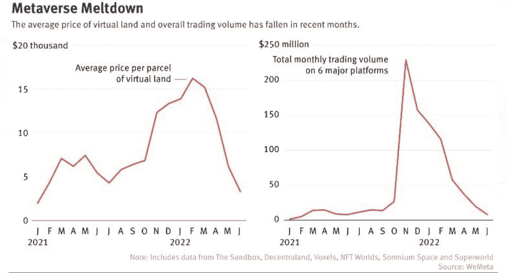
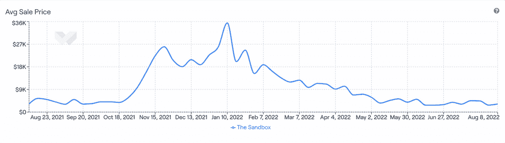
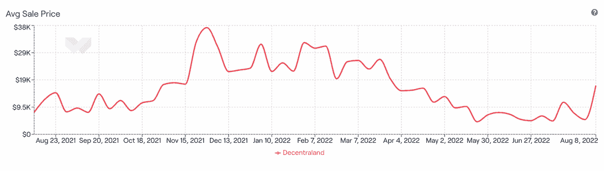
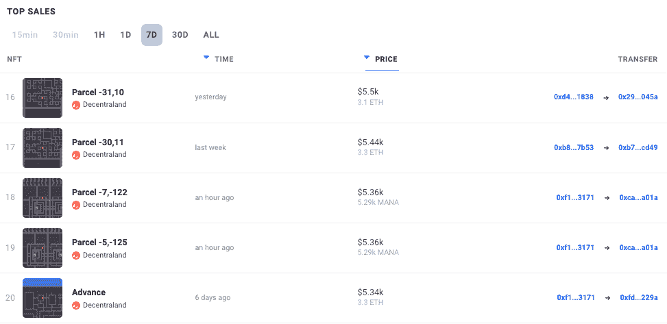
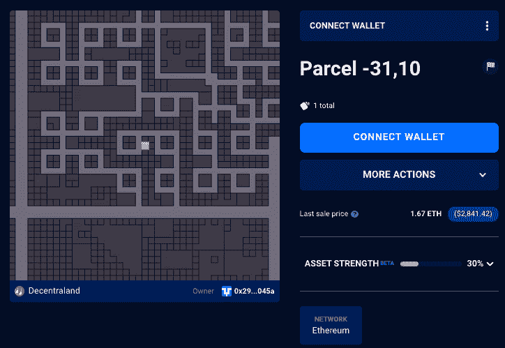
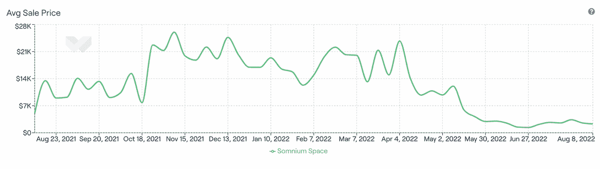
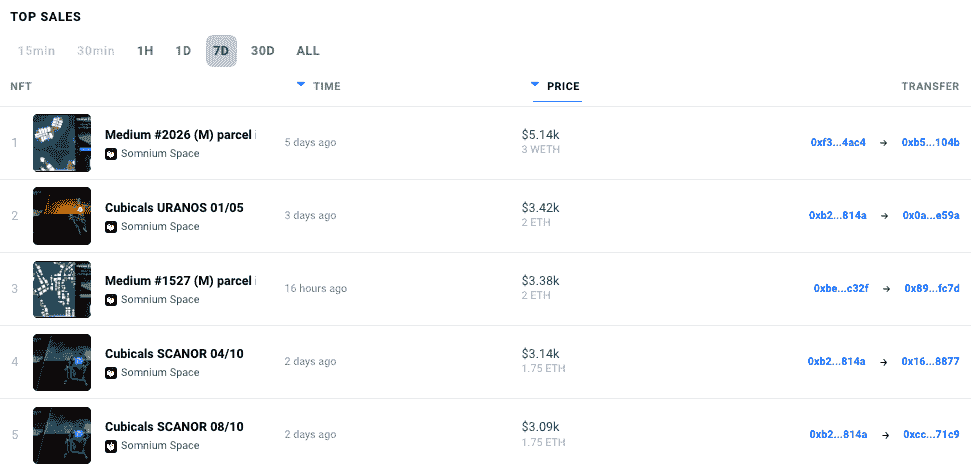
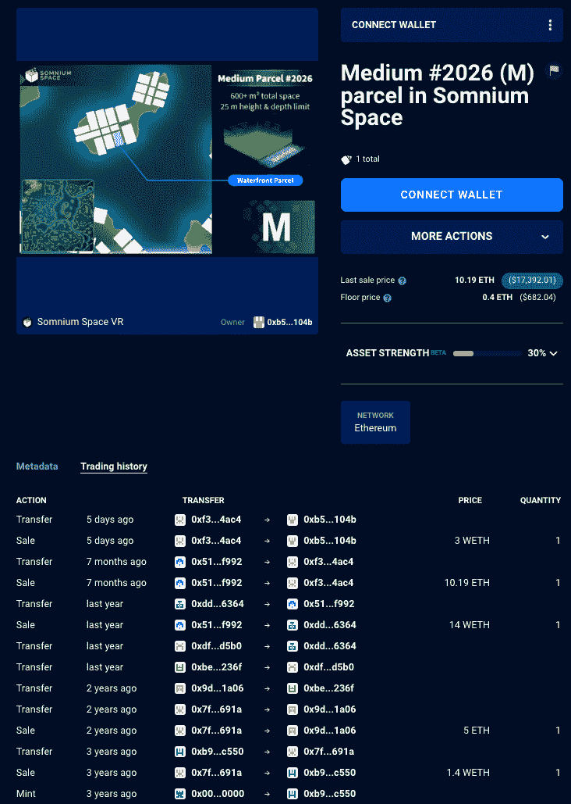
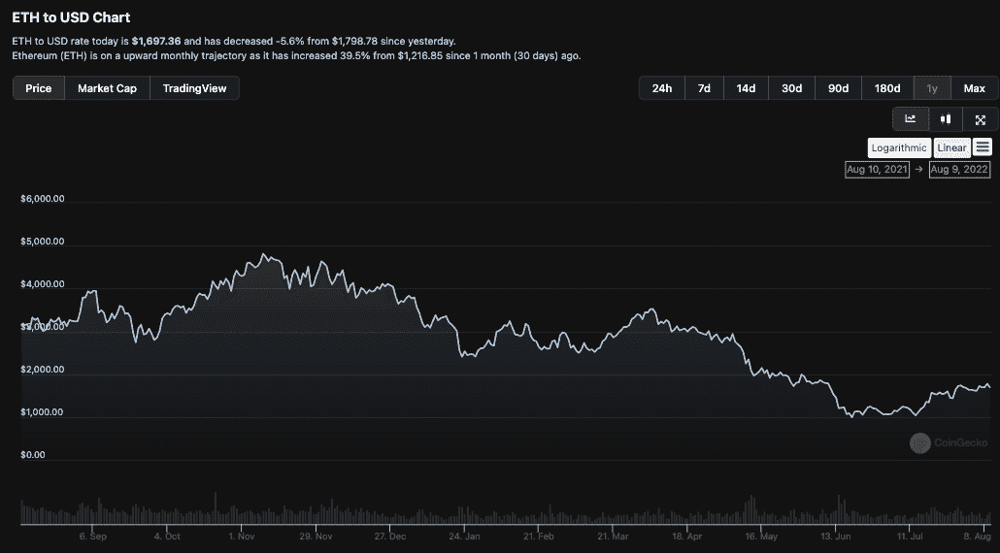

# 元宇宙崩溃:顶级元宇宙土地损失 91%的价值

> 原文：<https://web.archive.org/web/https://dappradar.com/blog/metaverse-meltdown-top-metaverse-lands-lose-91-value>

## 土地可能是虚拟的，但痛苦是真实的

从领先的元宇宙平台分散土地、Somnium Space 和沙盒，NFT 土地的价值正在全面崩溃。综合来看，这三个平台的土地平均销售价格比各自的高点下跌了 91%以上。

2021 年 10 月 28 日，当脸书宣布更名为 Meta 时，全世界都在关注。更重要的是，随着世界对元宇宙和虚拟世界平台提供的机会感兴趣，[位于区块链的元宇宙项目](https://web.archive.org/web/20221004001644/https://dappradar.com/blog/what-is-the-metaverse)已经站稳脚跟，开始感受到这种爱。

在大肆宣传中，随着对世界的期望越来越高，投机者[潜入领先平台抢购 NFT 土地](https://web.archive.org/web/20221004001644/https://dappradar.com/blog/top-10-best-metaverse-virtual-worlds-with-land-nfts/)，最终在元宇宙生活、工作和娱乐。从一个角度来看，这个想法是可靠的，因为如果数百万人最终在这些平台上，[他们将需要土地](https://web.archive.org/web/20221004001644/https://dappradar.com/blog/top-10-best-metaverse-virtual-worlds-with-land-nfts/)。类似于现实世界。

然而，炒作是短暂的，随着人们慢慢停止关注和投机土地，领先平台中 [NFT 土地的平均价格下降了 95%。当然，还有以太价值下降的重要细微差别需要考虑。](https://web.archive.org/web/20221004001644/https://dappradar.com/blog/top-10-best-metaverse-virtual-worlds-with-land-nfts/)

## 支持这一主张的数字

来自推特 [@MacroAlf 的一条简单的推文](https://web.archive.org/web/20221004001644/https://twitter.com/MacroAlf)引发了对元宇宙土地价值的更深入的探究。在发了一条声称元宇宙土地正在崩溃的推特之后，我们不得不更进一步。

[使用构建上图的同一个平台](https://web.archive.org/web/20221004001644/https://analytics.wemeta.world/metaverse/welcome)的数据，我们分别查看了[分散土地](/web/20221004001644/https://dappradar.com/blog/what-is-decentraland-an-open-world-economy-in-the-metaverse/)、 [Somnium Space](/web/20221004001644/https://dappradar.com/blog/how-to-setup-somnium-space/) 和[沙盒](/web/20221004001644/https://dappradar.com/blog/what-is-the-sandbox-how-to-join-the-metaverse/)上 NFT 土地的平均销售价格(以美元计)。取过去 12 个月中最高和最低的美元平均价格，并计算下降百分比。

## 沙盒

*   过去 12 个月
*   最高平均价格–2022 年 1 月 10 日–35，474 美元
*   最低均价–2022 年 6 月 13 日–2766 美元
*   土地价值下降百分比= 92.2%

Source: [WeMeta](https://web.archive.org/web/20221004001644/https://analytics.wemeta.world/metaverse/welcome)

有趣的是，NFT 的土地销售在 2021 年 11 月达到顶峰。与此同时，其他系列也失去了活力。然而，沙盒可以说是此后[最活跃的平台](https://web.archive.org/web/20221004001644/https://dappradar.com/blog/search/?q=the%20sandbox)，宣布了[几个强大的品牌合作关系](https://web.archive.org/web/20221004001644/https://dappradar.com/blog/search/?q=the%20sandbox)，还发布了[第二季 play-2-earn 事件](https://web.archive.org/web/20221004001644/https://dappradar.com/blog/search/?q=the%20sandbox)。

这些事情似乎有助于[沙盒](https://web.archive.org/web/20221004001644/https://dappradar.com/blog/what-is-the-sandbox-how-to-join-the-metaverse)保持其炒作，并在 2022 年 1 月看到其最高平均销售价格，然后整个加密市场开始进入熊市，价格开始随着以太的价值崩溃。

## 分散土地

*   过去 12 个月
*   最高均价–2021 年 11 月 29 日–37，238 美元
*   最低平均价格–2022 年 5 月 23 日–4379 美元
*   土地价值下降百分比= 88.2%

Source: [WeMeta](https://web.archive.org/web/20221004001644/https://analytics.wemeta.world/metaverse/welcome)

看看过去七天 NFT 在分散地的销售情况，就能更清楚地看到现在交易者愿意为分散地的土地支付多少钱。在几个高价值的[销售](https://web.archive.org/web/20221004001644/https://dappradar.com/ethereum/marketplaces/decentraland)之外，我们看到许多销售价格在 4000 美元到 6000 美元之间，这与当前大约 4500 美元的平均销售价格大致相符。

Source: DappRadar

[进一步调查](https://web.archive.org/web/20221004001644/https://dappradar.com/hub/wallet/eth/0x5cb6f3299374cf1ddc268c9336573aa7fe64d485/nfts/1/decentraland)[第 31，10](https://web.archive.org/web/20221004001644/https://dappradar.com/hub/assets/eth/0xf87e31492faf9a91b02ee0deaad50d51d56d5d4d/115792089237316195423570985008687907842721231291091471672092971177528315084810) 号地块的新主人的钱包发现，他们只持有这块分散的 NFT 土地，没有其他 NFT。这是一个坚信 NFT 分散土地会再次出现需求和价值增长的人。

Source: DappRadar

## Somnium Space

*   过去 12 个月
*   最高均价–2022 年 11 月 8 日–26，013 美元
*   最低平均价格–2022 年 6 月 27 日–1369 美元
*   土地价值下降百分比= 94.7%

Source: [WeMeta](https://web.archive.org/web/20221004001644/https://analytics.wemeta.world/metaverse/welcome)

Somnium Space 虽然不如元宇宙的另外两个项目那么引人注目，但可以说是 T2 正在建造的最先进的虚拟世界之一。该团队有一个坚实的愿景，要打造出与《T4》中描述的最相似的东西。

一个完全可互操作的元宇宙，用户在同一个实例中，可以自由地做他们想做的事情。他们甚至走得更远，[发布了 Teslasuit](https://web.archive.org/web/20221004001644/https://www.gmw3.com/2021/10/somnium-space-expands-metaverse-ambitions-with-teslasuit-investment/) ，这是一套全触觉人体套装，旨在让元宇宙市民在 Somnium 空间体验触觉、感觉和知觉。

在 Somnium Space 查看 NFT 过去七天的土地销售情况，可以证实其价值已经从历史高点下跌。我们看到一些中等地块的销售价格在 5000 美元到 3000 美元之间。

Source: DappRadar

进一步探究[中地块#2026、](https://web.archive.org/web/20221004001644/https://dappradar.com/hub/assets/eth/0x913ae503153d9a335398d0785ba60a2d63ddb4e2/2026)最近七天的最高销售，我们可以看到该地块的[交易历史。这块地最后一次转手是在 7 个月前，当时它的售价约为 17，000 美元，买家连续五天以约 5，000 美元的价格卖出，损失相当大。](https://web.archive.org/web/20221004001644/https://dappradar.com/hub/assets/eth/0x913ae503153d9a335398d0785ba60a2d63ddb4e2/2026)

再说一次，在元宇宙炒作高峰期买入的投机者希望收回一些资金，而不是持有土地等待更好的日子。可以说，这表明他们要么不完全明白自己买了什么，要么不知道 Somnium Space 是否有未来。

Source: DappRadar

分析的最终结果是，当结合每个元宇宙的个别百分比下降时，我们得到三个元宇宙平台的 NFT 土地价值从最高到最低平均价格平均下降 91.7%。

观察用于交易这些虚拟土地的货币价值也很重要，因为它会影响美元价值。虽然我们在上面指出了美元价值，但这些土地主要是在以太网中买卖的。

## ETH 值更低

这种细微差别很重要，因为如果一个交易者在 2021 年 11 月为一块土地支付 4 ETH，而当时 ETH 的价值为 4000 美元，那么他们的成本是 16000 美元。如果五个月后，ETH 的价值是 1000 美元，而该地块的价值是 4 ETH，卖方可能会得到 4000 美元。在这个过程中损失 12，000 美元，或者干脆持有，等待更好的日子。

在这种情况下，卖家可以将价格调整到 16 ETH，并试图重新获得总美元价值，但卖家这样操作并不常见。此外，根据简单的经济学规则，随着需求增长和供应萎缩，买家预计 NFT 土地会升值。

在过去的 12 个月里，ETH 在 2021 年 11 月 9 日触及 4815 美元的高点，在 2022 年 6 月 19 日触及 995 美元的低点。在这两个日期之间，股价下跌了近 80%。因此，这些数字看起来是一致的，除非卖家对他们在 ETH 的 NFT 土地重新定价，以补偿过去 12 个月的美元价值损失。

随着以太价值的下降，土地的美元价值也下降了。然而，这并不能说明一切。也就是说，我们观察到前三大元宇宙平台的 NFT 土地价值下降了 91%，但与此同时，用于交易土地的货币价值也受到了巨大冲击。

[<picture></picture>](https://web.archive.org/web/20221004001644/https://dappradar.com/ethereum/marketplaces/decentraland)[<picture></picture>](https://web.archive.org/web/20221004001644/https://dappradar.com/ethereum/marketplaces/the-sandbox-marketplace)[<picture></picture>](https://web.archive.org/web/20221004001644/https://dappradar.com/ethereum/games/somnium-space)

## 元宇宙崩溃

如果人们在价格最高时在这里提到的三个元宇宙平台中的任何一个购买了 NFT 的土地，那么最好的行动计划可以说是成立的。等待 ETH 的值增加，等待一些积极性回到空间，然后再开始思考。

理解这一点也很重要，虽然标题可以说价值下跌了 90%以上，但 NFT 的持有人在技术上并没有下跌，因为他们仍然持有土地，这些土地一度有很大的价值，可能会再次下跌。当然，如果一个人支付了 17000 美元，现在它值 3000 美元，这种不好的感觉很难动摇。耐心是关键。

然而，更令人担忧的是，元宇宙主要地台中的 [NFT 地块在短时间内价值下降，似乎纯粹受到投机和炒作](https://web.archive.org/web/20221004001644/https://dappradar.com/nft)的[影响。这三个平台在那段时间都没有做出什么惊人之举，支持了兴奋的投资者冲进去制造泡沫的观点。](https://web.archive.org/web/20221004001644/https://dappradar.com/blog/dappradar-blockchain-industry-report-july-2022)

 NewsletterUnsubscribe at any time. [T&Cs](https://web.archive.org/web/20221004001644/https://dappradar.com/terms) and [Privacy Policy](https://web.archive.org/web/20221004001644/https://dappradar.com/privacy-policy)