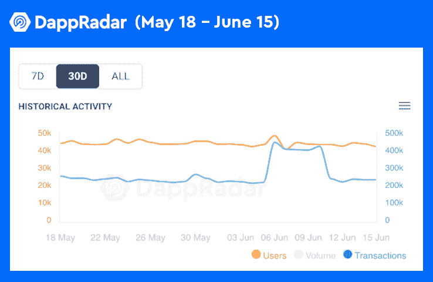

# 元宇宙汽车公司将首次亮相高地:准备放大

> 原文：<https://web.archive.org/web/https://dappradar.com/blog/metaverse-motors-to-make-debut-in-upland-get-ready-to-zoom>

## 元宇宙汽车公司为高地经济增添了新的一层

高地元宇宙汽车公司备受期待的汽车 NFTs 终于登陆元宇宙。随着汽车的到来，一系列全新的功能为玩家带来了新的可能性，让他们可以将资产货币化，并创造更具吸引力的体验。更重要的是，新的制造工艺引入了关键的基础设施，为当前的生态系统增加了一个新的经济层次。

**概要:**

*   [高地](https://web.archive.org/web/20220813161136/https://dappradar.com/eos/games/upland)是一个[即玩即赚](https://web.archive.org/web/20220813161136/https://dappradar.com/blog/tag/best-play-to-earn-games)的元宇宙平台，稳坐 [EOS dapp 排行榜榜首。](https://web.archive.org/web/20220813161136/https://dappradar.com/rankings/protocol/eos)
*   令人印象深刻的是，Upland 的注册用户同比增长了 546%。
*   最近，它正式推出了人们期待已久的采用 NFT 制造工艺的 NFT 汽车。
*   目前，Upland 拥有一个超过 250，000 名虚拟土地所有者的社区，在过去 30 天内产生了 800 万笔交易。

Upland 是 EOS 上领先的元宇宙 dapp，其注册用户同比增长了 546%。自 2019 年成立以来，Upland 已经从一个类似垄断的游戏转变为一个充满活力的元宇宙生态系统。

高地在所有元宇宙游戏中脱颖而出，因为它是基于现实世界地理定位的最大游戏。此外，Upland 利用不可替代令牌(NFT)授予玩家对其游戏内资产的所有权，确保数字财产拥有法定价值，就像现实世界中的财产一样。

临近 2022 年下半年，高地在建设广阔的元宇宙方面取得了坚实的进展。这些里程碑包括向生态系统引入新的城市，扩大 Metaventures(玩家拥有的企业)，以及为元宇宙汽车公司带来的新一层游戏和收入经济奠定基础。

[https://web.archive.org/web/20220813161136if_/https://www.youtube.com/embed/b7J2z6s2tbE?feature=oembed](https://web.archive.org/web/20220813161136if_/https://www.youtube.com/embed/b7J2z6s2tbE?feature=oembed)

## 元宇宙汽车公司为高地增添了一层新的经济

得益于交通系统，未来的元宇宙高地将变得更加互联互通、易于探索、令人身临其境。

在运输系统投入使用之前，陆上居民将需要一些汽车；当然是非功能性测试。为此，Upland 推出了自己的本土汽车品牌元宇宙汽车，为用户提供广泛的汽车选择，每种汽车都有不同的特点和用途。但是，最重要的是，高地邀请社区支持其“本地经济”，这意味着元宇宙汽车将在高地本地“制造”。

今年在 Q2，Uplanders 终于可以看到期待已久的第一家制造工厂在加州圣克拉拉的部署。此外，它也是元宇宙汽车公司的总部。

### 为什么 NFT 制造业对高地很重要？

制造业在元宇宙高地的商业基础设施中扮演着重要的角色。正如前一篇文章中介绍的[，高地的部分经济以元风险投资为中心，元风险投资是元宇宙高地玩家拥有和经营的商店。游戏要求企业家以一种有趣的方式从头开始建立他们的商业帝国，这是 Upland 的 web3 环境所独有的。](/web/20220813161136/https://dappradar.com/blog/transport-businesses-have-enriched-the-upland-metaverse-ecosystem/)

有了这个背景，制造业的重要性就不言而喻了。因此，制造业将为所有元风险投资提供基础，比如户外装饰和结构装饰品。

汽车制造业的启动揭开了高地经济的新篇章。正在崛起的元宇宙汽车工业。此外，NFT 制造的推出是向高地生态系统赋权和多样化迈出的一大步。

## 高地的生态系统继续扩张和繁荣

目前，来自世界各地的超过 250，000 名虚拟土地所有者正在高地的元宇宙建造他们梦想的空间和企业。此外，300 多万名非森林动物找到了它们的主人。

根据 DappRadar 的数据，在过去的 30 天里，Upland 已经注册了超过 800 万笔交易，用户活动在这段时间内均匀分布。这意味着高地已经成功地建立了一个可持续的生态系统，不断吸引用户。

进入 web3 时代，Upland 坚持建立一个开放的、以社区为中心的经济，允许玩家、开发商和品牌制造商品、打造独特的体验、将资产货币化和建立公用事业 NFT。在高地，用户可以玩、赚、连接，最重要的是，重塑未来数字商务的范式。

6 月 16 日，Upland 与 DappRadar 就其不断扩张的数字经济以及 Upland 的未来进行了一次令人兴奋的对话。视频记录如下。

[https://web.archive.org/web/20220813161136if_/https://www.youtube.com/embed/5w7m24gADoo?feature=oembed](https://web.archive.org/web/20220813161136if_/https://www.youtube.com/embed/5w7m24gADoo?feature=oembed)

更令人兴奋的新功能即将来到高地的元宇宙。了解更多关于高地的信息:在 [Twitter](https://web.archive.org/web/20220813161136/https://twitter.com/UplandMe) 或 [Discord](https://web.archive.org/web/20220813161136/https://discover.upland.me/discord) 上。高地还在 [Reddit](https://web.archive.org/web/20220813161136/https://www.reddit.com/r/uplandme) 、[脸书](https://web.archive.org/web/20220813161136/https://www.facebook.com/uplandme)、 [YouTube](https://web.archive.org/web/20220813161136/https://www.youtube.com/c/Upland) 、 [Twitch](https://web.archive.org/web/20220813161136/https://www.twitch.tv/uplandme) 和 [Telegram](https://web.archive.org/web/20220813161136/https://t.me/upland) 上保持存在。

**免责声明** —这是一篇赞助文章。DappRadar 不认可本页面上的任何内容或产品。DappRadar 旨在提供准确的信息，但读者应该在采取行动之前总是自己做研究。DappRadar 的文章不能被认为是投资建议。