# 元宇宙报告#2:对元宇宙的需求仍然处于加密混乱中

> 原文：<https://web.archive.org/web/https://dappradar.com/blog/metaverse-report-2-demand-for-metaverse-remains-amidst-crypto-turmoil>

## 本报告探讨了可能对区块链行业的未来产生影响的最重要的元宇宙趋势。

***免责声明:***[***DappRadar***](https://web.archive.org/web/20221130131452/https://dappradar.com/)***跟踪在一段时间内与分散式应用程序(dapp)关联的智能合约交互的唯一活动钱包(UAW)的数量。这也称为链上或区块链活动。然而，多个 dapps 不需要执行区块链事务来执行某些动作。***

区块链生态系统之外的活动被称为链外或 Web 2.0 活动。传统上，离线活动是通过每日活跃用户的数量来衡量的(DAU)。离线活动的一个例子是用户访问沙盒或分散的虚拟世界，或者用户玩 Axie Infinity 而不要求奖励，从而执行区块链交易。

[Download PDF](/web/20221130131452/https://dappradar.com/blog/blog/static/3e9d81f23734be124a4e946bacc8d172/dappradar.com-metaverse-report-2.pdf)

Web3 元宇宙允许重置，这可能解决 Web2 互联网的某些众所周知的问题，如数据挖掘和权力集中。这是一个革命性的去中心化架构，使用区块链技术将虚拟世界与新的金钱和资产联系起来。

这种模式让生产者和用户从虚拟世界中获得了比现在的互联网更多的好处。仅在 2021 年，与元宇宙相关的区块链公司就筹集了 40 多亿美元来实现这一未来。

另一方面，许多批评家认为 Web3 的愿景是虚幻的。批评者称，这一愿景只是炒作，容易受到欺诈，鉴于其面临的技术和监管障碍，前景黯淡。他们经常预测，未来的元宇宙将基于中央所有的平台，比如目前主导在线游戏行业的平台。

这些支持者继续相信虚拟商品和虚拟世界的效用，但对完全可互操作的商品如 NFTs 和基于区块链的虚拟世界持谨慎态度。

元宇宙可以从两个不同的角度来理解:经典的元宇宙和基于区块链技术的元宇宙。前者可以与 Web2 概念相关，这是一种混合概念，其中当前的游戏和社交体验与在线增强现实相融合。另一方面，区块链·元宇宙坚持 Web3 理念，通过区块链技术赋予个人权力。

由于总部位于区块链的元宇宙的不可替代代币(NFT)的力量，任何人都可以根据自己的要求和偏好拥有和使用虚拟资产。NFT 是位于区块链上的唯一令牌，它将数字资产的所有权授予持有者。这很可能是区块链元宇宙的最大优势。

虚拟房地产 NFT 是区块链元宇宙最有趣的部分。这些数字地块共同构成了区块链虚拟世界(BVW)或 3D 虚拟环境。这些数字地块允许业主建造，鼓励创造力和分散化。

像[去中心化](https://web.archive.org/web/20221130131452/https://dappradar.com/multichain/social/decentraland)、隐体素和 [Somnium Space](https://web.archive.org/web/20221130131452/https://dappradar.com/ethereum/games/somnium-space) 这样的平台正在成为社交平台。同时，像[、沙盒](https://web.archive.org/web/20221130131452/https://dappradar.com/multichain/games/the-sandbox)、 [Treeverse](https://web.archive.org/web/20221130131452/https://dappradar.com/ethereum/collectibles/treeverse) 和[余烬剑](https://web.archive.org/web/20221130131452/https://dappradar.com/polygon/games/ember-sword)这样的空间是具有虚拟房地产特征的游戏。然而，每个平台都有区别于其他平台的特征。

这份报告旨在涵盖上个季度在[元宇宙](https://web.archive.org/web/20221130131452/https://dappradar.atlassian.net/wiki/spaces/UD/pages/1768816641/DappRadar+Index)发生的事情，并分析最受欢迎的元宇宙项目的链上指标。

## 关键要点

*   第三季度，虚拟世界的交易额下降了 91.61%，至 9000 万美元。土地销售数量环比下降 37.54%，表明对这类项目的热情并未消退。
*   来自 Q2 的前 10 大元宇宙项目的交易量平均下降了 80%，但销售额平均仅下降了 11%。
*   9 月份，分散土地公司 97，000 多处房产中只有 0.7%挂牌出售，尽管每一个土地卖家有 1.48 个买家。
*   沙盒 Alpha 第三季举办了 90 多场体验，有 400 万人注册了钱包，每月活跃用户超过 20 万。这帮助该平台的销售额比上一季度增长了 190%。
*   在经济不确定的情况下，元宇宙的代币平均损失了 60%的价值。
*   第三季度，Q2 注册了超过 112 万个 ENS 域名，同比增长 72%。
*   第三季度筹集的 12 亿美元中，33%用于建设元宇宙基础设施
*   北京市政府提出了一项为期两年的元宇宙创新和发展战略，以帮助北京成为数字经济的标杆。

## 内容

*   [虚拟世界概述](https://web.archive.org/web/20221130131452/https://dappradar.com/blog/metaverse-report-2-demand-for-metaverse-remains-amidst-crypto-turmoil/#Virtual-worlds-overview)
    *   [领先的元宇宙项目在第三季度显示出持续的区块链活动](https://web.archive.org/web/20221130131452/https://dappradar.com/blog/metaverse-report-2-demand-for-metaverse-remains-amidst-crypto-turmoil/#Leading-metaverse-projects-showed-sustained-blockchain-activity-in-Q3)
    *   [本季度元宇宙最大项目的美元贸易额下降了 80%](https://web.archive.org/web/20221130131452/https://dappradar.com/blog/metaverse-report-2-demand-for-metaverse-remains-amidst-crypto-turmoil/#The-USD-trade-volume-of-the-biggest-metaverse-projects-dropped-80%-this-quarter)
    *   [元宇宙项目的需求仍然很高，销售额仅比第三季度下降 11.55%](https://web.archive.org/web/20221130131452/https://dappradar.com/blog/metaverse-report-2-demand-for-metaverse-remains-amidst-crypto-turmoil/#The-demand-for-metaverse-projects-is-still-high,-with-only-11.55%-decrease-in-sales-count-from-Q3)
    *   [本季度以美元计算的虚拟土地地板价格下降 75%](https://web.archive.org/web/20221130131452/http://the-floor-price-of-virtual-lands-in-usd-decrease-75%-this-quarter-/)
*   [9 月，分散的土地迎来了 56，000 名每日用户](https://web.archive.org/web/20221130131452/http://decentraland-welcomed-56,000-daily-users-in-september/)
*   [沙盒 Alpha 第三季吸引 20 万活跃用户](https://web.archive.org/web/20221130131452/http://the-sandbox-alpha-season-3-attracts-200,000-active-users/)
*   [总部位于元宇宙的代币无法逃脱经济衰退的影响](https://web.archive.org/web/20221130131452/https://dappradar.com/blog/metaverse-report-2-demand-for-metaverse-remains-amidst-crypto-turmoil/#Metaverse-based-tokens-could-not-escape-the-economic-downturn)
*   [第三季度对 ENS 域名的需求猛增 72%](https://web.archive.org/web/20221130131452/https://dappradar.com/blog/metaverse-report-2-demand-for-metaverse-remains-amidst-crypto-turmoil/#Demand-for-ENS-domains-soared-72%-in-Q3)
*   第三季度筹集 12 亿美元建造元宇宙
*   [大众品牌采用和全球元宇宙扩张](https://web.archive.org/web/20221130131452/https://dappradar.com/blog/metaverse-report-2-demand-for-metaverse-remains-amidst-crypto-turmoil/#Mass-brand-adoption-and-global-metaverse-expansion)
*   [元宇宙的七大法则](https://web.archive.org/web/20221130131452/https://dappradar.com/blog/metaverse-report-2-demand-for-metaverse-remains-amidst-crypto-turmoil/#The-seven-rules-of-the-metaverse)
*   [结论](https://web.archive.org/web/20221130131452/https://dappradar.com/blog/metaverse-report-2-demand-for-metaverse-remains-amidst-crypto-turmoil/#Conclusion)

## 虚拟世界概述

在经历了 5 月份围绕“彼岸铸币厂”的大肆宣传之后，虚拟世界项目经历了一个平静的季度。该类别的交易量较上一季度的 8.93 亿美元下降了 91.61%。另一方面，土地交易数量较上一季度下降 37.54%，至 52，224 宗，表明围绕此类项目的热潮并未消退，而是正在接近盘整期。

![Virtual_World_Trading_Volume_and_Sales_Count[1]](img/60bd9633ba9e63f2fd2f7199447b15ae.png)

### 领先的元宇宙项目显示了第三季度持续的区块链活动

UAW 或用户数据是“与 dapp 智能合约交互的唯一钱包地址的数量”。因此，要被 DappRadar 计算在内，钱包必须进行区块链交易。

[Learn about Unique Active Wallets](https://web.archive.org/web/20221130131452/https://dappradar.com/blog/dappradar-tracks-unique-active-wallets-but-what-does-that-mean)

[Otherdeed for Otherside](https://web.archive.org/web/20221130131452/https://dappradar.com/ethereum/collectibles/otherdeed-for-otherside) 是 2022 年 5 月最流行的元宇宙项目，在 NFT 历史上最大的造币活动之一之后。然而，[、沙盒](https://web.archive.org/web/20221130131452/https://dappradar.com/multichain/games/the-sandbox)和[分散化](https://web.archive.org/web/20221130131452/https://dappradar.com/multichain/social/decentraland)仍然是全年最活跃的元宇宙平台。

自 5 月份以来，沙盒一直保持着平均每天 750 个钱包与游戏平台的合同进行交互。相比之下，[沙盒市场](https://web.archive.org/web/20221130131452/https://dappradar.com/ethereum/marketplaces/the-sandbox-marketplace)，游戏的 NFT 资产交易的 dapp，自 5 月以来一直呈上升趋势。沙盒市场的日 UAW 上升了 348%，9 月份达到 395。

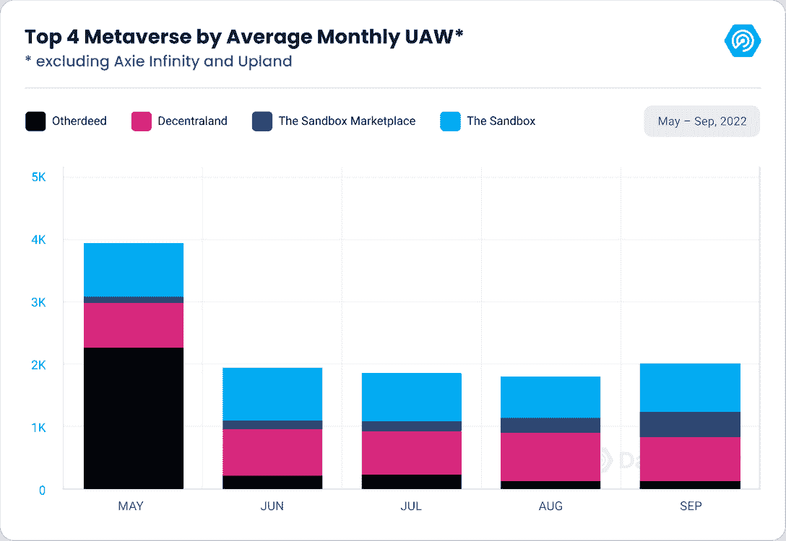

同样，在过去的五个月中，分散型土地保持了持续的区块链活动。由于 6 月的骄傲周和 8 月的艺术周，自 5 月以来，分散地平均吸引了 792 个独特的活动钱包。

尽管市场目前面临着经济不确定性，但人们对元宇宙平台的兴趣仍在不断增长。

### 本季度，元宇宙最大项目的美元贸易额下降了 80%

受恶劣的宏观环境影响，本季度元宇宙十大项目(不包括 [Axie](https://web.archive.org/web/20221130131452/https://dappradar.com/multichain/games/axie-infinity) 和 [Upland](https://web.archive.org/web/20221130131452/https://dappradar.com/eos/games/upland) )的美元交易量平均下降了 80%。

Otherdeeds for Otherside 第三季度的交易量为 5400 万美元，与第二季度相比下降了 92.70%。然而，宇迦实验室的游戏虚拟世界主办了一些重要的活动。7 月，该项目聚集了 4300 名测试人员，“旅行者”，进行由 implementable 开发的技术演示和元宇宙之旅。该团队推出了几个负载测试，以强调不可能的高端元宇宙技术 M2。

同样在 8 月，阿姆和史努比·道格在元宇宙的另一边的年度音乐录影带颁奖典礼上表演。Otherside 占第三季度整体虚拟世界交易量的 73.98%。

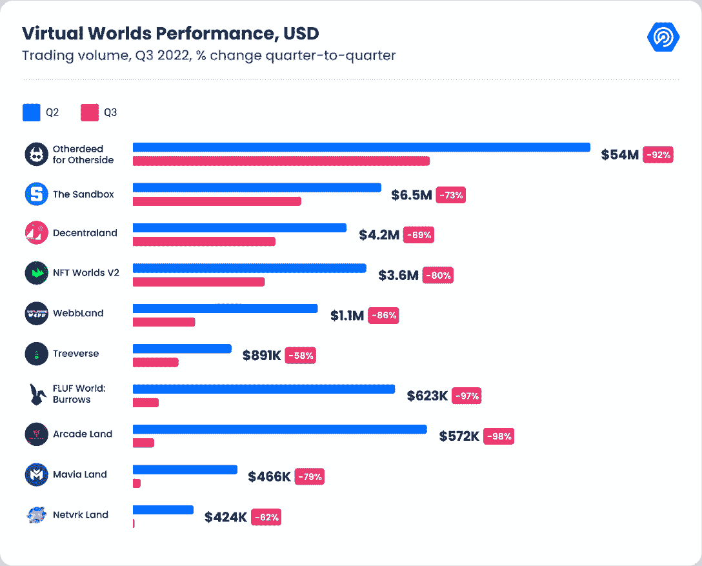

NFT 世界也经历了有趣的一季。该系列的交易量下降了 80.62%，至 360 万美元，是该项目有史以来的最低月份。这一下降是《我的世界》7 月[禁止非关税壁垒](https://web.archive.org/web/20221130131452/https://dappradar.com/blog/dappradar-x-bga-games-report-6#:~:text=Minecraft%20bans%20NFT%2D%20Resistance%20from%20traditional%20gaming)的结果。NFT 世界利用《我的世界》的源代码作为其 NFT 驱动的元宇宙项目的基础。然而，《我的世界》停止支持这种融合。

另一家元宇宙博彩公司 Treeverse 较 Q2 下跌了 58%，第三季度的交易额首次低于 100 万美元，准确地说是 891，175 美元。这是 Loopify 游戏有史以来的最低交易量。尽管标准很低，项目[宣布](https://web.archive.org/web/20221130131452/https://twitter.com/TheTreeverse/status/1565028399734718466?ref_src=twsrc%5Etfw%7Ctwcamp%5Etweetembed%7Ctwterm%5E1565028399734718466%7Ctwgr%5E0f5cb2ed473dde60efcde03729f626596f932749%7Ctwcon%5Es1_&ref_url=https%3A%2F%2Fplaytoearn.net%2Fnews%2Fblockchain-mmorpg-treeverse-is-launching-into-pre-alpha-this-q4)他们游戏的预测试版将在年底前上线。

虽然大多数元宇宙项目经历了一段时期，但沙盒的交易量在 9 月份增长了 25.69%，尽管仍比第二季度下降了 73.20%。

Netvrk Land 也见证了环比增长 54.16%(17.3 万美元)，尽管该公司仍比第二季度下降 62.34%。Netvrk Land 在本季度结束时的交易量首次低于 50 万美元，这是有史以来的最低交易量。

### 元宇宙项目的需求仍然很高，与第三季度相比，销售额仅下降了 11.55%

第三季度，元宇宙 10 大项目销售额平均下降 11.55%。我们认为这是一个看涨的信号，因为它表明对这类项目的炒作并没有减少。相反，加密货币价格的下跌影响了项目的整体交易量，而不是缺乏兴趣。

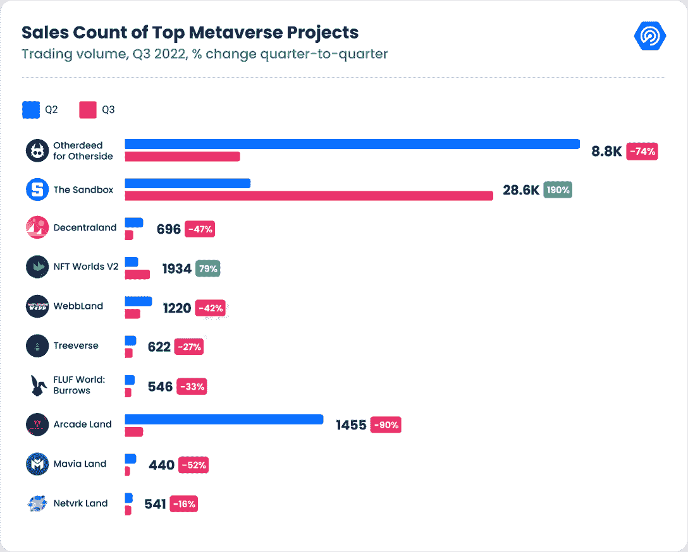

与 Q2 相比，Otherside 的 Otherdeed 第三季度销售额下降了 74%。类似地，分散的土地也有类似的下降，Q2 下降了 47%，在第三季度达到 696 辆。

另一方面，沙盒的销售计数从 Q2 增长了 190%，达到 28，624，主要是受阿尔法第三季的推动。同样，NFT 世界来自 Q2 的销售数量增加了 79%，这是由《我的世界》禁令推动的，因为一些持有者希望减少损失，而其他人则认为这是一个购买机会。

本季度 [FLUF 世界:与 Q2 相比，Burrows](https://web.archive.org/web/20221130131452/https://dappradar.com/ethereum/collectibles/fluf-world) 的销售额下降了 33%。不过，这个季度对平台来说还是很忙的。七月，元宇宙计划[宣布](https://web.archive.org/web/20221130131452/https://twitter.com/flufworld/status/1539604047032127488?ref_src=twsrc%5Etfw%7Ctwcamp%5Etweetembed%7Ctwterm%5E1539604047032127488%7Ctwgr%5E4315f27e78920b0403aaf93844529f838697d2b7%7Ctwcon%5Es1_&ref_url=https%3A%2F%2Fwww.cryptotimes.io%2Fkeanu-reeves-launches-futureverse-foundation-with-fluf-world-nft%2F)成立未来基金会，这是一个慈善基金会，艺术家亚历山德拉·格兰特和演员山谬·里维是其顾问。该组织将资助边缘化的艺术家，并在数字和物理频道上展示他们的作品。在挑选赠款获得者时，将特别考虑土著和女性艺术家。

### 本季度虚拟土地的底价(以美元计)下降了 75%

目前，元宇宙房地产价格接近一年来的最低点。尽管买卖土地目前无利可图，但元宇宙的房东和开发商仍有足够的机会。

虽然任何房地产的价值，不管是虚拟的还是其他的，都受到波动的影响，但元宇宙的房地产目前非常贬值。这主要来自加密货币市场的大幅价格下跌。因为虚拟土地是使用加密货币获得的，所以虚拟房地产的价值受加密货币价格波动的影响很大。

9 月 30 日，Otherdeed for Otherside 的土地楼面价为 1.62 ETH(2593 美元)，比 5 月底下降了 66.60%。

同样，沙盒和分散的土地价格从 5 月 1 日起分别下降了 41.44%(以美元计，2317.08 美元)和 56.05%(2315 美元)。但是，如果我们看看沙盒的 ETH 价格，我们可以观察到它实际上增加了 2.90% (1.49 ETH / 3109 SAND)

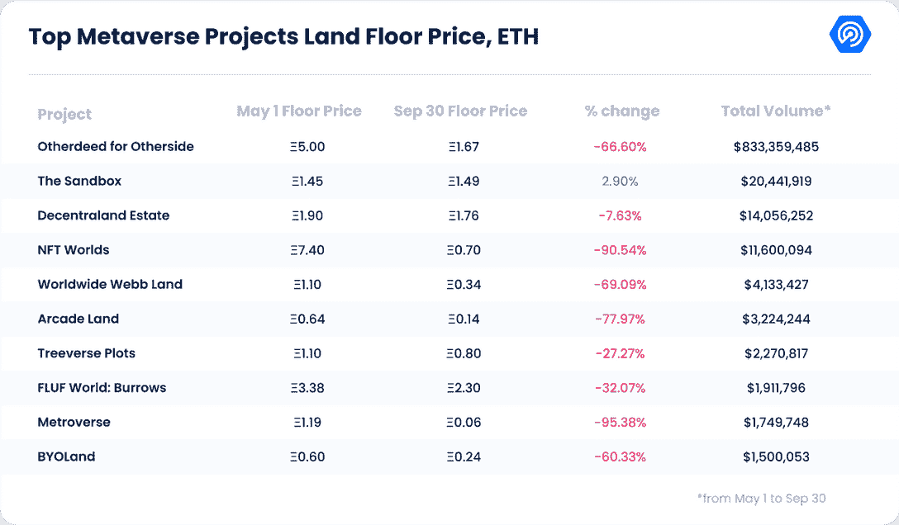

NFT 世界的地板价格在同一时期下降了 90%，在《我的世界》禁令之后急剧下降。NFT 世锦赛 9 月底的底价是 0.7 ETH(909 美元)。

即使可用土地供应有限，元宇宙的购买价格几个月来一直很低。例如，在 9 月份，分散土地上 97，000 多处房产中只有 0.7%挂牌出售，尽管每一个卖地者有 1.48 个买家。这种情况让投机者极难抛售资产，但对那些对元宇宙未来有长远眼光的人有利。这些人正在想办法把他们的房子租给有兴趣在元宇宙建立业务的公司，而不需要立即购买。

汇丰银行、DBS 银行和 Atari 已经宣布了在沙盒中的新举措，而施耐德电气、Pepperidge Farm 和联合包裹服务公司最近也在分散地首次亮相。

元宇宙的房地产似乎是一项风险投资。尽管如此，在过去的一年中，它仍然是许多公司的可靠收入来源，因为公司越来越多地发现，他们需要帮助开发虚拟环境，以吸引潜在的消费者和用户。

## 9 月，分散的土地迎来了 56，000 名每日用户

于 2020 年初启动的“分散的土地”仍然是位于区块链的元宇宙领先项目之一。如前所述，以社会为导向的元宇宙成功举办了 6 月的骄傲周和 8 月的艺术周，以及 11 月的音乐节。

9 月，分散的土地举办了 160 多场社区活动，包括由 RLTY，The Fabricant 和 [World of Women](https://web.archive.org/web/20221130131452/https://dappradar.com/ethereum/collectibles/world-of-women) (WoW)组织的元宇宙时尚活动。该活动的主要目的是吸引女性和时尚进入元宇宙。为期三天的节日在分散地的“Synth Avenue”举行，这是一个为这个场合而设立的场所。该街区由 RLTY 开发，模仿纽约标志性的时尚大道。

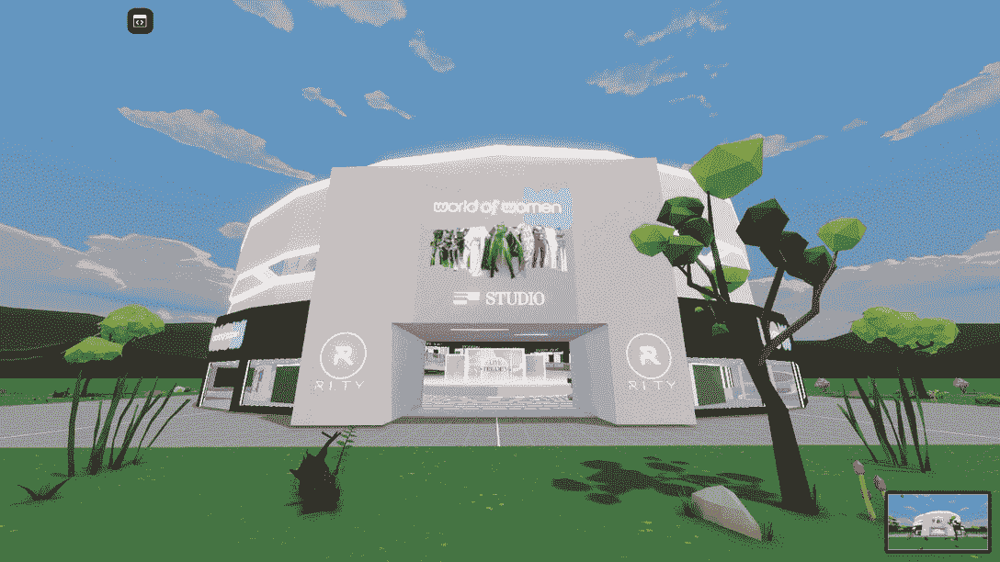

Source: [The Fabricant](https://web.archive.org/web/20221130131452/https://twitter.com/thefabricant/status/1571167310529929217?ref_src=twsrc%5Etfw%7Ctwcamp%5Etweetembed%7Ctwterm%5E1571167310529929217%7Ctwgr%5Ee1fb2850a4cc9a2e12ac080158eb32bb271820a9%7Ctwcon%5Es1_&ref_url=https%3A%2F%2Fwww.geekmetaverse.com%2Fthe-fabricant-wow-and-rlty-organize-a-fashion-event-in-the-decentraland-metaverse%2F)

9 月份的活动吸引了 56，000 名每日活跃用户(DAU)来分散土地的虚拟包裹，比 8 月份增加了 6%。UAW 测量的区块链活动也描绘了虚拟世界的乐观前景，因为几乎 800 个不同的钱包每天都与分散的合同交互，包括元交易。

作为参考，元交易是由用户签名的区块链交易，并被发送给称为中继者的第三方来执行它，并因此支付燃气费。分散基金会赞助了一个中继器，让用户可以与 Web3 互动，而不用负担煤气费。此外，由于分散式交易在多个网络(以太坊和多边形)上运行，元交易通过允许用户在以太坊中签署交易来改善用户体验，这些交易最终在多边形上中继。因为单个中继器执行元交易，所以这些不被算作唯一的活动钱包。

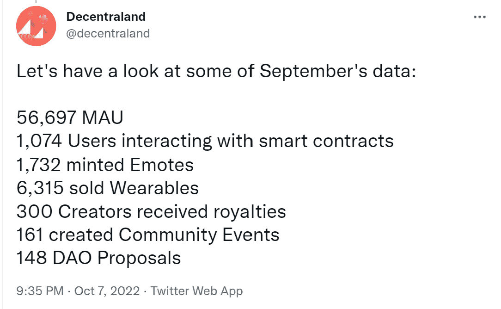

Source: [Twitter](https://web.archive.org/web/20221130131452/https://twitter.com/decentraland/status/1578454103692546048?ref_src=twsrc%5Etfw)

另一个值得注意的方面是分散土地的治理指标。虽然使用度量说明了故事的一个方面，但是 Web3 项目也应该在分散化的范围下被仔细检查。近 150 个 DAO 提案在 9 月份获得了超过 11，000 次投票，这表明该项目的社区参与了进来。“一体行动，履行使命”是许多旨在实现真正去中心化的 Web3 项目的一个重要方面。在分散土地的情况下，它显示了项目的健康和潜力。

## 沙盒阿尔法第三季吸引了 20 万活跃用户

沙盒宣布 Alpha 第三季的月参与者已达 20 万，这是游戏平台的一个重要里程碑。《阿尔法狼》第三季展示了沙盒可以提供令人印象深刻的元宇宙体验，将不同的项目和社区结合成一个有趣的活动。

此外，他们报告称，每天有 39，000 名用户浏览虚拟世界，仅在过去一个月就有 160 万访问者访问沙盒网站。

似乎这还不足以证明沙盒越来越受欢迎，[第三季已经播放了总共 160 万小时](https://web.archive.org/web/20221130131452/https://www.youtube.com/watch?v=CJLZBlTAepM&ab_channel=DappRadar)。

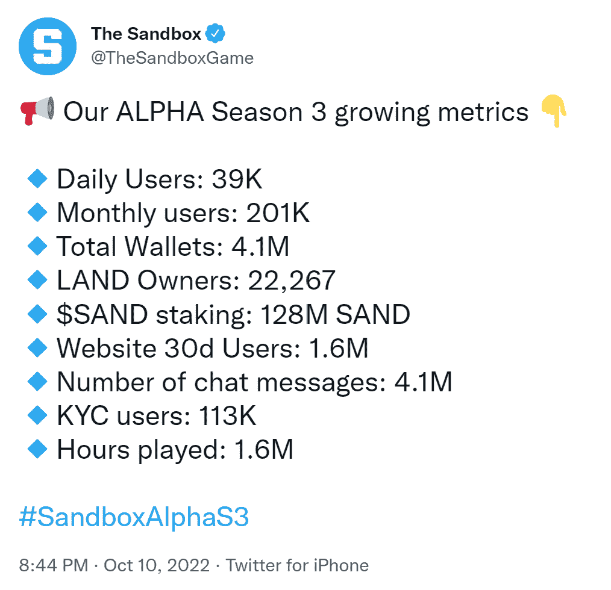

Source: [Twitter](https://web.archive.org/web/20221130131452/https://twitter.com/TheSandboxGame/status/1579528320441815040)

超过 140，000 名来自 NFT 顶级收藏的 NFT 所有者，如 [Bored Ape Yacht Club](https://web.archive.org/web/20221130131452/https://dappradar.com/ethereum/collectibles/bored-ape-yacht-club) 、 [World of Women](https://web.archive.org/web/20221130131452/https://dappradar.com/ethereum/collectibles/world-of-women) 、 [CoolCats](https://web.archive.org/web/20221130131452/https://dappradar.com/ethereum/collectibles/cool-cats) 、 [Clone X](https://web.archive.org/web/20221130131452/https://dappradar.com/ethereum/collectibles/clone-x-x-takashi-murakami) 和 Aoki voxels，可以在沙盒 Alpha Season 3 中使用他们来自 Web3 社区的数字资产作为化身。这是 Web3 中互操作性的一个非常具体的例子。

该团队本着行业团结的精神，设计了一款比之前的 Alpha 赛季更容易玩的游戏。它邀请普通用户更进一步，认为沙盒是一个游戏，其环境只是通过区块链技术得到增强。与表面现象相反，这非常有用。

对于在 dapp 行业工作的个人来说，采用是一个典型的话题。而对于那些在加密货币行业寻求商机的人来说。无论支撑区块链技术的信息和思想多么前沿，如果不能被那些注定受益的人所利用，一切(或很少)都没有意义。

## 总部位于元宇宙的代币无法逃脱经济衰退的影响

与其他加密货币相比，自加密冬天开始以来，元宇宙代币一直步履维艰。疲软的市场暴露了早期游戏赚取模式的弱点，其中大多数玩家的利润来自投机和奖励代币的膨胀。

自去年 11 月加密领域达到顶峰以来，MVIS CryptoCompare Media &娱乐领袖指数下跌了 85%,相比之下以太坊下跌了 71%。此外，DeFi 领先者下降了 80%，而基础设施领先者下降了 80%。自 6 月份低点以来，表现有所改善，但元宇宙硬币经常是我们跟踪的最波动的板块之一，表明投资者对最终获胜的概念缺乏信心。

宇迦实验室的 token [APE](https://web.archive.org/web/20221130131452/https://dappradar.com/hub/token/eth/APE/ETH?from=0x4d224452801aced8b2f0aebe155379bb5d594381) 自 5 月 1 日以来下跌了 72.92%，9 月 30 日触及 5.44 美元，市值为 14.2 亿美元。沙盒硬币[和](https://web.archive.org/web/20221130131452/https://dappradar.com/hub/token/eth/SAND?from=0x3845badade8e6dff049820680d1f14bd3903a5d0)是市值排名第二的元宇宙项目，与其他领先的元宇宙代币一样呈下降趋势。

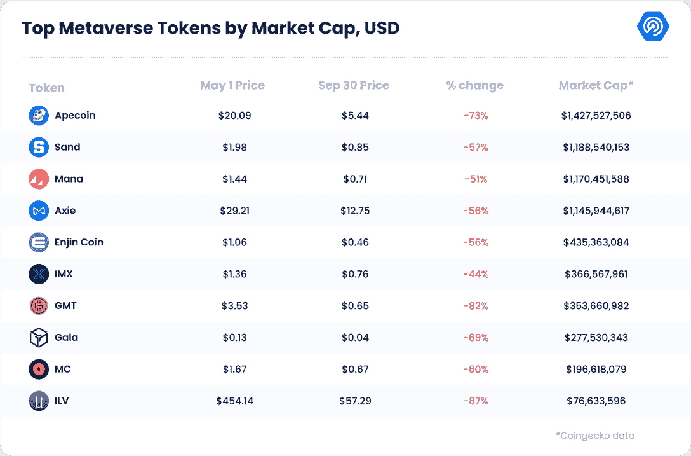

ImmutableX 硬币( [IMX](https://web.archive.org/web/20221130131452/https://dappradar.com/hub/token/eth/IMX?from=0xf57e7e7c23978c3caec3c3548e3d615c346e79ff) )是唯一一种自 5 月 1 日以来下跌不到 50%的游戏代币。这一非凡的成就源于面向游戏的第二层平台在过去三个月中形成的各种协作。阅读[此处](https://web.archive.org/web/20221130131452/https://dappradar.com/blog/dappradar-x-bga-games-report-q3-2022/#Esports-meets-Web3)关于最近的合作关系。

ENS 的案例也值得一提。以太坊名称服务 DAO 的治理令牌同期仅下降了 24%。在撰写本文时， [ENS](https://web.archive.org/web/20221130131452/https://dappradar.com/hub/token/eth/ENS?from=0xc18360217d8f7ab5e7c516566761ea12ce7f9d72) 的价值为 19.40 美元，尽管股市崩盘，但仍维持在 5 月份的水平。

## ENS 域名的需求在第三季度飙升了 72%

[以太坊名称服务(ENS)](https://web.archive.org/web/20221130131452/https://dappradar.com/ethereum/other/ethereum-name-service) 等区块链命名系统构成了元宇宙的重要组成部分。Web3 域名为我们提供了一个元宇宙名称，这是我们数字身份的一部分。9 月份，ENS 用户注册了 437，365 个新用户。这超过了 7 月份创下的 378，805 个域名的纪录。

激增导致注册总数增加到 260 多万，而注册和续展费收入增加了 550 万美元。协议收入存入项目金库，供 ENS DAO 使用。

9 月，ENS 还记录了 35，427 个注册或购买了至少一个域名的新账户，使此类账户的总数增加到 572，000 个。在同一时期，NFT 顶级市场 OpenSea 上 97%的 Web3 域名交易量来自 ENS 域名集合。这也表明，ENS 在命名服务中遥遥领先。

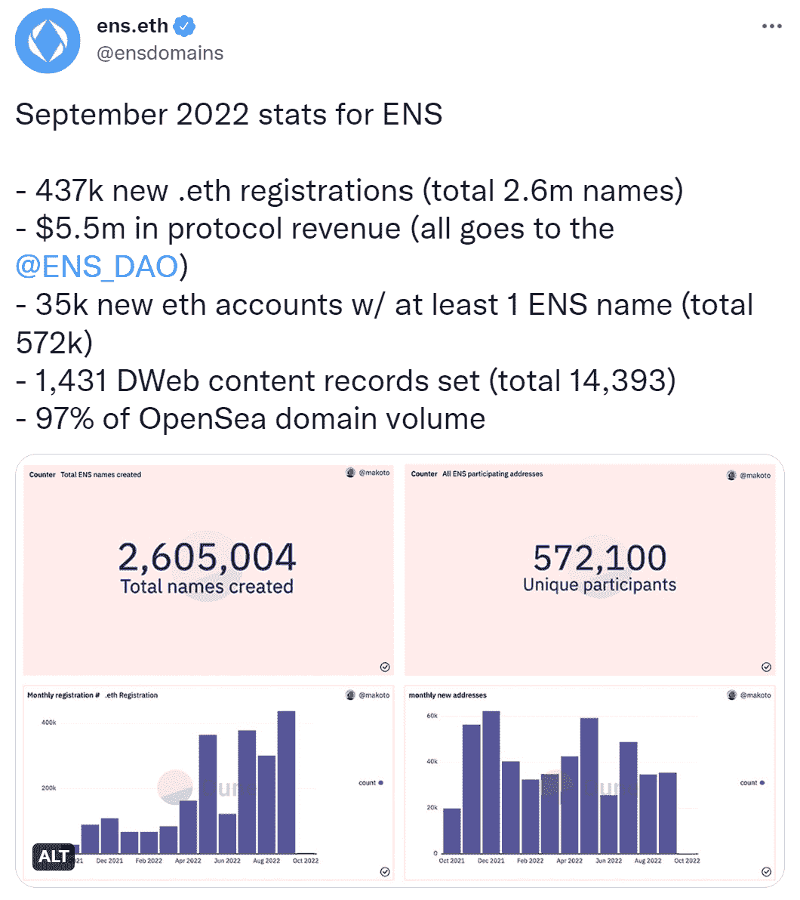

Source: [Twitter](https://web.archive.org/web/20221130131452/https://twitter.com/ensdomains/status/1576267739974422529)

破纪录的一个月的特点是显著的合作和销售。ENS 是分散的，建立在以太坊网络上，与比特币基地合作建立了独特的 cb.id 加密用户名，以增加 ENS 的采用。

在与 Chain 合作后，[新英格兰爱国者足球队通过收购 75 ETH 的“patriots.eth”首次亮相 Web3](https://web.archive.org/web/20221130131452/https://nftnewspro.com/the-new-england-patriots-get-into-web3-in-a-chain/) ，而[鲨鱼池投资者 Matt Higgins 仅在 9 月份就花了近 10 万美元购买了许多域名](https://web.archive.org/web/20221130131452/https://nftevening.com/shark-tanks-matt-higgins-buys-a-50k-ens-domain/)。

在过去的三十天里，ENS 治理令牌的价格图表保持稳定。根据 CoinGecko 的数据，这枚硬币在 9 月 9 日达到了 16.33 美元的月度高点，但在那之后就没有上涨，当月收于 16.02 美元。

负责 Web3 域服务的小组将 NameWrapper 引入了 Goerli testnet。NameWrapper 是一个智能合同，将 ENS 域名封装为 ERC-1155 NFTs，允许父域名所有者为其子域名指定权限和权利，并在市场上进行交易。Web3 命名服务将成为一个受欢迎的类别。目前，基于以太坊的名字主导着市场；然而，我们可以预期这种趋势会沿着不同的链条发展。

## 第三季度筹集 12 亿美元建设元宇宙

尽管目前市场低迷，但元宇宙和 Web3 游戏公司的融资仍然可观。到 2022 年的这个时候，区块链游戏和元宇宙项目已经筹集了大约 70 亿美元，即使第三季度是资本筹集的最低水平，我们仍然设法达到了 12 亿美元。

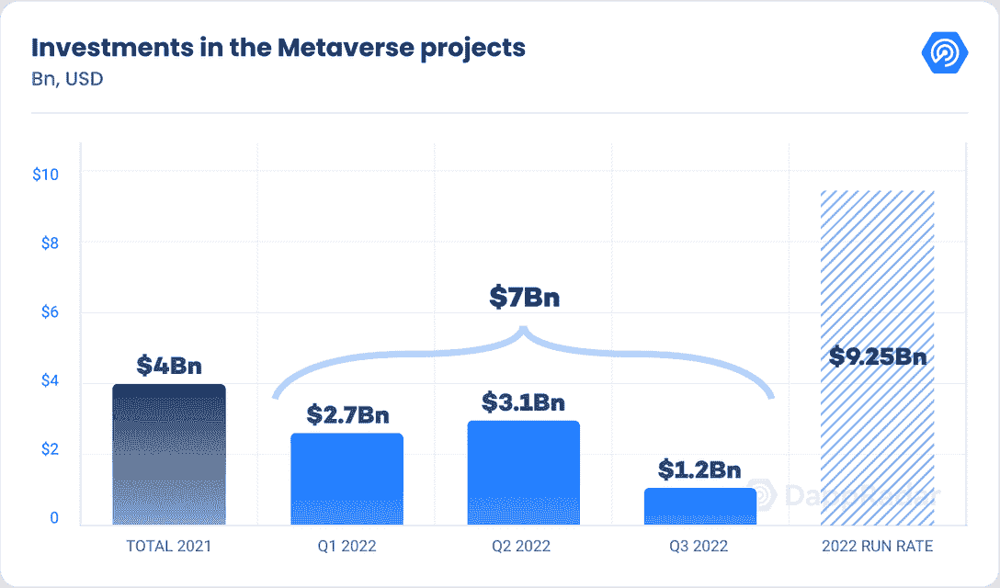

查看第三季度的投资，我们可以看到区块链游戏和元宇宙项目获得了最多的资金，合计占总额的 38.5%。基础设施占筹集资金的 33.5%，投资公司占 22.9%，媒体和 NFT 占剩余的 5%。

尽管本季度的投资水平较低，但这表明该行业从未停止增长，新的主要参与者正在加入市场。9 月，总部位于伦敦的 deep tech 初创公司 Hadean 筹集了 3000 万美元，创建了一个元宇宙项目。

Hadean 构建了关键的元宇宙组件，并与娱乐、教育和商业数字孪生服务提供商(《我的世界》、Pixelynx、索尼和 Gamescoin)合作。这项投资将帮助 Hadean 在新的和不断扩大的元宇宙市场装备生产商，以改变人们工作、建造、购买和消费的方式。

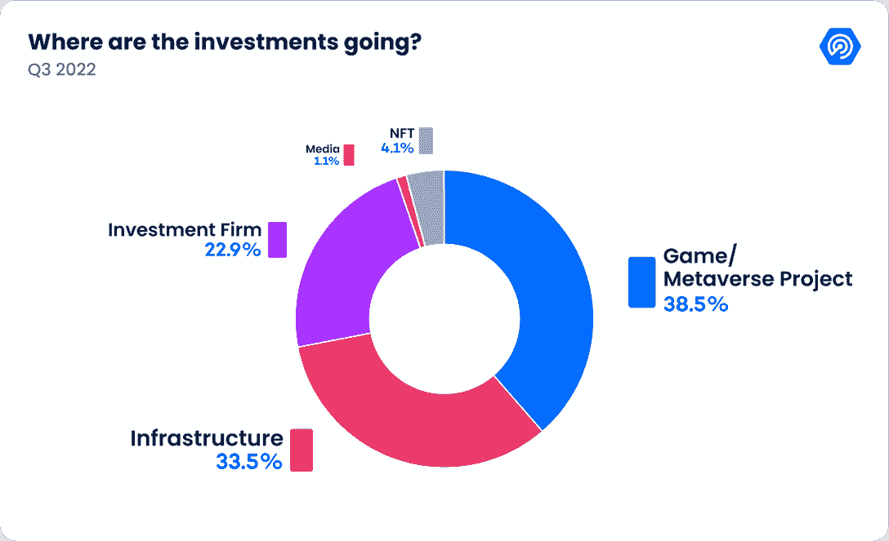

区块链技术、Web3 和元宇宙有可能颠覆绝大多数行业。近年来，风险资本家和其他专业投资者已经向区块链的初创企业投资了数十亿美元。他们相信 Web3 将极大地改变我们的金融机构、社会关系和身份。

## 大众品牌采用和全球元宇宙扩张

本季度在元宇宙的采用方面非常活跃。在 2022 年迪士尼加速器计划中，六家“成长期”公司，包括三家 Web3 公司——第二层扩展平台 Polygon、NFT AR 社交媒体应用 Flickplay 和初创公司 locker verse——被选中接受指导。此外，该公司一直在寻找具有“新兴技术”知识的“公司律师”，如 NFTs、元宇宙和 DeFi。

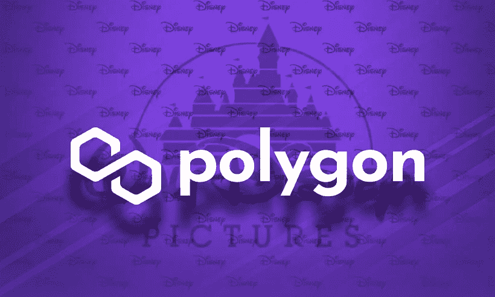

Source: [https://regtechafrica.com/](https://web.archive.org/web/20221130131452/https://regtechafrica.com/)

这可能表明迪士尼正在制定一项战略，利用它在 2021 年向美国专利商标局提交的“虚拟世界模拟器”专利。该应用涉及在迪士尼主题公园中使用增强现实(AR)技术以及元宇宙主题公园的可能性。

流量区块链还宣布了与 Ticketmaster 的有趣合作关系。在成功发行了 70，000 张 LVI 超级碗的 NFT 门票后，Dapper Labs 宣布与世界领先的票务平台合作。

沃尔玛是另一个进入元宇宙的大品牌。这家零售巨头在 Roblox 上首次推出了两种虚拟体验:沃尔玛土地和沃尔玛的游戏世界。

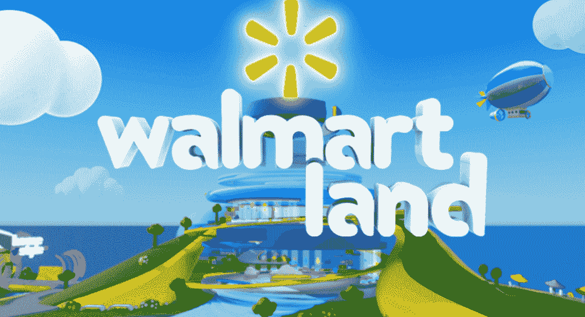

Source: [Roblox.com](https://web.archive.org/web/20221130131452/https://www.roblox.com/games/10895555747/Walmart-Land)

沃尔玛乐园由一个商品商店、一个摩天轮和奖励玩家代币和徽章的小游戏组成。今年 10 月，它还打算举办一场音乐活动。另一方面，游戏世界的目标是成为一个虚拟的玩具店，用户可以从特许经营店(如 L.O.L. Surprise)购买产品和角色。、侏罗纪世界、爪子巡逻、魔法混音和剃刀滑板车。

福特汽车公司是最新一家准备首次进入不可替代令牌(NFT)和元宇宙的汽车制造商，为其主要汽车品牌提交了 19 项商标申请。商标申请包括服装、虚拟汽车、卡车、货车、运动型多功能车，以及一个不可替代代币的预计在线市场。

该公司还公布了“可下载虚拟商品”的计划，主要是由汽车零部件和配件以及服装组成的“计算机程序”，用于“在线虚拟环境”，如虚拟现实和基于增强现实的在线贸易展览。

此外，还计划开发一个在线市场，以推广“他人的数字艺术品”以及“以不可替代代币(NFT)和数字收藏品为特色的在线零售店服务”

福特并不是第一家进入元宇宙的汽车制造商。包括梅赛德斯、日产、丰田和现代在内的汽车制造商已经表示了向快速扩张的元宇宙市场扩张的意图，而宾利和兰博基尼已经发布了 NFT 系列。

Source: [OpenSea](https://web.archive.org/web/20221130131452/https://opensea.io/assets/ethereum/0xc2ac394984f3850027dac95fe8a62e446c5fb786/312)

本季度还见证了政府的采纳，尤其是在亚洲经济体。南韩宣布在几个元宇宙项目上投资超过 2237 亿韩元(1.771 亿美元)。首先，国家基金将被用于建设一个大都市级别的元宇宙平台，使个人能够数字化地访问各种政府项目和服务。

日本首相岸田文雄在 10 月 3 日的政策演讲中表示，日本投资数字化转型的意图包括不可替代的代币(NFT)和元宇宙服务。

美国一直在逐步支持对数字技术的投资，特别是通过向拥抱数字未来的企业提供税收优惠。岸田文雄在对日本议会的讲话中表示，日本将继续“帮助数字技术的社会部署”，并“鼓励努力扩大利用元宇宙和 NFTs 的 Web3 服务的使用”

北京市政府公布了一项为期两年的元宇宙创新和发展战略，重点是促进元宇宙相关企业的发展，并帮助北京成为一个基准的数字经济城市。

在过去的几个月里，中国的两个大城市公布了以元宇宙和国家森林公园为中心的多年行动计划。在北京之前，上海同样将元宇宙纳入其五年增长计划，承诺到 2025 年底建立 3500 亿元人民币(约 510 亿美元)的元宇宙业务。

北京对尖端的 Web3 技术越来越感兴趣，这可能会导致更广泛的全国性采用。此前，北京市经济和信息化局发布了一项提案，计划在未来三年内利用 Web3 技术建立一个价值 500 亿元人民币(75 亿美元)的虚拟人经济。

## 元宇宙的七大法则

元宇宙的陌生和新奇导致了不确定性。出于这个原因，Unity Technologies 前 XR 广告和电子商务主管托尼·帕里西为元宇宙制定了七条规则。

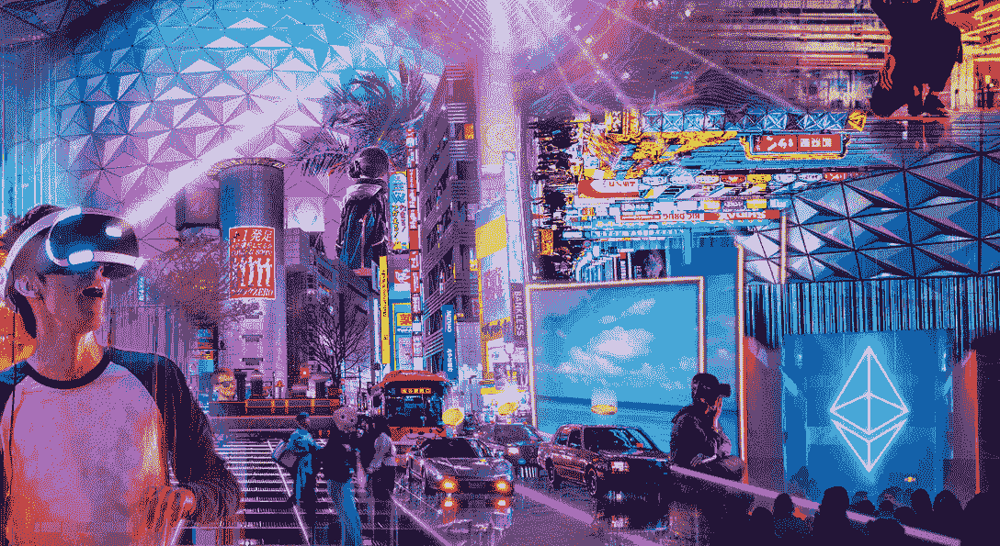

Source: [DAO insights](https://web.archive.org/web/20221130131452/https://daoinsights.com/news/where-is-china-in-the-metaverse-race/)

规则一。只有一个元宇宙。

它是所有可公开访问的虚拟世界、实时 3D 内容和相关媒体的总和，连接在一个开放的全球网络上，不受任何人控制，所有人都可以访问。

规则二:元宇宙是为每个人准备的。

按照我们最普遍的社会包容规则的定义，元宇宙是属于每个人的。这不是一个政治或社会经济声明；这是一个具有政治和社会经济影响的人种志。

规则三:没人能控制元宇宙。

这是数字通信和商业的普遍共享，根据需要进行中介，根据共同利益的要求进行管理，为最大多数人实现最大利益。

规则四:元宇宙是开放的。

它建立在可互操作的技术和工具之上，通过严格定义和广泛认可的自由和开放的通信标准连接起来。

规则#5:元宇宙是独立于硬件的。

元宇宙是独立于硬件的，可以在任何设备上访问，无论显示器类型和设备如何。

规则 6:元宇宙是一个网络。

元宇宙是一个计算机网络，连接着世界上公众可访问的虚拟体验、实时 3D 内容和相关媒体。

规则 7:元宇宙就是互联网。

元宇宙是互联网，经过增强和升级，可持续提供 3D 内容、空间组织信息和体验，以及实时同步通信。

## 结论

元宇宙到底是什么？会有什么影响？消费者和组织正在研究它如何增强连通性和改善日常生活。而且，十年之内，元宇宙可能会成为一个截然不同的世界背后的驱动力。

根据麦肯锡的研究，到 2030 年，超过 50%的现场活动将发生在元宇宙是可行的。超过 80%的商务活动会受到互联网上消费者行为的影响，例如品牌发现和虚拟商店访问。

大多数学习和发展可能发生在元宇宙环境中，以及大多数虚拟或混合合作。事实上，资产密集型企业的所有资产和业务，如制造商和电信公司，都可以在数字镜子中呈现。对真实物品和空间的模拟也是如此，以帮助它们的创建。到 2030 年， [Gartner 预计](https://web.archive.org/web/20221130131452/https://www.gartner.com/en/newsroom/press-releases/2022-02-07-gartner-predicts-25-percent-of-people-will-spend-at-least-one-hour-per-day-in-the-metaverse-by-2026)普通互联网用户每天将花费 6 个小时来体验元宇宙。

这种代际转变不会在一夜之间发生。它们通常需要数年时间，是由基于实验的哲学在培养创造力的平台上推动的逐步突破的积累的产物。

利益攸关方有机会以促进更大的社会凝聚力、减少不平等、扩大受教育机会和推动社会流动的方式创建元宇宙。

元宇宙不应该取代物质世界或把我们联系在一起的人际关系。它应该补充人们所做的事情，并像虚拟和物理工作场所一样，允许在两个世界之间不受限制地移动，从而扩大而不是限制我们的体验范围。然而，要做到这一点，需要集体领导来确保负责任地采取行动来塑造这场革命的进程。

到 2030 年，元宇宙有可能创造高达 5 万亿美元的价值，这似乎是不可避免的。它将对我们的商业和个人生活产生重大影响。如果你看了上周的 Meta Connect 活动，就会明白一些事情。

因此，企业、政策制定者、消费者和公民应该尽可能多地调查和了解这一现象、支撑这一现象的技术以及它对我们的经济和社会的影响。