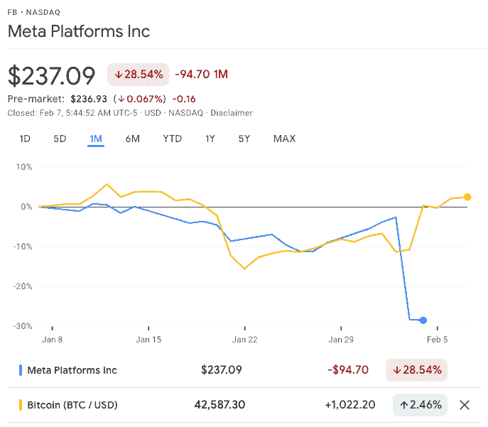
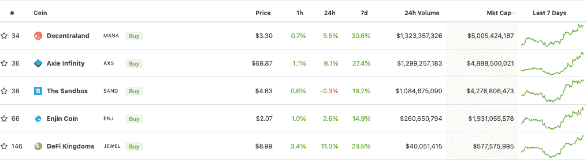
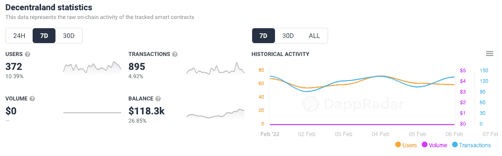
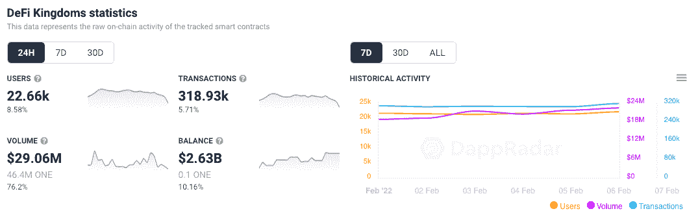

# 元宇宙代币作为元坦克激增

> 原文：<https://web.archive.org/web/https://dappradar.com/blog/metaverse-tokens-surge-as-meta-tanks>

## 人们开始不喜欢 Meta 了吗？

2 月 3 日星期四，脸书的所有者 Meta Platforms 的股票市值暴跌超过 2300 亿美元，这是这家美国社交媒体巨头创纪录的单日损失。相反，市值排名前五的元宇宙加密货币令牌在过去七天里出现了明显的价格飙升。2 月 4 日星期五，BTC 价格收于 40，500 美元，这一上升趋势表明一个更积极的动向即将出现。

META 宣布，截至 2021 年 12 月底的三个月内，脸书平台的日活跃用户数量降至 19.2 亿，而上一季度为 19.3 亿。尽管降幅如此之小，但这是该公司 18 年历史中，这一衡量活动的指标首次出现逆转。投资者和利益相关者的反应是将 META 的价格从 2 月 2 日的 323 美元推高到 2 月 3 日的 237 美元，实际上抹去了这个社交媒体巨头大约 2300 亿美元的价值。

Source: [Google Finance](https://web.archive.org/web/20221007154352/https://www.google.com/finance/quote/FB:NASDAQ?hl=en&window=1M)

与此同时，[顶级元宇宙平台代币](https://web.archive.org/web/20221007154352/https://www.coingecko.com/en/categories/metaverse)一直在飙升，因为 BTC 上周呈上升趋势，周五收于 40，500 美元以上，这表明市场的积极性。DeFi 王国和 Axie Infinity 的代币飙升了 20%以上，而分散王国在过去七天里表现出了超过 30%的最令人印象深刻的运行。沙盒和金恩也给出了可观的数字，分别增长了 18%和 14%。

Source: [CoinGecko](https://web.archive.org/web/20221007154352/https://www.coingecko.com/en/categories/metaverse)

## 用户很重要

导致 META 受损的数字是一个在应用程序中广泛使用的指标。每日活跃用户(DAU)指标用于评估平台受众的增长或下降。Dapps 使用一种叫做[独特活动钱包](https://web.archive.org/web/20221007154352/https://dappradar.com/rankings/category/games) (UAW)的东西。它的用户用区块链钱包登录 dapps，而不是设备与应用程序互动。为了衡量观察到的逆向价格行为，我们可以调查上面列出的几个顶级元宇宙平台的用户增长情况。

在过去的七天里，与[去中心化](https://web.archive.org/web/20221007154352/https://dappradar.com/ethereum/marketplaces/decentraland)连接的活跃钱包数量增加了 10%以上，达到 372 个。而在 [DeFi 王国](https://web.archive.org/web/20221007154352/https://dappradar.com/multichain/games/defi-kingdoms)的用户在过去的 24 小时内增长超过 8%，交易量超过 75%，超过 2900 万美元。

尽管与脸书数十亿用户相比，这些 UAW 数据实际上微不足道，但它表明，用户增长与传统股票市场和加密货币市场的估值密切相关。此外，它进一步显示了 DappRadar 在发现市场机会方面的实际用途。

## 元宇宙代币获得帮助

可以说，虽然去中心化的元宇宙平台的受欢迎程度和参与度都有所上升，但这个曾经的全球社交媒体领导者看起来正在严重衰落。Meta 的本意是拯救公司，但现在看来，随着一波又一波的评论者涌入谴责和抨击马克扎克伯格的集中式元宇宙愿景，它可能成为压垮骆驼的最后一根稻草。一些关键人士表示，该平台现在根本不具有相关性。

此外，正如 2021 年 11 月所观察到的，在脸书宣布最初的 Meta 后不久，总部位于区块链的元宇宙平台再次受益于 Meta 的巨额营销支出和全球认知度的普遍提高。当这些总部设在区块链的平台[走进光](/web/20221007154352/https://dappradar.com/blog/10-upcoming-gaming-worlds-where-you-could-have-a-side-hustle/)并且第一次被发现的时候，Meta 警告利益相关者面对日益激烈的竞争收入增长放缓。

去年，当苹果公司推出应用程序跟踪透明政策，让人们选择是否希望被像 Meta 这样的公司在整个互联网上跟踪时，Meta 又传来了更多坏消息。这对脸书来说是个大问题，因为找到用户信息并卖给广告商是它的赚钱方式。其季度业绩显示广告收入下降，主要是因为这个原因。

将这种消极的观点与对后英国退出欧盟时代 Meta 这样的集中式组织如何管理和存储数据的新感受结合起来。不难看出为什么人们会怀疑梅塔的真实想法，也许更赞成[给新来的男孩一个机会](/web/20221007154352/https://dappradar.com/blog/53-million-invested-in-metaverse-real-estate-this-week/)来打动他们。

[<picture></picture>](https://web.archive.org/web/20221007154352/https://dappradar.com/ethereum/marketplaces/decentraland)[<picture></picture>](https://web.archive.org/web/20221007154352/https://dappradar.com/ethereum/marketplaces/the-sandbox-marketplace)[<picture></picture>](https://web.archive.org/web/20221007154352/https://dappradar.com/ethereum/games/somnium-space)

***以上不构成投资建议。此处给出的信息仅供参考。请行使尽职调查，做你的研究。作者持有 ETH、BTC、AGIX、HEX、LINK、GRT、CRO、OMI、不可变 X、GALA、AVASTR、GMEE、CUBE、RADAR、FLOW、FTM、BNB、SPS、WRLD、ATOM 和 ADA。***

 NewsletterUnsubscribe at any time. [T&Cs](https://web.archive.org/web/20221007154352/https://dappradar.com/terms) and [Privacy Policy](https://web.archive.org/web/20221007154352/https://dappradar.com/privacy-policy)