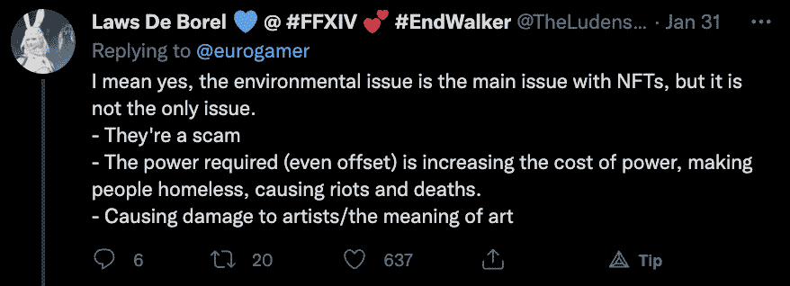
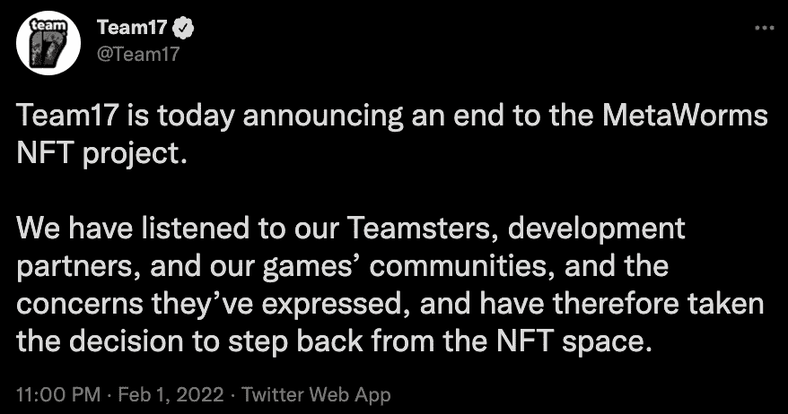

# Metaworms NFT 项目在社区强烈反对后被取消

> 原文：<https://web.archive.org/web/https://dappradar.com/blog/metaworms-nft-project-cancelled-following-community-backlash>

## Team17 在项目宣布后仅仅几个小时就宣布结束

2 月 1 日，热门游戏《蠕虫》的创作者 Team17 宣布，在与 Reality Gaming Group 的新合作中，该游戏将获得生殖元蠕虫 NFT 角色。不幸的是，这个雄心勃勃的项目非常短暂。**大约 24 小时后，Team17 通过推特宣布放弃。**

元虫[本应是一群生活在现实游戏集团以太坊侧链上的生殖 NFT 角色](https://web.archive.org/web/20230121164807/https://dappradar.com/blog/worms-nft-collectibles-team17-announcement)。不幸的是，自昨天宣布以来，Team17 面临着来自其社区以及游戏玩家和记者等方面的严重反弹。

像 [Eurogamer](https://web.archive.org/web/20230121164807/https://twitter.com/eurogamer/status/1488118947329331203) 这样的游戏出版物在 Twitter 上发布的消息引发了负面反应。大多数意见包括对环境问题和国家森林公园感知价值的关注。

在官方声明中，Team17 表示，他们是根据社区的负面反应做出决定的。Twitter 帖子详细介绍了 Team17 考虑到社区和开发人员的想法，决定不推进该项目。

重要的是，该声明不仅仅涉及元蠕虫项目。工作室已经决定总体上后退一步，不在他们的任何游戏产品中探索 NFT。

## Metaworms 试图追随其他游戏工作室的脚步，但失败了

随着 Metaworms collection 的推出，Team17 试图加入一长串已经进入 NFTs 的大型游戏工作室。最近几个月，特别是随着 NFT 空间开始升温，像育碧、艺电和 T2 的 Square Enix 已经宣布计划将 NFTs 集成到他们的产品中。

不幸的是，主流游戏社区仍然不完全相信 NFT 在他们玩的游戏中有一席之地。在 Team17 的例子中，这造成了损失。英国游戏工作室有一些非常成功的项目，如蠕虫，过度烹饪和庇护。然而，这绝不是育碧和艺电这样的工作室所拥有的规模和影响力。从这个意义上说，大电影公司有更大的机会逃脱社区不认可的东西。

另一方面，Team17 因倾听社区的反应而获得了很多赞誉。宣布一个项目并在 24 小时内放弃它可能不是最佳的营销实践。然而，这也表明团队已经准备好听取反馈并相应地改变计划。

主流游戏领域有很多东西可以从加密世界中借鉴，包括 NFTs 和游戏赚取机制。然而，从表面上看，这不会是最顺利的旅程。

DappRadar 将继续监督传统游戏产业和区块链游戏领域。随着两者之间的边界继续崩溃，游戏世界将被完全重塑。要想第一时间获得最新的区块链博彩新闻，请在 [Twitter](https://web.archive.org/web/20230121164807/https://twitter.com/dappradar) 上关注 DappRadar。此外，您可以查看 [DappRadar PRO](https://web.archive.org/web/20230121164807/https://dappradar.com/token/pro) ，并加入 [Discord](https://web.archive.org/web/20230121164807/https://discord.gg/4ybbssrHkm) 上的专属会员讨论频道，谈论您的游戏体验。

 NewsletterUnsubscribe at any time. [T&Cs](https://web.archive.org/web/20230121164807/https://dappradar.com/terms) and [Privacy Policy](https://web.archive.org/web/20230121164807/https://dappradar.com/privacy-policy)