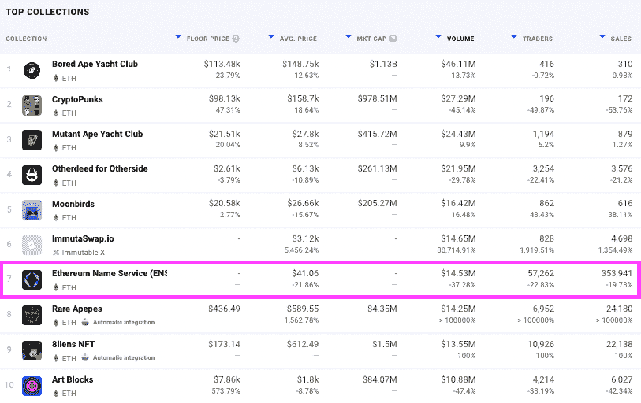

# 微软称区块链域为“新兴威胁”

> 原文：<https://web.archive.org/web/https://dappradar.com/blog/microsoft-calls-blockchain-domains-an-emerging-threat>

## 区块链域名最终可以取代网址

微软称区块链域名是科技行业的下一个重大威胁。这并不奇怪，因为区块链域名有朝一日将取代网址，并赋予持有者更多的在线身份权利。

可以说，真正的问题是[区块链域名](/web/20220926000430/https://dappradar.com/blog/new-dapps-report-ens-domains-10k-club-numbers-dont-lie/)对那些历史上控制人们数字身份的强大公司构成了重大挑战。同时也为破坏提供了明显的机会。

更令人担忧的是，这种说法并不新鲜，它发表在微软 2021 年 10 月的数字防御报告中。在报告中，微软称区块链域名为“监管之外的新兴威胁”

从这个意义上说，他们对目前控制网络身份产业的强大企业构成了威胁。但是区块链域名并不会威胁到那些利用它们来获取利益的普通人。与传统域名不同，在传统域名中，主机拥有集中的权力来删除它们，[基于区块链的域名永远是](https://web.archive.org/web/20220926000430/http://microsoft calls blockchain domains “an emerging threat”/)。

听起来熟悉吗？大公司正在对 NFTs、加密货币和去中心化技术采取行动，因为它们对他们的业务方式构成了重大威胁。更重要的是，他们的赚钱方式。

## 什么是区块链域？

区块链域存在的一个核心原因是便于加密交易，而不需要记住长的十六进制字符串。在基本层面上，它允许用户将难以记忆的区块链钱包地址替换为 Iankane.eth 之类的简单地址，而不是 0x d6e 7a 25039 ea 9 af 1 ff 1968 CD 960 e 0024 dbca 53 c 1。此外，用域名替换钱包地址也减少了键入地址时输入错误的机会。

区块链域生活在无许可或公共区块链上，如[以太坊](https://web.archive.org/web/20220926000430/https://dappradar.com/nft/protocol/ethereum)或[多边形](https://web.archive.org/web/20220926000430/https://dappradar.com/nft/protocol/polygon)，并通过智能合同以与 NFTs 相同的方式得到保护。一般来说，区块链域不会存储在服务器上。相反，它们保存在任何人都可以访问的公共分类账或登记簿中。区块链域可以与加密钱包地址匹配，就像 DNS 系统可以将 IP 地址与. com URL 匹配一样。

此外，一旦区块链域名被铸造，它们将永远存在持有者的加密钱包中。续费适用于包括 ENS 在内的一些域名，并且有提前注册 100 年的选项。

[https://web.archive.org/web/20220926000430if_/https://www.youtube.com/embed/5taZqqlawV0?feature=oembed](https://web.archive.org/web/20220926000430if_/https://www.youtube.com/embed/5taZqqlawV0?feature=oembed)

## 区块链域名销售

通过各种平台销售的区块链域名正在激增。更重要的是，他们正在超越。com 销售额大幅增长。的数量。2021 年全年的 com 销量约为 12.7 万。我们不考虑其他的。io 和各种. co.uk 注册。

仅在过去 30 天[以太坊域名服务(ENS)注册总数](https://web.archive.org/web/20220926000430/https://dappradar.com/nft)就接近 354，000 。自推出以来，Unstoppable Domains 已经积累了令人印象深刻的 240 万注册，最近以 10 亿美元的估值升级为[独角兽地位](https://web.archive.org/web/20220926000430/https://www.forbesindia.com/article/crypto-made-easy/blockchain-domain-provider-unstoppable-domains-becomes-unicorn/78505/1)。

一个月内注册的 ENS 域名几乎是 2009 年全年的三倍。com 域。这可能是未来的一个强有力的指标。可以说，那些攫取区块链域名的人是在投资一块将在未来几年升值的数字房地产。

## 品牌面临投机者的竞争

对于需要在多个平台上保持基调和存在的品牌来说，域名相当于社交媒体句柄。然而，有一个很大的区别，因为在一个品牌不得不试图控制一个坏演员在这些平台上建立的品牌账户的情况下，他们可以求助于集中控制者。

区块链域名是不一样的，因为一旦销售发生，它是最终的和不可改变的。没有人能强迫任何人放弃对区块链域名的控制，除非注册期满。

这意味着人们和品牌等待的时间越长，他们为成为 Web3 的一部分所支付的费用就越多。这种趋势并不新鲜，始于 20 世纪 60 年代。90 年代早期的网络热潮。1993 年，宾夕法尼亚大学的一名计算机科学教授以独特的远见购买了顶级域名 crypto.com，然后在 2018 年以 1200 万美元的价格出售。

值得注意的是，普通消费者不能购买。注册品牌的. com 域名。像 ENS Domains 和[unstopped Domains](https://web.archive.org/web/20220926000430/https://dappradar.com/hub/nft-explorer/collection/unstoppable-domains)这样的公司试图通过为一个品牌保留域名来支持类似的方法。然而，一些域名仍有可能落入投机消费者手中。同样，传统域名中没有我们没见过的。

我们已经看到彪马注册了 puma.eth，而百威啤酒在购买时支付了 30 ETH，即大约 95，000 美元后拥有了 beer.eth。点击此处查看与这些 Web3 域名相关的钱包:

*   在撰写本文时，Puma.eth 的总价值为 36，082 美元
*   [beer . eth](https://web.archive.org/web/20220926000430/https://dappradar.com/hub/wallet/eth/0x39dbfdd63fd491a228a5b601e0662a4014540347)–价值不到 9000 美元

## 对企业而言，威胁是真实的，而不是用户

如果不可避免的事情发生了，区块链域名将取代电子邮件地址和银行信息，并最终代表一个人完整的数字身份。为了确保个人信息的私密性和安全性，不可避免地需要做出一些改变。

如果区块链域名成为主流，微软概述的威胁是他们和其他公司将面临的威胁。可以说，就目前而言，买家主要是在猜测品牌和其他域名衍生品，如三位数的 ENS 名称。与此同时，加密本地人正在保护他们的个人和家庭身份，为未来做准备。

一年前，dappardar[报道了投机者获得诸如 nike.eth](https://web.archive.org/web/20220926000430/https://dappradar.com/blog/speculators-eye-up-ens-nft-domains) 、tesla.eth 等品牌名称。几周前，[有人支付了 300 ETH](https://web.archive.org/web/20220926000430/https://dappradar.com/blog/ens-registrations-surge-after-000-eth-sale-for-300-eth) ，或大约 315，000 英镑，以获得梦寐以求的 [000.eth](https://web.archive.org/web/20220926000430/https://dappradar.com/blog/ens-registrations-surge-after-000-eth-sale-for-300-eth) 域名。

未来几年，世界利用区块链技术的程度将变得更加明显，但有一点是显而易见的。世界正朝着更加分散的格局发展，人们对 Web3 的[机会感到兴奋。](https://web.archive.org/web/20220926000430/https://dappradar.com/)

正如 c[ryptoccurrences 和 NFT 已经展示了它们真正的潜力](/web/20220926000430/https://dappradar.com/blog/dappradar-x-bga-games-report-6/)，区块链域名也将如此。可以理解的是，那些坐在已建立的数十亿美元域名业务顶端的人对即将到来的事情有些害怕。

 NewsletterUnsubscribe at any time. [T&Cs](https://web.archive.org/web/20220926000430/https://dappradar.com/terms) and [Privacy Policy](https://web.archive.org/web/20220926000430/https://dappradar.com/privacy-policy)

***以上不构成投资建议。此处给出的信息仅供参考。请行使尽职调查，做你的研究。作者持有多种加密货币的头寸，包括 BTC、瑞士法郎和雷达。***