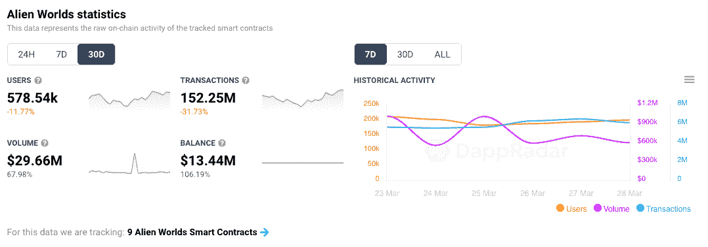
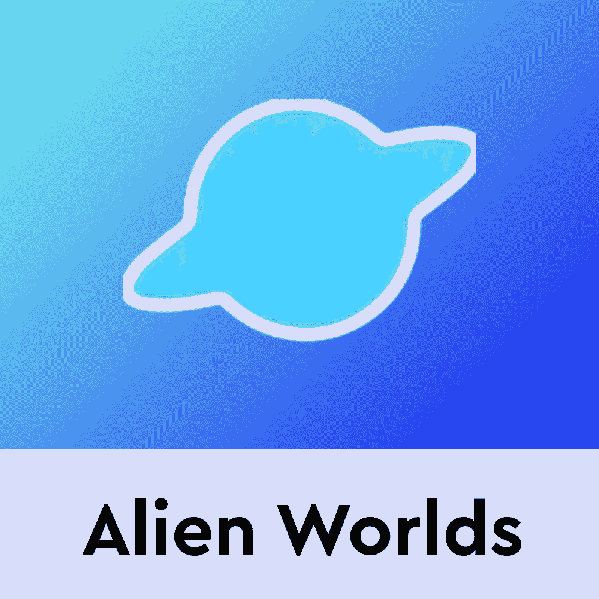
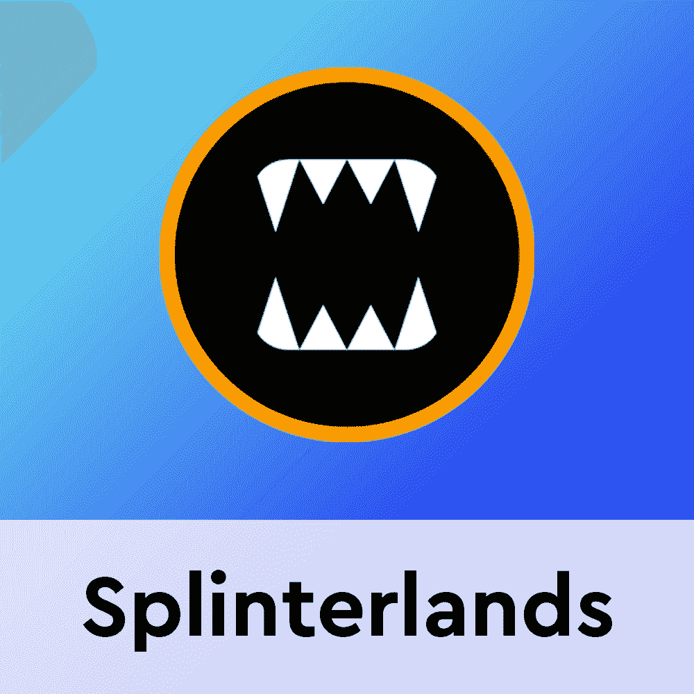
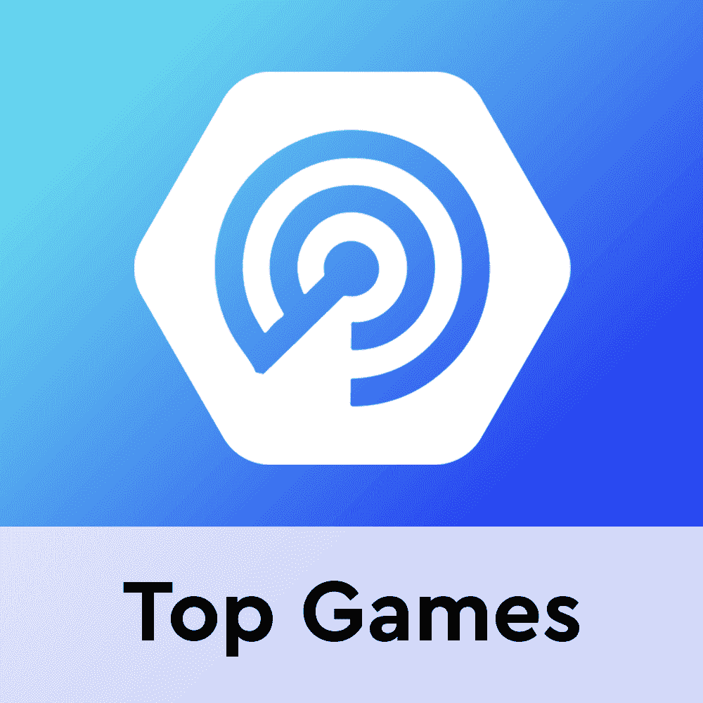

# 《我的世界》玩家可以在元宇宙的外星世界中获得 TLM

> 原文：<https://web.archive.org/web/https://dappradar.com/blog/minecraft-players-can-now-earn-tlm-in-alien-worlds-metaverse>

## 为《我的世界》游戏玩家打开“玩即赚”游戏和元宇宙的大门

历史上最畅销的游戏《《我的世界》》在全球拥有超过 1.7 亿玩家，[很快就能赚到 Trilium](https://web.archive.org/web/20221002010207/http://press.donongnews.com/newsRead.php?no=941812) (TLM)，这是外星世界元宇宙的本土代币。《异形世界》是最广泛的区块链游戏和元宇宙平台之一，自 2020 年初推出以来，一直是 DappRadar 五大游戏中的常客。

在 BNB 链和区块链蜡像上运行的《外星世界》每月吸引超过 50 万个独特的活跃钱包。在游戏中，用户可以以 NFT 的形式收集和交易独特的数字物品，开采行星资源，TLM 股份，去其他行星执行任务，选举投票，以及竞选行星委员会。游戏中的六个星球 Dao 相互竞争 TLM，这鼓励了用户之间的合作。

## 《我的世界》玩家现在可以在外星世界获得 TLM

通往《我的世界》的新互通桥梁应该会对传统和区块链游戏世界产生连锁反应。这座桥将加速非区块链玩家进入元宇宙的外星世界。传统玩家现在可以涉足“玩赚”的世界，并获得资产，在这种情况下，Trilium，以及很快完成任务的 NFTs。然后交换他们的数字资产，并通过参与外星世界的经济来赚取现实世界的价值。

[https://web.archive.org/web/20221002010207if_/https://www.youtube.com/embed/budIvSHeeUI?feature=oembed](https://web.archive.org/web/20221002010207if_/https://www.youtube.com/embed/budIvSHeeUI?feature=oembed)

《我的世界》玩家将能够赢得 TLM，并把它押到一个外星世界的星球道斯，那里拥有区块链产业中最大的一些财富。赌注 TLM 给了玩家投票权来决定行星金库的控制权。《我的世界》玩家不仅可以了解 DAOs，还可以参与到外星世界元宇宙的合作、竞争和高度战略性的环境中。此外，希望

《异形世界》的经济、团队战略和收入组合将把所有年龄的《我的世界》玩家转化为 Web3 玩家。

## 区块链游戏引领行业

区块链游戏和元宇宙项目无法逃脱在 2022 年 Q1 拖累加密市场的宏观趋势。尽管如此，区块链游戏的日活跃量在 2 月份仅下降了 13%，平均吸引了超过 110 万个每日独立活跃钱包，占 dapp 总使用量的 49%。

同样的，虚拟世界在元炒作周期后正在经历一个巩固阶段，进一步巩固了这种类型的 dapp 的地位。随着空间准备继续建设和发展，其他领先的游戏项目也在努力保持自己的地位。

Axie Infinity 正在准备对其生态系统进行必要的改变，包括预计发布的《T2》和《起源》第三季，费用结构的改变，以及更具活力的游戏模式。虽然 Gala Games 刚刚完成了对[的治理投票，将第三人称合作射击游戏 Superior](https://web.archive.org/web/20221002010207/https://dappradar.com/blog/gala-games-community-votes-on-adding-superior/) 纳入其游戏目录。此外，另一个盛大游戏项目 TownStar 的改进也可能转化为农业模拟游戏活动的大幅增加。

这些更新提供了更多的机会来获得一些最受欢迎的元宇宙游戏 dapps 的实践经验。社区可以在 DappRadar 上[探索游戏项目](https://web.archive.org/web/20221002010207/https://dappradar.com/rankings/category/games)和[游戏代币](https://web.archive.org/web/20221002010207/https://dappradar.com/hub/tokens/ethereum/all/1)，并通过我们的[月度游戏报告](https://web.archive.org/web/20221002010207/https://dappradar.com/blog/category/reports)走在潮流的前面。

[<picture></picture>](https://web.archive.org/web/20221002010207/https://dappradar.com/wax/games/alien-worlds)[<picture></picture>](https://web.archive.org/web/20221002010207/https://dappradar.com/hive/games/splinterlands)[<picture></picture>](https://web.archive.org/web/20221002010207/https://dappradar.com/rankings/category/games)

***以上不构成投资建议。此处给出的信息仅供参考。请行使尽职调查，做你的研究。作者持有多种加密货币的头寸，包括 BTC、瑞士法郎和雷达。***

 NewsletterUnsubscribe at any time. [T&Cs](https://web.archive.org/web/20221002010207/https://dappradar.com/terms) and [Privacy Policy](https://web.archive.org/web/20221002010207/https://dappradar.com/privacy-policy)