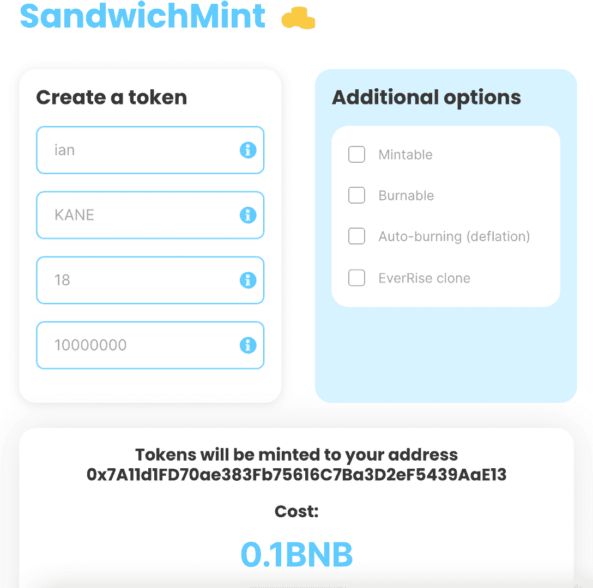
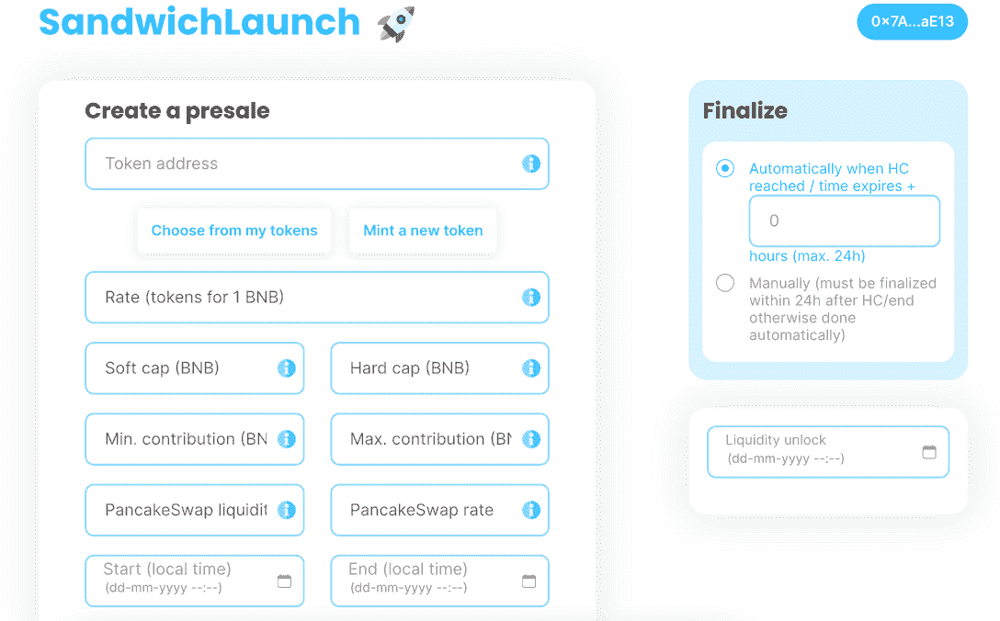
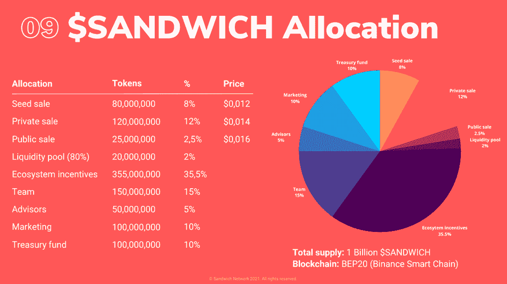

# 薄荷，发射和锁定夹层网络加密货币

> 原文：<https://web.archive.org/web/https://dappradar.com/blog/mint-launch-lock-cryptocurrency-with-sandwich-network>

## 启动项目的完整工具箱

**三明治网络提供了一个用户友好且无需许可的枢纽，在币安智能链上启动加密货币项目，并很快在多个区块链上启动。该平台是真正的去中心化和非托管的，因此任何使用 Metamask 等 Web3 钱包的用户都可以铸造**、**和锁定令牌。**

Sandwich 表示，他们希望成为去中心化世界中新项目的谷歌中心。该平台[于 2021 年 12 月底在币安智能链](https://web.archive.org/web/20221127161101/https://dappradar.com/binance-smart-chain/defi/sandwich-network)上推出，目前处于将四个 dapps 整合到一个生态系统的四阶段计划的第一阶段。因此，项目启动者和投资者只需将钱包与三明治相连，就可以使用启动项目所需的工具。

[Sandwich beta dapp 目前已上线](https://web.archive.org/web/20221127161101/https://dappradar.com/binance-smart-chain/defi/sandwich-network)，它通过三个核心产品提供在 BSC 上铸造、发行和锁定加密货币令牌的能力。Sandwich 希望将目前分散的令牌创建和管理服务整合到一个易于使用的中心。

## 夹心薄荷

选择你想使用的区块链网络，按照步骤操作，你将得到你自己的令牌，total supply 直接分发到你的钱包里。附加功能允许创造者给他们的代币添加层，例如使它们可燃烧，自动燃烧(放气)，可铸造，以及不断上升的克隆。EverRise 是一项区块链技术,通过 dapps 生态系统提供跨越各种区块链网络的桥接和安全解决方案。本质上，它可以帮助将创建的令牌包装和桥接到其他网络。

输入一些细节，我们可以看到，在没有特殊要求的情况下创建 10，000，000 个凯恩令牌将产生 0.1 BNB 的费用，或者在撰写本文时为 36 美元。

## 三明治发射

在大多数情况下，一旦令牌被铸造出来，创造者就会想开始预售来为项目筹集资金。SandwichLaunch 允许任何人直接在平台上为他们的密码货币令牌生成预售。投资者可以以每个令牌的固定价格参与预售。完成预售后，三明治将自动在领先的币安智能连锁交易所、泛卡交易所或 Ethereum 的 Uniswap 上创建一个流动性池。

## 夹层锁

锁定功能允许创建者安全地锁定一部分令牌，如创建者或团队分配。锁定代币，从而创造流动性，是一种安全的投资，有助于建立投资者群体的信任。

## 四份 dapp 三明治

如上所述，三明治网络计划建立四个免费的 dapps，包括所描述的三明治测试版。

*   三明治测试版(LIVE):在多个链上无权限地铸造、启动和锁定代币，以快速启动您的加密货币项目。
*   SandwichSAFU (Q1 2022):分层系统发射台，三明治持有者可以在这里访问多个链上的顶级项目的私人和公共回合。
*   SandwichTools (Q1/2 2022):最广泛的 DEX 交易工具箱。分析和预测市场动向统计数据，连接个人钱包，在一个地方跟踪所有投资。
*   SandwichSwap (Q2/3 2022):通过一个易于使用的界面访问所有市场领先的分散式交易所。

在[最近的博客文章](https://web.archive.org/web/20221127161101/https://medium.com/@sandwichnetwork?p=4668e984dc1e)中没有提到的未来功能包括三明治空投。一种工具，允许创建者通过导入他们希望空投令牌的地址列表，向用户空投令牌。同时，三明治私人将让用户参与新加密货币项目的种子、战略和私人投资轮次。此外，为代币的所有回合创建销售合同。投资者可以放心参与，代币可以线性归属。

## 三明治网络令牌

三明治网络的本地令牌三明治用于为三明治生态系统提供动力。代币将主要用作各种应用程序上的公用事业代币，项目启动者和投资者[将获得重大利益](https://web.archive.org/web/20221127161101/https://medium.com/@sandwichnetwork?p=3e3fecfca5d3)，如折扣、溢价访问和流动性挖掘。此外，三明治持有者将参与关键的治理投票，例如开发路线图和添加到生态系统中现有应用程序的新功能。

在推出生态系统中的第一个 dapp(三明治网络测试版)后，该团队一直在为风险资本家、交易所和合格投资者进行路演，以获得营销、联系和上市方面的价值。种子销售共筹集了 96 万美元，在一次私人销售中筹集了 168 万美元。种子销售参与者包括 Magnus Capital、Oddiyana Ventures、LD Capital 和 Moonwhale。

随着三明治即将在 PancakeSwap 上首次亮相，公开销售现在已经完成。重要的是，在第一家 CEX 上市之前，三明治将只能在 PancakeSwap 上交易。

## 美味的三明治

随着越来越多的创造者和企业家投身于加密货币的世界，三明治网络的前提似乎很坚实。项目可以在眨眼之间启动，并开始必要的步骤，使其项目从婴儿期到启动期及以后

目前，该网络在币安智能链上运行，铸造 BEP-20 令牌。虽然这可能对那些希望在以太坊创造 NFT 系列或在索拉纳创造 DeFi dapps 的人没有吸引力，但未来三明治多链的基础就在那里。此外，在 BSC 等收费低廉的区块链上铸造代币的过程感觉很有用，因为项目会寻找低预算的营销路线。

**免责声明** —这是一篇赞助文章。DappRadar 不认可本页面上的任何内容或产品。DappRadar 旨在提供准确的信息，但读者应该在采取行动之前总是自己做研究。DappRadar 的文章不能被认为是投资建议。

 NewsletterUnsubscribe at any time. [T&Cs](https://web.archive.org/web/20221127161101/https://dappradar.com/terms) and [Privacy Policy](https://web.archive.org/web/20221127161101/https://dappradar.com/privacy-policy)