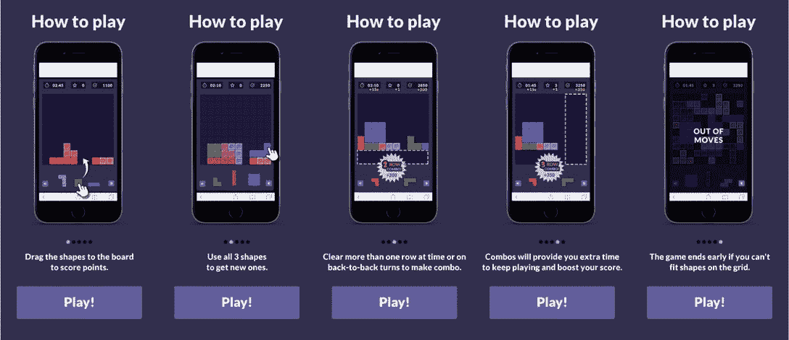
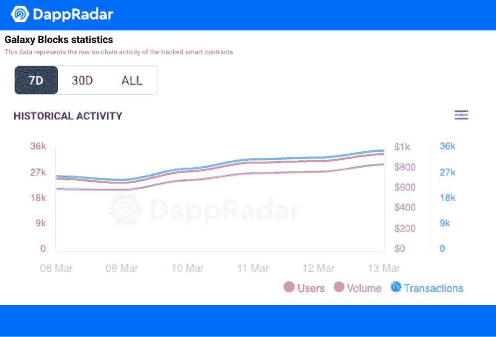
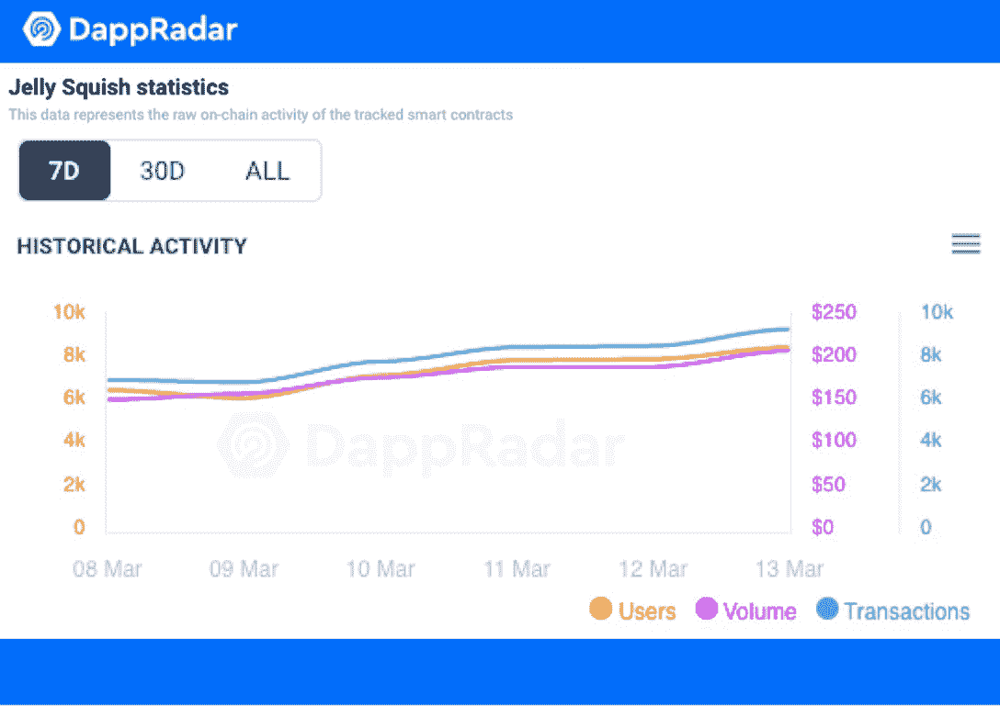
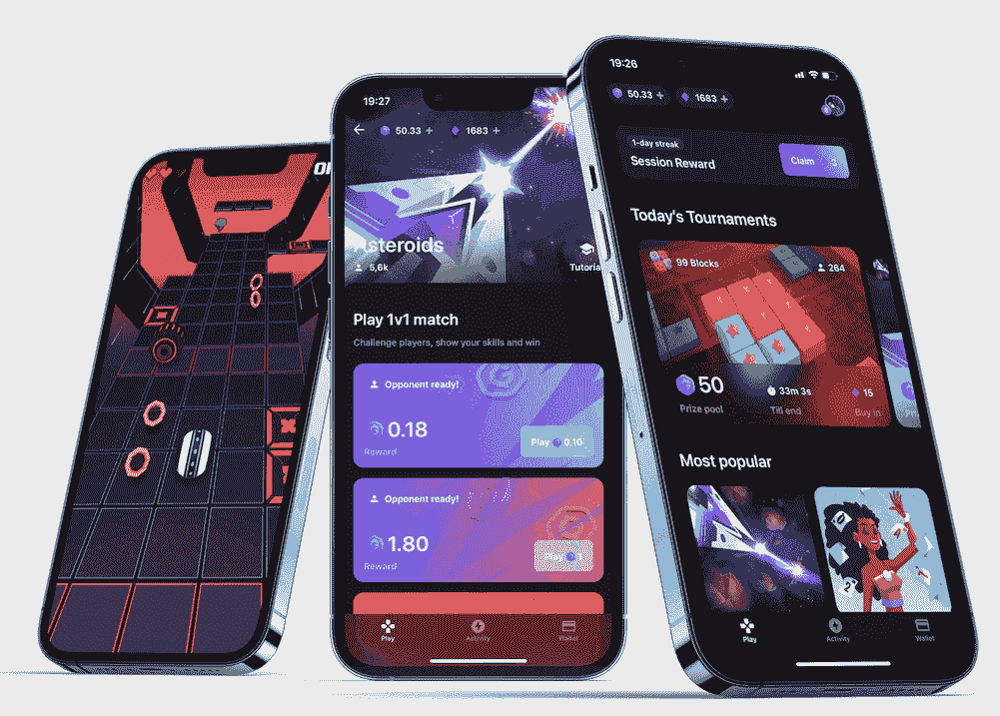
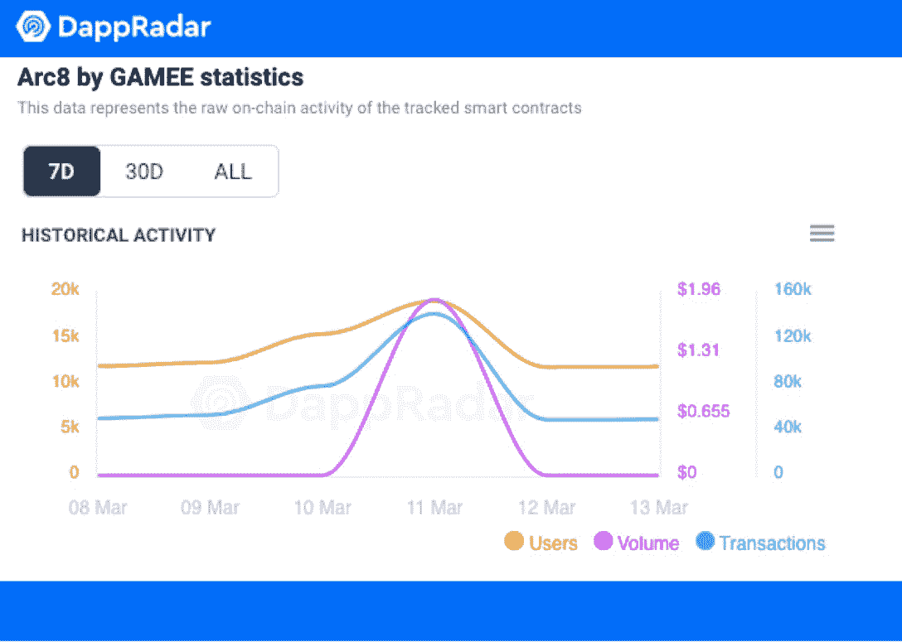
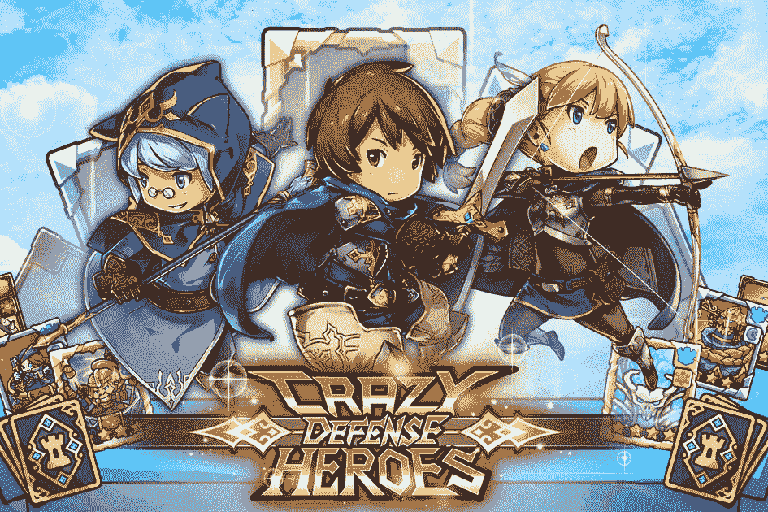
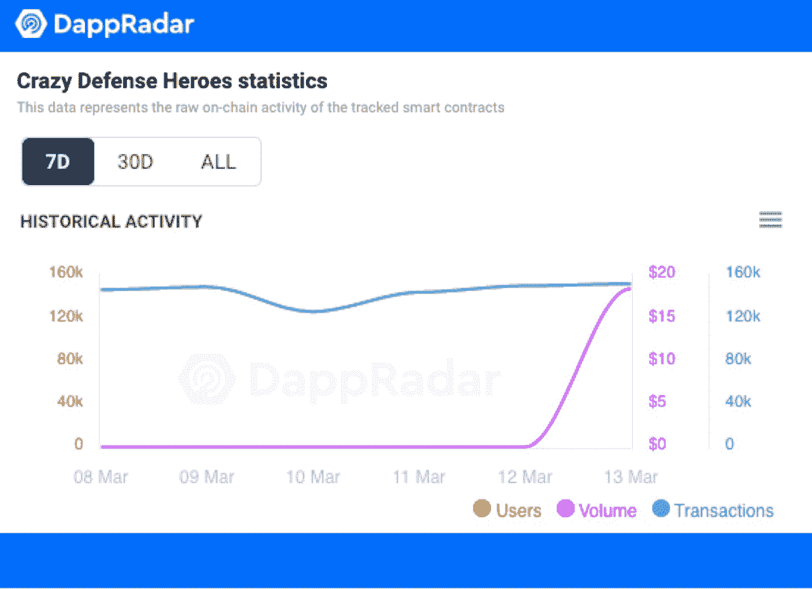

# 移动友好游戏 Dapps 在用户数量下降中获得牵引力

> 原文：<https://web.archive.org/web/https://dappradar.com/blog/mobile-friendly-game-dapps-gain-traction-amidst-dropping-user-numbers>

## Galaxy Blocks，Jelly Squish，Arc8 和疯狂防御英雄上周都见证了活动的增加

**上周，区块链博彩业表现不佳，活跃用户总数下降了 11%。然而，由于出色的游戏体验，几款提供原生移动应用的游戏的用户和交易量都有所增加。Galaxy Blocks、Jelly Squish、Arc8 和《疯狂防御英雄》等游戏都实现了这样的增长。****在更广泛的区块链游戏领域用户数量下降的同时，手机游戏 dapps 如 Galaxy Blocks、Arc8 和疯狂防御英雄看到了增长。移动友好型游戏 dapps 在独特的活动钱包中的数量和交易量每周都在增加，与总体市场趋势相反。**

在 3 月的第二周，与主要加密货币的颠簸趋势线相比，区块链博彩的表现相对稳定。[根据 DappRadar 的行业概览 7 天数据](https://web.archive.org/web/20221002004327/https://dappradar.com/industry-overview)，从 3 月 7 日到 3 月 14 日，与智能合约交互的唯一活跃钱包(UAW)总数从 180 万下降到 160 万，下降了约 11%。然而，[在 DappRadar x BGA Games 报告](https://web.archive.org/web/20221002004327/https://dappradar.com/blog/dappradar-x-bga-games-report-february-2022)中透露，二月份的日均 UAW 数下降了 13%。因此，希望我们能在这个月看到游戏行业的数字有所反弹。

尽管区块链游戏的用户活跃度整体下降，但我们仍然见证了一些移动友好型游戏 dapps 在过去七天中的正增长。他们是银河块和果冻挤在雷霆核心，Arc8 和疯狂防御英雄。值得注意的是，它们都有一个共同的特点:它们都提供移动应用的原生版本，用户可以直接从应用商店下载。现在，让我们深入研究数据及其产品属性，了解更多细节。

## 雷霆核心 dapps:银河块和果冻挤

ThunderCore 为从 DeFi 到游戏的各种 dapps 创建了一个区块链生态系统。为了充分体验 ThunderCore 的游戏平台，用户可以在谷歌 Play 商店和 iOS 应用商店下载 ThunderCore Hub 移动应用程序。

### Galaxy Blocks 的用户群增长了 40%

[银河方块](https://web.archive.org/web/20221002004327/https://dappradar.com/thundercore/games/galaxy-blocks)是[雷霆区块链](https://web.archive.org/web/20221002004327/https://dappradar.com/rankings/protocol/thundercore)上最受欢迎的游戏之一。下面的教程页面比任何冗长的描述都更好地解释了游戏——这是区块链上的俄罗斯方块！

好吧，如果你认为你是一个俄罗斯方块高手，并能设法赢得所有的方式，这可能不是这样。游戏的操控和俄罗斯方块略有不同。比如星系块不掉块。它们呆在你放它们的地方，你不能改变积木的方向。这是一个需要很好的空间可视化能力的游戏。

Galaxy Blocks 实现了令人印象深刻的三方面增长，用户增长 41.28%，交易量增长 20.16%，交易量增长 20.96%。截至本文撰写之时，Galaxy Blocks dapp 在过去七天中有 48，135 架无人机与其智能合约进行了交互。

### 果冻鱿鱼的用户增加了 26.81%

果冻咯吱声是 ThunderCore 区块链的另一个赢家。丰富多彩和有趣的游戏，果冻 Squish 是一个糖果一样的游戏。Match-3 游戏是手机游戏玩家的最爱之一，更不用说 Jelly Squish 还允许玩家获得 ThunderCore 的原生 TT 代币作为奖励。这类游戏的魅力自不必说，Jelly Squish 的数据表现就是最好的证明。

Jelly Squish 也录得三重方面增长的数据表现，用户增长 26.81%，交易增长 17.94%，成交量增长 21.27%。在过去的七天里，30133 个独特的钱包与游戏进行了互动。

## Arc8 的交易量大幅增长了 56.28%

Arc8 是区块链的一个游戏平台，在这里电子竞技与加密游戏相遇。Arc8 由 Animoca Brands 的 GAMEE 生态系统提供支持，允许玩家从其平台上选择游戏，与其他玩家对战并赢得奖励。有两种类型的比赛，1v1 比赛和锦标赛。自去年秋天推出以来，已经有超过 500 万个游戏被玩了，而且这个数字还在不断增加。

在过去的七天里，34，419 名独立用户与 Arc8 智能合约进行了互动，用户数量增长了 19.51%。此外，交易数量在此期间翻了一番，达到 467，062 笔，增幅高达 56.28%。

## 疯狂防御英雄实现了超过 100 万的交易

[疯狂防御英雄](https://web.archive.org/web/20221002004327/https://dappradar.com/polygon/games/crazy-defense-heroes)是 Animoca Brands 的塔防游戏，采用玩赚机制。在游戏中，玩家可以通过四种难度模式防御敌人，这四种难度模式是正常、困难、疯狂、噩梦。此外，各种各样的英雄，法术，塔和装备将在你的选择，以提高你的技能，以赢得更大的奖励。

毫无疑问，疯狂防御英雄的粉丝们对这款游戏非常着迷。在过去的七天里，175，536 名独立玩家访问了该游戏，在该平台上进行了超过 100 万次交易。变化率方面，游戏录得用户增长 9.91%，转场增长 24.91%。值得注意的是，许多传统手机游戏都未能实现如此出色的数据性能，更不用说区块链游戏仍处于萌芽状态。

## 结束语

根据 Mordor Intelligence 的一份报告，2021 年全球游戏市场价值 1984 亿美元。相反，NFT 博彩市场在 2021 年达到 40 多亿美元。尽管与传统游戏相比，区块链游戏仍处于起步阶段，但不可否认的是，区块链游戏的增长潜力是惊人的。例如，在过去的 12 个月里，[区块链博彩业](https://web.archive.org/web/20221002004327/https://dappradar.com/industry-overview)的活跃钱包数量增长了 15 倍以上。DappRadar 将持续跟踪游戏 dapps 在各个区块链的表现。为了更直观地实时了解区块链游戏行业，请查看 DappRadar 上的[顶级区块链游戏。](https://web.archive.org/web/20221002004327/https://dappradar.com/rankings/category/games)