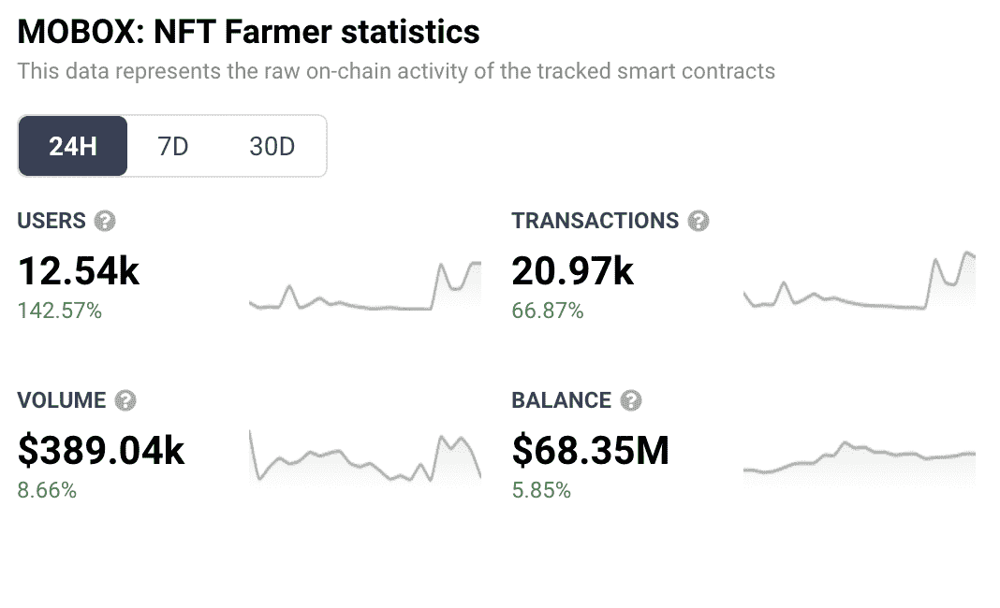
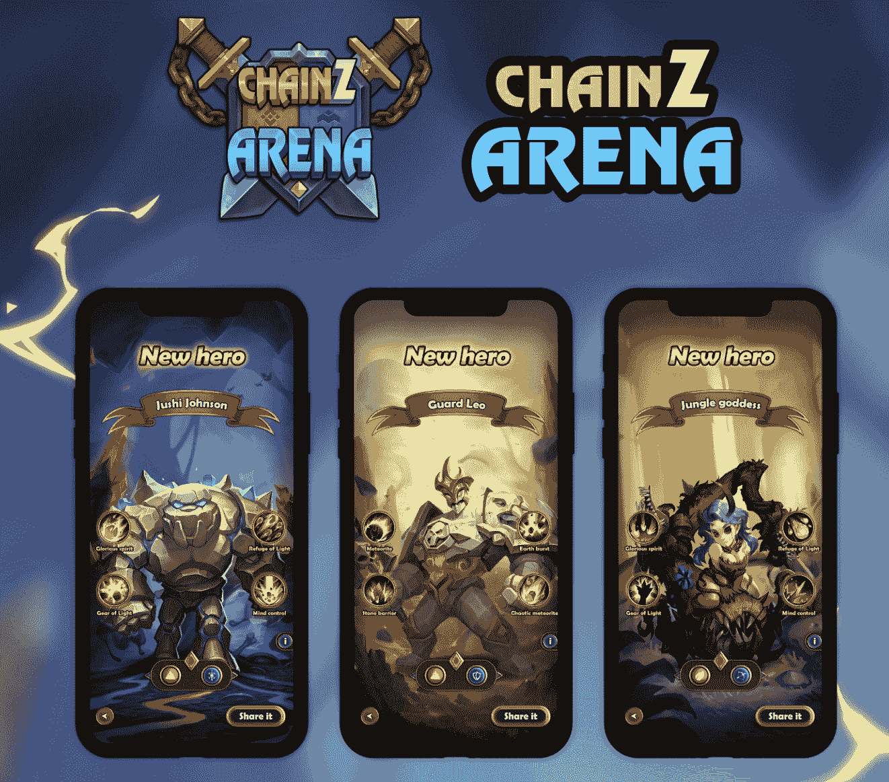

# Mobox 通过新的 Chainz Arena 赛季吸引了 142%的用户

> 原文：<https://web.archive.org/web/https://dappradar.com/blog/mobox-attracts-142-more-users-with-new-chainz-arena-season>

## Chainz Arena 的 Mobox 版第一季提高了平台上的活跃度

热门的币安智能连锁游戏 Mobox 在过去的 24 小时内取得了惊人的成绩，其用户数量增长了 142%以上。这种推动的发生得益于一个新的 Chainz 竞技场赛季的开始。自昨天以来，超过 12，500 个独特的活动钱包连接到游戏平台。

Chainz Arena Mobox Edition 第一季的推出备受 Mobox 社区的期待。为了庆祝这次发布，Mobox 团队决定在最初的奖励基础上再提供 100 万个 MBOX 代币。这进一步刺激了游戏玩家，他们随后蜂拥而至尝试新赛季。

在过去的 24 小时里，Mobox 全面记录了令人印象深刻的性能数据。除了增加其活跃用户，该平台处理的交易数量也增长了 66%以上。这反过来又推动 Mobox 的交易量在过去 24 小时内接近 40 万美元。

## 什么是 Chainz Arena Mobox 版？

Chainz Arena 是一款纸牌交易和战斗游戏，允许玩家创建自定义的牌组并面对对手赢得奖励。在 Mobox 上的 Chainz Arena 第一季中，开发人员引入了重要的改进和升级。

[https://web.archive.org/web/20230128002031if_/https://www.youtube.com/embed/oVuAaj3zyY4?feature=oembed](https://web.archive.org/web/20230128002031if_/https://www.youtube.com/embed/oVuAaj3zyY4?feature=oembed)

Chainz 竞技场成为 Momoverse 的一部分已经有一段时间了，然而，新的赛季给奖励带来了重要的变化。从 1 月 25 日开始，第一季 Chainz 竞技场玩家将获得陌陌游戏优惠券。在 Chainz Arena 消费的每 1 个 MBOX 都会给玩家带来 0.15 的 MBOX 优惠券奖励。Cupons 将在下一个赛季记入球员名下。

此外，新赛季也为 Chainz 竞技场带来了新的角色。第一季将有九个新的英雄角色可供玩家选择。其中，游戏玩家会发现像丛林女神和守卫利奥这样令人印象深刻的名字。

要了解更多关于 Mobox 和 Chainz Arena 的信息，请访问其官方 DappRadar 页面。此外，你可以在这里查看 Chainz Arena Mobox Edition 第一季[的官方公告。](https://web.archive.org/web/20230128002031/https://www.mobox.io/community/article/61ee700639ef680c431aedd2)

DappRadar 将继续关注游戏空间，并为您带来最新的区块链游戏更新。要了解最新消息，请在 Twitter 上关注 DappRadar。此外，您可以加入我们的 [Discord](https://web.archive.org/web/20230128002031/https://discord.gg/4ybbssrHkm) 社区，展示您最新的游戏成就！

 NewsletterUnsubscribe at any time. [T&Cs](https://web.archive.org/web/20230128002031/https://dappradar.com/terms) and [Privacy Policy](https://web.archive.org/web/20230128002031/https://dappradar.com/privacy-policy)