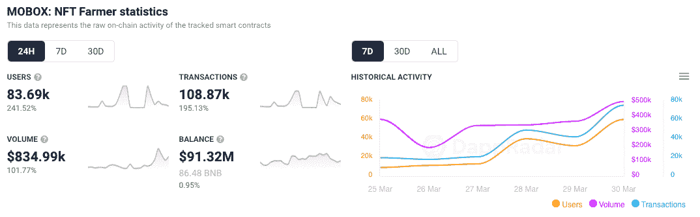
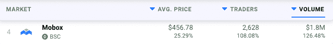
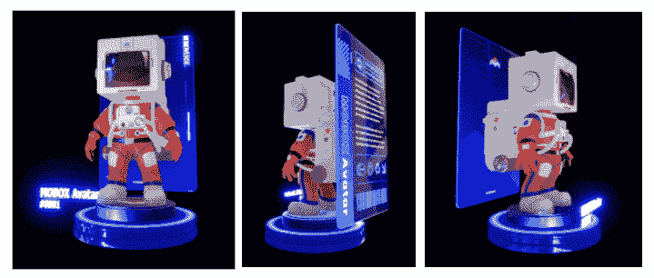

# MOBOX 计划为 veMBOX 持有者空投头像

> 原文：<https://web.archive.org/web/https://dappradar.com/blog/mobox-planning-avatar-airdrop-for-vembox-holders>

## MOBOX 将于 2022 年 4 月 5 日上午 8 点(UTC)拍摄 BNB 链快照

MOBOX: NFT 农民享受了丰收的一周，因为它准备了几次更新和一次空投，旨在将 NFT 注入的 GameFi 平台提升到一个新的水平。首先，将在 2022 年 4 月 5 日为已经持有 veMBOX 的用户空投一张 BNB 钱包的快照。

MOBOX 头像是下周即将推出的 MOMOverse 中玩家的虚拟形象。它们是播放器的数字版本，旨在允许用户在 MOBOX 元宇宙中表达他们的身份。

*veMBOX 提升玩家在* [*MOBOX*](https://web.archive.org/web/20221127145507/https://dappradar.com/binance-smart-chain/games/mobox-nft-farmer) *的流动性池中的位置，并根据玩家下注 MBOX 代币的时间给予玩家。可以说，那些拥有最多 veMBOX 的人是 MOBOX 平台最活跃的用户之一。*

## MOBOX 活动激增

过去一周，连接到 MOBOX 平台[的独特活动钱包数量猛增](https://web.archive.org/web/20221127145507/https://dappradar.com/binance-smart-chain/games/mobox-nft-farmer)，新玩家对 MOMOverse 的空投和发布感到兴奋。此外，过去 24 小时内的峰值很可能是由于玩家急于为 veMBOX 购买 MBOX，以使他们有资格进行空投。

随着本周进入 MOBOX 的用户数量不断增加，我们还可以看到 NFT 销售额的激增，过去 24 小时内，MOBOX NFT 的平均价格上涨了 25%以上。与此同时， [MOBOX token](https://web.archive.org/web/20221127145507/https://dappradar.com/hub/token/bsc/MBOX/BNB?from=0x3203c9e46ca618c8c1ce5dc67e7e9d75f5da2377) 在过去的七天里上涨了 25%以上。

*NFT Sales: Last 24 Hours*

## MOBOX 空投快照 4 月 5 日

MOBOX 将于 2022 年 4 月 5 日上午 8 点(UTC)拍摄 BNB 链的快照，值得注意的是，veMBOX NFTs 的赌注持续时间必须在 mobox.io 上设置为“长”。BNB 链上满足以下条件的每个地址最多可以获得三个头像宝箱。

1.  18000–32000 vem box 将获得 1 个头像箱
2.  32001–90000 vem box 将获得 2️头像箱
3.  超过 90001 veMBOX 将收到 3️头像箱

MOBOX 头像智能合约预计在 MOMOverse 正式上线后发布。头像智能合约发布后，头像宝箱会空投给玩家。

## 什么是 MOBOX 头像？

它们是技术层面的 ERC-721 NFT 代币，每个头像有 15 个固定属性，一旦铸造就不能更改。重要的是，玩家可以创造的 MOBOX 头像数量没有限制。

头像的每个属性属性都有对应的稀有度，有限属性的稀有度小于 0.001%。此外，基于 15 个属性属性的稀有性，MOBOX 头像将有一个广泛的稀有性。每个头像都有八个独特的插槽，可以产生一个马赛克限量版 NFT，可以在 MOBOX 游戏中显示。

MOBOX 头像是身份，是 MOMOverse 中使用的唯一 WEB3 ID。持有头像的玩家可以参加 MOprofession、MOsocial 和陌陌之家。MOMOverse 中的后续游戏将对头像稀有度有具体要求。**[在撰写本文时，MOBOX 团队声明](https://web.archive.org/web/20221127145507/https://mbox.medium.com/unboxing-a-momoverse-of-infinite-possibilities-cc7e8569ae1f)它将开放一个头像市场，玩家也可以在第三方 NFT 市场上列出头像。**

 **如前所述，符合条件的玩家将排队领取头像箱，不符合条件的玩家可以在 MOMOverse 购买头像箱。打开头像宝箱会铸造一个新的头像，头像 ID 从 1000 开始，依次累加。玩家也可以付费将所持头像替换成 MOMOverse 中的头像箱，原头像 ID 将被取消。

## 什么是独唱？

定于 4 月 5 日推出的 MOMOverse 将让玩家体验身临其境的休闲游戏体验。他们可以选择有多种选择的职业，包括店主、建筑商和农民。为了帮助平台的病毒式传播和社交范围，MOMOverse 还将嵌入一个社交游戏网络。这些包括资源岛，团队农业，激战，化身联盟，等等。

在 MOMOverse 内，MOmarket 将促进 NFT 物品的简单交易。居民还可以进入一个博物馆，展示来自陌陌世界之外的陌陌国家艺术博物馆和数字收藏品。MOBOX 的创造者让玩家设计和铸造 NFT 资产，可以使用或出售给其他玩家。

至关重要的是，MOMOverse 表示他们将发布第二阶段的更新，包括 MOMOverse 世界地图和 MOland 游戏。玩家和公会可以探索和争夺他们的领地。你可以在这里找到 MOMOverse 功能的全面分类和路线图[。](https://web.archive.org/web/20221127145507/https://mbox.medium.com/unboxing-a-momoverse-of-infinite-possibilities-cc7e8569ae1f)

## BNB 链有一个明星

玩赚游戏和与 DeFi 和 NFT 机制交织在一起的游戏的兴起已经变得非常流行，MOBOX NFT 农民是冉冉升起的明星之一。MOBOX 已经成为 BNB 连锁和所有网络和类别的 DappRadar 十大排行榜的常客。这进一步突出了 NFT 注入的“玩到赚”平台的优势及其广泛的吸引力。

在 2021 年取得长足进步后，MOBOX 还面临着一些特殊的挑战。留住用户对于 MOBOX 的持续扩张至关重要。这次空投和 MOMOverse 的推出看起来将把 MOBOX 推向一个新的水平，我们将[继续跟踪](https://web.archive.org/web/20221127145507/https://dappradar.com/binance-smart-chain/games/mobox-nft-farmer)和[从](https://web.archive.org/web/20221127145507/https://dappradar.com/blog/the-incredible-rise-of-mobox-nft-farmer) [BNB 链](https://web.archive.org/web/20221127145507/https://dappradar.com/rankings/protocol/binance-smart-chain)上的领先 dapps 之一报道发展。

 NewsletterUnsubscribe at any time. [T&Cs](https://web.archive.org/web/20221127145507/https://dappradar.com/terms) and [Privacy Policy](https://web.archive.org/web/20221127145507/https://dappradar.com/privacy-policy)

***以上不构成投资建议。此处给出的信息仅供参考。请行使尽职调查，做你的研究。作者持有多种加密货币的头寸，包括 BTC、瑞士法郎和雷达。*****