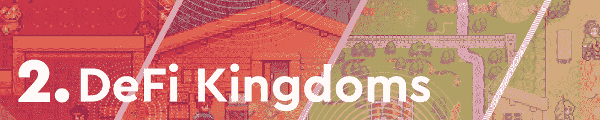
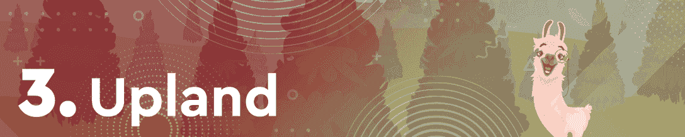
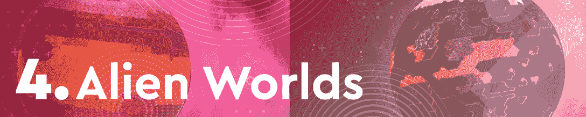
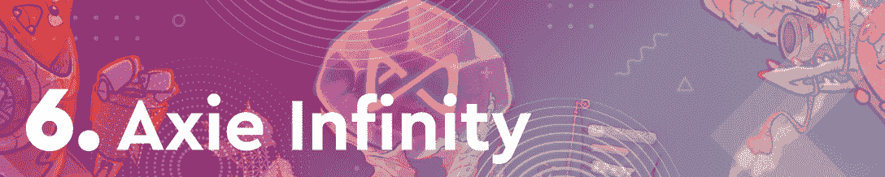
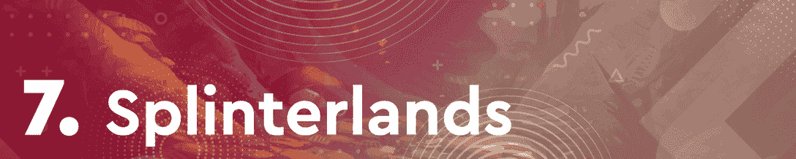
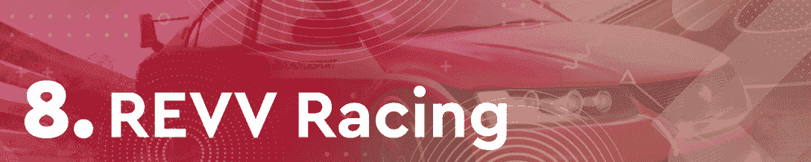
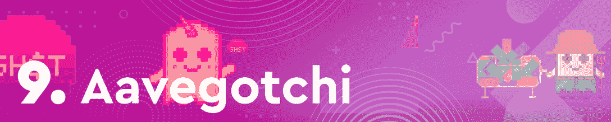
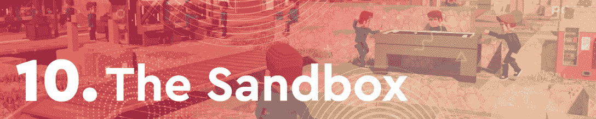

# Mobox 接管 BSC 上的游戏业务，以此赢得更多关注

> 原文：<https://web.archive.org/web/https://dappradar.com/blog/mobox-takes-over-gaming-on-bsc-as-play-to-earn-gains-traction>

## 由于 P2E dapps 吸引了更多的玩家，Mobox 在 3 月份的区块链游戏排名中名列榜首

BNB 智能链上的 NFT 游戏平台 Mobox 在三月份的区块链游戏排名中名列榜首。由于该平台的一长串令人兴奋的更新和全新迷你游戏的推出，该平台见证了 NFT 的销量与其原生令牌 MBOX 的估值一起飙升。

2022 年 3 月，区块链游戏空间飞速发展。继一月和二月的熊市之后，三月带来了一波积极的行动。这份名单中的十个 dapps 中有九个看到了他们的本地令牌价格上涨，而 NFT 的销售和用户活动正在蓬勃发展。

几个月来，区块链游戏一直处于加密活动的前沿。通过这篇文章，DappRadar 了解了本月最热门的游戏 dapps。为了编制这个排名，我们考虑了链上活动，NFT 交易量，令牌估值，以及围绕每个 dapp 的新闻和事件。

在下面浏览本周十大区块链游戏的完整列表。单击相应的图片，了解每个平台的更多信息。或者，看看下面的视频，它总结了排名，可以快速查看。

[https://web.archive.org/web/20220925080011if_/https://www.youtube.com/embed/3EPh0CmYgH4?feature=oembed](https://web.archive.org/web/20220925080011if_/https://www.youtube.com/embed/3EPh0CmYgH4?feature=oembed)

## 十大区块链游戏

[<picture></picture>](https://web.archive.org/web/20220925080011/https://dappradar.com/binance-smart-chain/games/mobox-nft-farmer)

### Mobox 在三月以臼齿防御领先

Mobox NFT 农民是今年三月不可否认的赢家。该游戏在 NFT 吸引了超过 2700 万美元的交易量，其原生令牌 [MBOX](https://web.archive.org/web/20220925080011/https://dappradar.com/hub/token/bsc/MBOX) 的价格几乎翻了一番。活动和估值的飙升主要是由平台上几个重要更新的发布引起的。比如 Mobox 推出了新的塔防迷你游戏《臼齿防御》。你可以在这里阅读更多关于 Mobox 的崛起。

[<picture></picture>](https://web.archive.org/web/20220925080011/https://dappradar.com/harmony/games/defi-kingdoms)

### DeFi 王国不断推出更新

DeFi 王国在 Harmony 上取得了巨大的成功，由于最近的雪崩整合，现在吸引了更多的玩家。三月份，DeFi 王国[也宣布推出其定制的 DFKChain 区块链](https://web.archive.org/web/20220925080011/https://dappradar.com/blog/defi-kingdoms-launching-own-dfk-blockchain-to-improve-game-experience/)。这进一步推动了活动，游戏的本地令牌宝石的价格在过去三十天里飙升了 57%。

[<picture></picture>](https://web.archive.org/web/20220925080011/https://dappradar.com/eos/games/upland)

### 高地吸引房地产投资者到区块链

基于 EOS 的房地产平台 [Upland](https://web.archive.org/web/20220925080011/https://dappradar.com/eos/games/upland) 延续了自 2022 年初以来的稳定表现。这款游戏经常出现在每周 DappRadar 十大区块链游戏排名中，也理所当然地在三月份的排名中获得一席之地。在过去的三十天里，这款游戏吸引了超过 260，000 个独特的活动钱包，成为 EOS 区块链上访问量最高的 dapp。

[<picture></picture>](https://web.archive.org/web/20220925080011/https://dappradar.com/multichain/games/alien-worlds)

### 《外星世界》与《我的世界》合作

《外星世界》最近[集成了《《我的世界》》的功能](https://web.archive.org/web/20220925080011/https://dappradar.com/blog/minecraft-players-can-now-earn-tlm-in-alien-worlds-metaverse/),这极大地提高了人们对该平台的兴趣。整个三月，《异形世界》吸引了超过 667，000 个独特的活动钱包，成为本月访问量最大的区块链游戏。这是一个不小的壮举，结合最近的《我的世界》整合，这款游戏对其本土令牌 [TLM](https://web.archive.org/web/20220925080011/https://dappradar.com/hub/token/bsc/TLM) 产生了积极影响，其价格在过去一个月上涨了 10%。

[<picture></picture>](https://web.archive.org/web/20220925080011/https://dappradar.com/ethereum/games/crazy-defense-heroes)

### 疯狂防御英雄将手机游戏推向前沿

基于多边形的移动塔防游戏[疯狂防御英雄](https://web.archive.org/web/20220925080011/https://dappradar.com/ethereum/games/crazy-defense-heroes)这个月相当成功，吸引了超过 200，000 个独特的活动钱包。庞大的用户群和平台提供的丰厚的 P2E 奖励也将游戏的本地令牌塔推向了新的高度。在过去的三十天里，[大厦](https://web.archive.org/web/20220925080011/https://dappradar.com/hub/token/eth/TOWER/ETH?from=0x1c9922314ed1415c95b9fd453c3818fd41867d0b)的估值上涨了 28%以上。

[<picture></picture>](https://web.archive.org/web/20220925080011/https://dappradar.com/multichain/games/axie-infinity)

### 浪人入侵后 Axie Infinity 继续前进

P2E 巨头 Axie Infinity 仍然主导着 NFT 市场，三月份在 NFT 的交易额超过 6000 万美元。尽管围绕着[浪人桥漏洞](https://web.archive.org/web/20220925080011/https://dappradar.com/blog/axie-infinity-activity-plummets-after-600-million-ronin-exploit)的骚乱不断，这款游戏还是设法保住了它在三月份区块链十大游戏排行榜中的位置。此外，Axie 的治理令牌 [AXS](https://web.archive.org/web/20220925080011/https://dappradar.com/hub/token/eth/AXS/ETH?from=0xbb0e17ef65f82ab018d8edd776e8dd940327b28b) 在过去 30 天内的估值飙升了 9.9%。随着起源更新在四月初发布，粉丝们有足够的理由感到兴奋。

[<picture></picture>](https://web.archive.org/web/20220925080011/https://dappradar.com/multichain/games/splinterlands)

### 尽管 SPS 值下降，夹板岛依然繁荣

基于蜂巢的纸牌交易游戏[split erlands](https://web.archive.org/web/20220925080011/https://dappradar.com/multichain/games/splinterlands)是业界最受欢迎的游戏。该游戏本月吸引了超过 560，000 个独特的活动钱包，在所有链中访问量最大的区块链游戏中排名第二。虽然 Splinterlands 的原生令牌 SPS 是过去 30 天中唯一一个价格出现负值的平台，但该平台仍在蓬勃发展。重要的是，随着 [SPS](https://web.archive.org/web/20220925080011/https://dappradar.com/hub/token/bsc/SPS/BNB?from=0x1633b7157e7638c4d6593436111bf125ee74703f) 现在可以在 Crypto.com 交易，这种负面趋势可能很快就会逆转。要了解更多关于夹板的信息，你可以查看这个 [DappRadar x 夹板 AMA 会议](https://web.archive.org/web/20220925080011/https://www.youtube.com/watch?v=Zb5_stG9zXs)。

[<picture></picture>](https://web.archive.org/web/20220925080011/https://dappradar.com/polygon/games/revv-racing)

### F1 德尔塔时代已经过去，REVV Racing 将继续存在

基于多边形的赛车游戏 [REVV Racing](https://web.archive.org/web/20220925080011/https://dappradar.com/polygon/games/revv-racing) 本月排名第八，尽管创造者 Animoca Brands 经历了动荡的几周。REVV Racing 的一级方程式赛车 F1 Delta Time 停止运营，导致一波赛车运动转向 REVV 平台。这反过来推动了活动，游戏的本地标志 [REVV](https://web.archive.org/web/20220925080011/https://dappradar.com/hub/token/eth/REVV/ETH?from=0x557b933a7c2c45672b610f8954a3deb39a51a8ca) 在三月份**获得了接近 10%的估值。**

[<picture></picture>](https://web.archive.org/web/20220925080011/https://dappradar.com/polygon/games/aavegotchi)

### 哥特里弗斯来了！

Aavegotchi 排名垫底，然而，该平台本月进行了重要更新。3 月 31 日，Aavegotchi 发布了它的虚拟世界 Gotchiverse。这是一个备受期待的更新，导致了玩家的获得和平台的大量活动。在过去的 30 天里，Aavegotchi 在 NFT 创造了超过 300 万美元的销售额，而其本土标志 [GHST](https://web.archive.org/web/20220925080011/https://dappradar.com/hub/token/eth/GHST/ETH?from=0x3f382dbd960e3a9bbceae22651e88158d2791550) 的估值增长了 5%。

[<picture></picture>](https://web.archive.org/web/20220925080011/https://dappradar.com/ethereum/games/the-sandbox)

### 沙盒阿尔法 2 结束

基于以太坊的虚拟世界[沙盒](https://web.archive.org/web/20220925080011/https://dappradar.com/ethereum/games/the-sandbox)在整个三月举行了[第二个阿尔法季节](https://web.archive.org/web/20220925080011/https://dappradar.com/blog/the-sandbox-to-launch-second-play-to-earn-alpha-season/)，这个事件对平台的活动产生了非常积极的影响。在过去的三十天里，沙盒在 NFT 产生了超过 3160 万美元的交易量，因为玩家和收藏家都想分一杯羹。

## Mobox 上升到顶端

Mobox 于 2021 年 4 月推出，即将迎来一周年纪念日。自去年以来，这款游戏已经成为 BNB 智能链上的一个主要被动收入和娱乐来源。与一年前的活动相比，该游戏现在每月吸引的独特活动钱包数量是以前的六倍多。

Mobox 有趣的前提、引人入胜的设计以及最重要的被动收入机会推动了这一显著增长。赚取 NFT 和胸部，并下注奖励，只是平台上所有被动收入机制的一部分。

更重要的是，Mobox 团队不断向游戏的生态系统推送更新和开发。最近推出的臼齿防御就是一个很好的例子。很快，MOBOX 也计划推出新的 Mobox 头像。这些将作为下周即将推出的 MOMOverse 中玩家的虚拟形象。

2022 年 3 月，Mobox 踏上了一条雄心勃勃的积极轨道，迈向新的成就。DappRadar 将继续监测这款热门的 BSC 游戏，同时推出其 MOMOverse 虚拟世界，并为玩家推出新的激动人心的更新。你可以在推特上关注 DappRadar，首先获得最新的区块链博彩新闻。

 NewsletterUnsubscribe at any time. [T&Cs](https://web.archive.org/web/20220925080011/https://dappradar.com/terms) and [Privacy Policy](https://web.archive.org/web/20220925080011/https://dappradar.com/privacy-policy)