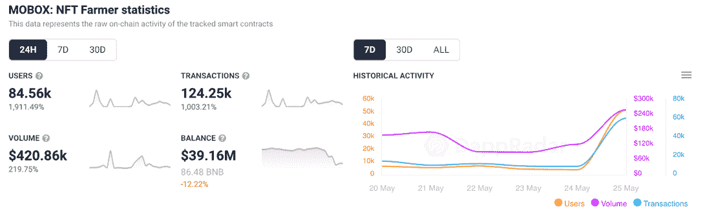
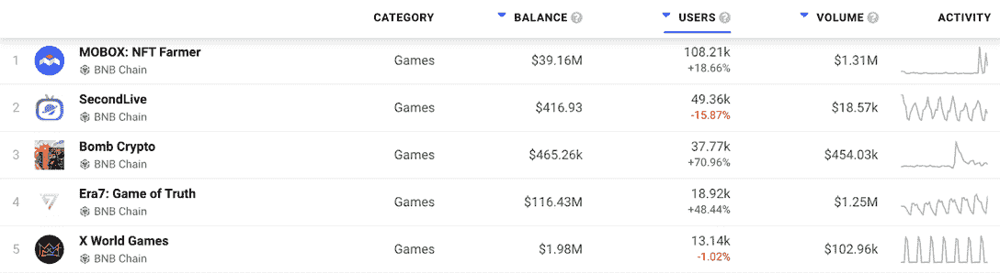

# Mobox 戏弄新游戏和莫兰德防御第四季

> 原文：<https://web.archive.org/web/https://dappradar.com/blog/mobox-teases-new-gameplay-and-moland-defense-season-4>

## 玩家很快就可以抓到野生的莫莫

BNB 连锁公司的热门游戏 Mobox NFT·法默推出了一个全新的游戏功能，并更新了《莫兰德防御》第四季。在一条相当模糊的推文中，Mobox 团队敦促玩家保持警惕，寻找在野外捕捉陌陌角色的新方法。

## 摘要

*   Mobox NFT 农夫将会在主游戏中引入新的功能，包括让玩家有机会抓到野生的桃子
*   《莫兰德防御》第四季更新带来了更好的等级属性和一个全新的防御者角色
*   农业平台仍然领先于 BNB 链上的游戏板块，在过去 24 小时内活动增加

## Mobox 游戏更新

到目前为止，Mobox 在 2022 年表现出色，推出了 momo verse T1。然而，似乎这个团队已经下定决心要给玩家带来更多的功能。在今天早些时候的一条挑逗性的推文中，该团队宣布，玩家很快就可以在野外捕捉陌陌角色。

> 🔥热点新闻–看看即将发布的内容！
> 
> 先睹为快👀
> 🐾在野外捕捉莫莫！pic.twitter.com/YFLIFuUb8C
> 
> — MOBOX (@MOBOX_Official) [May 26, 2022](https://web.archive.org/web/20220630232259/https://twitter.com/MOBOX_Official/status/1529671799549890560?ref_src=twsrc%5Etfw)

该预告片透露，玩家需要瞄准镜头，选择合适的时机，才有最好的机会抓住野生 MOMOs。该机制类似于口袋妖怪风格的游戏，但被定制以适应 MOMOVerse 主题。

## 臼齿防御第四季

除了令人兴奋的即将到来的功能，该团队一直在努力准备摩尔防御第四季的更新。新特性和改进的列表并不长，但有一些令人兴奋的新出现。例如，在第四季中，一个全新的后卫将被加入到队伍中。

此外，Mobox 团队对资源和材料消耗进行了小的调整和修复。游戏中的一些奖励机制也进行了调整，比如军团的第一关奖励。

## Mobox 引领潮流

Mobox 推出的令人兴奋的更新也对游戏的活动和用户数量产生了积极的影响。在过去的 24 小时内，该游戏吸引了 1，900%以上的独特活动钱包，使总数超过 84，000。此外，该游戏的智能合约处理的交易也飙升了 1000%以上，达到 124，000 多笔。

对 NFT 农业游戏的积极影响也不是一天的奇迹。在过去的七天里，Mobox 将连接到游戏的唯一活跃钱包数量提高了 18%以上，突破了 10 万大关。

此外，Mobox 在 BNB 链上的游戏方面稳步领先。根据 DappRadar 顶级 BNB 连锁游戏排名，Mobox 在过去一周内的活跃钱包数量增加了一倍以上。 [SecondLive](https://web.archive.org/web/20220630232259/https://dappradar.com/binance-smart-chain/games/secondlive) 排名第二，注册用户不到 5 万。

DappRadar 将继续关注 Mobox 游戏世界，因为玩家们急切地等待着新的游戏发布。如果你想了解更多关于 Mobox 的信息，可以查看游戏的[官方 dapp 页面](https://web.archive.org/web/20220630232259/https://dappradar.com/binance-smart-chain/games/mobox-nft-farmer)。此外，你可以在[推特](https://web.archive.org/web/20220630232259/https://twitter.com/dappradar)上关注 DappRadar，并继续关注我们每周[十大游戏](https://web.archive.org/web/20220630232259/https://dappradar.com/blog/tag/top-10-games)排行榜，以获得最新的游戏新闻。

 NewsletterUnsubscribe at any time. [T&Cs](https://web.archive.org/web/20220630232259/https://dappradar.com/terms) and [Privacy Policy](https://web.archive.org/web/20220630232259/https://dappradar.com/privacy-policy)