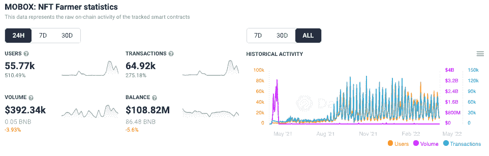
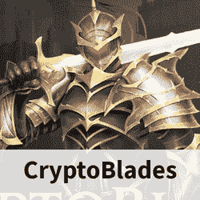
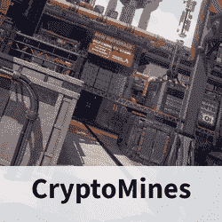
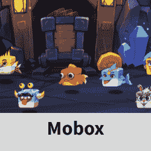

# MOMOverse 的推出一夜之间让 MOBOX 用户增加了 500%

> 原文：<https://web.archive.org/web/https://dappradar.com/blog/momoverse-launch-drives-500-more-users-into-mobox-overnight>

## MOBOX 将 24 小时指标提升到了一个新的高度

领先的 GameFi dapp MOBOX 今天发布了备受期待的 MOMOverse，随着一波又一波的玩家加入进来，24 小时的指标达到了顶峰。MOMOverse 让玩家参与到身临其境的游戏体验中，他们可以选择职业并显示个性化的化身，同时仍然通过游戏化的金融机制产生收益。

## **总结**

*   4 月 5 日，MOBOX 发布了它的 MOMOverse 和用户头像
*   活跃钱包数量在 24 小时内飙升了 510%，达到近 56，000 个
*   [在过去 24 小时内，交易量增加了 275%以上，达到 64，920 笔](https://web.archive.org/web/20220925075051/https://dappradar.com/binance-smart-chain/games/mobox-nft-farmer)
*   [MBOX token](https://web.archive.org/web/20220925075051/https://dappradar.com/hub/token/bsc/MBOX/BNB?from=0x3203c9e46ca618c8c1ce5dc67e7e9d75f5da2377) 在过去的七天里上涨了 50.8%，在过去的 24 小时里上涨了 2.2%

## **MOBOX 浪涌**

4 月 5 日 MOMOverse 的发布使 MOBOX 在 DappRadar 排名中上升，目前在过去 24 小时内所有类别中排名第 15 位。当考虑链上数据时，特别是在轴无穷大以上。在撰写本文时，连接到 MOBOX 的钱包数量在过去 24 小时内增长了 510%以上，达到近 56，000 个，而交易数量也紧随其后，攀升了 275%以上，达到近 65，000 个。

MOBOX 和 MOMOverse 的推出可以说是为其他人的观看奠定了坚实的基础。GameFi dapp 是《T2》过去 12 个月中的常规前 10 名。dapp 抓住了那些希望参与 DeFi 机制的人的想象力，除了额外的乐趣。更重要的是，它逐月保持并扩大了玩家基数，巩固了它作为前 10 名游戏的地位。随着越来越多的人意识到 GameFi 产品类别，MOBOX 看起来将继续增长。

## monoverse 将 bnb 连锁游戏放在地图上

Mobox NFT 农民在三月份吸引了超过 2700 万美元的 NFT 交易量，其本地令牌[MBOX](https://web.archive.org/web/20220925075051/https://dappradar.com/hub/token/bsc/MBOX)的价格几乎翻了一番。活动和估值的飙升是由平台上重要更新的推出以及围绕 MOMOverse 和 avatars 的推出而进行的炒作造成的。在我们对游戏化金融平台成功的最新深入探讨中，你可以阅读更多关于 Mobox 崛起[的信息。](https://web.archive.org/web/20220925075051/https://dappradar.com/blog/the-incredible-rise-of-mobox-nft-farmer)

[https://web.archive.org/web/20220925075051if_/https://www.youtube.com/embed/3EPh0CmYgH4?feature=oembed](https://web.archive.org/web/20220925075051if_/https://www.youtube.com/embed/3EPh0CmYgH4?feature=oembed)

## 什么是独唱？

MOMOverse 让玩家体验身临其境的休闲游戏体验。他们可以选择有多种选择的职业，包括店主、建筑商和农民。为了帮助平台的病毒式传播和社交范围，MOMOverse 还将嵌入一个社交游戏网络。这些包括资源岛，团队农业，激战，化身联盟，等等。

在 MOMOverse 内，移动市场将促进 NFT 商品的便捷交易。居民还可以进入一个博物馆，展示来自陌陌世界之外的陌陌国家艺术博物馆和数字收藏品。MOBOX 的创造者让玩家设计和铸造 NFT 资产，可以使用或出售给其他玩家。

至关重要的是，MOMOverse 表示他们将发布第二阶段的更新，包括 MOMOverse 世界地图和 MOland 游戏。玩家和公会可以探索和争夺他们的领地。你可以在这里找到 MOMOverse 功能的全面分类和路线图[。](https://web.archive.org/web/20220925075051/https://mbox.medium.com/unboxing-a-momoverse-of-infinite-possibilities-cc7e8569ae1f)

[MOBOX 头像](https://web.archive.org/web/20220925075051/https://dappradar.com/blog/mobox-planning-avatar-airdrop-for-vembox-holders/)是身份，是 MOMOverse 中使用的唯一 WEB3 ID。[持有头像](https://web.archive.org/web/20220925075051/https://dappradar.com/blog/mobox-planning-avatar-airdrop-for-vembox-holders/)的玩家可以参加 MOprofession、MOsocial 和陌陌 Home。MOMOverse 中的后续游戏将对头像稀有度有具体要求。

上周，有资格的玩家排队领取头像箱，没有资格的玩家可以在 MOMOverse 购买头像箱。打开头像宝箱铸造一个新头像，头像 ID 从 1000 开始依次累加。玩家也可以付费将他们持有的头像替换到 MOMOverse 的头像箱中，并将取消原来的头像 ID。MOBOX 的未来看起来很光明，因为即将到来的开发承诺给 NFT 土地和其他公用事业带来盈利的可能性。

[<picture></picture>](https://web.archive.org/web/20220925075051/https://dappradar.com/binance-smart-chain/games/cryptoblades-1)[<picture></picture>](https://web.archive.org/web/20220925075051/https://dappradar.com/binance-smart-chain/games/cryptomines)[<picture></picture>](https://web.archive.org/web/20220925075051/https://dappradar.com/binance-smart-chain/games/mobox-nft-farmer)

***以上不构成投资建议。此处给出的信息仅供参考。请行使尽职调查，做你的研究。作者持有多种加密货币的头寸，包括 BTC、瑞士法郎和雷达。***

 NewsletterUnsubscribe at any time. [T&Cs](https://web.archive.org/web/20220925075051/https://dappradar.com/terms) and [Privacy Policy](https://web.archive.org/web/20220925075051/https://dappradar.com/privacy-policy)