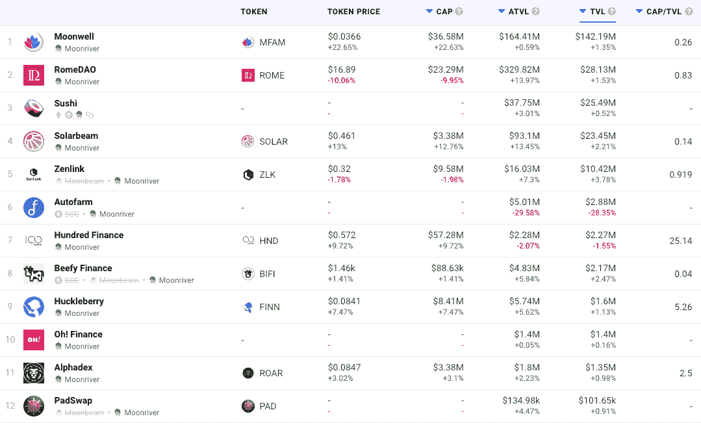
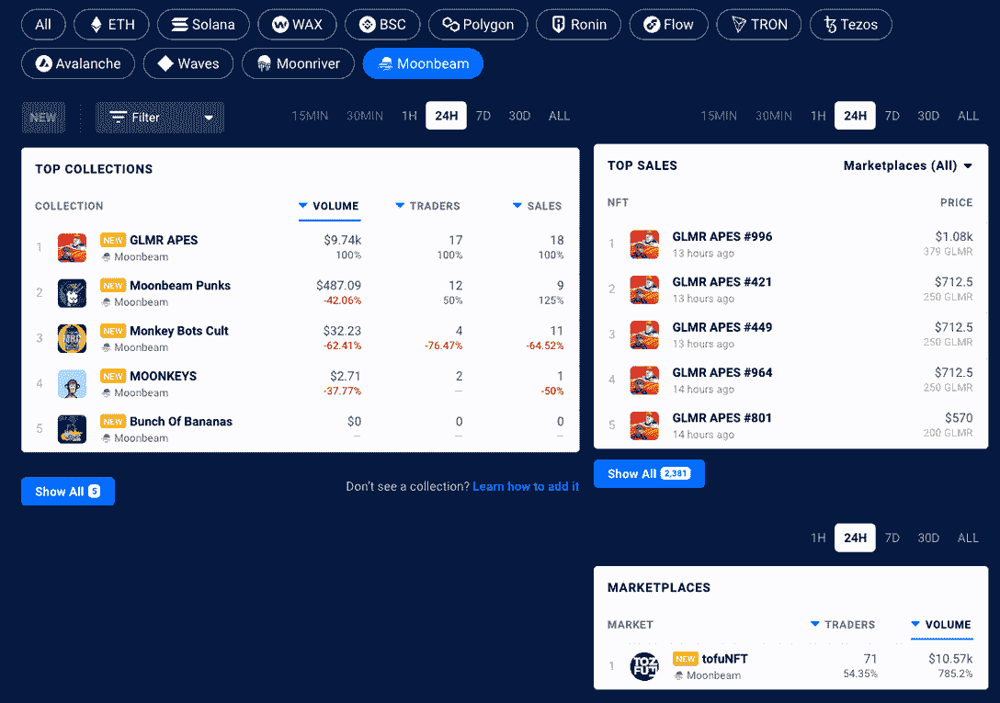

# 月光和月亮河 NFTs 和 DeFi TVL 现在在达普拉达

> 原文：<https://web.archive.org/web/https://dappradar.com/blog/moonbeam-and-moonriver-nfts-and-defi-tvl-now-on-dappradar>

## 扩展我们的能力，为用户提供更多

**DappRadar 在 Moonriver 和 Moonbeam 的 DeFi dapps 上增加了总价值锁定(TVL)的跟踪功能，同时还将这两个网站的 NFT 收藏添加到我们的 NFT 排名中。这不仅有助于用户更好地了解这两个不断增长的网络上的 DeFi 景观，也让他们深入了解最热门的 NFT 系列的性能。**

Moonriver 和 Moonbeam 都是独立的第 1 层网络。新代码首先运送到 Moonriver，在那里它在真实的经济条件下被测试和验证。一旦被证实，同样的代码会被传送到月光。Dapp 开发人员可以根据他们希望访问的中继链(Kusama 或 Polkadot)部署到其中一个或两个网络。

moon river 和 Moonbeam 在更广泛的 DappRadar 生态系统中的更深入整合使 [DeFi dapps](https://web.archive.org/web/20221001113218/https://dappradar.com/defi) 和 [NFT 系列](https://web.archive.org/web/20221001113218/https://dappradar.com/nft)成为焦点。现在用户可以[跨七个区块链](https://web.archive.org/web/20221001113218/https://dappradar.com/defi)分析 TVL，包括 Moonriver 和 Moonbeam。而用户可以跟踪这两个连锁店最受欢迎的 NFT 系列的表现。

## 月光和月光下的迪菲·TVL

锁定的总价值，或 TVL，指的是锁定在网络上 DeFi dapps 智能合约中的资产的美元价值。这是一个广泛使用的指标，用来表示 DeFi 空间随时间的增长。在这两个网络中，DappRadar [追踪了 Moonriver](https://web.archive.org/web/20221001113218/https://dappradar.com/defi/protocol/moonriver) 上的 12 个 dapps 和 Moonbeam 上的 6 个 T2，为客户提供[分散金融](/web/20221001113218/https://dappradar.com/blog/what-is-defi-or-decentralized-finance/) (DeFi)服务。TVL 反映了有多少价值被注入 DeFi dapps，也可以表明他们的受欢迎程度和整体吸引力。在 DeFi 排名中，用户现在可以分析 TVL，本地令牌和探索月光和月亮河 DeFi dapps 更详细。

Source: [DappRadar](https://web.archive.org/web/20221001113218/https://dappradar.com/defi)

## NFT 收藏到月光

虽然 NFT 收藏在 Moonbeam 和 Moonriver 上才刚刚起步，但 DappRadar 作为世界上的 dapp 商店，向用户传达来自最热门资产类别的最新趋势是必不可少的。DappRadar 在 Moonbeam 上追踪五个 NFT 系列和一个 NFT 市场[，在](https://web.archive.org/web/20221001113218/https://dappradar.com/nft/protocol/moonbeam) [Moonriver](https://web.archive.org/web/20221001113218/https://dappradar.com/nft/protocol/moonriver) 上追踪三个 NFT 系列和一个市场。用户现在可以更详细地分析 NFT 收藏，并使用过滤器查看任一网络上的顶级 NFT 销售以及他们可以交易的市场。

Source: [DappRadar](https://web.archive.org/web/20221001113218/https://dappradar.com/nft)

## 扩展能力

DappRadar 在过去的 24 个月里有了巨大的发展，从一个跟踪少数几个网络和他们的 Dapp 的网站发展到全球的 Dapp 商店。我们向世界介绍了我们的 RADAR token，这是一个具有不断扩展的功能、token swap 和 explorer 的投资组合管理器，而且还具有深入的 NFT、DeFi 和 TVL 跟踪功能。此外，DappRadar 还提供行业领先的评估工具和报告，帮助[进一步指导社区](https://web.archive.org/web/20221001113218/https://dappradar.com/token/governance)。

随着我们继续建设未来的 dapp 商店，我们邀请社区参与、贡献并与我们一起建设[它](https://web.archive.org/web/20221001113218/https://dappradar.com/token/governance)。

 NewsletterUnsubscribe at any time. [T&Cs](https://web.archive.org/web/20221001113218/https://dappradar.com/terms) and [Privacy Policy](https://web.archive.org/web/20221001113218/https://dappradar.com/privacy-policy)