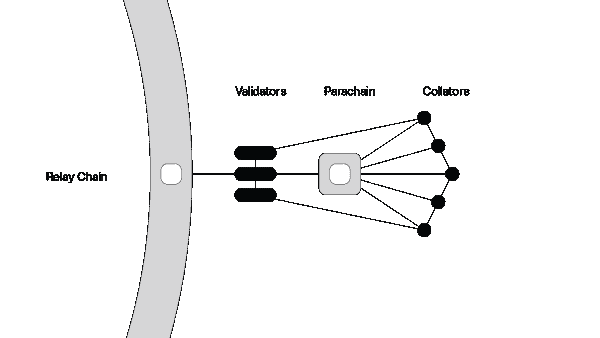
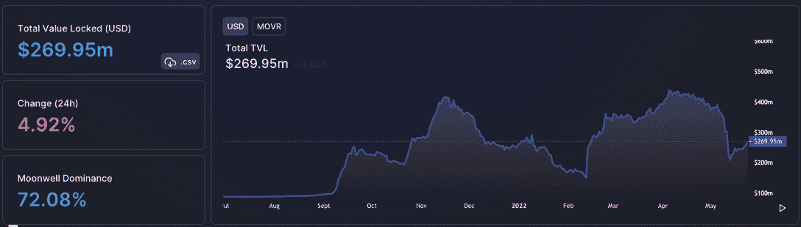
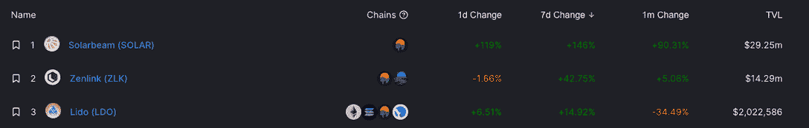
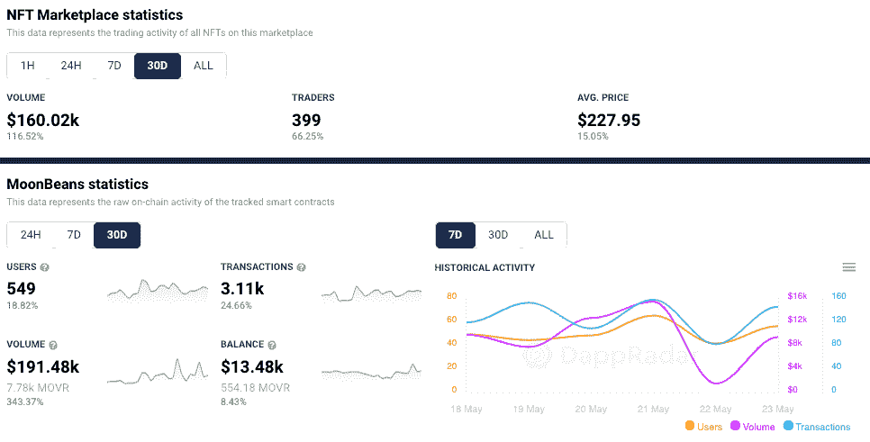
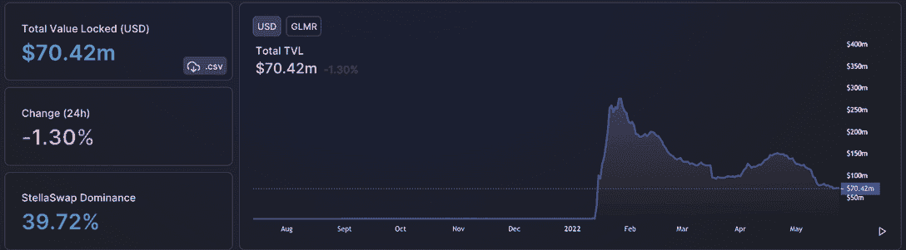
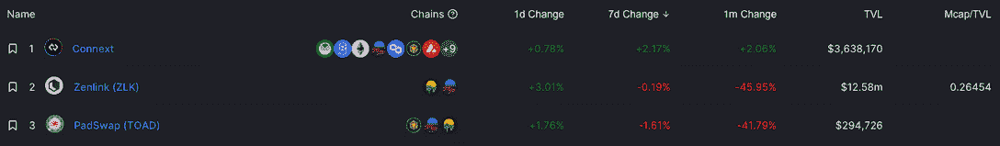
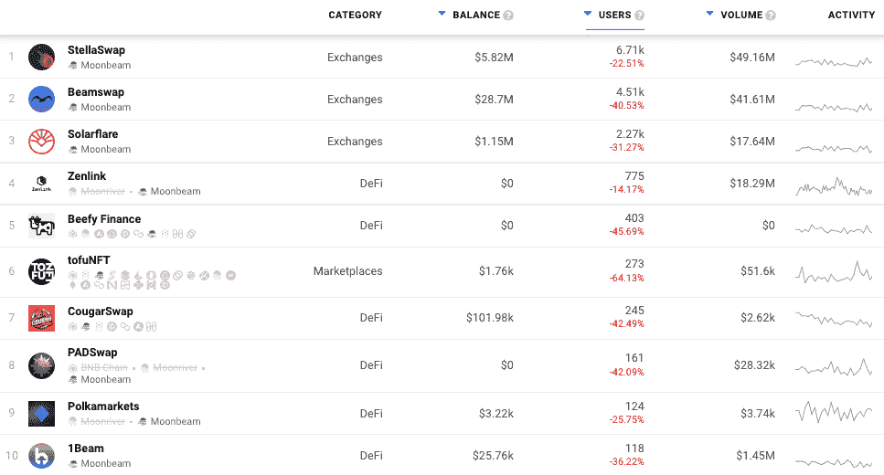

# 月光和月光 Dapps:近距离观察

> 原文：<https://web.archive.org/web/https://dappradar.com/blog/moonbeam-moonriver-dapps-a-closer-look>

## Moonriver 和 Moonbeam 都是独立的第一层网络

Moonriver 和 Moonbeam 是独立的第 1 层网络。第 1 层指的是基础网络，如比特币、BNB 链或以太坊及其底层基础设施。第 1 层区块链无需另一个网络即可验证和完成交易。换句话说，当一个协议在它的区块链上处理和完成交易，并拥有用于支付交易费用的本机令牌时，它就是第 1 层。

新代码首先运送到 [Moonriver](https://web.archive.org/web/20220630221149/https://dappradar.com/rankings/protocol/moonriver) ，在那里可以在真实的经济条件下进行测试和验证。一旦被证实，同样的代码就会被运送到波尔卡多特上的[月光](https://web.archive.org/web/20220630221149/https://dappradar.com/rankings/protocol/moonbeam)。Dapp 开发人员可以根据他们希望接入的中继链(Kusama 或 Polkadot)部署到其中一个或两个网络。通过采用以太坊的工具标准和实现以太坊虚拟机(EVM)环境，Moonbeam 和 [Moonriver](https://web.archive.org/web/20220630221149/https://dappradar.com/rankings/protocol/moonriver) 最大限度地减少了将现有的基于以太坊的应用程序部署到波尔卡多特和草间弥生所需的工作。

## 为用户扩展区块链

在另类区块链生态系统中部署和使用基于以太坊的 dapps 已经成为 web3 的重要组成部分。虽然以太坊的先发优势以及庞大的用户群和工具使其成为构建 web3 应用的绝佳地点，但这反过来会导致拥堵，从而导致[高昂的运营费用](/web/20220630221149/https://dappradar.com/blog/when-are-ethereum-gas-fees-lowest/)和缓慢的交易速度。此外，即使以太坊 2.0 的出现，汽油费也不会明显便宜，因为以太坊的核心问题是街区总是满的。从权力转移到共识不会解决这个问题。谁获得天然气费将会改变，但成本仍会相对较高，因此第一层网络变得如此重要。

自从 2022 年 1 月 DappRadar 整合了这两个网络以来，它们的生态系统已经有了很大的发展。在那个阶段，两个网络之间只有 18 个 dapps，大多数都是在实际经济条件下在 [Moonriver](https://web.archive.org/web/20220630221149/https://dappradar.com/rankings/protocol/moonriver) 上测试的。此外，大多数 dapps 属于 DeFi 和 exchange 类别。我们现在在两个网络中追踪 78 个 dapps，包括几个游戏、NFT 收藏和市场。

尽管从以太坊吸引了许多已经被充分利用的 dapp，如 SushiSwap、Beefy Finance、Curve 和 Oasis，但本土 dapp 脱颖而出，获得了最大的牵引力，在 [Moonriver](https://web.archive.org/web/20220630221149/https://dappradar.com/rankings/protocol/moonriver) 和 Moonbeam 上吸引了最多的用户钱包和交易。

## 月亮河——一个安全的空间

如前所述，新代码首先被运送到 Moonriver，在那里可以在真实世界的条件下进行测试。用户可以像在 Moonbeam 上一样与这些 dapp 进行交互，重要的是，开发人员可以将 dapp 发送到两个网络，然后在将更新发布到 Moonbeam 版本之前更新 [Moonriver](https://web.archive.org/web/20220630221149/https://dappradar.com/rankings/protocol/moonriver) 端的内容。《月亮河》上的 TVL 目前的票房接近 2.7 亿美元，从 5 月 13 日到今天，票房明显上升，超过 6000 万美元。

*Moonriver TVL *

从 TVL 上涨的源头来看，Solarbeam、Zenlink 和 Lido 是主要的贡献者，Solarlink 记录了 TVL 在上周的 7 天上涨 146%。我们再次看到网络本地 dapps Solarbeam 和 Zenlink 领先，而以太坊 dapp Lido 贡献显著，但远不如其他两个。

*Moonriver TVL contributors*

在 [Moonriver](https://web.archive.org/web/20220630221149/https://dappradar.com/rankings/protocol/moonriver) 上查看过去 30 天的链上数据表明，哪些 dapps 找到了显著的用户吸引力。有趣的是，看到一个曾经非常严重的网络顺应行业趋势拥抱游戏和 NFT 市场。

*Moonriver Dapps *

鉴于当前的贸易环境，看到[网络的领先 DeFi dapp](https://web.archive.org/web/20220630221149/https://dappradar.com/rankings/protocol/moonriver)在使用方面受到打击就不足为奇了。Solarbeam 用户数量环比下降约 20%，而 RomeDAO 活跃钱包在过去 30 天内下降了近 65%。这两个协议都提供了交易、代币交换、赌注和产量耕作选项。然而，如上所述，尽管使用率下降，但两者仍对网络的 TVL 有显著贡献。也许更有趣的是 dapps 在游戏和市场类别中使用的增加。

[MoonBeans 是 Moonriver 网络](https://web.archive.org/web/20220630221149/https://dappradar.com/moonriver/marketplaces/moonbeans)上领先的 NFT 市场，目前仅在 Moonriver 上提供，不久将在 Moonbeam 上推出。MoonBeans NFT 平台提供利润分享和功能 [USDC](/web/20220630221149/https://dappradar.com/blog/stablecoin-race-heats-as-usdc-chases-usdt/) 红利自动奖励给 Beans 令牌持有者，可定制的奖励，以及一个全功能的社区 DAO。BEAN 持有人从每笔交易中获得被动奖励，奖励支出由社区通过 DAO 投票决定。

月豆上 NFT 的平均价格相对较低，约为 227 美元，反映了可供购买的收藏类型。这里没有无聊的猩猩。然而，在过去的 30 天里，交易者增加了 66%以上，达到 399 人，而销售额增长了 116%，超过 16 万美元。与 OpenSea 每月数十亿美元的交易量相比，这是一个小数字，但仍然显示了正确方向上的强劲势头。

## 月光——更上一层楼

Moonbeam 上的 TVL 目前仅超过 7000 万美元，这反映出许多负责生成 TVL 的 DeFi dapps 仍处于 Moonriver 上的测试阶段。然而， [Moonbeam](https://web.archive.org/web/20220630221149/https://dappradar.com/moonriver/marketplaces/moonbeam) 代表了生态系统中最活跃的一面，也是最具竞争力的 dapps 的家园。

*Moonbeam TVL *

我们在 TVL 的 Moonbeam 上没有看到像在 Moonriver 上看到的那样积极的上升，然而，Zenlink 在两条链上都有运营，并且是两条链上 TVL 的重要驱动力。

在过去的三十天里， [Moonbeam 上的前三名 dapps 吸引了超过 13，400 个独特的活动钱包](https://web.archive.org/web/20220630221149/https://dappradar.com/rankings/protocol/moonbeam),而 Moonriver 上的前三名仅吸引了超过 8，000 个。鉴于目前的交易环境，发现网络的主要 DeFi dapps 现在使用较少并不奇怪。

*Moonbeam Dapps*

[StellaSwap 平台](https://web.archive.org/web/20220630221149/https://dappradar.com/moonbeam/exchanges/stellaswap)致力于为最终用户创建一套全面的 DeFi 产品，并为基于 Moonbeam 网络的项目创建一个强大的生态系统。通过利用互操作性和可扩展性的前提，StellaSwap 正在通过解构和简化传统的用户旅程来推动大规模采用，从而创建一套更容易接近和简单的 DeFi 产品来满足普通用户的需求。

与此同时， [BeamSwap](https://web.archive.org/web/20220630221149/https://dappradar.com/moonbeam/exchanges/beamswap) 非常相似，提供了一个 AMM 的分散交换。除了各种其他功能，如产量农业，令牌桥和水龙头服务，项目发射台，以及类似于以太坊领先的 DEX SushiSwap 的糖浆池。

## 月光和月光总结

由于以太坊的可扩展性仍然是一个值得关注的重要原因，[像 Moonbeam](https://web.archive.org/web/20220630221149/https://dappradar.com/rankings/protocol/moonbeam) 和 Moonriver 这样的第 1 层网络应该会受到寻求低成本、快速交易和以太坊级安全性的客户的更多关注。通过提供以太坊兼容的开发环境、Web3 RPC API 支持以及令牌和数据的现成工具，Moonbeam 和 Moonriver 简化了在底层生态系统中部署基于以太坊的 dapps。

我们已经看到像寿司、曲线和肌肉这样的重要玩家做出了改变。然而，这两个网络上的这些 dapp 的使用落后于本地 dapp。尽管如此，这对 Moonriver 和 Moonbeam 网络的增长都是非常积极的。

有兴趣了解更多关于构建 dapps 或将 dapps 迁移到 Moonbeam 或 Moonriver 的开发者可以从这里开始。以太坊项目可以简单地复制他们的 dapp，并使用 Hardhat、Truffle、Remix 和其他流行的部署工具将其部署到 Moonbeam。

 NewsletterUnsubscribe at any time. [T&Cs](https://web.archive.org/web/20220630221149/https://dappradar.com/terms) and [Privacy Policy](https://web.archive.org/web/20220630221149/https://dappradar.com/privacy-policy)

***以上不构成投资建议。此处给出的信息仅供参考。请行使尽职调查，做你的研究。作者持有多种加密货币的头寸，包括 BTC、瑞士法郎和雷达。***