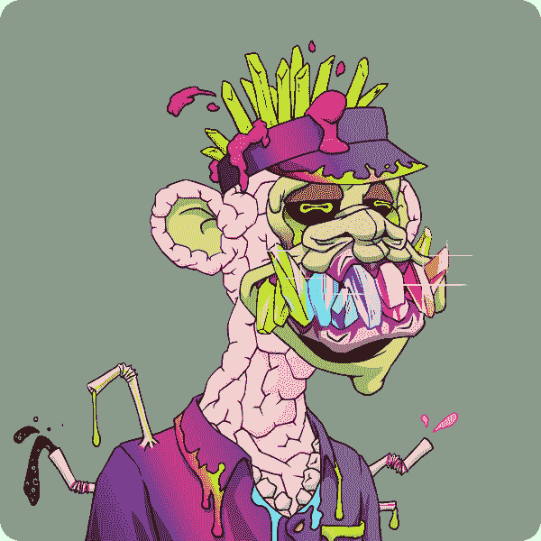
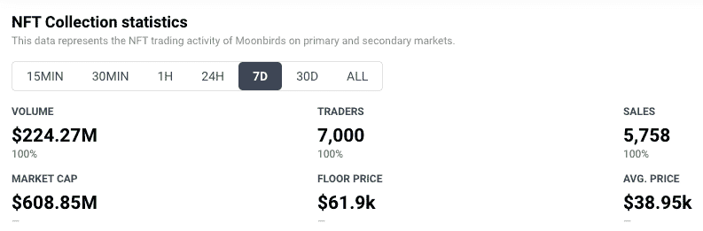
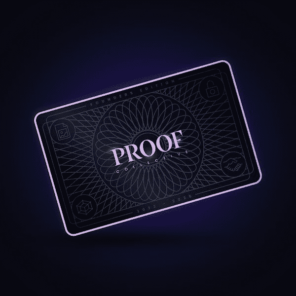
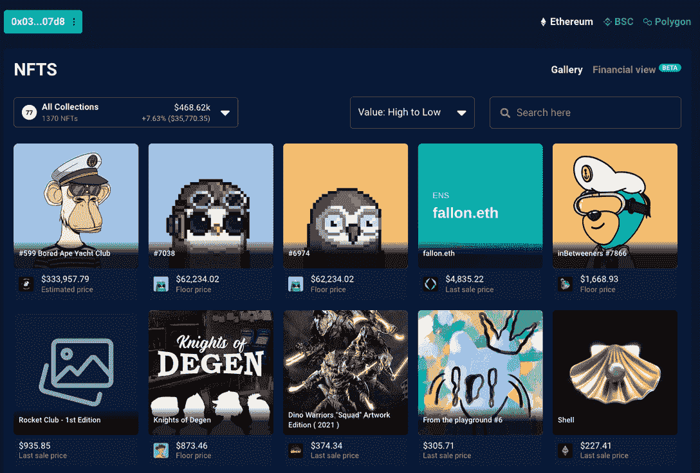

# 吉米·法伦的月鸟和内马尔的变异猿

> 原文：<https://web.archive.org/web/https://dappradar.com/blog/moonbirds-for-jimmy-fallon-and-a-mutant-ape-for-neymar>

## 名人仍然购买 NFT 并在网上展示

**总结**

*   ***某天，NFT 收藏家[吉米·法伦得到了两只月鸟](https://web.archive.org/web/20221004143151/http://jimmy-fallon/)，这是不可替代的代币领域最热门的新财产。***
*   ***足球明星[内马尔刚刚为 55 ETH](https://web.archive.org/web/20221004143151/http://neymar-ape/) 购买了一只变异猿。***
*   在 NFT 游戏中处于顶端的人通常有所有权之外的原因来解释他们为什么拥有他们持有的代币。

在过去的几天里，吉米·法伦收到了一些月鸟，内马尔购买了一只变异猿。但是这两个名人获得他们的 NFT 的原因是非常不同的。他们强调了 NFT 项目如何在当前体系下运作，以及他们用来炒作的手段。

[吉米·法伦](https://web.archive.org/web/20221004143151/https://dappradar.com/hub/wallet/eth/0x0394451c1238cec1e825229e692aa9e428c107d8/nfts)昨天在推特上说他已经加入了[最新的 NFT 炒作项目，月鸟](https://web.archive.org/web/20221004143151/https://dappradar.com/blog/what-are-moonbirds-the-nft-collection-that-broke-all-records-in-a-weekend)。巴黎圣日耳曼足球明星[内马尔](https://web.archive.org/web/20221004143151/https://dappradar.com/hub/wallet/eth/0xc4505db8cc490767fa6f4b6f0f2bdd668b357a5d)最近购买了[突变猿#10953](https://web.archive.org/web/20221004143151/https://dappradar.com/hub/assets/eth/0x60e4d786628fea6478f785a6d7e704777c86a7c6/10953) 。但是，对于一个建立在声誉、排他性和金钱基础上的空间来说，名人代言和网络炫耀并不新鲜。

话说回来，看到名人以高价购买 NFT 总是很有趣。更有意思的是，看看他们买入了哪些项目，以及 NFT 来自哪里。因为有时候购买不仅仅是简单的购买——它们可以成为 NFT 新系列的绝佳营销工具。

## 吉米·法伦得到两只月鸟

吉米·法伦[最近发推特](https://web.archive.org/web/20221004143151/https://twitter.com/jimmyfallon/status/1516488515780980736)说他现在拥有 PROOF Collective 全新月鸟系列的两件 NFT。

[One of Jimmy Fallon’s two Moonbirds](https://web.archive.org/web/20221004143151/https://dappradar.com/hub/assets/eth/0x23581767a106ae21c074b2276d25e5c3e136a68b/6974)

法伦有这些 NFT 也就不足为奇了。他们是目前游戏中最热门的两个角色，法伦已经有了一只无聊的猿和他自己的 T2。eth 域。但是看看月鸟是从哪里来的很有意思。有趣的是，他在收到照片三天后发微博说他已经收到了。也许他在等着看他们会不会爆炸，然后再告诉全世界。

将两只月鸟送到法伦的钱包是这个钱包，它目前持有价值 856 万美元的非现金交易券和代币。如果你[在 OpenSea](https://web.archive.org/web/20221004143151/https://opensea.io/MBTreasury) 上找到同样的钱包，你可以看到它叫做 MBTreasury。钱包本月加入了 OpenSea，目前拥有超过 120 只月鸟。所有迹象都表明这个钱包是 Moonbirds Treasury，项目团队存放其 NFTs 的地方。

我们可以在以太扫描上看到他没有为这两只鸟支付任何钱，我们也知道他没有自己铸造它们。将所有这些放在一起，并进行一些有根据的猜测，似乎吉米·法伦免费获得了这两个 NFT，作为月鸟项目营销策略的一部分。

所有这些都不足为奇。每个人都知道这是项目获得关注和产生炒作的方式。但是当我们看到一个名人支持一个项目时，保持一定程度的谨慎总是有用的。问问你自己:他们和谁一起工作，他们从中获得了什么？

## 内马尔抓了一只猩猩

内马尔购买的变异猿与吉米·法伦的月鸟不属于同一类。这位足球运动员为他的 NFT 付了真金白银。他以 55 ETH(173，601 美元，在撰写本文时)的价格购买了它，现在你可以在 DappRadar 上看到它。

[Neymar’s new Mutant Ape #10953](https://web.archive.org/web/20221004143151/https://dappradar.com/hub/assets/eth/0x60e4d786628fea6478f785a6d7e704777c86a7c6/10953)

您可以[亲自在这里](https://web.archive.org/web/20221004143151/https://etherscan.io/tx/0x7ad8b630dddccf7d1b11853db3bab3b2d476a043fd393528e39fde1a4a370ffd)查看购买情况。如果你[看看二级市场上的 NFT](https://web.archive.org/web/20221004143151/https://opensea.io/assets/0x60e4d786628fea6478f785a6d7e704777c86a7c6/10953)，你可以看到，在撰写本文时，已经有人出价 31.8 ETH(99250 美元)从内马尔购买这只猩猩。

在这种情况下，内马尔购买了 NFT，因为他看到了购买的价值。也许他喜欢艺术品，或者他只是喜欢成为变异猿游艇俱乐部的一员。不管他的理由是什么，没有人能否认他对事业的承诺和对网络力量的信念。

不然他为什么要在现实生活中打扮成 NFT 人去外面的世界？

Neymar and Paris Saint-Germain teammate Leo Messi

## 什么是证明集体和他们的新月鸟系列？

月鸟系列于 4 月 16 日推出，底价已经是 20 ETH(61950 美元)。该项目由 PROOF Collective 开发，由 10，000 个实用的 PFP 组成。

自推出以来的四天里，已经有超过 72，343 ETH(2.24 亿美元)的收藏交易。虽然目前的平均售价为 12.5 ETH(38，950 美元)，但随着该项目的宣传继续，预计未来几天价格将会飙升。

[DappRadar’s NFT Collection statistics for Moonbirds](https://web.archive.org/web/20221004143151/https://dappradar.com/ethereum/collectibles/moonbirds)

PROOF Collective 是一个由 web3 爱好者和品味创造者组成的小型、有影响力且资源丰富的社区。它的网站将他们描述为“1000 名专门的 NFTs 收藏家和艺术家的私人会员集体”。欢迎任何人加入证明集体，但这是有代价的。为了在二级市场购买会员通行证，你必须支付大约 83 ETH(257，305 美元)。因此，尽管理论上有可能加入，但实际上对大多数人来说是不可能的。

The PROOF Collective membership card

PROOF Collective 启动了 Moonbirds 项目，作为其成员在社交媒体个人资料上展示的亲民 NFT。有趣的是，这个收藏由 10，000 只月鸟组成，NFT 收藏者被允许每人铸造两只。这意味着这个已经排外的俱乐部的成员可以在其他人得到一只之前得到 2000 只可爱的小鸟。

拿着月鸟给人们:

*   进入私人证明集体不和通道。
*   这个过程叫做筑巢。这类似于赌注，通过这样做，持有者可以获得额外的利益和奖励。
*   成员和链接到一个组包含关键的 web3 人物，如 Beeple，Mike Winkelmann 和 Gary Vaynerchuck。

Moonbirds 系列已经打破了交易记录，自四天前推出以来，已经在所有市场产生了超过 2.24 亿美元的销量。而且底价已经高于老牌的 NFT 系列，如[克隆 X](https://web.archive.org/web/20221004143151/https://dappradar.com/ethereum/collectibles/azuki) 、 [CrypToadz](https://web.archive.org/web/20221004143151/https://dappradar.com/ethereum/collectibles/cryptoadz-by-gremplin) 和[酷猫](https://web.archive.org/web/20221004143151/https://dappradar.com/ethereum/collectibles/cool-cats)。如果它继续这样下去，它可能会统治所有的国家。

## 追踪区块链周围的非传染性疾病

要查看[吉米·法伦的 NFT 钱包](https://web.archive.org/web/20221004143151/https://dappradar.com/hub/wallet/eth/0x0394451c1238cec1e825229e692aa9e428c107d8/nfts)，你可以使用 DappRadar 的[投资组合](https://web.archive.org/web/20221004143151/https://dappradar.com/hub/wallet/)功能。这是一个有用的工具来跟踪区块链周围的 NFT 和令牌。你也可以用它来[追踪其他名人的钱包](https://web.archive.org/web/20221004143151/https://dappradar.com/blog/top-10-most-valuable-celebrity-nft-portfolios-in-march)。

[DappRadar’s Portfolio tracker showing some of Jimmy Fallon’s NFTs](https://web.archive.org/web/20221004143151/https://dappradar.com/hub/wallet/eth/0x0394451c1238cec1e825229e692aa9e428c107d8/nfts)

您可以通过点击各个 NFT，深入了解与艺术品或令牌相关的各种功能。您将能够看到:

*   NFT 的最后销售价格
*   当前底价
*   NFT 的估计价格
*   资产实力——你可以在这里了解 DappRadar 如何判断资产实力[。](https://web.archive.org/web/20221004143151/https://dappradar.com/blog/how-does-dappradar-calculate-nft-asset-strength)
*   NFT 在哪个区块链网络上
*   与 NFT 相关联的元数据
*   收藏中任何 NFT 的交易历史。

与存储在区块链上的所有东西一样，任何人都可以跟踪信息的痕迹，追踪加密货币和 NFT 的历史。例如，你可以看到吉米·法伦五个月前从[的](https://web.archive.org/web/20221004143151/https://dappradar.com/blog/bored-apes-talk-of-the-town-celebrities-join-hype)处收到了他的[无聊猿](https://web.archive.org/web/20221004143151/https://dappradar.com/ethereum/collectibles/bored-ape-yacht-club)，他的以太坊钱包[目前价值 1198 万美元](https://web.archive.org/web/20221004143151/https://dappradar.com/hub/wallet/eth/0xd75233704795206de38cc58b77a1f660b5c60896)。

你还可以使用 DappRadar 的工具来跟踪 [Moonbirds 的最新 NFT 收藏统计数据](https://web.archive.org/web/20221004143151/https://dappradar.com/ethereum/collectibles/moonbirds)，并查看它在我们的 [NFT 排名页面](https://web.archive.org/web/20221004143151/https://dappradar.com/rankings/category/collectibles)中的排名。请务必关注我们的[博客](https://web.archive.org/web/20221004143151/https://dappradar.com/blog/)以了解这一事件的最新进展，并在 [Twitter](https://web.archive.org/web/20221004143151/https://twitter.com/DappRadar) 上关注我们，以便尽快获得新闻。