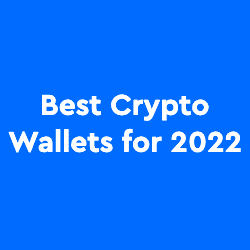

# MoonPay 为 MetaMask 带来简单的加密购买

> 原文：<https://web.archive.org/web/https://dappradar.com/blog/moonpay-brings-easy-crypto-purchases-to-metamask>

## 元掩码用户现在可以使用信用卡购买加密

由于 Moonpay，领先的加密货币 Web3 钱包 MetaMask 的用户现在可以使用信用卡或借记卡直接在 MetaMask 中购买 ETH。通过 Twitter 宣布的合作伙伴关系使 Moonpay 能够接触到 MetaMask 的 3000 多万用户群，并让 MetaMask 更好地为其客户服务。此外，合作伙伴关系将有助于扩大加密的采用。

## 摘要

*   [Moonpay 与 MetaMask](https://web.archive.org/web/20221001105627/https://dappradar.com/blog/moonpay-brings-easy-crypto-purchases-to-metamask/#Moonpay-partners-with-MetaMask) 合作，通过主流支付方式进行 ETH 采购
*   MoonPay 使通过 MetaMask 购买加密更容易和更容易
*   MetaMask 是领先的 Web3 钱包服务，在全球拥有超过 3000 万用户
*   MetaMask 的集成交换功能[每月已经吸引了 117，000 个独特的活动钱包](https://web.archive.org/web/20221001105627/https://dappradar.com/rankings/category/defi)
*   [MetaMask Swap](/web/20221001105627/https://dappradar.com/blog/metamask-swap-wows-users-with-convenience/) 根据[DappRadar 排名](https://web.archive.org/web/20221001105627/https://dappradar.com/rankings/category/defi)是 DeFi 类别中第七大 dapp

## Moonpay 与 MetaMask 合作

MoonPay 与领先的区块链钱包的整合将使购买加密货币更加容易。整个过程可以在 MetaMask 钱包内进行，而不是在中央交易所设立一个外部账户，并将其用作菲亚特 onramp。此外，菲亚特入口对于区块链工业保持目前的增长速度至关重要。

MetaMask 今年已经推出了几项重要的升级，包括非常受欢迎的黑暗模式，以及安全性和可访问性升级。可以说， [MetaMask](/web/20221001105627/https://dappradar.com/blog/set-up-metamask-on-layer-2-and-avoid-ethereum-gas-fees/) 处于有利地位，充分利用了在该领域的早期优势。它目前在全球拥有超过 3000 万用户，尽管随着 Web3 钱包领域的升温，竞争对手的冲击，但简单的菲亚特 onramp 的推出应该会在未来一段时间内巩固其地位。

## 月亮日前往月球

MoonPay 的使命是 2022 年，他们在 4 月初宣布将与 OpenSea 合作，使购买 NFT 更容易。OpenSea 平台最近一直在尝试添加 Solana NFTs，通过多边形令牌支付，并允许用户使用信用卡进行购买。你仍然需要一个基于 ETH 的钱包，比如 Metamask 来存储 NFTs，但是这一举动使 OpenSea 更接近所有人的访问。

与 OpenSea 合作伙伴发生的事情是，MetaMask 试图全力以赴，以确保它抢在比特币基地之前。随着比特币基地的 NFT 托管平台即将推出，OpenSea 正试图让 NFTs 尽可能地易于访问。一旦比特币基地平台引入了收藏家使用加密货币购买 NFT 并将其保存在链上的能力，该平台上的 NFT 可能为零汽油费，这可能会对 OpenSea 目前享有的数量和领导地位产生影响。然而，这是一个已经受到不同角度批评的领导职位。LooksRare 希望占领市场份额，而区块链其他 NFT 市场的使用率也在上升。

## 在元掩码上购买加密

首先，[在您的首选设备上安装](https://web.archive.org/web/20221001105627/https://metamask.io/download/)meta mask 钱包。它可以是移动的或桌面的。创建新的钱包地址或导入现有地址后，点击蓝色的购买按钮，继续通过 MoonPay 购买以太坊。

用户现在可以通过升级移动版本 4.4 和即将推出的扩展版本 10.13，直接在 MetaMask 钱包中通过 MoonPay 购买 crypto。由于监管原因，除了纽约、德克萨斯州、路易斯安那州、罗德岛州、夏威夷和美属维尔京群岛，在 MoonPay 上购买以太坊服务在美国各州都可用。

一旦用户的元掩码钱包中有了 ETH，他们就可以使用集成的交换服务将 ETH 换成另一个令牌。每月有 117，000 个独特的活动钱包使用[元掩码交换](https://web.archive.org/web/20221001105627/https://dappradar.com/ethereum/defi/metamask-swap)。MetaMask 在每次交换中收取少量费用。

 NewsletterUnsubscribe at any time. [T&Cs](https://web.archive.org/web/20221001105627/https://dappradar.com/terms) and [Privacy Policy](https://web.archive.org/web/20221001105627/https://dappradar.com/privacy-policy)

***以上不构成投资建议。此处给出的信息仅供参考。请行使尽职调查，做你的研究。作者持有多种加密货币的头寸，包括 BTC、瑞士法郎和雷达。***

[<picture></picture>](https://web.archive.org/web/20221001105627/https://dappradar.com/blog/4-tips-on-blockchain-cybersecurity-stay-safe-in-crypto)[<picture></picture>](https://web.archive.org/web/20221001105627/https://dappradar.com/blog/how-to-start-using-defi-dapps-and-crypto-wallets-on-solana)[<picture></picture>](https://web.archive.org/web/20221001105627/https://dappradar.com/blog/best-cryptocurrency-wallets-for-2022)