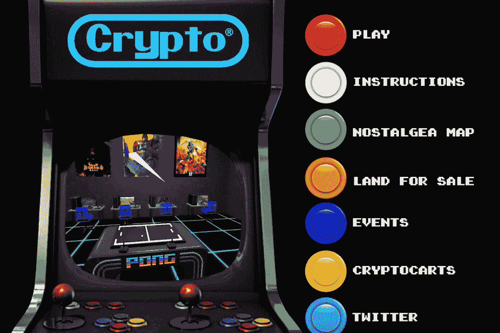

# 更多的游戏 Dapps 增加了和谐生态系统的多样性

> 原文：<https://web.archive.org/web/https://dappradar.com/blog/more-gaming-dapps-boost-the-diversity-of-harmonys-ecosystem>

## 加密街机，速度之星，和火箭怪物来和谐

**Harmony 的高性价比和可扩展的区块链将有更多令人兴奋的游戏 dapps 加入生态系统。这些游戏从商业模拟到第三人称射击游戏，为 Harmony 的用户提供了更广泛的游戏 dapps 选择。**

**概要:**

*   [和谐](https://web.archive.org/web/20220717050354/https://dappradar.com/rankings/protocol/harmony) ( [ONE](https://web.archive.org/web/20220717050354/https://dappradar.com/hub/token/eth/ONE/ETH?from=0x68ac1affe00cf64ebc71e7e835a6871a379c5587) )将会有更多精彩的游戏项目加入网络。
*   这些[游戏 dapp](https://web.archive.org/web/20220717050354/https://dappradar.com/rankings/category/games)是 Crypto Arcade、Speed Star 和 Rocket Monsters。
*   和谐上成功的游戏 dapps 继续出色的表现。
*   在过去的 30 天里，DeFi 王国的交易量增长了 54%，T2 的交易量增长了 53%。

更广泛的加密货币市场继续低迷，dapp 活动触及今年最低点。根据 [DappRadar 行业报告 5 月版](https://web.archive.org/web/20220717050354/https://dappradar.com/blog/dappradar-industry-report-may-2022)，5 月份有 222 万个每日唯一活跃钱包(UAW)连接到区块链 dapps，环比(MoM)下降 5%，尽管仍比 2021 年 5 月高出 32%。

然而，一些行业领袖认为，最近加密货币[的市场崩溃可能有助于从新兴行业](https://web.archive.org/web/20220717050354/https://www.cnbc.com/2022/06/03/cryptocurrency-industry-focus-regulation-stablecoins-market-crash.html)中淘汰不合格的市场参与者。这也可以减少市场投机，让加密用户专注于项目的长期价值。

在建立可持续发展的区块链生态系统时，Harmony 在丰富其生态平台多样性方面实现了几个里程碑。游戏 dapps 不断加入 Harmony，最新的有 Crypto Arcade，Speed Star，火箭怪兽。

## 加密街机-一个交叉链街机风格的元宇宙

[Crypto Arcade](https://web.archive.org/web/20220717050354/https://www.cryptoarcade.one/) 是一款以怀旧街机元素为特色的跨链元宇宙。此外，虚拟世界为用户带来了 2D 和 3D/VR 探索的混合，用户可以在这两种模式之间轻松切换。

在这个空间里冒险，用户会意识到加密街机不仅仅是街机游戏。该团队旨在构建一个适合在线会议、游戏、社交活动和其他数字生活用例的虚拟世界。

## 速度之星——牧场、繁殖、训练和赚钱

速度之星是一款以赛马为主题的游戏，由 Unity 引擎驱动。在游戏中，玩家可以选择职业道路，建造自己的马场，饲养、训练和繁殖马匹。这些活动都是为了最终的目标，赢得比赛和大奖。由于玩家需要努力工作才能在比赛中脱颖而出，Speed Star 背后的团队为这款游戏提出了一个独特的价值主张，即工作赚钱。

[https://web.archive.org/web/20220717050354if_/https://www.youtube.com/embed/4c9LN9pj2jw?feature=oembed](https://web.archive.org/web/20220717050354if_/https://www.youtube.com/embed/4c9LN9pj2jw?feature=oembed)

三个令牌促进了游戏中的经济系统，JOC，速度和明星。它们都有不同的用途。JOC 用于从玩家的活动中恢复能量，并从市场中购买物品。速度是游戏中的基础货币。玩家可以使用这些代币进行牧场开发和扩张、养马、雇佣其他玩家以及赌马。最后，星，速星的治理令牌。

## 火箭怪兽——一款身临其境的第三人称射击游戏

[https://web.archive.org/web/20220717050354if_/https://www.youtube.com/embed/zzOMHl6ZykY?feature=oembed](https://web.archive.org/web/20220717050354if_/https://www.youtube.com/embed/zzOMHl6ZykY?feature=oembed)

[火箭怪兽](https://web.archive.org/web/20220717050354/https://rocketmonsters.io/)是一款以玩为赚的射击游戏，拥有身临其境的视觉效果，这要归功于强大的虚幻引擎 5。值得注意的是，所有游戏内的资产都是可玩的 NFT，包括各种角色、武器和车辆。

该游戏让玩家参与玩家对玩家和玩家对环境模式。此外，稳健和可持续的代币组学旨在为玩家提供多种游戏和收入选择。例如，玩家可以在各种比赛和比赛中争夺游戏内的代币和 NFT 掉落。

游戏中 NFT 的重要资产之一是怪物角色，一群渴望权力的熊会让你想起著名的艺术玩具，[【电子邮件保护】](/web/20220717050354/https://dappradar.com/cdn-cgi/l/email-protection)目前有 7000 个可玩的 NFT 角色，并且还在增加。

## 最后的想法

值得注意的是，Harmony 团队一直致力于为未来的去中心化数字生活奠定坚实的基础。因此，在过去的几个月里，和谐的游戏部门见证了持续的扩张。由于其低延迟和低成本的高吞吐量，越来越多的游戏 dapps 青睐 Harmony 作为托管其产品的基础设施。

除此之外，现有的 dapps 保持了对加密用户的吸引力。例如，和谐网上排名第一的 dapp 网站 [DeFi Kingdoms](https://web.archive.org/web/20220717050354/https://dappradar.com/harmony/games/defi-kingdoms) ，在过去 30 天里记录了 3000 万美元的交易量，增长了 54%。同样， [MarsColony](https://web.archive.org/web/20220717050354/https://dappradar.com/harmony/games/marscolony) 的 30 天用户增长了 27%，交易增长了 53%。

DappRadar 将继续监测 Harmony 及其生态系统的最新发展。在 [Twitter](https://web.archive.org/web/20220717050354/https://twitter.com/dappradar) 、 [Discord](https://web.archive.org/web/20220717050354/https://discord.gg/4ybbssrHkm) 和 [Youtube](https://web.archive.org/web/20220717050354/https://www.youtube.com/c/DappRadar) 上关注我们，跟上区块链世界的动态。

了解更多关于和谐的信息:

[网站](https://web.archive.org/web/20220717050354/https://www.harmony.one/)

[白皮书](https://web.archive.org/web/20220717050354/https://harmony.one/whitepaper.pdf)

[推特](https://web.archive.org/web/20220717050354/https://twitter.com/harmonyprotocol)

**免责声明** —这是一篇赞助文章。DappRadar 不认可本页面上的任何内容或产品。DappRadar 旨在提供准确的信息，但读者应该在采取行动之前总是自己做研究。DappRadar 的文章不能被认为是投资建议。