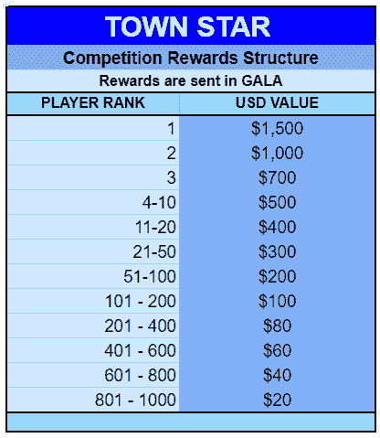

# 城镇明星玩家将获得更多奖励

> 原文：<https://web.archive.org/web/https://dappradar.com/blog/more-rewards-coming-to-town-star-players>

## 联欢晚会的奖励结构给予获胜者真正的奖励

[**春晚游戏**](https://web.archive.org/web/20221127162140/https://dappradar.com/blog/tag/gala-games) **【最大头衔】** [**镇星**](https://web.archive.org/web/20221127162140/https://dappradar.com/blog/tag/town-star) **，将获得扩大奖励和扩大权限。在拥挤的游戏赚取市场，该平台正在继续改善，以保持领先地位。**

竞技农业游戏城镇之星已经成为节日游戏目录中最受欢迎的游戏。首先，因为它是市场上最完整的游戏。目前，超过 28，000 名玩家在该游戏中竞争，以赢得服务器，获得 GALA 中的每月奖励和 tokens 中的每日奖励。每一个新的 NFT 版本或游戏更新都会对城镇之星的游戏赚钱机制产生重大影响。这就是为什么 3 月 3 日[来自 Gala Games 的博客帖子](https://web.archive.org/web/20221127162140/https://blog.gala.games/expanded-rewards-and-extended-access-9ad54e34b11a)非常重要，因为它提供了本月一系列更新的细节，包括:

*   新的竞争
*   更多赢家和更多奖励
*   持续玩到赚(P2E)早期访问
*   公平和更公正的竞争环境

## 新的竞争

比赛服务器已经回来了。他们离线了一段时间，因为平台根据社区反馈对他们进行了升级。

首先，比赛服务器将从小规模开始，以便游戏制造商可以测试改进。但是在测试之后，城镇之星将开始全面升级。

## 更多赢家和奖励

城镇之星的奖励池将从比赛的前 400 名扩大到前 1000 名。奖励结构概述如下:

Updated Town Star rewards structure

这个新的奖励结构是暂时的，城镇之星的开发者打算在比赛服务器回归后对它进行更多的改进。

## 持续的“玩即赚”访问

由于《城市之星》第二季还有一段路要走，季票还没有发布。但这意味着玩家将在一段时间内继续免费获得 P2E 奖励。

## 更公平、更平等的竞争环境

在听取社区反馈并对这个问题进行一些真正的思考后，Gala Games 将推出新的方法来打击那些想要滥用 Town Star 谋取私利的人(或机器人)。

在 P2E 平台上玩系统游戏是一个众所周知的现象，也是游戏制造商不断试图解决的问题。Gala Games 有“有趣的更新”,承诺遏制破坏游戏的滥用行为。

## 什么是城镇之星？

城镇之星是 Gala Games 的旗舰游戏，它的概念很简单:规划和建设一个城镇。你是城市环境的管理者，有机会为你的成功赚钱。玩家可以在日常挑战中竞争以赢得 TownCoin。

不像 Farmville，游戏只限于农业，城镇之星包括整个城镇的组织。玩家需要耕种、建造、制作和出售东西。例如，生产面粉，烤面包，并把它卖给附近的城市。

基于区块链以太坊建造并于 2020 年 3 月推出，玩家需要一个 Gala Games 账户和钱包才能玩游戏。拥有一个或多个 NFT 将增加你的庆祝能力，让你增加你的城镇收入机会。你可以在这里购买庆典代币，或者在这里找到城镇代币。

现在城镇之星和更广泛的游戏生态系统的 NFTs 仍然存在于以太坊区块链。但 Gala Games 正致力于推出自己的玩家驱动的节点网络。你可以在 DappRadar 上阅读更多关于[这个即将到来的区块链，又名 Gala 连锁项目 Gyri 的信息。随着 Gala Games 宣布更多更新，DappRadar 将在这里确保你听到他们。关于区块链游戏和分散应用世界的所有其他新闻，请继续关注](https://web.archive.org/web/20221127162140/https://dappradar.com/blog/gala-games-presents-its-blockchain-what-is-project-gyri) [DappRadar](https://web.archive.org/web/20221127162140/https://dappradar.com/blog/) 并在 [Twitter](https://web.archive.org/web/20221127162140/https://twitter.com/DappRadar) 上关注我们。你也可以在格林威治时间每周四下午 4 点加入我们的每周 [Discord](https://web.archive.org/web/20221127162140/https://discord.com/invite/QMnwjGzrkG) 。