# 元宇宙最昂贵的土地

> 原文：<https://web.archive.org/web/https://dappradar.com/blog/most-expensive-land-in-the-metaverse>

## 虚拟土地是一个蓬勃发展的行业；NFT 土地交易使人们赚了几千美元

虚拟世界中的一块 NFT 土地目前是热门商品，因为投资者和机会主义者都想从元宇宙中分一杯羹。土地有时会卖到几十万美元，这取决于虚拟世界的受欢迎程度和土地的大小。我们来看看元宇宙一些最昂贵的热门景点。

在这篇文章中，我们将看看一些不同的虚拟世界。我们指出高土地价值的原因，并告诉你最重要的销售。

[https://web.archive.org/web/20230118183007if_/https://www.youtube.com/embed/S1FBOwLwCn4?feature=oembed](https://web.archive.org/web/20230118183007if_/https://www.youtube.com/embed/S1FBOwLwCn4?feature=oembed)

## 分散土地

到 2021 年底，我们已经看到分散土地上的虚拟房地产售价高达数百万美元。在分散土地中，有三个方面影响土地的价值:它的大小，它与热门地点的接近程度，以及它是否在公路旁边。最大的销售是房地产，这基本上是一堆捆绑在一起的土地。

最昂贵的土地购买是:

[<picture>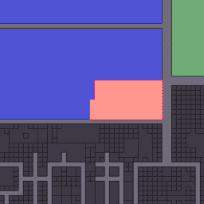</picture>](https://web.archive.org/web/20230118183007/https://dappradar.com/hub/assets/eth/0x959e104e1a4db6317fa58f8295f586e1a978c297/4339)

Fashion Street Estate – 22 November 2021 – 618,000 MANA / 2.4 million dollars

[<picture>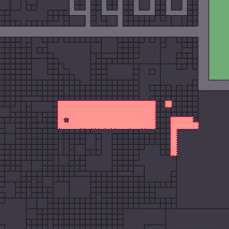</picture>](https://web.archive.org/web/20230118183007/https://dappradar.com/hub/assets/eth/0x959e104e1a4db6317fa58f8295f586e1a978c297/985)

Massive Genesis Plaza Estate – 29 November 2021 – 210,000 MANA / 1.08 million dollars

[<picture>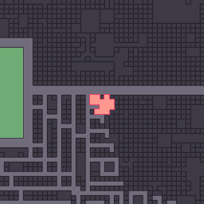</picture>](https://web.archive.org/web/20230118183007/https://dappradar.com/hub/assets/eth/0x959e104e1a4db6317fa58f8295f586e1a978c297/4313)

Venture Estates – 10 December 2021 – 300,000 MANA / 1.03 million dollars

## Somnium Space

与分散体相比， [Somnium 空间](https://web.archive.org/web/20230118183007/https://dappradar.com/ethereum/games/somnium-space)更高级，但也更复杂。Somnium Space 支持 VR 头戴设备和身体运动。非常先进的东西。这使得进入 Somnium 空间变得更加复杂，这也是开发人员正在努力改进的地方。。

在空间上，影响土地价值的因素很多。当然，面积很重要，但更重要的是土地是否毗邻公路，是否能看到湖景。Somnium Space 中有一些地块的土地与湖泊相连，允许土地所有者建造码头。

最昂贵的土地购买是:

[<picture>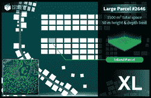</picture>](https://web.archive.org/web/20230118183007/https://dappradar.com/hub/assets/eth/0x913ae503153d9a335398d0785ba60a2d63ddb4e2/2646)

28 Land Parcels – 16 March 2021 – 250 ETH / $444,460

[<picture>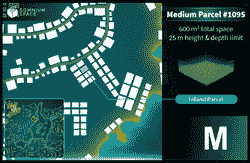</picture>](https://web.archive.org/web/20230118183007/https://dappradar.com/hub/assets/eth/0x913ae503153d9a335398d0785ba60a2d63ddb4e2/1095)

8 Combined Medium Land Parcels – 5 May 2021 – 99.9 ETH / $335,010

[<picture>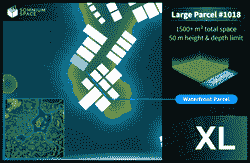</picture>](https://web.archive.org/web/20230118183007/https://dappradar.com/hub/assets/eth/0x913ae503153d9a335398d0785ba60a2d63ddb4e2/1018)

5 XL Land Parcels – 14 May 2021 – 140 ETH / $261,930

## 沙盒

尽管 2021 年对沙盒来说是重要的一年，游戏世界还没有完全充实起来。到目前为止，只有少数几个游戏体验已经推出，而且只提供给阿尔法通行证 NFT 持有者。

迄今为止，沙盒中的土地估值一直基于地产的规模以及与知名品牌或社区的接近程度。这个想法是玩家将从一个地方跳到另一个地方，因此大的土地和品牌将吸引步行交通。例如，最近几周我们已经看到用户支付数千美元来拥有 Snoop Dogg 虚拟豪宅旁边的土地。

最昂贵的土地购买是:

[<picture>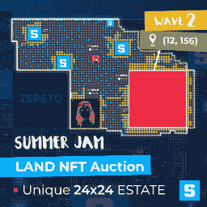</picture>](https://web.archive.org/web/20230118183007/https://dappradar.com/hub/assets/eth/0xf17131a4c85e8a75ba52b3f91ce8c32f6f163924/68)

24×24 Summer Jam estate – 2 July 2021 – 3.6 million SAND / $874,760

[<picture>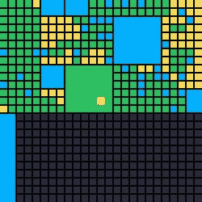</picture>](https://web.archive.org/web/20230118183007/https://dappradar.com/hub/assets/eth/0x50f5474724e0ee42d9a4e711ccfb275809fd6d4a/137722)

6×6 Estate – 26 December 2021 – 60 ETH / $244,980

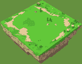

Land next to Atari – 26 November 2021 – 44 ETH / $191,190

## 隐体素

我们将探索的下一个虚拟世界是[隐体素](https://web.archive.org/web/20230118183007/https://dappradar.com/ethereum/collectibles/cryptovoxels)。在虚拟世界中，用户可以建造他们想要的任何东西，团队仍然定期铸造新的土地。然而，最想要的土地是在原点城市，隐体素世界的中心。因为那是新人诞生的地方。此外，法兰克福地区以拥有虚拟世界中最高的地块而闻名，这使该地区在竞争中具有优势。

隐体素中的土地具有宽度、深度和高度，每一个都决定其价值。低高度的奇数尺寸包裹往往卖得便宜一点。在世界中心之外，更大的地块和靠近水边的地块价格更高。

最昂贵的土地购买是:

[<picture>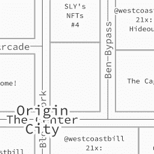</picture>](https://web.archive.org/web/20230118183007/https://dappradar.com/hub/assets/eth/0x79986af15539de2db9a5086382daeda917a9cf0c/1)

70, 74 and 75 Block Fork – 14 February 2021 – 300 ETH / $543,000

[<picture>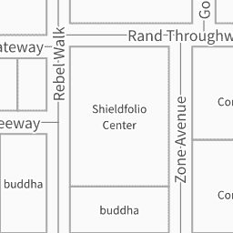</picture>](https://web.archive.org/web/20230118183007/https://dappradar.com/hub/assets/eth/0x79986af15539de2db9a5086382daeda917a9cf0c/102)

4 Rebel Walk – 22 October 2021 – 65 ETH / $267,640

[<picture>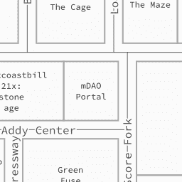</picture>](https://web.archive.org/web/20230118183007/https://dappradar.com/hub/assets/eth/0x79986af15539de2db9a5086382daeda917a9cf0c/10)

63 Addy Gardens – 23 February 2021 – 90 ETH / $131,480

## 无限轴

在[轴无限远](https://web.archive.org/web/20230118183007/https://dappradar.com/multichain/games/axie-infinity)的土地还没有效用。然而，游戏世界中心的创世之地是最罕见的。游戏世界外围的萨凡纳土地逻辑上是最便宜的。所有的土地都有相同的大小，但是假设土地的类型会影响它为未来的土地游戏产生的资源。

最昂贵的土地购买是:

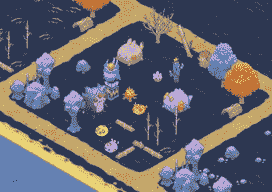

Genesis land – 24 November 2021 – 550 ETH / $2.33 million

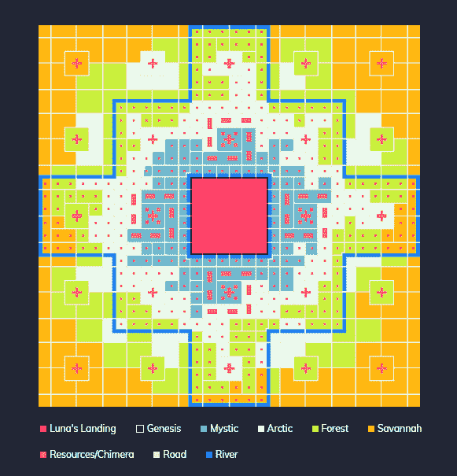

9 Genesis plots – 8 February 2021 – 888.25 ETH / $1.5 million

2x Genesis land – 8 July 2021 – 569 ETH / $1.29 million

每个虚拟世界都有自己的怪癖，在元宇宙投资的买家也有自己购买虚拟土地 NFT 的理由。然而，无论你看哪里，当你以高价购买元宇宙的某块土地时，位置是一个关键因素。这可能是因为步行交通或审美的原因。下周我们将关注元宇宙其他有趣的发展，[让我们知道你想了解什么！](https://web.archive.org/web/20230118183007/https://discord.gg/dappradar)

[<picture></picture>](https://web.archive.org/web/20230118183007/https://dappradar.com/ethereum/marketplaces/decentraland)[<picture></picture>](https://web.archive.org/web/20230118183007/https://dappradar.com/ethereum/marketplaces/the-sandbox-marketplace)[<picture></picture>](https://web.archive.org/web/20230118183007/https://dappradar.com/ethereum/games/somnium-space)