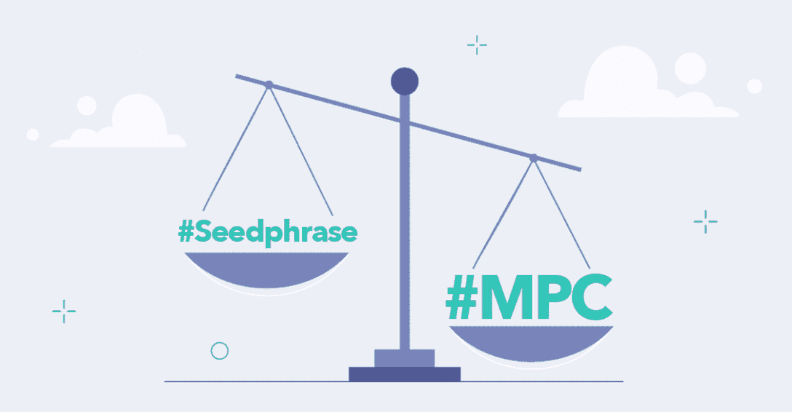
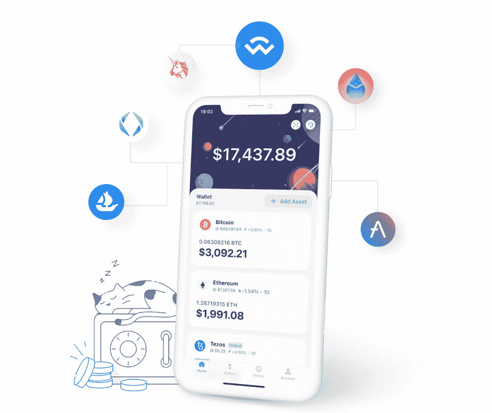

# MPC 钱包可能比硬件钱包更安全&这就是原因

> 原文：<https://web.archive.org/web/https://dappradar.com/blog/mpc-wallets-might-be-more-secure-than-hardware-ones-this-is-why>

## ZenGo 是一个链上加密钱包，由 MPC 驱动，而不是私钥

ZenGo 使用三因素认证系统和 MPC 技术为加密钱包用户提供最高级别的安全性。ZenGo 通过用两个独立创建的数学“秘密份额”替换标准私钥，消除了单点故障。此外，ZenGo 对那些通常发生在硬件钱包上的黑客攻击免疫。

**概要:**

*   硬件钱包无法将用户从黑客手中拯救出来:在过去十年中，由于糟糕的私钥管理，超过 1000 亿美元的比特币丢失或被盗！
*   ZenGo 是一款 [MPC 钱包](https://web.archive.org/web/20220930072219/https://zengo.com/mpc-wallet)，将加密安全提升到一个新的水平。
*   [ZenGo](https://web.archive.org/web/20220930072219/https://zengo.com/) 通过支持 [BTC](https://web.archive.org/web/20220930072219/https://dappradar.com/hub/token/eth/WBTC?from=0x2260fac5e5542a773aa44fbcfedf7c193bc2c599) 、 [ETH](https://web.archive.org/web/20220930072219/https://dappradar.com/hub/token/eth/ETH) 、Dogecoin、Tezos 和 70 多种其他加密资产，为用户带来多链加密体验。
*   此外， [ZenGo](https://web.archive.org/web/20220930072219/https://zengo.com/) 为用户提供了一个高度安全的网关，让他们可以通过 [DeFi](https://web.archive.org/web/20220930072219/https://dappradar.com/defi) 、 [NFT](https://web.archive.org/web/20220930072219/https://dappradar.com/nft) 和 [gaming](https://web.archive.org/web/20220930072219/https://dappradar.com/rankings/category/games) 访问他们喜爱的 dapps。
*   使用 [ZenGo](https://web.archive.org/web/20220930072219/https://zengo.com/) 连接到 [OpenSea](https://web.archive.org/web/20220930072219/https://dappradar.com/multichain/marketplaces/opensea) 、[沙盒](https://web.archive.org/web/20220930072219/https://dappradar.com/multichain/games/the-sandbox)、 [UniSwap](https://web.archive.org/web/20220930072219/https://dappradar.com/multichain/exchanges/uniswap-v3) 、 [Lido](https://web.archive.org/web/20220930072219/https://dappradar.com/multichain/defi/lido) 等等。

加密钱包是一个必要的工具。它们是用户进入区块链世界的门户，允许他们轻松存储和访问他们的加密资产，发送和接收比特币和以太坊等加密货币。

加密钱包有多种形式，从硬件钱包如 Ledger 和种子短语钱包如 MetaMask 到 MPC 钱包如 [ZenGo](https://web.archive.org/web/20220930072219/https://zengo.com/) 。通常，硬件钱包被认为相对更安全地存储加密货币，因为它们不太容易受到黑客攻击。

然而，这不一定是真的。今天的文章将解释为什么硬件钱包可能不是最安全的，而像 [ZenGo](https://web.archive.org/web/20220930072219/https://zengo.com/) 这样的 [MPC 加密钱包](https://web.archive.org/web/20220930072219/https://zengo.com/mpc-wallet)更值得信赖。

## 硬件钱包会遭遇黑客攻击吗？

虽然硬件钱包旨在保持私钥离线，使其无法被恶意软件攻击，但它们仍可能在几个方面面临风险。

其中一次黑客攻击是由于电源故障。这种攻击经常在短时间内使硬件电路板充满电力，使用户的设备处于损坏状态。然后，随着能量的冲击波，设备的电路变得混乱，使攻击者能够访问敏感信息。

另一种黑客攻击叫做旁道攻击。攻击者在执行交易时观察硬件钱包的行为。当设备碰到正确的引脚时，它们可以识别设备的噪声。换句话说，侧信道攻击者“监听”用户的设备以解码其 PIN。

由于硬件钱包是实体的，所以它们不能免除运输这一步。不幸的是，硬件钱包在运输过程中被篡改的情况时有发生，更不用说向用户发送钓鱼短信的假钱包了。

## MPC 钱包提供更高的安全性

MPC 密码术，也被称为多方计算，涉及到将传统的私钥分成几个单独的“份额”(例如， [ZenGo 的](https://web.archive.org/web/20220930072219/http://www.zengo.com/) MPC 钱包使用 2)。通过这种方式，钱包可以通过避免单点漏洞(私钥)来提供更高级别的安全性。

MPC 是一种被大型机构广泛使用的技术，为 Fireblocks 这样的公司提供托管。最近，比特币基地宣布他们正在为一个特定的应用子集建立一个 MPC 钱包。

## ZenGo 通过 MPC 为 Web3 用户提供了最高级别的安全性。

像用户熟悉的大多数加密货币钱包一样， [ZenGo](https://web.archive.org/web/20220930072219/http://www.zengo.com/) 提供对用户加密货币的链上访问。此外， [ZenGo](https://web.archive.org/web/20220930072219/http://www.zengo.com/) 钱包拥有全面的功能，可用于购买和出售 NFT、DeFi、博彩等。此外， [ZenGo](https://web.archive.org/web/20220930072219/http://www.zengo.com/) 也是多链的，支持比特币、以太、Tezos、Dogecoin 和 70 多种其他加密资产。

ZenGo 与其他钱包的不同之处在于其重大的安全创新。多亏了 MPC 驱动的 [ZenGo](https://web.archive.org/web/20220930072219/https://zengo.com/) ，用户不会丢失他们的私钥，因为没有密钥可以丢失。同时， [ZenGo](https://web.archive.org/web/20220930072219/https://zengo.com/) 在硬件钱包上没有上面提到的弊端。

除此之外， [ZenGo](https://web.archive.org/web/20220930072219/https://zengo.com/mpc-wallet) 使用加密的面部生物识别技术来确保用户在手机丢失或被盗时能够找回钱包。该功能是 [ZenGo 的](https://web.archive.org/web/20220930072219/https://zengo.com/)三因素认证的一部分，包括加密和私人存储的 3D 面部生物特征。

ZenGo 的这些强大功能最终确保了除了用户之外没有人能够窃取用户的加密资产，让用户高枕无忧。

你现在可以从[应用商店](https://web.archive.org/web/20220930072219/https://apps.apple.com/hk/app/zengo-crypto-bitcoin-wallet/id1440147115?l=en)和 [Google Play](https://web.archive.org/web/20220930072219/https://play.google.com/store/apps/details?id=com.zengo.wallet&shortlink=74480312&c=oth_zengo-website_android_button&pid=oth_zengo-website&af_channel=Other) 下载你的 [ZenGo](https://web.archive.org/web/20220930072219/https://zengo.com/) 钱包。

查找更多关于 ZenGo 的信息:

[网站](https://web.archive.org/web/20220930072219/https://zengo.com/)

[推特](https://web.archive.org/web/20220930072219/https://www.twitter.com/zengo)

[电报](https://web.archive.org/web/20220930072219/https://t.me/zengo)

[中等](https://web.archive.org/web/20220930072219/https://www.medium.com/zengo)

[Youtube](https://web.archive.org/web/20220930072219/https://youtube.com/zengo)

**免责声明** —这是一篇赞助文章。DappRadar 不认可本页面上的任何内容或产品。DappRadar 旨在提供准确的信息，但读者应该在采取行动之前总是自己做研究。DappRadar 的文章不能被认为是投资建议。