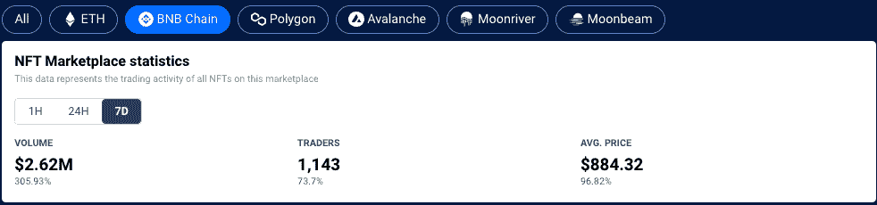
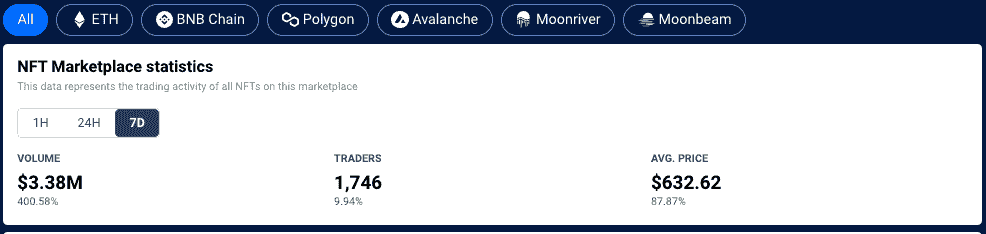
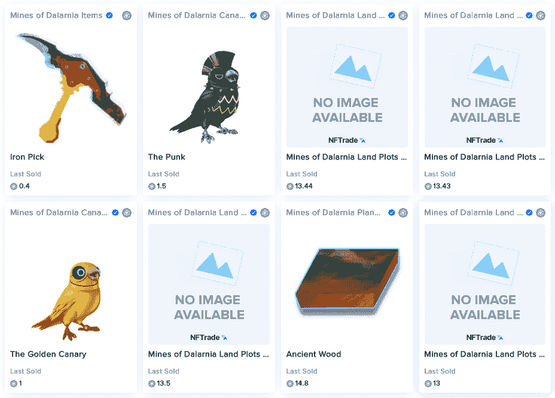
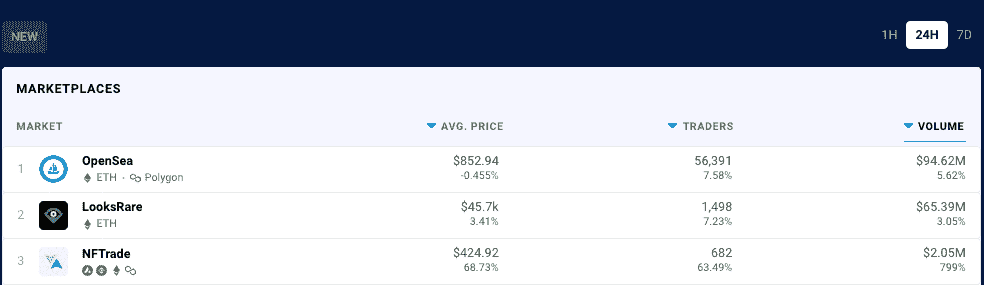

# 多链 NFT 市场 NFTrade 突破 200 万美元大关

> 原文：<https://web.archive.org/web/https://dappradar.com/blog/multichain-nft-marketplace-nftrade-breaks-2-million-barrier>

## 多连锁店 NFT 市场的兴起

数字收藏品聚合商和市场 NFTrade 的交易额突破了 200 万美元大关，这要归功于其本周在 BNB 连锁店的活跃程度。多链市场聚集了跨越六个以太坊、多边形和雪崩网络的 NFT，在 BNB 链上表现出最大的增长。

## 摘要

*   [NFTrade 突破了](https://web.archive.org/web/20220925225635/https://dappradar.com/multichain/marketplaces/nftrade)BNB 连锁店 200 万美元的交易量大关
*   达拉尼亚的地雷是主要的驱动力
*   [NFTrade 现已在 24 小时达普拉达 NFT 市场排名中名列第三](https://web.archive.org/web/20220925225635/https://dappradar.com/nft/marketplaces)

[NFTrade 是 NFT 市场](https://web.archive.org/web/20220925225635/https://dappradar.com/multichain/marketplaces/nftrade)的聚合器，托管来自六个区块链的 NFT，允许任何人创建、购买、销售、交换和经营 NFT。在过去的七天里，1，143 名交易者在 [BNB 链](https://web.archive.org/web/20220925225635/https://dappradar.com/rankings/protocol/binance-smart-chain)上与 NFTrade 互动，将交易量推高至超过 260 万美元。BNB 连锁店的交易者数量增加了 73%以上，使得该平台上 NFT 收藏品的平均价格上涨了 96%左右，截至发稿时不到 900 美元。

有趣的是，这 262 万美元代表了本周通过 NFTrade 流动的总[交易量的 77%以上，并显示了](https://web.archive.org/web/20220925225635/https://dappradar.com/multichain/marketplaces/nftrade) [BNB 连锁店](https://web.archive.org/web/20220925225635/https://dappradar.com/rankings/protocol/binance-smart-chain)的惊人增长，因为币安品牌网络开始在远离 [DeFi](https://web.archive.org/web/20220925225635/https://dappradar.com/rankings/protocol/binance-smart-chain/category/defi) 的类别中做出坚实的标记。

## 达拉纳的地雷在 bnb 链上发射

本周在 BNB 连锁店上抢购[NFT 的一个主要原因是](https://web.archive.org/web/20220925225635/https://dappradar.com/nft/protocol/binance-smart-chain)[在 4 月 26 日推出的【达拉尼亚矿山】](https://web.archive.org/web/20220925225635/https://twitter.com/MinesOfDalarnia/status/1510954083557036039)。通过查看 NFTrade 上最新售出的商品，这种相关性显而易见。最近出售的[大部分收藏品](https://web.archive.org/web/20220925225635/https://nftrade.com/marketplace?search=&sort=sold_desc)都是在达拉尼亚的[矿坑中可用的游戏内物品。](https://web.archive.org/web/20220925225635/https://dappradar.com/multichain/games/mines-of-dalarnia)

经过社区几个月的测试，达拉尼亚的 Mines 推出了它的“玩到赚”游戏，可以在 PC 上下载，并建立在 [BNB 链](https://web.archive.org/web/20220925225635/https://www.bsc.news/post/cryptonomics-beginners-handbook-to-bsc-defi)上。该游戏允许用户与 NFTs 和协议的本地 DAR 令牌进行交互。

达拉尼亚之矿允许玩家在其他玩家拥有土地的情况下，使用他们的化身来开采土地。土地是在土地销售活动中使用 DAR 代币获得的，每个代币都有不同的属性，如深度、坡向(生物群落)、资源、能量等级和地形。玩家开采土地以获得改善装备所需的资源，包括土地所有者保护其土地所需的土地改造胶囊。此外，土地所有者通过将他们的财产出租给玩家来产生收入。

[https://web.archive.org/web/20220925225635if_/https://www.youtube.com/embed/p_7gEKK89vE?feature=oembed](https://web.archive.org/web/20220925225635if_/https://www.youtube.com/embed/p_7gEKK89vE?feature=oembed)

这款游戏目前只能在个人电脑上玩。然而，GameFi 平台将很快推出移动应用程序。根据 Medium 博客 4 月 26 日的一篇文章，已经有计划在 2022 年推出 marketplace 和移动版本。

## 与大男孩相比

NFTrade 的表现使它的排名上升到了第一位，在 24 小时数据方面，它骄傲地排在了第一位，排在第二位的是第三位的 T2。这些数字远低于两个领先的市场，但在如此拥挤的市场中，NFTrade 的表现不容忽视。

## 多链 NFT 市场会产生影响吗？

像 NFTrade 一样， [OpenSea 也是多链的](/web/20220925225635/https://dappradar.com/blog/opensea-upgrade-throws-door-open-to-hackers/),在过去的 12 个月里，它欢迎 Polygon 和 Solana NFTs 进入其策划的市场。此外，领先的 NFT 市场[在 2022 年 4 月整合了 MoonPay](/web/20220925225635/https://dappradar.com/blog/moonpay-brings-easy-crypto-purchases-to-metamask/) ，使用户在竞争激烈时更容易购买 NFT。可以说，领导者们正准备在今年晚些时候收购预期中的比特币基地 NFT 市场，将用户加入作为其运营的核心。

此外，如果一个单独的游戏 dapp 可以在某一天达到如此高的数字，NFTtrade 今年可能会发现自己被推得更远，因为更多的游戏将在网络上推出，如 [Avalanche、BNB 链、Polygon、Moonriver 和 Moonbeam](https://web.archive.org/web/20220925225635/https://dappradar.com/rankings/category/games) 。

在 OpenSea 和 LooksRare 主要处理 NFT 高端销售的地方，NFTrade 似乎在追逐游戏中的 NFT 物品市场，那里的销售价值较低，但频率较高，因为玩家们争相超越彼此，爬上排行榜。随着人们发现区块链技术和[过剩的可用网络](https://web.archive.org/web/20220925225635/https://dappradar.com/rankings)，多链方法正在发挥作用。随着以太坊替代品的使用继续攀升，DappRadar 的最新区块链行为报告支持了这一说法。

 NewsletterUnsubscribe at any time. [T&Cs](https://web.archive.org/web/20220925225635/https://dappradar.com/terms) and [Privacy Policy](https://web.archive.org/web/20220925225635/https://dappradar.com/privacy-policy)

***以上不构成投资建议。此处给出的信息仅供参考。请行使尽职调查，做你的研究。作者持有多种加密货币的头寸，包括 BTC、瑞士法郎和雷达。***