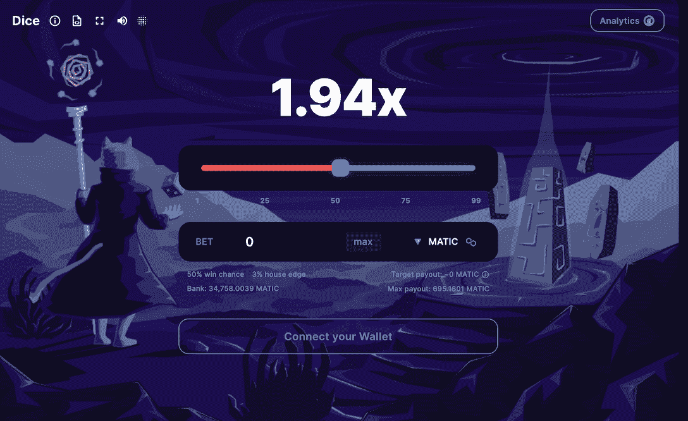
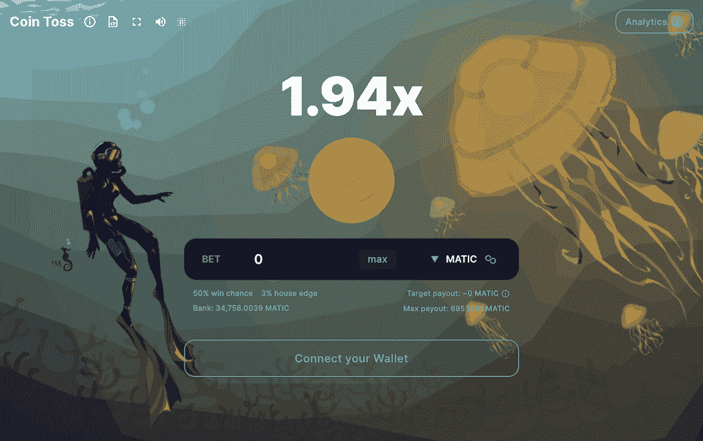
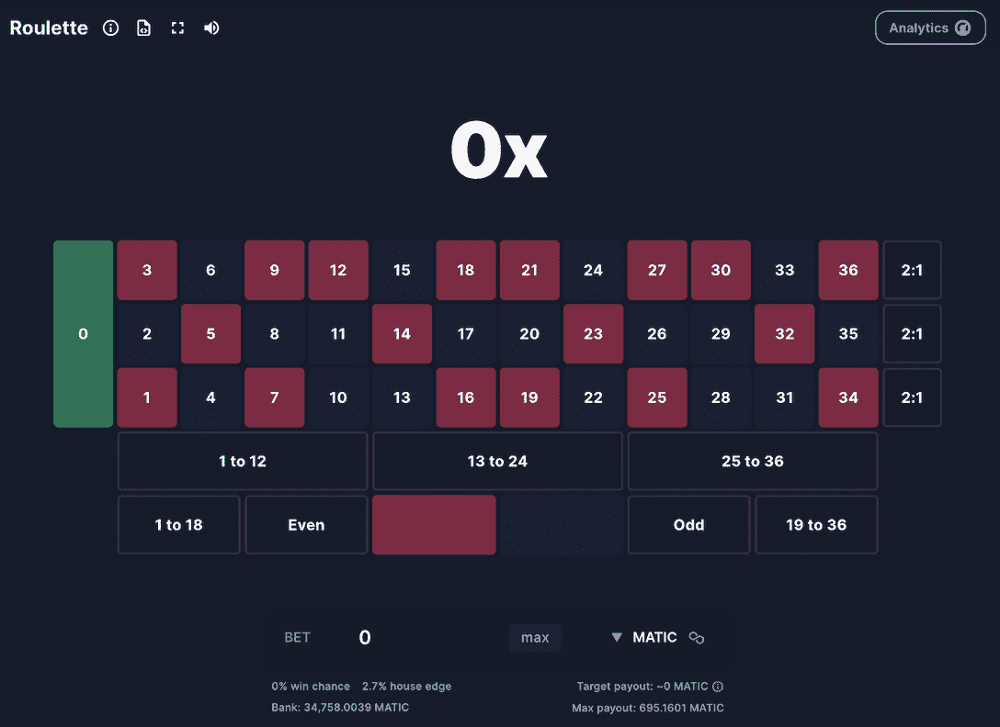
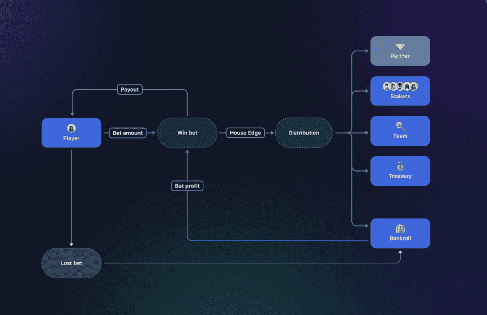

# 多链、透明和公平的加密赌场游戏

> 原文：<https://web.archive.org/web/https://dappradar.com/blog/multichain-transparent-and-fair-crypto-casino-games-with-betswirl>

## 在 BetSwirl 的分散式投注平台上探索多种游戏和代币选择

BetSwirl 是一个去中心化的匿名加密货币游戏平台，提供公平有趣的游戏体验。该平台支持多种游戏，包括掷骰子、掷硬币、轮盘赌和即将到来的 PvP 游戏。玩家可以使用他们选择的令牌轻松访问这些游戏。

## 内容

*   [什么是 BetSwirl](https://web.archive.org/web/20230307022111/https://dappradar.com/blog/multichain-transparent-and-fair-crypto-casino-games-with-betswirl/#what)
*   [近距离观察 BetSwril 上的游戏](https://web.archive.org/web/20230307022111/https://dappradar.com/blog/multichain-transparent-and-fair-crypto-casino-games-with-betswirl/#a)
*   [赌注呢？](https://web.archive.org/web/20230307022111/https://dappradar.com/blog/multichain-transparent-and-fair-crypto-casino-games-with-betswirl/#BETS)
*   BetSwirl 由一个透明协议支持
*   [加入 BetSwirl 有趣而安全的博彩世界](https://web.archive.org/web/20230307022111/https://dappradar.com/blog/multichain-transparent-and-fair-crypto-casino-games-with-betswirl/#join)

## 什么是贝茨维尔？

BetSwirl 是一个分散的、隐私优先的加密游戏平台，其中心是下注令牌，提供公平有趣的游戏体验。通过 BetSwirl，用户可以确定幸运或不幸是真正随机的，而不是由房子控制的。

[https://web.archive.org/web/20230307022111if_/https://www.youtube.com/embed/WcBuJ1gGg_U?feature=oembed](https://web.archive.org/web/20230307022111if_/https://www.youtube.com/embed/WcBuJ1gGg_U?feature=oembed)

该平台通过动画和声音效果带来了独特的互动游戏体验，并支持多种游戏，如骰子，硬币投掷，轮盘赌，以及很快推出的第一款 PvP 游戏俄罗斯轮盘赌和硬币投掷战。BetSwirl 使加密投注变得简单，因为玩家可以使用他们选择的令牌访问所有类型的游戏，包括 MATIC、BNB、AVAX、BETS 和合作伙伴提供的其他 ERC20 令牌。

他们的采用策略包括部署到占主导地位的 tvl(Polygon、Avalanche、BSC、Arbitrum)的前 8 家连锁店中的 4 家，并通过与当地社区的合作实现增长。最近的 Arbitrum 扩展让 BetSwirl 接触到了寻求流畅、快速和廉价的 L2 游戏体验的本地 Eth 用户。

作为一个分散的应用程序，BetSwirl 提供了透明性和可访问性。因此，您可以在 DappRadar 上轻松监控平台的关键指标，让您对游戏体验更有信心。

[View more stats about BetSwirl](https://web.archive.org/web/20230307022111/https://dappradar.com/multichain/gambling/betswirl)

## BetSwril 上游戏的近距离观察

### 骰子

骰子是一个简单的游戏，适合任何寻求快速刺激的人。在这个游戏中，你将掷出一个 100 面的骰子，并试着猜测幸运数字是否会高于你选择的数字。

要开始，只需选择 4 到 99 之间的一个数字，设置您的下注金额和代币，然后点击滚动按钮。它可以变得更加令人兴奋，因为玩家有可能通过点击 max 按钮获得更大的胜利。在你做决定之前，系统会给你显示计算出的银行能提供的最大金额。

[Play Dice now](https://web.archive.org/web/20230307022111/https://app.betswirl.com/dice?c=137&token=MATIC)

### 掷硬币

抛硬币是一个经典的游戏，你只需点击几下鼠标就可以玩。你所需要做的就是选择你认为幸运硬币是正面还是反面，设置你的下注金额和代币，然后点击翻转按钮，用你的钱包启动交易。然后，坐下来等几秒钟，看看你是否赢了。

[Play Coin Toss now](https://web.archive.org/web/20230307022111/https://app.betswirl.com/coin-toss?c=137&token=MATIC)

### 轮盘赌

BetSwirl 上的轮盘赌是一款经典的赌场游戏，采用了区块链技术，创造了真实安全的游戏体验。玩家可以对单个数字、各种数字组合(红或黑、奇数或偶数)下注，也可以对数字是高(19-36)还是低(1-18)下注。就像传统的轮盘赌一样，赢的钱会支付给下注成功的玩家。

[Play Roulette now](https://web.archive.org/web/20230307022111/https://app.betswirl.com/roulette?c=137&token=MATIC)

## 赌注呢？

### 有利可图的赌博

GambleFi 协议在 2023 年经历了爆炸式增长，一些公司的估值达到了 9 位数。大部分没有工作的产品，有的有产品却没有用户。然而在这里，BetSwirl 在其平台上已经有机地发展到超过 20，000 名玩家。这些玩家下注超过 600，000 次，价值超过 1，450 万美元。一家市值 340 万美元的初创公司创造了令人印象深刻的 45 万美元收入。贝特斯维尔可能会主导未来几个月的博彩业。

### 分享收入

持有人将押注于从 BetSwirl 的利润中分得一杯羹，并从其通缩机制中获益。

自 betswill 的游戏于 2022 年 2 月推出以来，他们已经积累了大量的赌注奖励(查看 betswill 上的分析页面)。这些将在 2023 年 Q2 奥运会的赌注项目中重新分配。用户可以选择单股下注，并以蓝筹股代币(MATIC、AVAX、BNB、ETH)赢得当前和未来的奖励。

下图显示了收入是如何分配给合作伙伴、股东、银行、财政部和团队的。

### 公用事业

BetSwirl 是一个社区驱动的平台，有多种激励、奖励和惊喜，由公用令牌赌注推动。

令牌以多种方式增强了 BetSwirl 平台的能力。

例如，玩家可以用它来玩游戏，并受益于一个减少的房子边缘！在轮盘赌上的赌注是 2.4%的赌场优势，而不是 2.7%，这使它成为赌博中最低的轮盘赌赌场优势！

此外，持有赌注赋予了用户投票和影响平台未来的权利。

## BetSwirl 由透明协议支持

透明度对于一个博彩平台至关重要，因为它可以建立玩家之间的信任，并确保公平竞争。为了实现更大的透明度，BetSwirl 开发了几个分析仪表板和工具，允许用户轻松跟踪项目的所有指标。

用户可以前往分析页面查看这些分析，其中使用了图形区块链技术。该图是一个分布式协议，用于索引和查询来自区块链的数据。BetSwirl 的团队使用该图构建了子图来索引他们的协议数据，使用户能够访问 BetSwirl 的许多分析见解。

[View the Analytics page on BetSwirl](https://web.archive.org/web/20230307022111/https://app.betswirl.com/analytics?c=137&token=MATIC)

## 加入 BetSwirl 有趣而安全的赌博世界

BetSwirl 努力做到分散、合法、安全和身临其境。该平台结合了最先进的技术来创建一个分散的应用程序。简单来说，就是尊重用户隐私，承诺不审查，把玩家的信任当作最高优先级。

BetSwirl 已经通过了必要的法律步骤，获得了开展在线博彩业务的授权，让玩家安心。该平台利用加密领域最安全的工具，所有合同都经过成功的审核，以确保最大的可靠性。

从长远来看，BetSwirl 专注于制作身临其境的游戏，为元宇宙游戏和社交赌博的未来铺平道路。

### 了解更多关于 BetSwirl 的信息

*   [网站](https://web.archive.org/web/20230307022111/https://www.betswirl.com/)
*   [推特](https://web.archive.org/web/20230307022111/https://twitter.com/betswirl)
*   [不和](https://web.archive.org/web/20230307022111/https://discord.gg/4BxtJV7fbZ)
*   [文档](https://web.archive.org/web/20230307022111/https://documentation.betswirl.com/)

**免责声明** —这是一篇赞助文章。DappRadar 不认可本页面上的任何内容或产品。DappRadar 旨在提供准确的信息，但读者应该在采取行动之前总是自己做研究。DappRadar 的文章不能被认为是投资建议。