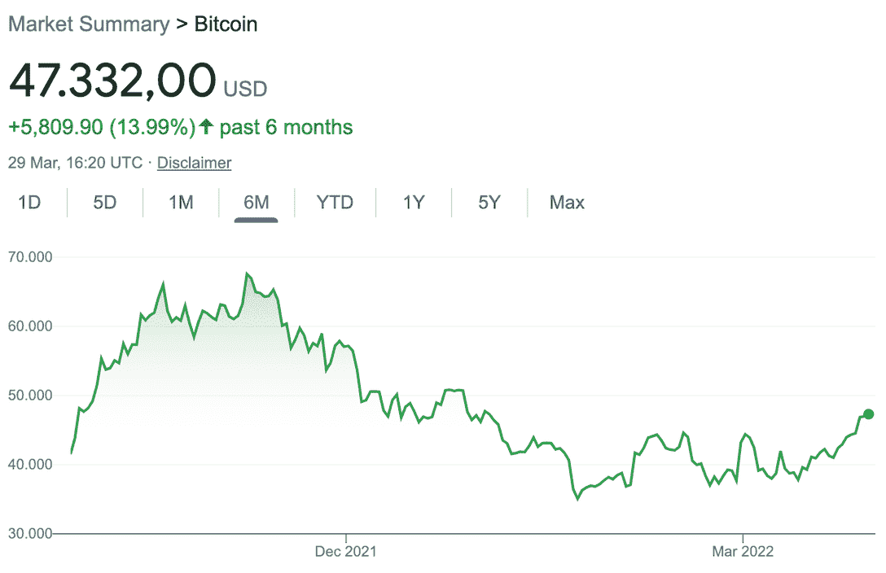
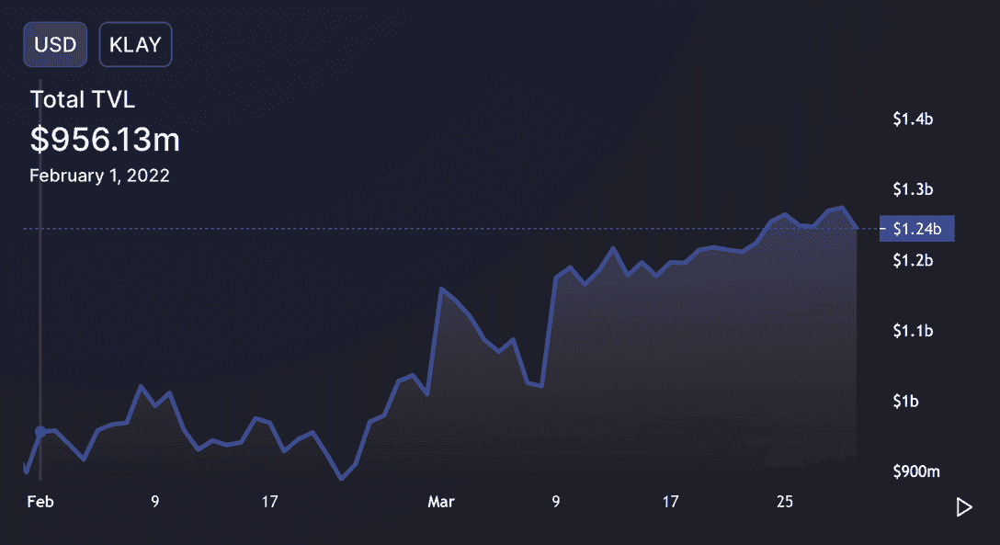
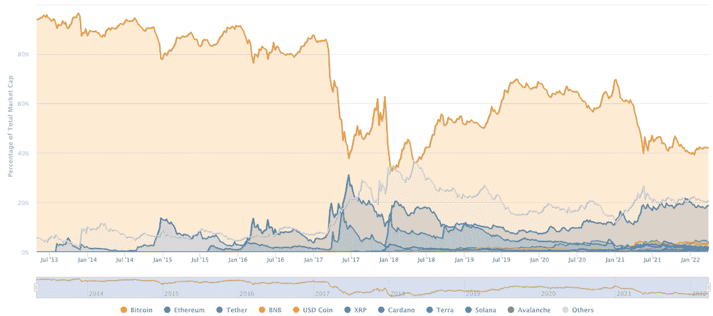
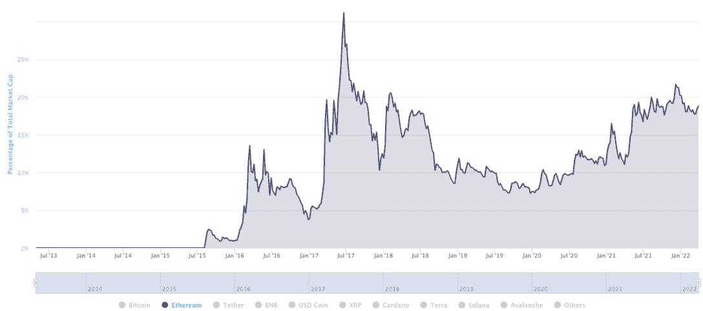
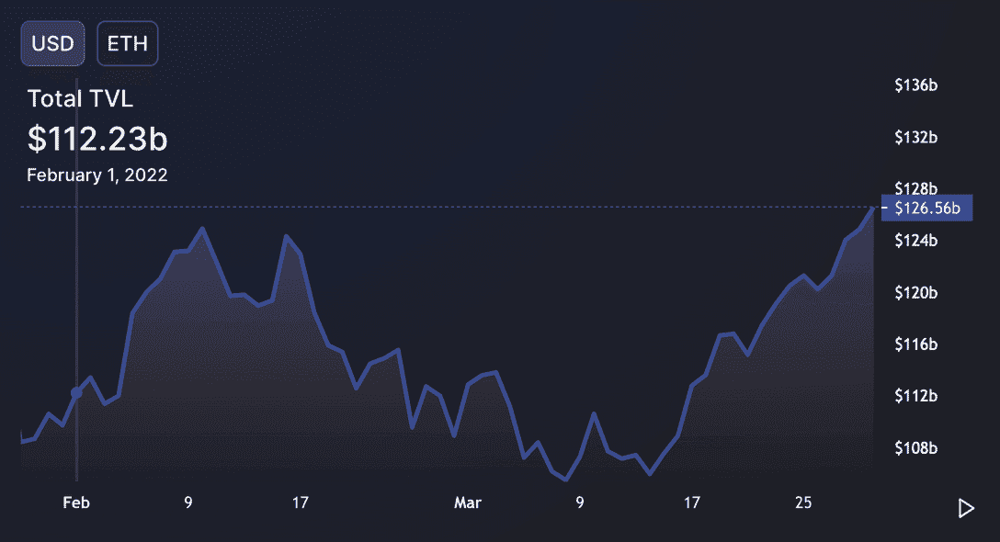

# 多重区块链促成了 DeFi 在 3 月份的上升

> 原文：<https://web.archive.org/web/https://dappradar.com/blog/multiple-blockchains-contribute-to-defis-rise-in-march>

## DeFi 正在复兴，但是绿芽正在陌生的地方发芽

DeFi 的回归不仅仅发生在区块链以太坊。另外，较新的区块链也导致了最近代币价格和锁定总价值的上升。在过去的 30 天里，Klaytn 和 Waves 的连锁活动展示了他们是如何帮助 DeFi 恢复的。然而，现在还不要放弃以太坊，因为区块链已经制定了完善的计划来保持其市场地位。

DeFi 再次上升。2021 年 11 月令人兴奋的日子似乎是很久以前的事了。但自从 1 月份比特币跌至 33，495 美元以来，现在似乎是庆祝 DeFi 领域发生的事情的时候了。

鉴于大多数代币都紧跟比特币设定的路径，下图显示了你需要知道的关于加密货币在过去六个月的价格走势的一切。对于持有人来说，年初是一个特别麻烦的时期，因为自 11 月初至 11 月中旬的峰值以来，我们看到的稳步下降在 1 月份急剧下降。

Bitcoin’s six-month performance

## 为什么价格会下降？

大玩家的获利回吐导致供应增加和价格下降。然后，缺乏经验的新交易员开始集体出售他们新获得的代币，因为波动的价格让他们意识到没有资产会永远上涨，他们的脚突然发痒。

高通胀的到来以及随后俄罗斯入侵乌克兰加剧了交易员的恐惧，很快 DeFi 就失去了吸引力。

然而在过去的一周里，绿色曲线在我们的图表上开始上升。人们想知道熊市是否已经结束，加密货币是否可以再次安全持有。对于任何一个在六个月前就拥有比特币基地账户的人来说，众所周知，区块链的资产有涨有跌。

但现在我们正处于一个相对收益更快乐的时期，看看支撑分散金融的平台和交易所，看看那里发生的事情与我们的 DeFi 钱包发生的事情有什么关系，这很有趣。

## 克莱顿·区块链为 DeFi 尽自己的一份力量

看看 DappRadar 的交易所排名页面，很难发现一种模式。在过去的 30 天里，没有一个区块链成为最近加密货币价格上涨的明显受益者。除了在 Klaytn 网络上运行的交易所，这些交易所在过去 30 天里都在上涨。

[Exchanges on Klaytn blockchain](https://web.archive.org/web/20221206162341/https://dappradar.com/rankings/protocol/klaytn/category/exchanges)

这里，[克莱斯瓦普](https://web.archive.org/web/20221206162341/https://dappradar.com/klaytn/exchanges/klayswap)和[帕拉](https://web.archive.org/web/20221206162341/https://dappradar.com/klaytn/exchanges/pala)分别上涨了 3.24%和 33.02%。 [Transit Swap](https://web.archive.org/web/20221206162341/https://dappradar.com/klaytn/exchanges/transit-swap) 是一个多链 DEX 聚合器，其中一个链是 Klaytn。过去一个月上涨了 138.18%。

用户数量的增加反映在 Klaytn 网络的锁定总价值(TVL)中。TVL 显示了存放在区块链上的加密货币的当前总价值，包括用于赌注、借贷和流动性池的所有硬币。这是我们拥有的网络实力的最佳指标之一。自 2 月 1 日以来，克莱滕的 TVL 从 9.56 亿美元上涨到 12.4 亿美元，涨幅为 29.5%。

Klaytn’s TVL since February 1st (DeFiLlama)

不幸的是，对于该网络的本地代币 KLAY 的持有者来说，其价格并没有跟随其 TVL 或其他加密货币的脚步。KLAY 自今年年初以来一直下跌，根据 Klaytn 的链上分析，其目前 1.22 美元的价格可能代表着一个良好的买入机会。

## 跨多个连锁店的交易所表现良好

与智能合约交互的唯一活跃钱包(UAW)在 30 天内大幅增长的其他主要交易所包括:

*   [中微子协议](https://web.archive.org/web/20221206162341/https://dappradar.com/waves/exchanges/neutrino-protocol)——UAW 上涨 58%，至 2740 点，当前余额为 33.4 亿美元。中微子协议在[波](https://web.archive.org/web/20221206162341/https://dappradar.com/rankings/protocol/waves)网上，在这里你可以了解更多关于[的信息。](https://web.archive.org/web/20221206162341/https://dappradar.com/blog/qa-waves-network)
*   UAW 股价上涨 83.02%，至 57，470 美元，目前余额为 5.7539 亿美元。KyberSwap 是一个充满活力的做市商，为多个连锁店的用户寻找最佳回报。
*   [陷入困境。金融](https://web.archive.org/web/20221206162341/https://dappradar.com/multichain/exchanges/bogged-finance) (UAW 上涨 66.2%)和[bloctswap](https://web.archive.org/web/20221206162341/https://dappradar.com/multichain/exchanges/bloctoswap)(UAW 上涨 10.76%)是过去一个月中获得更广泛受众的另外两家多链交易所。

我们在这里看到的似乎是更多的区块链对整个 DeFi 生态系统的贡献。与比特币和以太坊在过去十年的大部分时间里所承担的负载不同，更广泛的网络选择正在为加密货币的整体市值做出贡献。这增加了 DeFi 的安全性，因为它不再依赖一两个单独的硬币来将所有东西固定在一起。

10-year market cap share of various blockchains (CoinMarketCap)

但是，即使我们看到每年都有新的区块链推出，并承诺解决其他人不能解决的问题，以太坊仍然保持了它的地位。下图代表了以太坊自 2014 年推出以来的单个市场份额。我们可以看到，该网络的市场份额从 2020 年初的 7.5%稳步增长到今天的 19.8%。

Ethereum’s 10-year market cap share (CoinMarketCap)

## 不要对以太坊说再见

尽管天然气费用高昂，年轻的觊觎者觊觎其宝座，以太网仍然是衡量其他所有公司的区块链。这是因为它对许多其他与 web3、元宇宙、NFTs、游戏和 DeFi 相关的项目的成功至关重要。

很多成功而重要的 dapps 都是建立在以太坊之上的。硬币本身的市值超过 4000 亿美元。大量开发人员也花费了数年时间来构建侧链，以解决以太坊众所周知的问题。

随着如此多的人和公司投入金钱和时间来创造依赖以太坊的东西，网络突然失去其在群雄中的位置将需要一些真正的革命性的东西。

如果我们看看以太坊自 2 月初以来的 TVL，我们看不到该网络失去对市场控制的迹象。TVL 增长了 12.8%，从 1120 亿美元增长到 1265 亿美元。中间的下降表明，由于俄罗斯入侵乌克兰，厌恶风险的投资者取出资金，将其投入避风港。但随着信心在 3 月中旬回升，美元很快回流到区块链。

Ethereum’s TVL since February 1st (DeFiLlama)

除了本月所有加密货币的普遍上涨之外，以太坊的“[合并](https://web.archive.org/web/20221206162341/https://ethereum.org/en/upgrades/beacon-chain/)”尤其令人兴奋，这将导致区块链成为一个股权证明网络。一些评论人士认为，随着越来越多的机构投资者买入，比特币的市值甚至可能超过比特币。

如果这真的发生，如果以太坊进一步解决可扩展性、安全性和可持续性的问题，加密货币将会得到更多的主流接受。我们已经可以看到这一点，基于以太坊的平台 MetaMask 最近[宣布](https://web.archive.org/web/20221206162341/https://twitter.com/MetaMask/status/1508580273868353537)与 Visa 和 MasterCard 合作。[迪拜的一所私立学校甚至接受比特币和 ETH 支付学费](https://web.archive.org/web/20221206162341/https://thecryptobasic.com/2022/03/29/dubai-school-will-accept-tuition-fees-payment-in-bitcoin-btc-and-ethereum-eth/)。

如果这些迹象不能让怀疑者变成相信者，那么加密货币和区块链永远不会成为他们的东西。

## 理解链上活动

理解区块链的数据和趋势，以及生态系统的活动部分相互作用的方式是很困难的。如果你是加密货币的新手，一开始甚至连术语都很难掌握。

但对于任何投资区块链资产的人来说，至少拥有这些东西的基本知识是很重要的。这可能是赚取可观利润和在派对结束、灯光亮起时成为背黑锅的人的区别。

加密货币的美妙之处在于所有这些信息都在那里。区块链技术和智能合约是专门为了透明而设计的。虽然总有人会发现系统中的漏洞，但能够及早发现信号将帮助您避免大部分危险。

DappRadar 不断增长的工具列表旨在帮助您及时识别趋势并采取行动。我们的[排名页面](https://web.archive.org/web/20221206162341/https://dappradar.com/rankings)向你展示了区块链各行各业的风云人物。我们的[令牌浏览器](https://web.archive.org/web/20221206162341/https://dappradar.com/hub/tokens/ethereum/all/)可以告诉你加密货币目前的表现。[投资组合追踪器](https://web.archive.org/web/20221206162341/https://dappradar.com/hub/wallet/)会让你了解钱包里所有资产的当前价值。我们的 [DeFi](https://web.archive.org/web/20221206162341/https://dappradar.com/defi) 和 [NFT](https://web.archive.org/web/20221206162341/https://dappradar.com/nft) 页面是一站式商店，你可以实时跟踪他们的表现。

你也可以通过关注我们的[博客](https://web.archive.org/web/20221206162341/https://dappradar.com/blog/)来了解最新消息，并从我们的[推特](https://web.archive.org/web/20221206162341/https://twitter.com/DappRadar)获取即时信息。对于关于游戏、NFT 项目和新区块链的深入对话，我们在我们的 [Discord](https://web.archive.org/web/20221206162341/https://discord.com/invite/4ybbssrHkm) 服务器上定期举行对话。

DappRadar 是唯一一个将所有这些信息集中在一个地方的地方。随着我们的前进，我们将继续倾听我们的社区，并继续为我们的平台添加更多内容。

*本文不构成财务建议。我总是建议任何投资加密货币或 NFT 的人进行自己的研究，并在做出决定前仔细思考。*