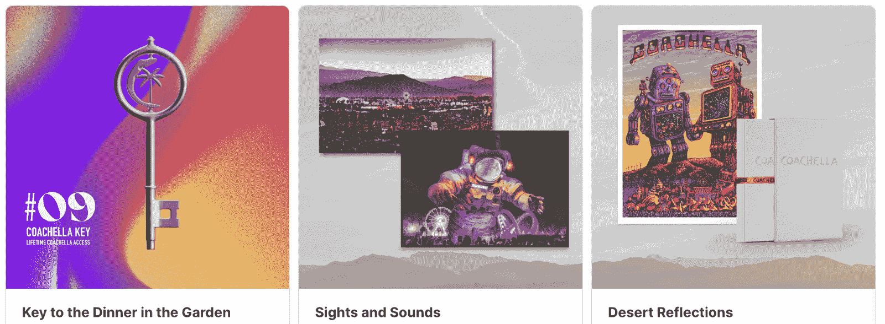

# 音乐节科切拉 NFT 收藏品发布于 2 月 4 日

> 原文：<https://web.archive.org/web/https://dappradar.com/blog/music-festival-coachella-nft-collectibles-launch-on-february-4th>

## NFT 收藏包括终身节日通行证和更多

科切拉音乐节宣布将于 2 月 4 日推出一系列 NFT 收藏品。在这些收藏品中，将有节日的终身通行证、独特的现场体验、实物和数字收藏品。

科切拉收藏品系列将分布在三个不同的收藏。其中最独特的是科切拉钥匙系列。它将以十个独特的 NFTs 为特色，让所有者可以终身参与该节日。此外，钥匙 NFTs 将解锁 2022 版的独特体验。其中包括科切拉舞台的正面和中心景观、终生狩猎露营或玫瑰园由专业厨师准备的晚餐。所有 10 个密钥 NFT 将在 2 月 4 日进行拍卖，拍卖将持续一周。

接下来是[沙漠倒影系列](https://web.archive.org/web/20221001121504/https://nft.coachella.com/marketplace)，将推出 1000 个版本。铸造其中一个 NFT 将使所有者获得 Emek 标志性的 Coachella 海报的十个独特的数字版本之一。每一个 NFT 都可以兑换一次 Coachella | The photos:1999-2019 的实体副本，这是一个超过 400 页的标志性摄影作品集，展示了电影节的粉丝、艺术和艺术家。

最后但并非最不重要的是，还有由 10，000 个版本组成的[视觉和声音集合](https://web.archive.org/web/20221001121504/https://nft.coachella.com/marketplace)。每一个 NFT 都有标志性的节日照片和从未听过的来自马球场的声景。此外，每张 NFT 可以兑换一张实物艺术照片。摄影师和装置艺术家从他们相关的 NFT 作品中获得销售提成。

## 茄果类真菌

除了将于 2 月 4 日上市的大量不同的 NFT，Coachella 还试图覆盖二次销售。官方节日网站体育 NFT 市场，收藏家将能够购买和上市后，官方造币厂科切拉收藏品。

重要的是，该节日还与加密交换 FTX 美国和索拉纳合作。交换将有助于促进 KYC 进程和身份验证。此外，[索拉纳·区块链](https://web.archive.org/web/20221001121504/https://dappradar.com/rankings/protocol/solana)将举办所有的 NFT。考虑到以太坊仍然是 NFTs 之王，选择索拉纳可能有点令人惊讶。然而，根据 Coachella 的说法，这一选择的动机是为了使收藏品系列更容易获得，更环保。

虽然科切拉正在采取大胆的步骤进入 NFT 空间，但球迷们仍然不愿意接受这个概念。当然，也有 NFT 的粉丝张开双臂拥抱这些新系列。然而，也有怀疑者，称这是一种营销噱头和 jpeg 销售。

目前还无法判断 Coachella 是否会成功地以如此广泛的方式整合非功能性测试。然而，努力是显而易见的，全球最大的音乐节之一已经坚定地进入了 NFT 空间。此外，这一举措将索拉纳定位为[以太坊](https://web.archive.org/web/20221001121504/https://dappradar.com/rankings/protocol/ethereum)的直接竞争对手，因为 NFT 将找到进入主流的道路。

DappRadar 将继续监测科切拉收藏品项目，因为它将于本周五下降。如果你想得到一辆终身 Coachella，请在 2 月 4 日前往官方市场。要想第一时间获得最新的 NFT 新闻，请在 [Twitter](https://web.archive.org/web/20221001121504/https://twitter.com/dappradar) 上关注 DappRadar。此外，你可以查看 [DappRadar PRO](https://web.archive.org/web/20221001121504/https://dappradar.com/token/pro) ，独家访问 [Discord](https://web.archive.org/web/20221001121504/https://discord.gg/4ybbssrHkm) 频道和 DappRadar 社区。

 NewsletterUnsubscribe at any time. [T&Cs](https://web.archive.org/web/20221001121504/https://dappradar.com/terms) and [Privacy Policy](https://web.archive.org/web/20221001121504/https://dappradar.com/privacy-policy)