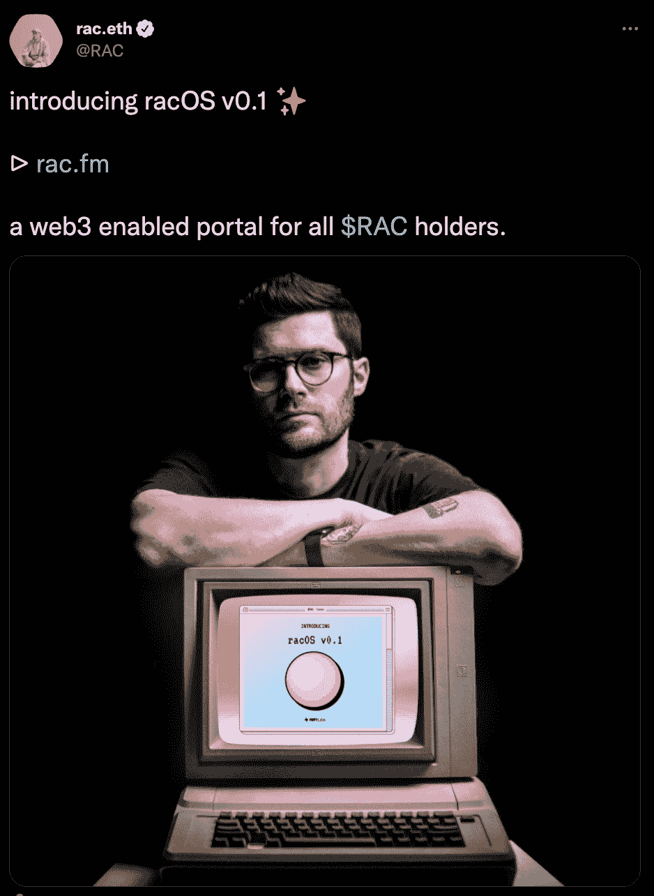

# 音乐在秘密世界中流动

> 原文：<https://web.archive.org/web/https://dappradar.com/blog/music-flows-through-the-crypto-world>

## DJ RAC 在分散地设立商店，Gala Games 推出音乐部门

虽然数字艺术作品一直以 NFTs 的形式存在，但慢慢地音乐也流向了 web3。元宇宙变得越来越大，更多的品牌加入了虚拟世界。因此，音乐制作人、DJ 和制作人也开始探索。本周几个重要的公告证实了音乐即将接管加密空间。

首先，DJ RAC 宣布他计划在分散地开店。这种向虚拟世界的转移是 RAC 努力为他的粉丝创造 web3 体验的一部分。RAC 的新 web3 项目叫做 racOS。它将允许歌迷通过虚拟世界提供的机会，以一种引人入胜的方式体验 DJ 的音乐。

为了完成 web3 体验，RAC 还推出了 [RAC 令牌](https://web.archive.org/web/20230103101605/https://dappradar.com/hub/token/eth/?from=0xc22b30e4cce6b78aaaadae91e44e73593929a3e9)。这是一个基于以太坊的令牌，将允许音乐迷支持该项目，并帮助建立 racOS 体验。随着项目的发展，RAC 令牌持有者将获得独家内容和各种其他特权。

除了 DJ RAC 进军分散化领域，区块链游戏开发商 Gala Games 也宣布推出以音乐为中心的部门。

## 节日音乐在聚光灯下流动

Gala Games 是区块链最著名的游戏开发商之一，而 Gala 的服务生态系统也在不断发展。在 Gala Labs，他们推出了 Vox avatar NFTs，现在 Gala Music 成为该团队的最新公告。该平台将使创作者和粉丝都能从音乐 NFTs 中获得回报。该平台提出了“听赚”的概念。它为音乐迷和创作者带来了一个新的娱乐时代。

“听赚”依赖于一种经过实践检验的方法。就像节日游戏的节点网络一样，节日音乐也将依赖于听众支持的节点。当艺术家通过平台推出 NFT 音乐时，Gala Music nodes 会记录下这首歌的每次播放，并向创作者和 NFT 的所有者奖励 GALA tokens。

重要的是，Gala Music 允许艺术家将他们的歌曲和专辑制作成 NFT，而没有标签或工作室的监督，完全去中心化。这就像 RAC 努力使他的音乐在 web3 空间中可访问一样，在加密和音乐行业中带来了一种新的趋势。虽然加密空间提供了前所未有的自由，但它仍然是音乐出版的未开发媒介。然而，随着大牌明星纷纷尝试这项技术，加密世界正成为许多艺术家、制作人和粉丝的第二故乡。

Gala Music 与 Snoop Dogg 的合作有了一个令人印象深刻的开始。这位说唱歌手通过 Gala Music 的新分散平台发布了他的全新专辑 B.O.D.R。这是将更多受欢迎的艺术家带入 web3 空间的重要一步。此外，在 NFT 和元宇宙非常活跃的史蒂夫·青木出席了音乐平台 Gala 的现场展示。

随着越来越多的音乐项目转向元宇宙提供的无穷无尽的机会，DappRadar 将继续关注 web3 空间。要了解 RAC 项目的更多信息，请访问官方网站。如果你对节日音乐节点感兴趣，可以看看他们的[关于页面](https://web.archive.org/web/20230103101605/https://music.gala.world/ecosystem)。在[的 Twitter](https://web.archive.org/web/20230103101605/https://twitter.com/dappradar) 上关注 DappRadar，首先了解最新的元宇宙新闻，并加入我们的 [Discord](https://web.archive.org/web/20230103101605/https://discord.gg/4ybbssrHkm) 频道，对 web3 的未来进行有趣的讨论。

 NewsletterUnsubscribe at any time. [T&Cs](https://web.archive.org/web/20230103101605/https://dappradar.com/terms) and [Privacy Policy](https://web.archive.org/web/20230103101605/https://dappradar.com/privacy-policy)