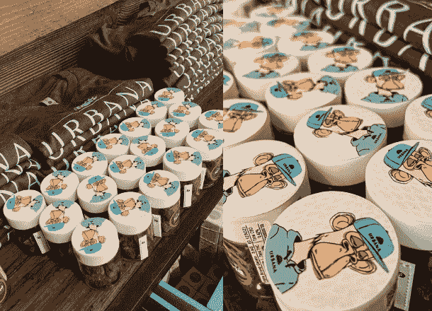

# 变异猿 NFT 领导新的大麻 Web3 品牌

> 原文：<https://web.archive.org/web/https://dappradar.com/blog/mutant-ape-nft-to-lead-new-cannabis-web3-brand>

## 农舍宣布与变异猿游艇俱乐部#30000 达成许可协议

**大麻上市公司 Farmhouse 本周宣布了一项合作计划，将为一个新的 web3 品牌项目获得 NFT(MAYC)变种人猿游艇俱乐部#30000 的形象。与 NFT“巨型机器人”的独家许可协议将为连接 MAYC 和 WeedClub 平台社区打开大门。**

又一个真实企业进入令人兴奋的分散应用程序世界的例子。

“我们与‘Mega Robot’的许可协议坚定地将农舍作为大麻品牌和 NFT 持有者的连接器。大麻品牌现在有机会授权一种最具标志性的突变猿类，并与 web3 中最负盛名的品牌之一建立联系，农舍餐厅首席执行官埃文·霍洛维茨在[官方新闻稿](https://web.archive.org/web/20230102012702/https://www.prnewswire.com/news-releases/farmhouse-announces-licensing-agreement-with-mutant-ape-yacht-club-30000-301607852.html)中说。

## 农家的网络之旅 3

这并不是农家第一次体验 NFTs。美国大麻行业的农场部门和 B2B 网络 WeedClub 从 6 月份开始收集交易。

根据公关，他们的授权组合包括[无聊猿游艇俱乐部](https://web.archive.org/web/20230102012702/https://dappradar.com/hub/nft-explorer/collection/bored-ape-yacht-club)、[变异猿游艇俱乐部](https://web.archive.org/web/20230102012702/https://dappradar.com/hub/nft-explorer/collection/mutant-ape-yacht-club)、[隐朋克](https://web.archive.org/web/20230102012702/https://dappradar.com/hub/nft-explorer/collection/cryptopunks)、[涂鸦](https://web.archive.org/web/20230102012702/https://dappradar.com/hub/nft-explorer/collection/doodles-official)等等。

该公司已经将其无聊猿放在多种大麻产品以及现实生活和虚拟活动中。

[Source: @420 Twitter account](https://web.archive.org/web/20230102012702/https://twitter.com/420)

这一最新公告还透露，该公司正在研究奖励任何从一开始就支持他们项目的人的新方法。

> 现在我们可以进一步扩展这个 w/ [@Mr_Robot_v1](https://web.archive.org/web/20230102012702/https://twitter.com/Mr_Robot_v1?ref_src=twsrc%5Etfw) 的 web3 专长
> 
> 🤝将 web3 价值观融入我们的 NFT 许可部门
> 👀探索奖励早期支持者的创新方式&参与者
> 🚀建立知识产权许可生态系统，为 NFT 持有者创造机会
> 
> — 420 (@420) [August 18, 2022](https://web.archive.org/web/20230102012702/https://twitter.com/420/status/1560347868115787776?ref_src=twsrc%5Etfw)

正如 Twitter 帖子所指出的，一旦许可部门还处于早期，该项目将在向公众开放之前与一小批持有人合作。

## 变异猿游艇俱乐部 NFT 版权政策

正如其成功的前身 BAYC 在《变种人类人猿》系列中一样，NFT 的所有者拥有以各种身份使用数字艺术的许可。

如果你拥有一家 MAYC NFT，你可以随心所欲地利用它的财产，只要不损害项目的条款和条件。

因此，无论是在产品印刷、歌曲还是视频剪辑中，“巨型机器人”的所有者都可以自由地与农舍合作，并为自己的利益使用他的投资。

*   **进一步阅读** : [所有权和版权如何为非功能性森林公园服务？](https://web.archive.org/web/20230102012702/https://dappradar.com/blog/how-do-ownership-and-copyright-work-for-nft)

## 使用 DappRadar 继续跟踪您最喜爱的 NFT

如果你想了解最新的 [BAYC](https://web.archive.org/web/20230102012702/https://dappradar.com/hub/nft-explorer/collection/bored-ape-yacht-club) 和 [MAYC](https://web.archive.org/web/20230102012702/https://dappradar.com/hub/nft-explorer/collection/mutant-ape-yacht-club) NFTs 的市场数据，你必须探索我们的 [NFT 收藏浏览器](https://web.archive.org/web/20230102012702/https://dappradar.com/hub/nft-explorer)工具。

[https://web.archive.org/web/20230102012702if_/https://www.youtube.com/embed/fkEaXYLOW-s?feature=oembed](https://web.archive.org/web/20230102012702if_/https://www.youtube.com/embed/fkEaXYLOW-s?feature=oembed)

此外，达普拉达将继续关注 NFT 空间的最新消息。请确保关注我们的[博客](https://web.archive.org/web/20230102012702/https://dappradar.com/blog/)、 [Youtube](https://web.archive.org/web/20230102012702/https://www.youtube.com/c/DappRadar) 频道和官方 [Twitter](https://web.archive.org/web/20230102012702/https://twitter.com/DappRadar) 账户，以获取教育内容&最热门的趋势。

***以上不构成投资建议。此处给出的信息仅供参考。请尽职调查并自行研究。***

 NewsletterUnsubscribe at any time. [T&Cs](https://web.archive.org/web/20230102012702/https://dappradar.com/terms) and [Privacy Policy](https://web.archive.org/web/20230102012702/https://dappradar.com/privacy-policy)