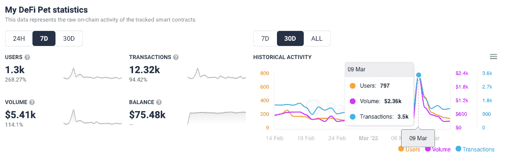
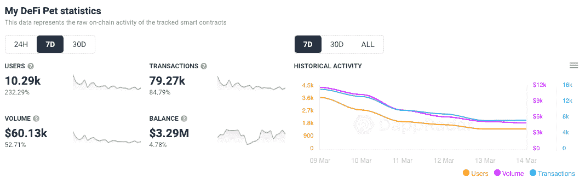
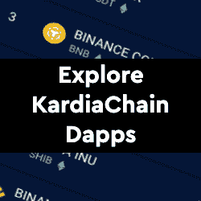
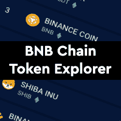

# 我的 DeFi 宠物得到 KardiaChain 用户助推器

> 原文：<https://web.archive.org/web/https://dappradar.com/blog/my-defi-pet-gets-kardiachain-user-booster>

## 过去 7 天，KardiaChain 上的活跃用户增加了 268%

《我的迪菲宠物》是一款从玩到赚的游戏，最初于 2021 年 4 月在 BNB 链上推出，本周在卡尔迪亚链上获得了极大的关注。随着 3 月 9 日 DPET 代币被投入到卡尔迪亚链用户的钱包中，NFT 灌输的育种和战斗游戏每天吸引大约 100 个钱包。

[DPET 空投公告](https://web.archive.org/web/20221007153654/https://twitter.com/MyDeFiPet/status/1501484410377424897)收到了预期的效果，连接到我的 DeFi 宠物的钱包从 3 月 8 日的 120 个增加到 3 月 9 日的近 800 个，第二天下降到不到 500 个。重要的是 [Boss Fight 第七季](https://web.archive.org/web/20221007153654/https://twitter.com/MyDeFiPet/status/1501541793615155200)于 3 月 10 日开播，以保持玩家参与并说服用户逗留更长时间。

[看着我的 DeFi 宠物隔着两个区块链](https://web.archive.org/web/20221007153654/https://dappradar.com/kardiachain/games/my-defi-pet)，它从，看着玩家分裂很有趣。在过去的 7 天里，连接到我的 DeFi 宠物的钱包总数为 10，290 个。然而，其中的 1300 人，或者说大约 12%是通过 KardiaChain。

自从 BSC 在 DeFi 和 yield 农业领域崭露头角以来，它一直是区块链顶级生态系统之一。凭借 PancakeSwap，区块链拥有整个行业最活跃的 dapp。与此同时，KardiaChain 是一个新来者，在更广泛的区块链生态系统中开辟了自己的位置。因此，有趣的是看到 KardiaChain 已经负责了我的 DeFi Pet 上超过 10%的所有活动。也许他们的空投将为在 Web3 中进行营销的新方式树立一个标志。

## KardiaChain dapps 在 DappRadar 上

DappRadar 在 KardiaChain 上跟踪八个 dapps，涵盖各种类别，包括 DeFi、游戏和 NFT。 [Kaimond](https://web.archive.org/web/20221007153654/https://dappradar.com/kardiachain/defi/kaimond) 是网络上领先的 dapp，为 DeFi 社区提供在 KardiaChain 上交换代币等服务。包括获得由 KardiaChain 孵化的项目的私人分配令牌的特权，如我的 DeFi Pet，以及更多即将到来的项目。

追凯蒙德的是 [BecoSwap](https://web.archive.org/web/20221007153654/https://dappradar.com/kardiachain/defi/becoswap) ，和领袖有类似的手感和报价。 [Kephi Gallery](https://web.archive.org/web/20221007153654/https://dappradar.com/kardiachain/marketplaces/kephi-gallery) 是 KardiaChain 的本土 NFT 市场，来自不同学科的艺术家可以在这里聚会，分享他们的作品并将其货币化。同时， [Zorba X](https://web.archive.org/web/20221007153654/https://dappradar.com/kardiachain/collectibles/zorba-x) 是目前唯一一个卡尔迪亚链本土的 NFT 系列。

## 我的定义是什么？

我的 DeFi 宠物是一个虚拟的宠物饲养游戏，结合了育种和 DeFi 机制。游戏中的活动是分开的，这样玩家可以通过季节和事件或者通过游戏的交易、排名和社交功能获得奖励。

[<picture></picture>](https://web.archive.org/web/20221007153654/https://dappradar.com/rankings/protocol/kardiachain)[<picture></picture>](https://web.archive.org/web/20221007153654/https://dappradar.com/kardiachain/games/my-defi-pet)[<picture></picture>](https://web.archive.org/web/20221007153654/https://dappradar.com/hub/tokens/bsc/all/1)

***以上不构成投资建议。此处给出的信息仅供参考。请行使尽职调查，做你的研究。作者持有多种加密货币的头寸，包括 BTC、ETH 和 RADAR。***