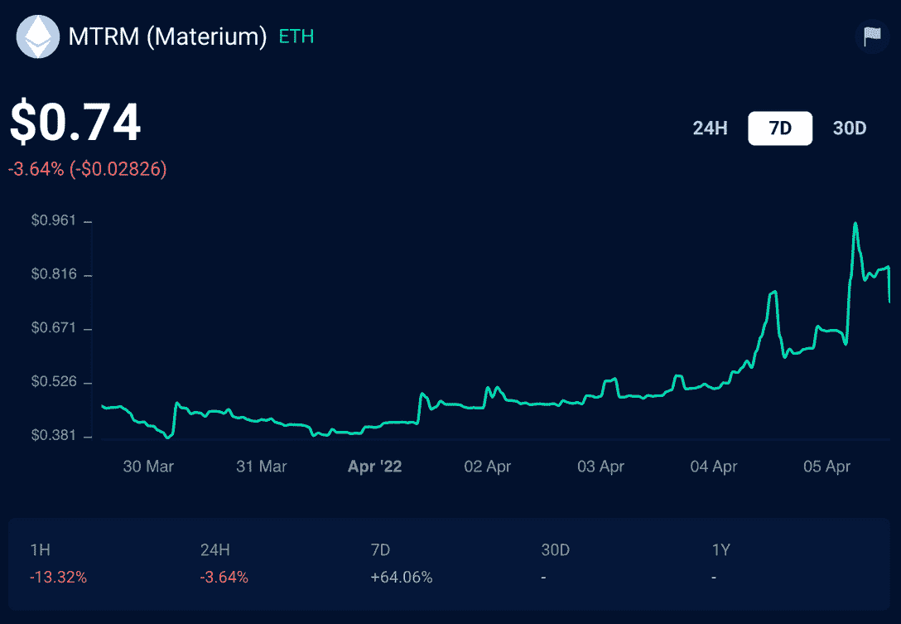
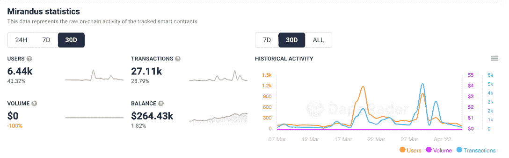

# 在效用的预期下，本地米兰多斯代币暴涨 100%

> 原文：<https://web.archive.org/web/https://dappradar.com/blog/native-mirandus-token-booms-100-in-anticipation-of-utility>

## Materium 在早期空投和对未来公用事业和金融机会的预期后价值增加

Gala Games 的米兰多斯社区屏住呼吸，期待新的流动性池和 MTRM 代币的进一步功能，过去几天，其价值翻了一番。Gala Games 特许经营权米兰多斯在 3 月份向忠诚的社区成员空投了新的本地令牌。

## 摘要

*   [***【米兰杜斯】***](https://web.archive.org/web/20221007093415/https://dappradar.com/ethereum/games/mirandus) ***是*** [***春晚游戏***](https://web.archive.org/web/20221007093415/https://dappradar.com/blog/tag/gala-games) ***稳定*** 中的一个玩赚头衔
*   [***DappRadar Token Explorer 显示 MTRM token 价格暴涨 100%***](https://web.archive.org/web/20221007093415/https://dappradar.com/hub/token/eth/MTRM?from=0xcd17fa52528f37facb3028688e62ec82d9417581)
*   [***都在炒作些什么？***](https://web.archive.org/web/20221007093415/http://the-hype/)

## 什么是米兰多斯？

米兰多斯是一个总部设在区块链的玩赚 MMORPG。这款游戏雄心勃勃，试图让玩家尽可能多地控制这个平台。从游戏商店到整个城市，用户是米兰多斯经济平稳运行的真正负责人。

游戏玩家控制他们的虚拟角色与怪物战斗，并搜索可穿戴资产。但他们也可以沉浸在一个全面的虚拟经济中，而不必去对付食人魔和进行剑斗。

持有一块具有重要战略意义的土地，可以让土地所有者从经过他们地块的繁忙交通中获利。他们可以向路人出售商品，或者成为玩家拥有的城市的一部分。在陆地上建造是米兰多斯世界的重要组成部分。做这件事要花钱，但回报可能会很大。

Screenshot from the game

把米兰多斯想象成一个网络世界，就像沙盒世界、T2 分散世界和 T4 NFT 世界一样。但是在元宇宙的这个角落，居民们还可以进行奇幻冒险，与神话人物战斗。

到目前为止，Gala Games 已经对其社区成员进行了两次压力测试，但这些测试都不代表一款接近完成的产品。人们仍然怀疑 alpha 版本是否能在年底前准备好。

## 游戏中的令牌 MTRM 在七天内激增

在过去的一周里，米兰多斯的本土代币 Materium (MTRM)价格飙升；今天早些时候，该指数一度上涨约 100%，达到 0.96 美元的高点。此后，价格回落，七天涨幅达到 64%。不过，截至本文撰写之时，这一价格已从一周前的 0.47 美元升至 0.74 美元。

与 Gala Games stable 中的所有专营权一样，玩家不能直接从公司购买 Materium。相反，玩家通过参与游戏中的测试或执行任务来获得令牌。Gala Games 于 2021 年 11 月第一次戏弄了 Materium，但直到 3 月份用户才最终接触到它。

该令牌在米兰多斯生态系统中有几个用途:

*   它可以愈合伤口，恢复精力。
*   它增加了力量、速度和耐力等玩家属性。
*   玩家可以用它来施法。
*   它可以作为制作食谱时缺少的配料的替代品。
*   玩家可以用它在游戏中传送。

[MTRM on DappRadar’s Token Explorer](https://web.archive.org/web/20221007093415/https://dappradar.com/hub/token/eth/MTRM?from=0xcd17fa52528f37facb3028688e62ec82d9417581)

在最近的代币价格上涨之前，米兰度的整体连锁活动有所上升。如果我们查看游戏前 30 天的分析，我们可以看到不同领域的多个峰值。

*   用户，即与平台智能合约互动的唯一活跃钱包，增长了 43%，达到 6，440 人。
*   该平台的交易量上升了 29%。从 21，049 美元涨到了 27，110 美元。

[DappRadar’s 30-day on-chain activity for Mirandus](https://web.archive.org/web/20221007093415/https://dappradar.com/ethereum/games/mirandus)

## 为什么炒作？

这一切都归结于 Gala Games 在其生态系统内推出硬币的方式。如前所述，用户不能直接从公司购买硬币。在这种情况下，玩家因做两件事而获得物质奖励。

第一个手里拿着一个叫做样本的强大的米兰多斯化身。他们必须在 2021 年 12 月 12 日把这个放在钱包里。第二次是在 12 月 13 日到 1 月 3 日之间参加米兰多斯游戏测试。

上个月，2021 年 3 月，Gala Games 终于开始向满足这两个条件的玩家分发材料。由于有足够多的人拥有硬币，流动性池已经涌现。这种代币的激增和更广泛的受众开始交易代币似乎只是时间问题。

物质的相对稀缺和 Gala Games 特许经营权的流行意味着这枚硬币的价值很有可能继续上涨，至少在短期内是如此。但米兰多斯游戏的成功和受欢迎程度将是这枚硬币长期价值背后的最终驱动力。

要了解这个故事的最新进展，请关注 DappRadar [博客](https://web.archive.org/web/20221007093415/https://dappradar.com/blog/)。你可以使用我们的令牌浏览器来跟踪[材料的价值。而且你可以通过检查它的](https://web.archive.org/web/20221007093415/https://dappradar.com/hub/token/eth/MTRM?from=0xcd17fa52528f37facb3028688e62ec82d9417581)[链上活动](https://web.archive.org/web/20221007093415/https://dappradar.com/ethereum/games/mirandus)和查看它在 [DappRadar 的排名页面](https://web.archive.org/web/20221007093415/https://dappradar.com/rankings/protocol/ethereum/category/games/1)中的位置来看米兰多斯是否保持它的受欢迎程度。