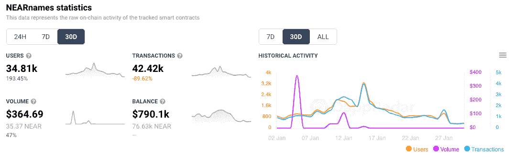
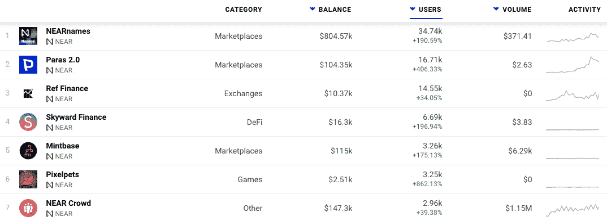
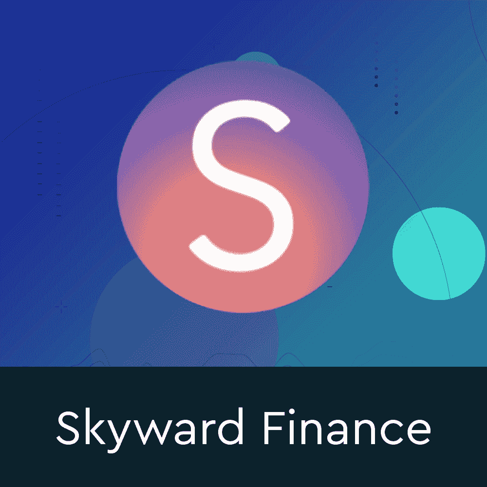

# 近名看到一月激增

> 原文：<https://web.archive.org/web/https://dappradar.com/blog/near-names-sees-surge-in-january>

## 随着一些公司保住了自己的份额，Web3 的采用达到了顶峰

NEAR Names 是一种协议，允许在 NEAR 钱包中有令牌的用户创建和赠送 web3 钱包名称，自 1 月初以来，人们对该协议的兴趣激增。随着崇拜者和更精明的用户寻求保护自己的网络 3，钱包地址已经成为一种流行的标识符和简化 NEAR 上数字资产转移的方式。

NEAR Names 平台的简单前提是允许用户在区块链附近为朋友和家人申请一个名字。比如 kaned.near 或者 cryptogiant.near，目的当然是让那些[熟悉 NEAR](/web/20221127144506/https://dappradar.com/blog/what-is-near-a-simple-explanation/) 的人向网络介绍人，同时扩大知名度和使用量。此外，那些在他们的 NEAR 钱包中有代币的人可以简单地登录以给出一个独特的 NEAR 账户的礼物。

在撰写本文时， [NEAR Names 已经见证了超过 190%的钱包](https://web.archive.org/web/20221127144506/https://dappradar.com/near/marketplaces/nearnames)连接到该平台，在过去 30 天内超过 34，500。

## 附近的 Dapps 得到注意

近似名字的工作方式与参考或附属系统没有什么不同，最终越多的人创建和给出名字，用户群就可能增长得越大。简而言之，NEAR Names 平台的增长表明，现在有更多的人持有 NEAR wallets 和 NEAR web3 名称。他们给了它们进一步的动力去探索附近的 dapp 生态系统。

该平台似乎取得了预期的效果，因为 NEAR 上排名前七的 dapps 在过去 30 天里都经历了显著的用户增长。引人注目的是，我们看到 [NFT 市场段落](https://web.archive.org/web/20221127144506/https://dappradar.com/near/marketplaces/paras-2-0)连接到他们平台的活跃钱包增长了 400%以上，而该网络的第一个 GameFi 产品 [PixelPets 正在快速攀升](https://web.archive.org/web/20221127144506/https://dappradar.com/near/games/pixelpets)。

## 近

在撰写本文时，NEAR 锁定的总价值超过 9200 万美元，表明 NEAR 的 DeFi 和财务 dapps 取得了初步成功。与此同时，透过独特的活动钱包的镜头，可以看到 dapps 在用户活动方面的增长。有争议的是，在这些新生阶段，这是一个更准确的发现标准。更重要的是，随着 DeFi dapps 在 BSC 和 Polygon 等[网络上的应用似乎正在经历使用率的下降，NEAR 正在寻找牵引力。](/web/20221127144506/https://dappradar.com/blog/drip-defi-doubles-user-base-in-shadow-of-bsc-giants/)

[NEAR 平台](https://web.archive.org/web/20221127144506/https://dappradar.com/rankings/protocol/near)可以存储独特的数字资产，例如，从包装 BTC 等其他链桥接的令牌或在 NEAR 平台上创建的令牌。与现实世界中的固定资产(如美元)挂钩的稳定硬币可用于支付近距离应用程序上的商品和服务。

与令牌类似，不可替换的令牌或 NFT(从游戏中的收藏品和密码艺术到现实世界资产的表示)可以使用 NEAR 进行存储，更重要的是，可以使用 NEAR 进行移动。鉴于 2022 年围绕 NFT 注入游戏和元宇宙的兴趣持续高涨，NFT 和游戏生态系统的扩张肯定会有回报。

[<picture></picture>](https://web.archive.org/web/20221127144506/https://dappradar.com/near/defi/skyward-finance)[<picture></picture>](https://web.archive.org/web/20221127144506/https://dappradar.com/near/marketplaces/nearnames)[<picture></picture>](https://web.archive.org/web/20221127144506/https://dappradar.com/near/other/near-crowd)

***以上不构成投资建议。此处给出的信息仅供参考。请行使尽职调查，做你的研究。作者持有 ETH、BTC、AGIX、HEX、LINK、GRT、CRO、OMI、不可变 X、GALA、AVASTR、GMEE、CUBE、RADAR、FLOW、FTM、BNB、SPS、WRLD、ATOM 和 ADA。***