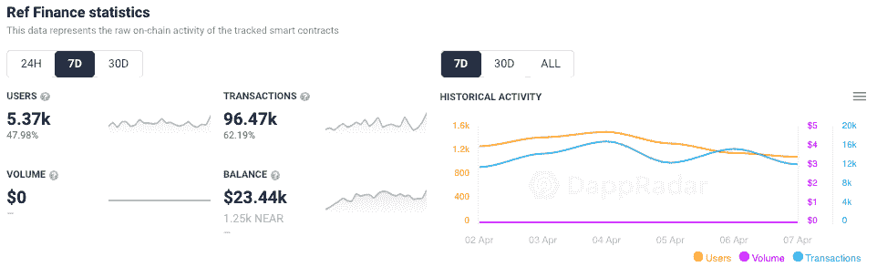
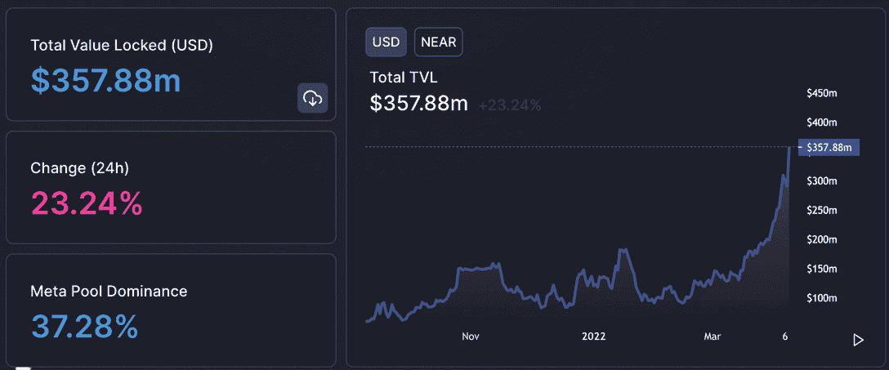
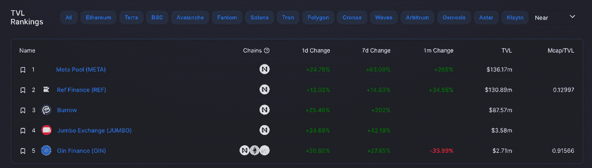
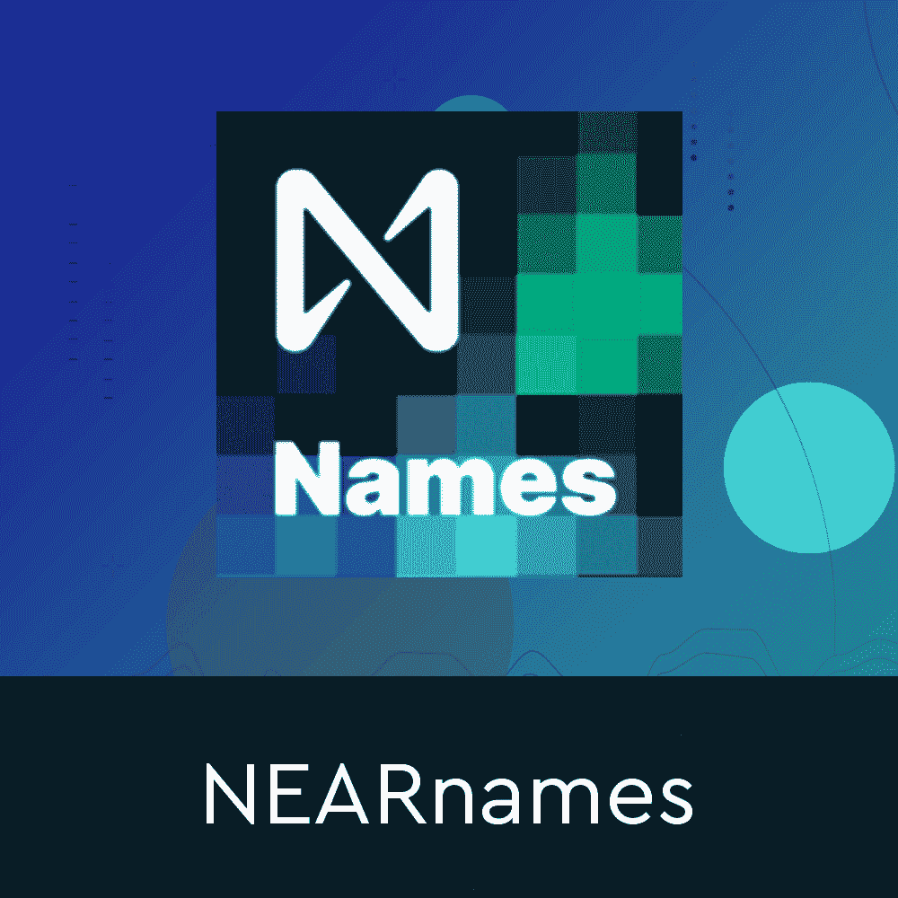
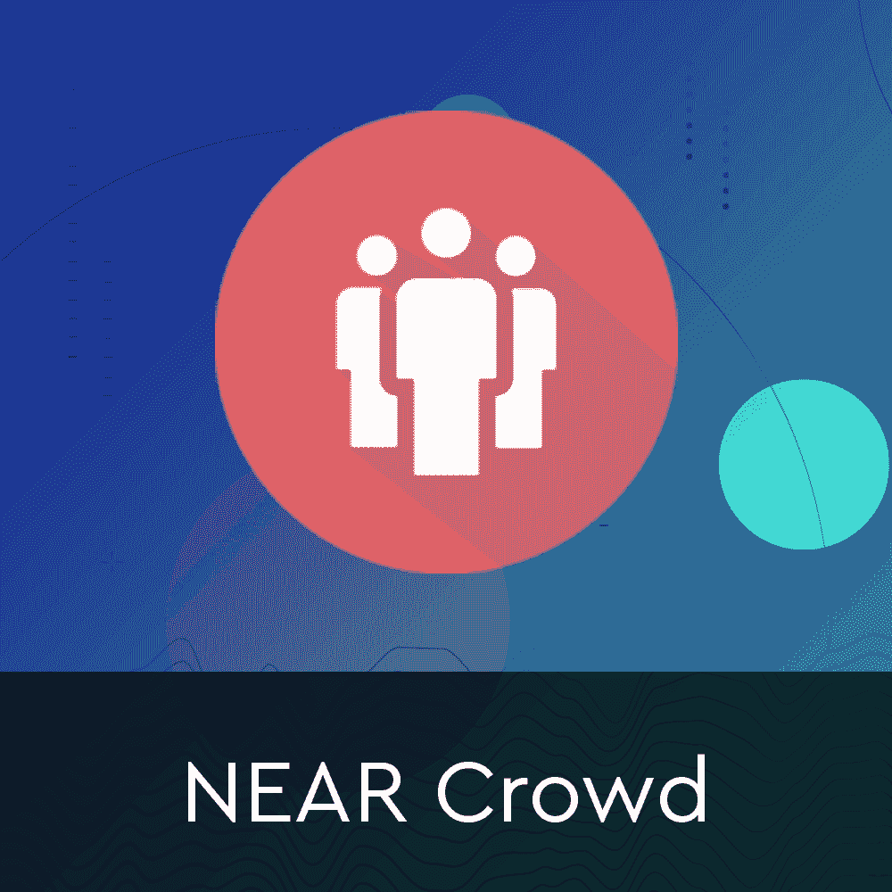

# 随着投资者的多元化，锁定的总价值增加到 3.6 亿美元

> 原文：<https://web.archive.org/web/https://dappradar.com/blog/near-total-value-locked-swells-to-360-million-as-investors-diversify>

## 代币价值一个月内飙升 95%

随着 NEAR 的财务部门显示出决心，其 DeFi 协议锁定的总价值在过去几周飙升。TVL 从 2 月 14 日的 9000 万美元增长了近 300%，达到逾 3.6 亿美元。与此同时，网络的本地令牌的价值在过去 30 天内增加了 95%。

## 摘要

*   DeFi 协议附近[中锁定的总值(TVL)增加 300%](https://web.archive.org/web/20221001110208/https://dappradar.com/rankings/protocol/near/category/defi)
*   [近令牌](https://web.archive.org/web/20221001110208/https://dappradar.com/hub/tokens/ethereum/all/1)值在过去 30 天内增加了 95%
*   三个协议持有价值的最大份额， [Ref Finance](https://web.archive.org/web/20221001110208/https://dappradar.com/near/exchanges/ref-finance-1) 、 [Burrow](https://web.archive.org/web/20221001110208/https://dappradar.com/near/defi/burrow) 和[元池](https://web.archive.org/web/20221001110208/https://dappradar.com/near/defi/meta-pool)。

NEAR 是一个平台,它利用了开发者友好的、分片的、利益相关证明的公共区块链，致力于让开发者更容易构建 dapps。Dapps 可以为用户提供易于使用的应用程序，能够保护像金钱和身份这样的高价值资产。[NEAR token](https://web.archive.org/web/20221001110208/https://dappradar.com/hub/tokens/ethereum/all/1)，允许这个平台运行，也允许构建在它之上的应用程序相互交互。

## 谁赢了？

NEAR 上目前表现突出的是 [Ref Finance](https://web.archive.org/web/20221001110208/https://dappradar.com/near/exchanges/ref-finance-1) ，这是一个由社区主导的多功能 [DeFi 平台](https://web.archive.org/web/20221001110208/https://dappradar.com/near/exchanges/ref-finance-1)，实现代币和稳定币互换、农业和流动性供应。在过去的七天里，超过 5370 个钱包连接到 dapp，产生了近 10 万笔交易。最重要的是，TVL 在 Ref 上的身价已飙升至 1.31 亿美元，约占 NEAR 所有锁定价值的三分之一。

Source: DappRadar

另一个重要的 DeFi 玩家是[元池](https://web.archive.org/web/20221001110208/https://dappradar.com/near/defi/meta-pool)。它拥有超过 1.37 亿美元，比参考值低一点点。此外，这两个 dapps 支配着 DeFi T3 附近的 T2 生态系统，拥有总价值 360 美元的近 2 . 7 亿美元。

Source: [DeFi Lama](https://web.archive.org/web/20221001110208/https://defillama.com/chain/Near)

## 接近象征性价格呢？

所有这些交易量和锁定的增值正在推高 Near 的原生令牌的价格，该令牌的市值为 125 亿美元，目前在柴犬和包装比特币之间的前 100 名中排名第 16 位。在过去的 30 天里，NEAR 上涨了近 100%，从 11 美元左右涨到了 19 美元。

Source: [DeFi Lama](https://web.archive.org/web/20221001110208/https://www.coingecko.com/en/coins/near/usd#panel)

NEAR 上另一个必要的 [DeFi 协议是 Burrow](https://web.archive.org/web/20221001110208/https://dappradar.com/near/defi/burrow) ，它在 TVL 持有近 9000 万美元。Burrow 是一个分散的、非托管的基于池的利率平台，使用户能够提供资产以赚取利息，并以资产为抵押借款以释放流动性。

[Burrow 类似于 Aave](https://web.archive.org/web/20221001110208/https://dappradar.com/near/defi/burrow) 、 [Compound](https://web.archive.org/web/20221001110208/https://dappradar.com/ethereum/defi/compound) 和其他基于池的协议，似乎找到了一个坚实的用户基础。最值得注意的是，Burrow 是 NEAR 上唯一一个允许用户以其流动资产为抵押借入资金的贷款平台，这已经成为那些囊中羞涩的人借出其加密资产以获得被动收入的一种流行方式。

## 快到了

dapps 的近生态系统比 DeFi 更加多样化，并以稳定的速度增长，吸引了更多的价值和活跃的钱包。[彩虹桥](https://web.archive.org/web/20221001110208/https://dappradar.com/null/other/rainbow-bridge)允许开发者将以太坊资产和智能合同转移到 NEAR，而 [Sputnik DAO](https://web.archive.org/web/20221001110208/https://dappradar.com/null/social/sputnik-dao) 提供基础设施来创建资金和团队 DAO。

是一个面向创作者和收藏者的一体化、社会化的数字收藏品市场。最近，像[帝国之地](https://web.archive.org/web/20221001110208/https://dappradar.com/near/games/land-to-empire)这样的游戏正在接近竞争激烈的 [GameFi](https://web.archive.org/web/20221001110208/https://dappradar.com/rankings/protocol/near/category/games) 场景。

[<picture></picture>](https://web.archive.org/web/20221001110208/https://dappradar.com/near/defi/skyward-finance)[<picture></picture>](https://web.archive.org/web/20221001110208/https://dappradar.com/near/marketplaces/nearnames)[<picture></picture>](https://web.archive.org/web/20221001110208/https://dappradar.com/near/other/near-crowd)

*以上不构成投资建议。此处给出的信息仅供参考。请行使尽职调查，做你的研究。作者持有多种加密货币的头寸，包括 BTC、瑞士法郎和雷达。*

 NewsletterUnsubscribe at any time. [T&Cs](https://web.archive.org/web/20221001110208/https://dappradar.com/terms) and [Privacy Policy](https://web.archive.org/web/20221001110208/https://dappradar.com/privacy-policy)