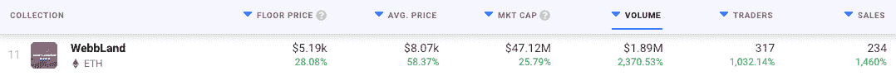
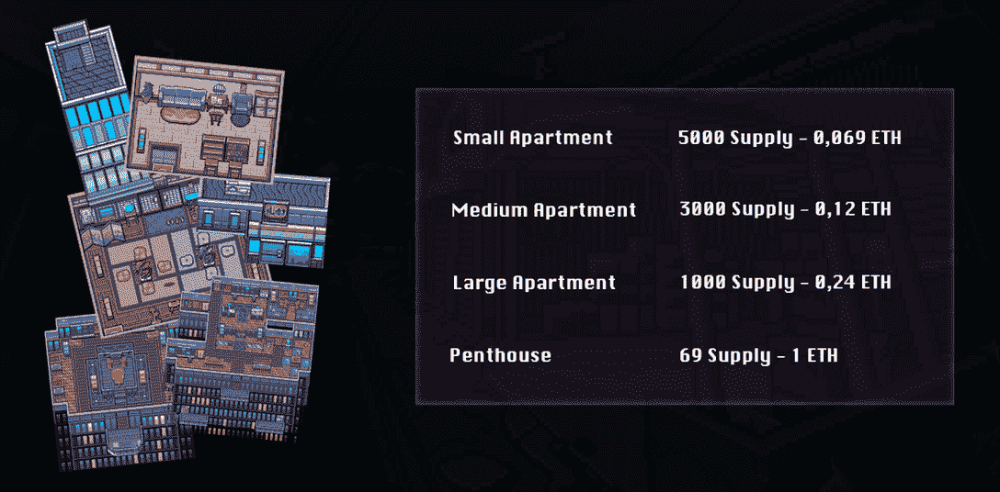

# 新的社区利益推动万维网和非功能性食物的销售

> 原文：<https://web.archive.org/web/https://dappradar.com/blog/new-community-benefits-push-worldwidewebb-land-nft-sales>

## 土地所有者将独占令牌、资源和选票

WorldWideWebb 是元宇宙最受欢迎的虚拟世界之一，最近它的土地 NFT 销售出现了大幅增长。在官方的 WWW Twitter 账户发布了一个关于土地所有者的模糊但重要的更新后，活动量有所增加。

***概要:***

*   *[地主获得令牌掉落、统治权和专属物品](https://web.archive.org/web/20221202031647/https://dappradar.com/blog/new-community-benefits-push-worldwidewebb-land-nft-sales/#more-benefits)*
*   全球韦布置地 NFT 24 小时销量增长 2370%
*   *[你的地块大小关系重大](https://web.archive.org/web/20221202031647/https://dappradar.com/blog/new-community-benefits-push-worldwidewebb-land-nft-sales/#size-of-your-plot-matters)*

WorldWideWebb land 于 2021 年 11 月 29 日推出，[在不到 24 小时内销售一空](https://web.archive.org/web/20221202031647/https://dappradar.com/blog/worldwideweb3-sells-out-all-land-nfts-on-launch-day/)，并从最初的造币厂获得超过 700 万美元的收入。自那以来，这一直是元宇宙领域备受追捧的资产。然而，最近的公告将交易活动推上了顶峰。

## 万维网和陆地 nft 持有者获得更多利益

根据昨天的公告，万维网(WWW)的所有者将获得一系列新的利益。目前，持有虚拟世界的土地 NFT 允许收藏家们在元宇宙[建造和定制他们自己的空间](https://web.archive.org/web/20221202031647/https://dappradar.com/blog/digital-homeowners-get-to-design-their-apartment-today-in-worldwidewebb/)。

然而，WWW 土地所有者将很快获得独家令牌滴和治理投票。此外，WorldWideWebb 的房主将有资格获得 NFTs 形式的独家资源和资产减免。

目前，还没有关于这些福利的推出日期以及它们是否会同时下降的信息。尽管如此，持有人将获得许多新的利益这一事实对过去 24 小时内 NFT 土地虚拟世界的销售产生了巨大的影响。

## 土地 NFT 交易量上升了 2370%

在过去的 24 小时里，特别是在声明发布后，全球范围内的土地转让已经成为一个热门话题。该系列的销售额增加了 1，460%，总数达到 234 件，交易者增加了 1，032%。

全球韦伯地产 NFT 的平均价格飙升了 58%，达到 8000 美元以上，而地板价格也上涨了 28%，达到 5000 美元以上。然而，在过去的 24 小时里，该藏品最大的亮点是其交易量。

不断上涨的底价和均价，加上交易活动的增加，推动交易量飙升。仅在一天之内，WebbLand NFT 的交易量飙升了 2370%，达到了 189 万美元的新高。这是一个不小的壮举，显著的飙升将该系列推上了 DappRadar 的[顶级 NFT 系列排行榜](https://web.archive.org/web/20221202031647/https://dappradar.com/nft/collections)的首位。

## 你的地块大小很重要

最近公告透露的有限细节之一是，土地所有者的奖励和利益将根据其财产的大小而定。WorldWideWebb land 分为四个不同大小的部分。你可以在下面看到它们和每个尺寸的初始价格。另一方面，自造币厂以来，全球韦布置地 NFT 的价格大幅上涨，一套小公寓的最低价格现在是 1.7 ETH。

对于规模会在多大程度上影响持有人的潜在收益和利益，目前还没有官方的详细说明。然而，预计小型公寓 NFT 比顶层公寓 NFT 提供的福利要少得多。最重要的是，所有 NFT 土地所有者都将成为新福利计划的一部分。

DappRadar 将继续关注 WorldWideWebb，推动新的所有者权益并发布更新。这是元宇宙领域的一颗冉冉升起的新星，所以如果你想密切关注它，请点击这里查看所有 WebbLand 数据。更重要的是，你可以加入 [DappRadar PRO](https://web.archive.org/web/20221202031647/https://dappradar.com/token/pro) ，获取最近 15 分钟的 NFT 销售数据，让你了解最新的 WorldWideWebb 业绩概况。在[推特](https://web.archive.org/web/20221202031647/https://twitter.com/dappradar)上关注 DappRadar，首先获得最新的元宇宙新闻。

 NewsletterUnsubscribe at any time. [T&Cs](https://web.archive.org/web/20221202031647/https://dappradar.com/terms) and [Privacy Policy](https://web.archive.org/web/20221202031647/https://dappradar.com/privacy-policy)