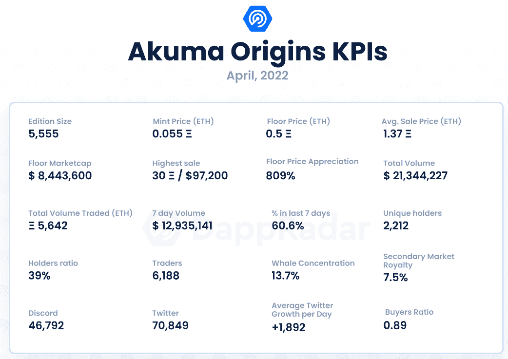
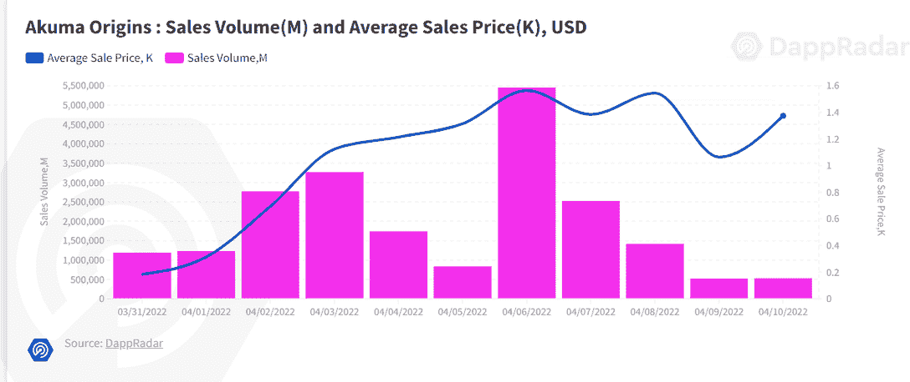
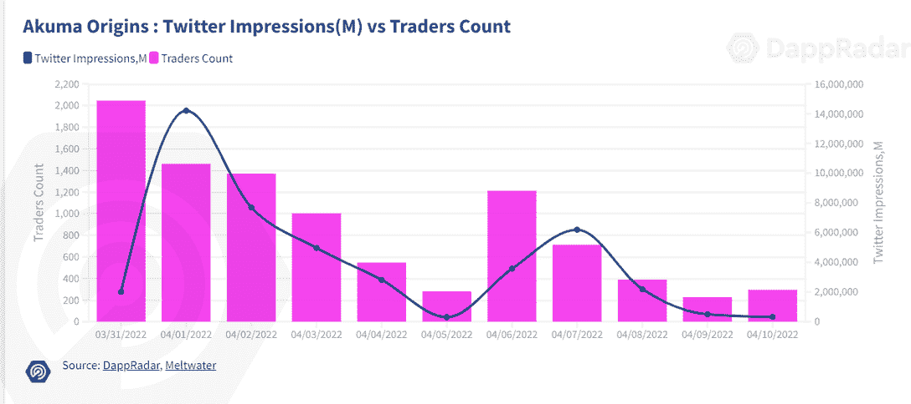

# 新的 Dapps 报告:Akuma 起源-稳定增长和强劲的公用事业

> 原文：<https://web.archive.org/web/https://dappradar.com/blog/new-dapps-report-akuma-origins-steady-growth-robust-utilities>

## 了解更多关于阿库玛起源 NFT 系列的信息

在 2022 年 4 月版的 DappRadar 的新 Dapps 报告中，我们关注了受欢迎和有趣的 NFT 系列，这次我们涵盖了 Akuma 的起源。新的 Dapps 报告是对 NFT 收藏的财务指标的执行概述和分析。

这份新的 Dapps 报告是一系列执行报告的一部分，为读者提供了一个有前途的随机生成的 NFT 集合的高级视角。该报告侧重于财务指标，包括销售活动和价格分析，以及分布指标，如独特持有人比率和鲸鱼集中指数。它还深入研究了鲸鱼的行为模式以及社会和技术概况。

在这些报道中，我们讨论了市场上出现的令人兴奋的新系列，本周我们将回顾 Akuma 的起源。这个受日本流行文化启发的系列自造币厂以来大幅升值。

Akuma Origins 是一组比利时和法国艺术家制作的 5555 幅 NFT 的集合。他们希望在数字世界和现实世界之间架起一座桥梁，同时为持有者提供艺术、音乐和季节性空投方面的强大实用工具包。

请不要将本文件视为财务建议。

**数据更新日期:2022 年 4 月 14 日**

## 目录

*   [关键要点](https://web.archive.org/web/20221202020924/https://dappradar.com/blog/new-dapps-report-akuma-origins-steady-growth-robust-utilities/#Key-Takeaways)
*   [财务概况](https://web.archive.org/web/20221202020924/https://dappradar.com/blog/new-dapps-report-akuma-origins-steady-growth-robust-utilities/#Floor-price)
*   [效用](https://web.archive.org/web/20221202020924/https://dappradar.com/blog/new-dapps-report-akuma-origins-steady-growth-robust-utilities/#Average-Offering)
*   [社会意识和参与度](https://web.archive.org/web/20221202020924/https://dappradar.com/blog/new-dapps-report-akuma-origins-steady-growth-robust-utilities/#Social-Awareness)
*   [技术概述](https://web.archive.org/web/20221202020924/https://dappradar.com/blog/new-dapps-report-akuma-origins-steady-growth-robust-utilities/#Technical-Overview)

## 关键要点

*   Akuma Origins 是过去七天中交易量第十大的收藏，总销售额超过 2000 万美元。
*   自 3 月 31 日发行以来，Akuma Originals 系列的底价上涨了 800%以上

## akuma Origins–底价增长 809%

## 区块链:以太坊

**上市日期:**2022 年 3 月 31 日

**版本尺寸:**5555-限量版

**特质:** 18

**属性:** 222

**底价:** 0.5 ETH

Source: [Dappradar.com](https://web.archive.org/web/20221202020924/https://dappradar.com/hub/assets/eth/0x67d9417c9c3c250f61a83c7e8658dac487b56b09/9999)

Akuma Origins 在第一周就创造了近 2000 万美元的销售额。尽管随后日成交量有所回落，但总体成交量仍在继续攀升。Akuma 是过去 7 天交易量第 10 大的收藏，也是过去两周交易量第 19 大的收藏。平均价格在第一周稳步上升，在本周早些时候略有下降后，在撰写本文时，平均价格稳定在 1.37 ETH。

## 附加效用–普通产品

Akuma Origins 发布了该项目的发布后支持路线图。尽管该团队还没有传达交付里程碑的具体时间表，但他们计划用季节性 NFT 滴剂奖励他们的社区。Akuma 持有者可以在网站上用这些空投物品交换数字或实物艺术品。持有者还将收到一个他们的 NFT 的乙烯基小雕像。这些奖励是季节性的，这意味着第一季的持有者可以获得第一季的奖励。该团队还计划将该项目扩展到元宇宙，但在撰写本文时还不知道该项目的具体细节。欣赏艺术品的持有者将最大限度地利用这些设施。

## 社会意识和参与

Akuma Origins 在网上的社交活动不多。它的 [Discord](https://web.archive.org/web/20221202020924/https://discord.com/invite/akuma-origins) 服务器拥有 **46，792 名活跃用户**，复杂的入职程序，以及减少恶意机器人活动和不良行为者的活跃审核团队。社区对话全天都在进行，并通过各种渠道进行，这表明参与度很高。

Akuma Origins [Twitter](https://web.archive.org/web/20221202020924/https://twitter.com/AkumaOrigins) 于 2021 年 12 月上线，目前拥有 70849 名粉丝。该帐户在过去 30 天内经历了 80%的总增长，获得了 56，765 个新关注者，平均每天 1，892 个新关注者。这表明了人们对该系列的强烈兴趣和不断增长的需求。

Akuma Origins 的交易者激增，在第一周就积累了超过 2000 名不同的交易者。尽管在随后的几周内交易量有所下降，但共有 5，723 名独立交易者显示了对该系列的健康需求。

## 团队概述

伯纳德是主要的开发者，也是这个项目的负责人。[马特奥](https://web.archive.org/web/20221202020924/https://twitter.com/mateo9k)是一名自由艺术家和艺术领袖。马蒂亚斯和奥托刀，他们之前为 Reikon games(RUINER 视频游戏的开发者)以及支持艺术家和开发者工作。[阿德](https://web.archive.org/web/20221202020924/https://twitter.com/WhoIsAdeAdev?t=6-wY46twWj9Y5VYOPWhgWQ&s=09)是支持 web3 的开发者，而[卢克](https://web.archive.org/web/20221202020924/https://twitter.com/lukep_16)是社区经理。并非所有团队成员都公开了自己；然而，他们在他们的 Discord 服务器上随时可用，并定期与社区互动。

 Source: [akumaorigins.com](https://web.archive.org/web/20221202020924/https://www.akumaorigins.com/)

## 技术概述

像大多数 NFT 项目一样，Akuma Origins 使用 IPFS 存储其元数据，而不是完全在链上。这给视觉上丰富的元数据项目带来了一个共同的挑战，因为智能合约和元数据是分开的。不过，从技术角度来看，没有什么大问题。

*   审计状态:尚未执行审计

*   存储:阿库玛起源**NFT 作为 ERC-721 令牌存储在以太坊区块链上，视觉在 IPFS 上永久存在。**

 ***   合同地址:[0x fa 7 E3 f 898 c 80 e 31 a3 aedeea 8 b 0 c 713 a3 f 9666264](https://web.archive.org/web/20221202020924/https://etherscan.io/address/0xfa7e3f898c80e31a3aedeae8b0c713a3f9666264)

## 鲸鱼钱包分析

Akuma Origins 目前的唯一持有人比例为 **39%** ，表明收藏适度多元化；较低的比率表明对价格突变的敏感度较高。在 **13.7%** ，其鲸类浓度非常集中。更高的鲸鱼聚集度表明知名收藏者操纵价格的风险增加。

在前五名持有者中，有三只重要的鲸鱼——[cryptopolitan . eth](https://web.archive.org/web/20221202020924/https://dappradar.com/hub/wallet/eth/0xb8adcc8e382a7c43bdfa2e1c47059a1afec10e06)、 [ethersole.eth](https://web.archive.org/web/20221202020924/https://dappradar.com/hub/wallet/eth/0x64916cd4b15045fd156bc2a6460cd3207638e289) 和 [legendmaster.eth](https://web.archive.org/web/20221202020924/https://dappradar.com/hub/wallet/eth/0x226b88b9ca0f069a16adfdac31ab8243b1ef911c) 。仅 C [ryptopolitan.eth](https://web.archive.org/web/20221202020924/https://dappradar.com/hub/wallet/eth/0xb8adcc8e382a7c43bdfa2e1c47059a1afec10e06) 就拥有整个收藏的近 8%。知名 NFT 收藏家和加密投资者的大量参与可能会混淆有机贸易活动。它也可以表明，收藏是不被大众所欣赏的。用户应该警惕跟随高调的交易者，因为他们退出收藏往往先于抛售。

## 摘要

Akuma Origins 在以下统计中表现突出:0.5 ETH 的底价从铸币厂升值了 809%；但 1.37 ETH 的均价已经升值 2391%，明显高于平均水平。这是过去两周交易量第 19 大的藏品，交易量超过 2000 万美元。30ξ/97，200 美元的最高销售额仅在铸造后八天出现。

该系列具有 13.7%的高鲸鱼集中度，独特活跃钱包的比率为 39%，表明该系列有来自高知名度鲸鱼交易商的相当大的参与。这种参与可能意味着公众不重视这些收藏，或者鲸鱼活动的增加扰乱了自然需求。

任何项目的长期增长都非常依赖于它为持有者提供的效用。Akuma 专注于用数字和实物商品奖励持有者，如艺术书籍、数字印刷品和乙烯基小雕像。强烈喜欢项目艺术风格的用户可能会享受计划中的奖励。

 NewsletterUnsubscribe at any time. [T&Cs](https://web.archive.org/web/20221202020924/https://dappradar.com/terms) and [Privacy Policy](https://web.archive.org/web/20221202020924/https://dappradar.com/privacy-policy)**