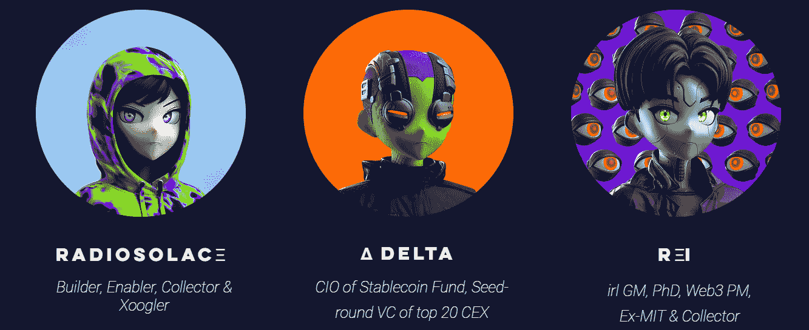
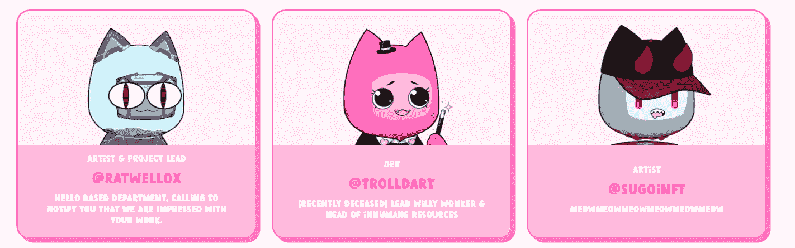

# 新的 Dapps 报告:动画化身启动春季销售

> 原文：<https://web.archive.org/web/https://dappradar.com/blog/new-dapps-report-animated-avatars-kickoff-spring-sales>

## 了解更多关于看不见的朋友，3Landers，和由 Tubby 集体的 Tubby 猫。

在这份 2022 年 3 月版的 DappRadar 的新 Dapps 报告中，我们关注了在熊市中表现良好的三个受欢迎的 NFT 系列:隐形朋友、3Landers 和 Tubby Collective 的 Tubby Cats。新的 Dapps 报告是对 NFT 收藏的财务指标的执行概述和分析。

这份新的 Dapps 报告是一系列执行报告的一部分，为读者提供了一个有前途的随机生成的 NFT 集合的高级视角。该报告侧重于财务指标，包括销售活动和价格分析，以及分布指标，如独特持有人比率和鲸鱼集中指数。它还深入研究了鲸鱼的行为模式以及社会和技术概况。

尽管低迷的宏观经济事件导致市场下滑，但 NFT 市场仍然推出了吸引市场兴趣的新藏品。在这份报告中，我们将讨论三个打破常规的新系列。

首先，我们来看看[隐形朋友](https://web.archive.org/web/20221006045211/https://invisiblefriends.io/)——一个由 5000 个橡胶软管风格的动画角色组成的集合，类似于成功的视频游戏《网飞秀》的“瘾君子”。[马库斯·马格努松](https://web.archive.org/web/20221006045211/https://twitter.com/motionmarkus)，一位多产的艺术家和动画师，之前为包括谷歌和 Dropbox 在内的品牌制作动画，是该系列的创作者。

然后我们来看看由泰国艺术家 [Pom](https://web.archive.org/web/20221006045211/https://twitter.com/3landboy) 和时装设计师 [Stubby](https://web.archive.org/web/20221006045211/https://twitter.com/NFTStubby) 与 [0x.studio](https://web.archive.org/web/20221006045211/https://www.0x.studio/) 合作制作的[3 landers](https://web.archive.org/web/20221006045211/https://3landersnft.com/#/)–**一万个充满活力、眼睛圆睁的虚拟形象。Pom 有独特的卡通风格，并发布了许多其他 NFT 系列。**

 **最后，我们来看看由 [Tubby Collective](https://web.archive.org/web/20221006045211/https://twitter.com/tubbyCollective) 制作的 [Tubby Cats](https://web.archive.org/web/20221006045211/https://tubbycats.xyz/home) ，这是一个由 20，000 只通过算法生成的猫组成的集合。这个系列的与众不同之处在于，除了 69 个完全独特的作品，所有的头像都是从 120 个独特的调色板中生成的，而不是从一个功能池中生成的。

请不要将本文件视为财务建议。

**数据更新日期:****2022 年 2 月 28 日**

## 目录

*   [关键要点](https://web.archive.org/web/20221006045211/https://dappradar.com/blog/new-dapps-report-animated-avatars-kickoff-spring-sales/#key)
*   [看不见的朋友](https://web.archive.org/web/20221006045211/https://dappradar.com/blog/new-dapps-report-animated-avatars-kickoff-spring-sales/#invisible)
*   3 个着陆器
*   [胖墩猫被胖墩集体](https://web.archive.org/web/20221006045211/https://dappradar.com/blog/new-dapps-report-animated-avatars-kickoff-spring-sales/#tubby)
*   [总结](https://web.archive.org/web/20221006045211/https://dappradar.com/blog/new-dapps-report-animated-avatars-kickoff-spring-sales/#summary)

## 关键要点

*   **《看不见的朋友》****–**《看不见的朋友》30 天的成交量超过 7700 万美元，是交易量第 14 大的收藏；自 2 月 23 日铸造以来，地板价格上涨了近 3，020%，最高销售额为 200 ETH 或超过 50 万美元。

*   **3 landers**–3 landers 是过去 30 天内交易量第 15 大的藏品，成交额超过 5300 万美元，是过去 7 天内交易量第 6 大的藏品，成交额为 6640143 美元；自过去两周以来，其底价上涨了近 980%。

*   **Tubby Cats****–**在撰写本文时，Tubby Cats 收藏的独特交易者数量高达近 12，000 人，是过去 30 天内交易量第 18 大的收藏，交易量为 31，254，570 美元。

## 隐形朋友——底价增长 3.020%

**区块链:**以太坊

**上市日期:**2022 年 2 月 23 日

**版本数量:**5000-限量版

**特质:** 20

**属性:** 332

**底价:** 7.55 瑞士法郎

Source: [Dappradar.com](https://web.archive.org/web/20221006045211/https://dappradar.com/hub/assets/eth/0x67d9417c9c3c250f61a83c7e8658dac487b56b09/9999)

销售价格与销售量的相关性很小。主要价格上涨似乎更加随机，而整体销售价格似乎是稳定的。

### 附加效用–投机性效用产品

《看不见的朋友》的实用性是高度推测性的，因为它的开发者没有提供具体的路线图。然而，这个项目是更大的“随机角色集合”的一部分，其中包括像“ [Slim Hoods](https://web.archive.org/web/20221006045211/https://twitter.com/SlimHoods) ”和“ [Mood Rollers](https://web.archive.org/web/20221006045211/https://twitter.com/MoodRollers) ”这样的集合，其持有者通常会在所有未来的项目中获得优先白名单。该系列的创作者目前正在与 [Nguyen Nhut](https://web.archive.org/web/20221006045211/https://twitter.com/nguyenhut_art) 合作一个未公开的合作项目，该项目可能会在 2022 年年中发布。

### 社会意识和参与

《看不见的朋友》有着丰富而活跃的在线社交活动。其 [Discord](https://web.archive.org/web/20221006045211/https://discord.com/invite/rndm) 服务器拥有 **263，972**活跃用户，并拥有复杂的入职程序和主动审核团队，减少了恶意机器人活动和不良行为者。社区对话全天都在进行，并通过各种渠道进行，这表明参与度很高。

《隐形朋友》的推特于 2021 年 11 月**上线**，目前在**拥有 522116 名粉丝**。在过去的 30 天里，该账户经历了 20%的总增长，获得了 **106，673** 个新粉丝，平均每天 **3，555 个新粉丝**。这表明了人们对该系列的强烈兴趣和不断增长的需求。

该项目还有一个 Instagram 账户，目前拥有超过 166，000 名 T2 粉丝。它大多分享推广艺术。

交易员数量与 Twitter 印象密切相关。交易者的大量涌入与 Twitter 活动的增加相吻合。遵循同样的模式，交易者数量的减少反映在 Twitter 印象的减少上。

### 团队概述

该系列由马库斯·马格努松创作，他在网上的笔名 [Motionmarkus](https://web.archive.org/web/20221006045211/https://twitter.com/motionmarkus) 更为人所知。Markus 是一位多产的艺术家、动画师和教师。他为谷歌和 Dropbox 等公司创作过动画，也发布过动画教程。他在社交平台上非常活跃，在 Twitter 上有超过 90，000 名粉丝。

  Source: [motiondesign.school](https://web.archive.org/web/20221006045211/https://motiondesign.school/courses/science-of-character-animation-by-markus-magnusson/)

### 技术概述

像大多数 NFT 项目一样，《看不见的朋友》使用 IPFS 存储其元数据，而不是完全在链上。这给视觉上丰富的元数据项目带来了一个共同的挑战，因为智能合约和元数据是分开的。不过，从技术角度来看，没有什么大问题。

*   审计状态:尚未执行审计

*   存储:隐形朋友**NFT 作为 ERC-721 令牌存储在区块链以太坊上，托管在 IPFS 上，拥有不变的所有权**

 ***   合同地址:[0x 59468516 a 8259058 bad 1c a5 F8 F4 BFF 190d 30 e 066](https://web.archive.org/web/20221006045211/https://etherscan.io/address/0x59468516a8259058baD1cA5F8f4BFF190d30E066)

### 鲸鱼钱包分析

《看不见的朋友》目前唯一持有人比例 **83%，**表示是高度多元化的收藏；较低的比率表明对价格突变的敏感度较高。在 **4.36%** ，其鲸密度一般。更高的鲸鱼聚集度表明知名收藏者操纵价格的风险增加。在前五名持有者中，只有一条著名的鲸鱼。知名 NFT 收藏家/密码投资者的出现通常表明交易活动增加，对藏品的整体兴趣更高。

## 3 landers–稳定增长，平均回报率为 1，349%

**区块链:**以太坊

**上市日期:**2022 年 2 月 21 日

**版本数量:** 10，000-限量版

**特质:** 10

**属性:** 353

**底价** : 1.47 ETH

销售价格与销售量的相关性很小。价格的大幅上涨与交易量大的日子相吻合。交易活动的减少压低了平均价格。

### 附加效用–投机性效用产品

3Landers 开发团队表示，他们希望培养一个强大的社区，并将数字世界与物理世界联系起来，但在撰写本文时尚未提供详细的路线图。NFT 系列的实用性将集中在身份和定制的概念上。该团队将在铸造后几周的“营火活动”上公布所有细节。

### 社会意识和参与

交易者数量与 Twitter 印象略有关联。交易者的大量涌入与 Twitter 活动的增加相一致，而交易者数量的减少与 Twitter 印象的减少相一致。

3Landers [Twitter](https://web.archive.org/web/20221006045211/https://twitter.com/3landersNFT) 账号于 2021 年 9 月在**上线，在**拥有 55937 名粉丝**。它的大部分增长发生在过去的 30 天里，该账户增加了 44，682 名新关注者，平均每天有 1，489 名新关注者，这表明对该系列的需求不断增长。**

三个兰德[不和](https://web.archive.org/web/20221006045211/https://discord.com/invite/3landers)拥有**34697 名成员**。新用户必须注册他们的手机，并通过验证码机器人验证才能进入。该服务器由一个专门的团队积极管理，以确保机器人、垃圾邮件和不良行为者的存在降至最低。不和是适度的，一个活跃的社区和 mods 团队经常参与讨论。

### 团队概述

核心团队由 [Pom](https://web.archive.org/web/20221006045211/https://twitter.com/3landboy) 和 [AJ，](https://web.archive.org/web/20221006045211/https://twitter.com/NFTStubby)组成，他们将自己公之于众，为项目增加可信度。他们得到了 [0x.studio](https://web.archive.org/web/20221006045211/https://www.0x.studio/) 的支持来运作这个 NFT 项目。完整的团队还包括[radios OLAξ](https://web.archive.org/web/20221006045211/https://twitter.com/radiosolace)、[δDelta](https://web.archive.org/web/20221006045211/https://twitter.com/0x0b5)、[rξI](https://web.archive.org/web/20221006045211/https://twitter.com/rei_0xstudio)、 [MadPug、](https://web.archive.org/web/20221006045211/https://twitter.com/0xMadPug) [Abaoaqu](https://web.archive.org/web/20221006045211/https://twitter.com/Abaoaqu0x) 和 [PussyCat](https://web.archive.org/web/20221006045211/https://twitter.com/0xpussycat) 。总的来说，开发团队由经验丰富的成员组成。Pom 是一位成功的艺术家，发行了许多 NFT 的作品集(包括《T21》)，Radiosolace 是前谷歌开发人员，而 Delta 是 CEX 前 20 大风投公司的首席信息官，REI 是前麻省理工学院 web3 开发人员。

 Pom and AJ  Source: [Medium/3Landers ](https://web.archive.org/web/20221006045211/https://medium.com/@3landers.nft/3landers-campfire-1-summary-13872a7d8d47)

Source: [0x.studio](https://web.archive.org/web/20221006045211/https://www.0x.studio/)

### 技术概述

像大多数 NFT 项目一样，3Landers 元数据使用 IPFS 存储，而不是完全在链上存储。这给视觉上丰富的元数据项目带来了一个共同的挑战，因为智能合约和元数据是分开的。不过，从技术角度来看，没有什么大问题。

*   审计状态:尚未执行审计
*   存储:NFT 作为 ERC-721 令牌存储在以太坊区块链上，图形资产托管在 IPFS 上，拥有不可改变的所有权
*   合同地址:[0x B4 d 06d 46 a 8285 F4 EC 79 FD 294 f 78 a 881799 D8 ced 9](https://web.archive.org/web/20221006045211/https://etherscan.io/address/0xb4d06d46a8285f4ec79fd294f78a881799d8ced9)

### 鲸鱼钱包分析

3Landers 是一个适度分布的集合，**唯一持有人比例为 53%。**比率越高，藏品越不容易受到价格操纵或价格突然波动的影响。前五大鲸鱼只控制了总收藏量的 **3.47%** ，这是一个很好的指标，表明较大的持有者不能过多地操纵价格。

前五大收藏者中有三种已知的鲸鱼: [3landers.eth](https://web.archive.org/web/20221006045211/https://dappradar.com/hub/wallet/eth/0xd841b09d68cc44a9461dd46194d1c7c8b9c50e65) 、 [gmfer.eth](https://web.archive.org/web/20221006045211/https://dappradar.com/hub/wallet/eth/0x1dc301854bfecb4ba03eb417579585c2b8ea12c1) 和 [shoopy.eth](https://web.archive.org/web/20221006045211/https://dappradar.com/hub/wallet/eth/0x0c368d683c616073d48fa26f7796dfe3f8d46526) 。知名交易商的出现表明，收集可能会成功，通常会增加交易兴趣。然而，用户也应该警惕跟随高知名度的交易者，因为他们的集合退出往往先于抛售。

## 胖猫——吸引交易者的可爱

**区块链:**以太坊

**上市日期:**2022 年 2 月 21 日

**版本数量:** 20，000-限量版

**特质:** 21

属性:1697

**底价** : 0.299 ETH

销售价格与销售量的相关性很弱。价格的大幅上涨与几天的大量交易同时发生。交易活动的减少压低了平均价格。

### 增加的实用程序–推测性实用程序包

Tubby Cats 尚未发布该项目的路线图，也没有对未来的计划做出任何声明。因此，没有已知的实用程序。

### 社会意识和参与

Tubby Cats 在社交媒体上表现平平。Tubby Cats [Twitter](https://web.archive.org/web/20221006045211/https://twitter.com/tubbycatsnft) 账号于 2019 年 5 月**推出**，目前在**拥有 22946 名粉丝**。它的大部分增长发生在过去的 30 天里，当**它获得了 22，872 个**关注者，平均每天 762 个新关注者。

Tubby Cats [Discord](https://web.archive.org/web/20221006045211/https://discord.com/invite/tubbycatsnft) 人口稀少**18366 注册独立用户**。尽管如此，大多数渠道仍有积极的讨论。它有一个彻底的验证程序，以防止机器人垃圾邮件和不良行为者的存在。服务器也有一个积极的审核团队，以确保这种情况发生在最低限度。

Tubby 猫交易者的数量与 Twitter 印象密切相关。交易者的大量涌入与 Twitter 活动的增加相吻合。而交易者数量的减少反映在 Twitter 浏览量的减少上。

### 团队概述

被称为 Tubby Collective 的 Tubby Cats 团队还没有上市。Ratwell 是首席艺术家和项目负责人， [trollart](https://web.archive.org/web/20221006045211/https://twitter.com/trolldart) 和 [0xngmi](https://web.archive.org/web/20221006045211/https://twitter.com/0xngmi) 负责开发。 [Sugoi](https://web.archive.org/web/20221006045211/https://twitter.com/sugoiNFT) 、[绷带](https://web.archive.org/web/20221006045211/https://twitter.com/bandageNFT)、 [Hoppy](https://web.archive.org/web/20221006045211/https://twitter.com/hoppynft) 、 [VKROOO](https://web.archive.org/web/20221006045211/https://twitter.com/VKR000) 和 [Sweetbread](https://web.archive.org/web/20221006045211/https://twitter.com/sweetbread_eth) 为配角。

Source: [tubbycats.xyz](https://web.archive.org/web/20221006045211/https://tubbycats.xyz/about)

### 技术概述

像大多数 NFT 项目一样，Tubby Cats 元数据使用 IPFS 存储，而不是完全在链上存储。

这给视觉上丰富的元数据项目带来了一个共同的挑战，因为智能合约和元数据是分开的。不过，从技术角度来看，没有什么大问题。

审计状态:尚未执行审计

*   存储:以太坊区块链上的 NFTs ERC-721 令牌和托管在 IPFS 上的图形资产，以实现不可改变的所有权。
*   合同地址:[0x ca 7 ca 7 bcc 765 f 77339 be 2d 648 ba 53 ce 9 c8 a 262 BD](https://web.archive.org/web/20221006045211/https://etherscan.io/address/0xCa7cA7BcC765F77339bE2d648BA53ce9c8a262bD)

### 鲸鱼钱包分析

Tubby Cats 目前的**唯一持有人比例为 59%** ，表明这不是一个分布均匀的集合。较低的比率表明对价格突变的敏感度较高。在 **4.55%，鲸鱼密度**一般。更高的鲸鱼聚集度表明知名收藏者操纵价格的风险增加。著名的鲸鱼[和](https://web.archive.org/web/20221006045211/https://dappradar.com/hub/wallet/eth/0x1418ab54752826a82698a23e22ebbf7e678cfe47)[名列前五名。巨鲸的出现提升了收藏品的社会形象，通常会在买卖期间吸引更多的交易活动。](https://web.archive.org/web/20221006045211/https://dappradar.com/hub/wallet/eth/0x5847555c01e7b3ed23259d0f1a511e7a67177629)

## 摘要

《看不见的朋友》一炮而红，表现出强劲的业绩指标。这是过去 7 天中交易量第二大的收藏，交易量接近 1600 万美元..它也是过去 30 天内交易量最大的藏品，排名第 14 位，总交易量超过 77，000，000 美元。底价已经巩固在 7 ETH 以上，比原价上涨了 3，020%，而均价上涨了 3，352%。200 ETH/510，000 美元的最高销售额仅在铸造后 11 天出现。

3Landers 是另一个表现强劲的系列，尽管市场动荡。其背后的团队是众所周知的，并在运行 NFT 项目经验丰富。该系列的交易表现良好，是过去 7 天中交易量第 12 大的系列，交易量为 6，640，143 美元，独立交易者超过 8，000 人。30 天内在 Twitter 上获得了超过 160，000 名用户，其社交媒体的增长非常迅速。同样，该系列的底价和均价分别上涨了 980%和 1349%。

尽管 Tubby Cats 在社交媒体上的关注度较低，但其独特的交易者人数高达近 12，000 人。尽管如此，在只有两周的时间里，它是过去 7 天中交易量第 42 大的系列，并以其“可爱”的风格和独特的制作方式吸引了许多交易者。但是，与前面提到的其他两个集合相比，该集合的整体性能较差。《3Landers》和《隐形朋友》在社交媒体上都拥有更多粉丝。他们各自的推特账户有 55，937 和 522，116 名粉丝，相比之下，Tubby Cat 的账户有大约 22，946 名粉丝。这种表现也反映在他们各自的总销量上，其中 3Landers 和隐形朋友的销量分别为 5300 万美元和 7700 万美元，而 Tubby Cats 的销量为 3000 万美元。

 NewsletterUnsubscribe at any time. [T&Cs](https://web.archive.org/web/20221006045211/https://dappradar.com/terms) and [Privacy Policy](https://web.archive.org/web/20221006045211/https://dappradar.com/privacy-policy)****