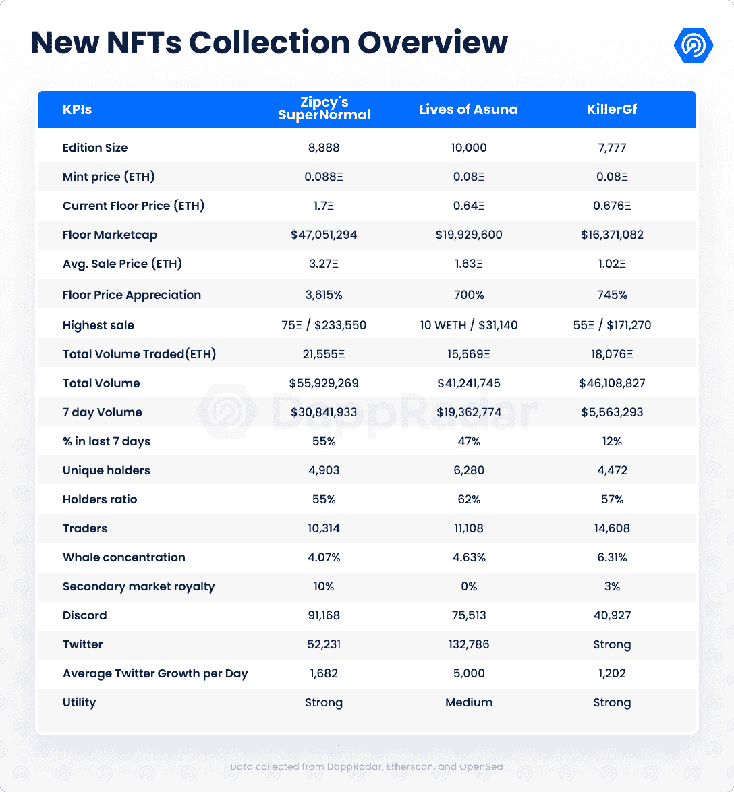
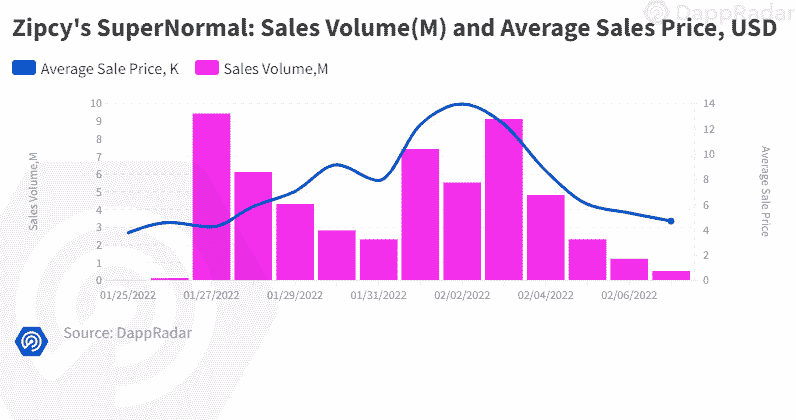
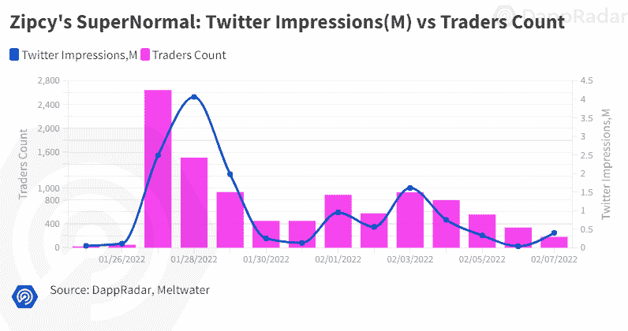
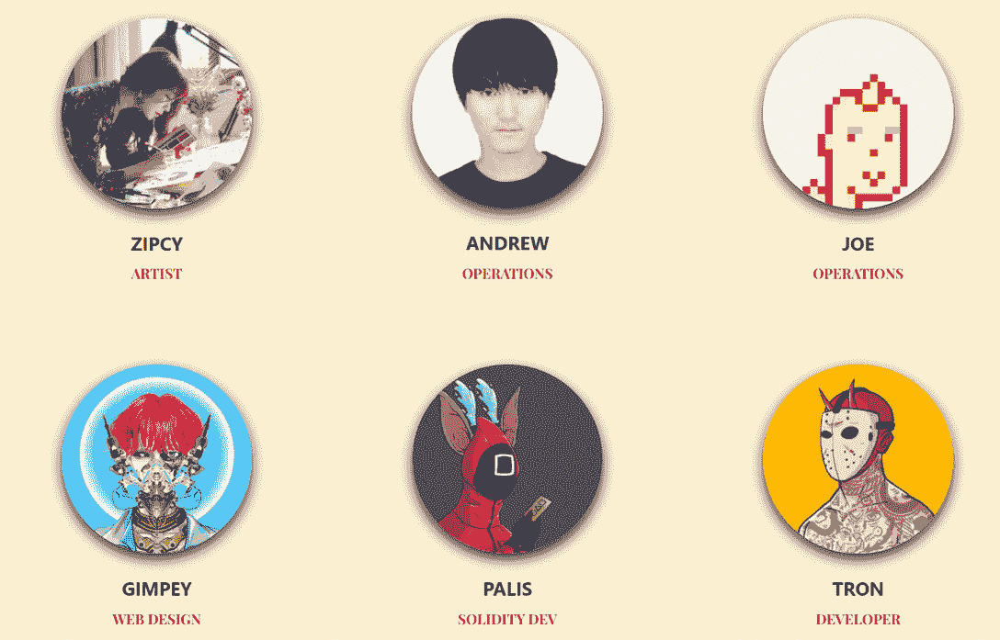
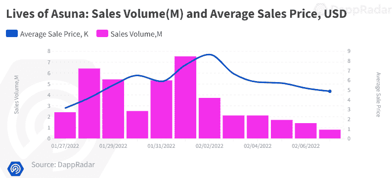
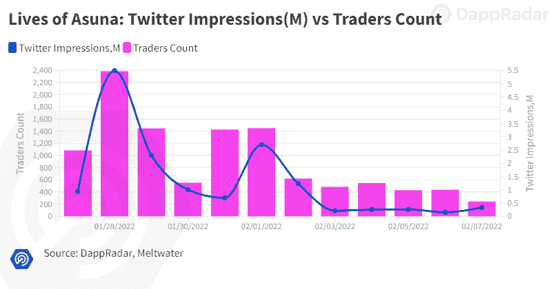
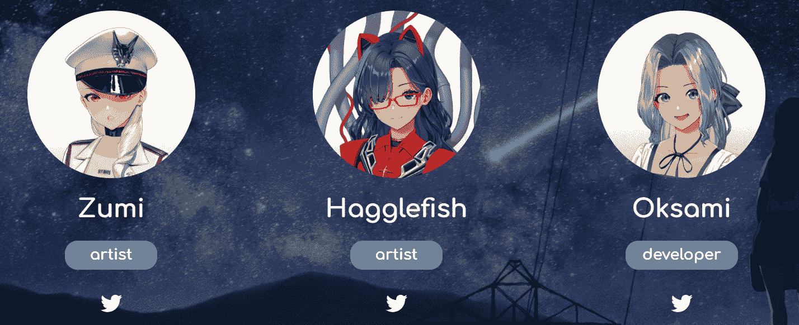
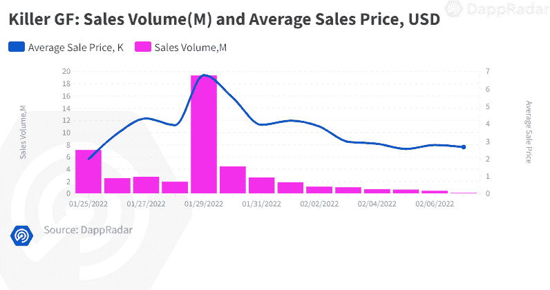
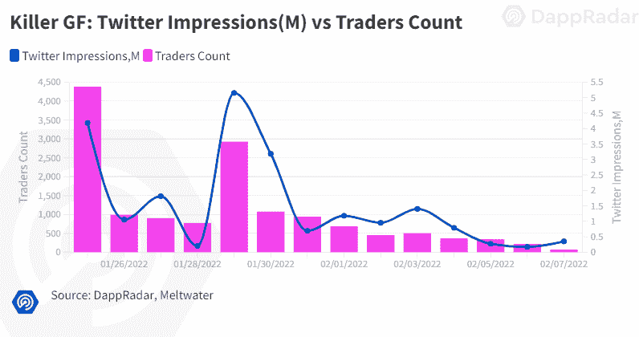
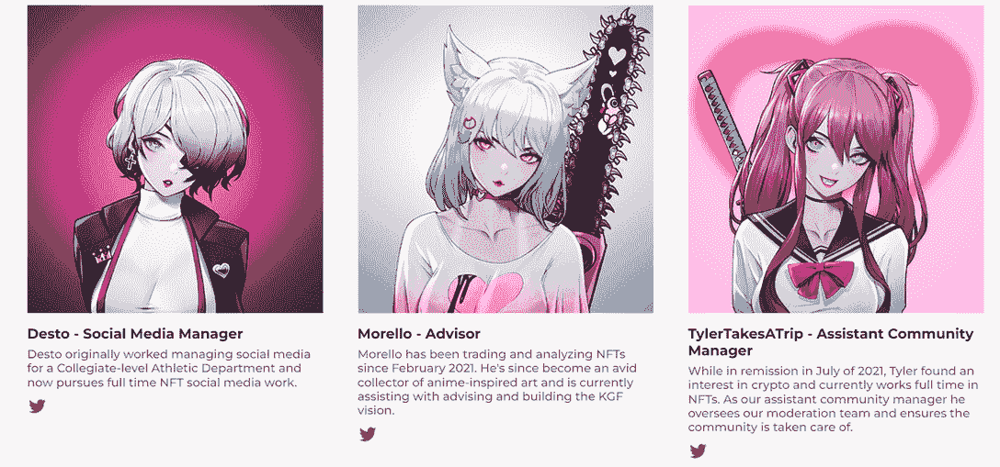

# 新的 Dapps 报告:受动漫启发的 NFT 交易额飙升至 1.4 亿美元

> 原文：<https://web.archive.org/web/https://dappradar.com/blog/new-dapps-report-anime-inspired-nft-soared-to-140m-in-trading-volume>

## 深入观察在不温不火的市场中战胜困难的三个受欢迎的 NFT 收藏:齐普西的《超常》、《亚莎的生活》和《黑仔的 GF》。

在 2022 年 2 月由 DappRadar 撰写的新的 Dapps 报告中，我们来看看三个受 NFT 动漫启发的流行系列:Zipcy 的《超常规》、《亚莎的生活》和《黑仔的 GF》。新的 Dapps 报告是对 NFT 收藏的财务指标的执行概述和分析。

新的 Dapps 报告系列由执行报告组成，为读者提供了随机生成的 NFT 集合的高级视角。该报告侧重于财务指标，如销售活动和价格分析，以及分布指标，如独特持有人比率和鲸鱼集中指数。此外，它还深入研究了鲸鱼的行为模式以及详细的社会和技术概述。

今年二月是动漫月。我们上个月报道的志那都红豆的明显成功似乎激发了许多类似的系列。在这份新的 Dapps 报告中，我们选择了三个受动漫启发的 NFT 项目，它们在 2 月初获得了关注。根据我们在分析中考虑的因素，每个人都显示出了潜力。

首先，我们来看看 **Zipcy 的超常的**原创手绘人物系列，由 Zipcy 制作，他是一位韩国艺术家，职业插画师，曾为**网飞**工作。由前**微软**技术主管和经验丰富的 [//pr0xy](https://web.archive.org/web/20221206162815/https://www.pr0xy.io/) 开发团队协助。

然后，我们将看看亚莎的系列的**生活，重点是音乐和化身定制。该团队试图为虚拟角色创造大量定制项目，并为他们配上独家配乐。

最后我们来看**黑仔 GF，**前**英雄联盟**概念艺术家 **Zerosis 做的一个集合。它有很多计划好的实用功能，由一个经验丰富的开发团队开发，他们推出了 uwucrew。****

请不要将本文件视为财务建议。

**数据更新日期:****2022 年 2 月 9 日**

## 目录

*   [关键要点](https://web.archive.org/web/20221206162815/https://dappradar.com/blog/new-dapps-report-anime-inspired-nft-soared-to-140m-in-trading-volume/#key-takeaways)
*   [齐普西的超常发挥](https://web.archive.org/web/20221206162815/https://dappradar.com/blog/new-dapps-report-anime-inspired-nft-soared-to-140m-in-trading-volume/#zipcy)
*   [亚莎的生活](https://web.archive.org/web/20221206162815/https://dappradar.com/blog/new-dapps-report-anime-inspired-nft-soared-to-140m-in-trading-volume/#asuana)
*   [黑仔 GF](https://web.archive.org/web/20221206162815/https://dappradar.com/blog/new-dapps-report-anime-inspired-nft-soared-to-140m-in-trading-volume/#killer)
*   [总结](https://web.archive.org/web/20221206162815/https://dappradar.com/blog/new-dapps-report-anime-inspired-nft-soared-to-140m-in-trading-volume/#summary)

## 关键要点

*   Zipcy 的超常表现——它是过去 7 天中交易量第八大的股票，成交量为 55，929，269 美元。自铸币以来，底价已经上涨了 1，831%，最高成交价 75ξ/$ 233，550 发生在铸币后仅 9 天。

*   **《亚莎的生活》****–**是在过去 7 天中交易量第 12 大的藏品，成交额为 19，362，774 美元，底价增长 700%

*   **黑仔 GF****–**底价上涨了 745%，目前有 14608 名独立交易者。Collection 由前英雄联盟艺术家制作，具有强大的实用内容投放渠道。

## Zipcy 的超常-超级 NFT 地板价格增长 1，831 %

**区块链:**以太坊

**上市日期:**2022 年 1 月 25 日

**版本尺寸:**8888-限量版

**特质:** 13

**属性:** 590

**增加了实用性–**元宇宙的时尚

路线图详细描述了该系列将在不久的将来发布的许多强大功能。

其中最值得注意的是:分散地的私人庄园，将向所有第一季持有者提供的第二季超人，一个让持有者能够升级第一季超人专属物品的时尚游戏，为持有者提供的 IRL 和数字专属商品，以及与许多 NFT 女艺术家的慈善合作。

第二季的超人将是所有当前持有者的 NFT 掉落，游戏将允许持有者用额外的装备定制他们的第一季超人，使他们更加独特。

### **社会意识和参与度**

虽然 Twitter 账户创建于 3 个多月前的 2021 年 10 月，但大部分增长发生在过去 30 天，该账户新增了 50，000 多名粉丝，平均每天新增 1，682 名粉丝。这是该客户的一个强劲增长指标。

[不和谐](https://web.archive.org/web/20221206162815/https://discord.com/invite/xDhvz3S5ND)服务器有 91168 个成员。新用户必须注册他们的手机才能进入，这是由一个专门的团队积极调节，以确保机器人，垃圾邮件和不良行为者的存在最小化。不和是很好的填充，一个活跃的社区。

Instagram 有 7862 名粉丝，他们分享该系列的宣传图片。

### **团队概述**

团队的核心已经公开了他们自己，这增加了这个项目的可信度。

//pr0xy 团队在业内非常知名，曾参与过多个 NFT 系列的发布。该团队由经验丰富的专业人士组成，他们曾在纳斯达克上市的公司工作过，拥有良好的声誉以及在加密领域工作的良好记录。

Zipcy 是一位成功的艺术家、商业插画师和教师。她为韩国的许多网飞时装秀做宣传艺术。

[Andrew Choi](https://web.archive.org/web/20221206162815/https://twitter.com/andrewchoi5) 运营—**比特币基地**和**前微软、LinkedIn、Snapchat IBM 和黑莓的技术主管**

[//pr0xy](https://web.archive.org/web/20221206162815/https://www.pr0xy.io/) 由[金佩、](https://web.archive.org/web/20221206162815/https://twitter.com/itsgimpey) [帕利斯](https://web.archive.org/web/20221206162815/https://twitter.com/0xpalis)和 [Tron 组成。他们是一个经验丰富的团队，推出 NFT 项目](https://web.archive.org/web/20221206162815/https://twitter.com/tron_quixote)即服务。他们之前曾参与过以下成功的项目——[疯兔暴动俱乐部](https://web.archive.org/web/20221206162815/https://madrabbits.io/) [迪克基斯](https://web.archive.org/web/20221206162815/https://dikdiks.io/)[madeofape.com](https://web.archive.org/web/20221206162815/http://madeofape.com/)

 Source: [zipcy.io](https://web.archive.org/web/20221206162815/https://zipcy.io/)

### **技术概述**

从技术角度来看，没有重大问题。像大多数 NFT 项目一样，Zipcy 的元数据使用 IPFS 存储，而不是完全在链上存储。不太理想，因为智能合约和元数据是分开的，但 IPFS 工作正常。视觉丰富的元数据项目中的常见挑战。

*   审计状态:尚未提交审计
*   存储:OOP NFTs 作为 ERC-721 令牌存储在以太坊区块链上，图形资产托管在 IPFS 上，以实现不变的所有权。
*   合同地址:[0xd 532 b 88607 b 1877 Fe 20 c 181 CBA 2550 E3 bbd 6 b 31 c](https://web.archive.org/web/20221206162815/https://etherscan.io/address/0xd532b88607b1877fe20c181cba2550e3bbd6b31c)

### **鲸鱼钱包分析**

Zipcy 的是一个适度分布的集合。唯一持有人比例为 55%。比率越高，藏品越不容易受到价格操纵或价格突然波动的影响。前五大鲸鱼只控制了总收藏量的 4.07%，这是一个很好的指标，表明富裕用户不会容易受到价格操纵。

然而，许多著名的 NFT 交易者出现在该系列的前五名所有者中，如 [Pranksy](https://web.archive.org/web/20221206162815/https://dappradar.com/hub/wallet/eth/0xd387a6e4e84a6c86bd90c158c6028a58cc8ac459) 。知名交易商的出现让人相信，这种收集可能是一种非常成功的努力，通常会促进交易兴趣的增加。用户还必须警惕跟随高调的交易者，因为他们的集合退出往往先于抛售。

*   鲸鱼集中率:362 / 4.07%

## 亚莎的生活——元宇宙的音乐和 NFT 动漫艺术

**区块链:**以太坊

**上市日期:**2022 年 1 月 27 日

**版本数量:** 10，000-限量版

**特质:** 19

**属性:** 357

Source: [Dappradar.com](https://web.archive.org/web/20221206162815/https://dappradar.com/hub/assets/eth/0x67d9417c9c3c250f61a83c7e8658dac487b56b09/9999)

**增加了实用程序–**标准实用程序包

亚莎有一个标准的公用事业包，在路线图中有详细说明。该功能如下:数字内容下降，持有人将获得额外的 NFT 项目，以进一步定制他们的亚莎，传奇 Asunas 发布具有独特的功能，并发布一个只有持有人才能获得的独家原声音乐。OST 是这一系列中最独特的部分，让它在竞争中脱颖而出。这是一个非常罕见的产品，可以吸引音乐爱好者和杰出的收藏家。

### **社会意识和参与度**

亚莎有丰富的在线社交活动。 [Discord](https://web.archive.org/web/20221206162815/https://discord.com/invite/livesofasuna) 拥有超过 75000 名活跃用户。该服务器有一个简单的加入程序，允许用户很容易地加入服务器，但是，这增加了机器人参与的风险。有一个积极的调节团队，将不良行为者的存在减少到最低限度。社区在所有频道上都非常活跃，全天都有对话。

他们的 [Twitter](https://web.archive.org/web/20221206162815/https://twitter.com/LivesOfAsuna) 成立于 2021 年 11 月，然而该账户在过去 30 天内经历了显著增长，获得了超过 128，000 名新粉丝。该账户平均每天增加近 5000 名新粉丝。

### **团队概述**

Source: [livesofasuna.com](https://web.archive.org/web/20221206162815/https://livesofasuna.com/)

来自德国的流行自由艺术家，在推特上有超过 50 万的粉丝，专门研究动漫女孩和美女

来自德克萨斯州的独立艺术家

[奥克萨米](https://web.archive.org/web/20221206162815/https://twitter.com/itsoksami)—开发人员和声音制作人——多产的开发人员，也参与了成功的收藏，如[胶囊屋](https://web.archive.org/web/20221206162815/https://opensea.io/collection/capsulehouse)。

这个团队没有公开他们自己；然而，这没有什么可担心的，因为所有的成员都活跃在网上，并且有着干净的、公认的声誉。Zumi 是 Patreon 上的一名成功艺术家，拥有大量粉丝，而 Oksami 在 Twitch 和 Youtube 上非常活跃。

### **技术概述**

像大多数 NFT 项目一样，通过 IPFS 在以太坊举办。不理想，但 IPFS 工作正常。

*   审计状态:尚未提交审计

*   存储:亚莎 NFT 作为 ERC-721 令牌存储在区块链以太坊，托管在 IPFS，拥有不可改变的所有权。

*   合同地址:[0x af 615 b 61448691 fc 3 E4 c 61 a4 f 015d 6 e 77 b 6 cc A8](https://web.archive.org/web/20221206162815/https://etherscan.io/address/0xAf615B61448691fC3E4c61AE4F015d6e77b6CCa8)

### **鲸鱼钱包分析**

亚莎目前拥有 62%的独特持有人比例。这是一个平均分；较低的比率表明对价格突变的敏感度较高。鲸鱼的平均浓度为 4.63%。更高的鲸鱼聚集度表明知名收藏者操纵价格的风险增加。

*   鲸集中率:4.63%–463 只

## 黑仔 GF-黑仔增长潜力

**区块链:**以太坊

**上市日期:**2022 年 1 月 25 日

**版本号:**7777-限量版

**特质:** 10

**属性:** 291

**增加了实用程序–**强大的实用程序包

该集合有一个强大的特性目录，将在不久的将来实现。该系列的实用性主要针对英雄联盟的享受者，因为许多奖励都直接与 Zeronis 艺术相关。这些功能将按程序实施，因为该系列的收入将达到里程碑。

它们是:5 ETH 的慈善赠品、遗产艺术投放、促销艺术投放、受该系列启发的实物商品和为沙盒元宇宙现成的体素版本。

这种罕见的独家艺术将被英雄联盟和动漫迷们高度转化。长期持有人将从这些公用事业中受益。

### **社会意识和参与度**

该系列在社交媒体上的曝光率一般。他们的 [Twitter](https://web.archive.org/web/20221206162815/https://twitter.com/killergfnft) 已经于 2021 年 11 月推出，并在过去 30 天内经历了大部分增长，增长了 36062 人，平均每天有 1202 名新粉丝。

[Discord](https://web.archive.org/web/20221206162815/https://discord.com/invite/nPUcrUHUpm) 服务器拥有 43，000 名注册独立用户，在所有渠道都非常活跃。它有一个简化的验证程序，以实现快速入职；然而，这使得它容易受到僵尸邮件的攻击。Discord 有一个非常活跃的调节团队，以确保这种情况发生在最低限度。

### **团队概述**

该团队由在过去成功推出其他系列的行业专业人士组成。并不是所有的团队成员都公开了自己的身份，但是他们中的大多数人都公开了，这增加了项目的可信度。该团队在各自的领域都拥有无可挑剔的声誉和丰富的相关经验。

[Zeronis](https://web.archive.org/web/20221206162815/https://www.artstation.com/zeronis-pk)——前 Riot Games/ League of Legend 概念艺术家——亲自设计冠军 Ahri、Star guardian、 [K/DA。](https://web.archive.org/web/20221206162815/https://www.youtube.com/watch?v=UOxkGD8qRB4)

Source: [Killer GF.com](https://web.archive.org/web/20221206162815/https://killergf.com/) 

*   [uwucrew](https://web.archive.org/web/20221206162815/https://uwucrew.art/)–[奇异果](https://web.archive.org/web/20221206162815/https://twitter.com/0xKiwi_)
*   [赃物](https://web.archive.org/web/20221206162815/https://twitter.com/SwagDolphinn)
*   查斯曼宁
*   [目的地](https://web.archive.org/web/20221206162815/https://twitter.com/desto_eth)
*   莫雷罗
*   [TylerTakesATrip](https://web.archive.org/web/20221206162815/https://twitter.com/TylerTakesATrip)

### **技术概述**

从技术角度来看，没有重大问题。像大多数 NFT 项目一样，KillerGfs 元数据使用 IPFS 存储，而不是完全在链上存储。不太理想，因为智能合约和元数据是分开的，但 IPFS 工作正常。视觉丰富的元数据项目中的常见挑战。

*   审计状态:尚未提交审计
*   存储:OOP NFTs 作为 ERC-721 令牌存储在以太坊区块链上，图形资产托管在 IPFS 上，以实现不变的所有权。
*   合同地址:[0x6be 69 B2 a9 b 153737887 cfcdca 7781 ed 1511 C7 e 36](https://web.archive.org/web/20221206162815/https://etherscan.io/address/0x6be69b2a9b153737887cfcdca7781ed1511c7e36)

### **鲸鱼钱包分析**

黑仔广发目前拥有 53%的独特持有人比例。这是在光谱的低端；然而，该系列仍然相对年轻，这解释了这一比例。较低的比率表明对价格突变的敏感性较高。鲸鱼的浓度平均为 4.66%。更高的鲸鱼聚集度表明知名收藏者操纵价格的风险增加。

这个系列很受 NFT 鲸鱼的欢迎。其中前 5 名鲸鱼的浓度为 6.31%，明显高于正常水平，其中有著名的鲸鱼，如[capsulatraphouse . eth](https://web.archive.org/web/20221206162815/https://dappradar.com/hub/wallet/eth/0x1418ab54752826a82698a23e22ebbf7e678cfe47)、 [zhouyongyou.eth](https://web.archive.org/web/20221206162815/https://dappradar.com/hub/wallet/eth/0x986391e27aada4783560baa814a2394ca332187a) 和 [Pranksy](https://web.archive.org/web/20221206162815/https://dappradar.com/hub/wallet/eth/0xd387a6e4e84a6c86bd90c158c6028a58cc8ac459) 。看起来他们中的许多人是英雄联盟的粉丝，这也解释了他们的兴趣。重要鲸鱼的出现增加了收藏品的社会形象，通常在买卖期间吸引更多的交易活动。

*   鲸集中率:6.31%–491 只

## 摘要

自诞生以来的两周内，Zipcy 的《超常规》已经建立了强劲的表现。这是过去 30 天内交易量第十大的藏品，交易总额为 55，929，269 美元。底价增长 1，831%是一个强有力的业绩指标，但平均价格增长 3，615 %甚至更强。实用功能，如第二季超正常下降普遍具有吸引力，但该系列的强烈目标是女性的代表性和权力。

《亚莎的生活》通过手绘艺术建立了它的吸引力，并为所有持有者提供了一个独特的实用的收藏配乐。该系列的交易表现非常好。这是过去 30 天内交易量第 14 大的收藏，总交易量为 41，241，745 美元，交易者超过 11，000 人，交易量还在稳步增长。它在社交媒体上迅速增长，30 天内在 Twitter 上获得了超过 13 万用户。

《黑仔 GF》的成功与主唱艺术家 Zeronis 的受欢迎程度直接相关，Zeronis 曾在《英雄联盟》工作了十年。该系列的独特交易者数量高达 14，608 人，表明对该系列的需求不断增长。他们中的许多人都是像 Pranky 一样著名的鳍状肢。事实上，这个收藏的前十名持有者中有六个是突出的鳍状肢动物，这解释了高于平均水平的 6.31%的鲸密度。该系列用 Zeronis 的稀有和独特的艺术品奖励长期持有人，这些艺术品在忠实的粉丝中可以卖得高价。

 NewsletterUnsubscribe at any time. [T&Cs](https://web.archive.org/web/20221206162815/https://dappradar.com/terms) and [Privacy Policy](https://web.archive.org/web/20221206162815/https://dappradar.com/privacy-policy)