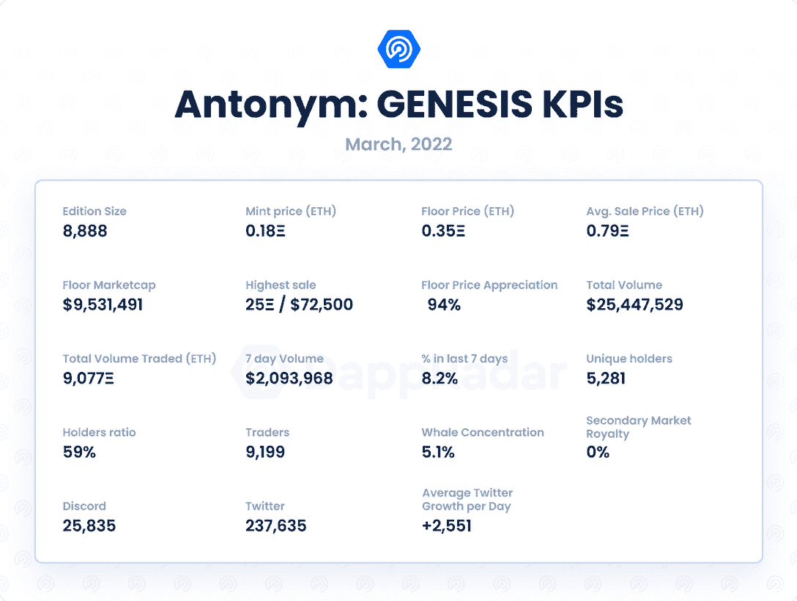
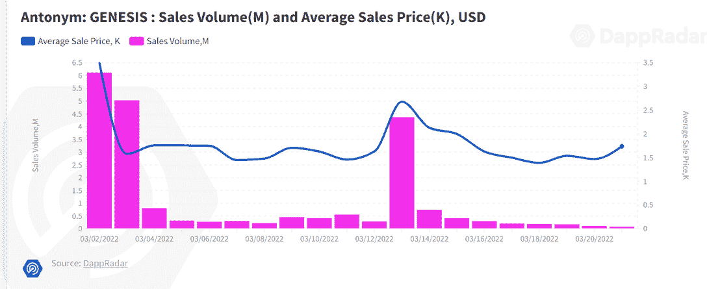
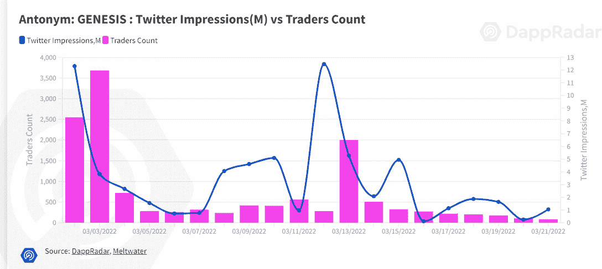
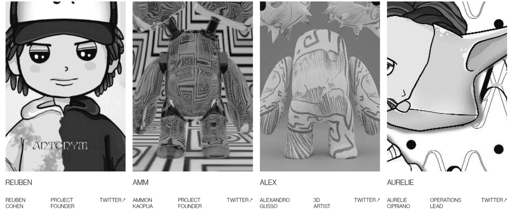
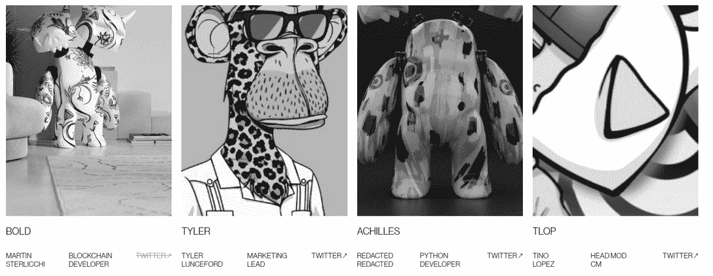
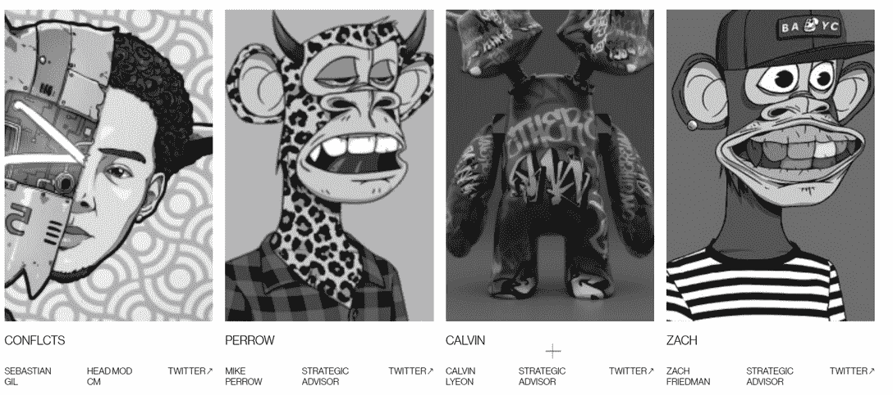

# 新 Dapps 报告:反义词:创世纪

> 原文：<https://web.archive.org/web/https://dappradar.com/blog/new-dapps-report-antonym-genesis>

## 正在形成的生活方式品牌

在这份 2022 年 3 月版的 DappRadar 的新 Dapps 报告中，我们来看看市场上出现的流行和独特的 NFT 系列。这个 Dapps 报告将回顾反义词:创世纪。新的 Dapps 报告是对 NFT 收藏的财务指标的执行概述和分析。

*这份新的 Dapps 报告是[系列执行报告](https://web.archive.org/web/20221201203301/https://dappradar.com/blog/tag/new-dapps-report)的一部分，为读者提供了一个有前途的随机产生的 NFT 集合的高级视角。该报告侧重于财务指标，包括销售活动和价格分析，以及分布指标，如独特持有人比率和鲸鱼集中指数。它还深入研究了鲸鱼的行为模式以及社会和技术概况。*

反义词:创世纪是 8888 个 NFT 化身的集合。该系列自称为“phygital”，旨在弥合现实世界和数字世界之间的差距，创造独特的产品体验。

请不要将本文件视为财务建议。

**数据更新日期:2022 年 3 月 24 日**

## 目录

*   [关键要点](https://web.archive.org/web/20221201203301/https://dappradar.com/blog/new-dapps-report-antonym-genesis/#Key Takeaways)
*   [财务概况](https://web.archive.org/web/20221201203301/https://dappradar.com/blog/new-dapps-report-antonym-genesis/#Antonym:-GENESIS---25-ETH-Top-Sale)
*   [效用](https://web.archive.org/web/20221201203301/https://dappradar.com/blog/new-dapps-report-antonym-genesis/#Added-Utility---Robust-Offering-)
*   [社会意识和参与度](https://web.archive.org/web/20221201203301/https://dappradar.com/blog/new-dapps-report-antonym-genesis/#Social-Awareness-and-Engagement-)
*   [团队概述](https://web.archive.org/web/20221201203301/https://dappradar.com/blog/new-dapps-report-antonym-genesis/#Team-Overview)
*   [技术概述](https://web.archive.org/web/20221201203301/https://dappradar.com/blog/new-dapps-report-antonym-genesis/#Technical-Overview)
*   [鲸鱼钱包分析](https://web.archive.org/web/20221201203301/http://whale-wallet-analysis/)
*   [总结](https://web.archive.org/web/20221201203301/https://dappradar.com/blog/new-dapps-report-antonym-genesis/#Summary)

## 关键要点

*   《反义词:创世纪》30 天的交易量超过 2500 万美元，是交易量第 19 大的收藏
*   最高成交价是 25 ETH/72，500 美元，发生在 3 月 1 日铸币后一天

## 反义词:创世纪–第 25 届顶级销售

*   **区块链:**以太坊
*   **上市日期:**2022 年 3 月 1 日
*   **版本尺寸:**8888-限量版
*   **特质:** 10
*   **属性:** 670
*   **底价:** 0.35 瑞士法郎

反义词:GENESIS 在第一周创造了 1300 万美元的销售额，第二周创造了 700 万美元的销售额——这是新项目的典型场景，通常在第一周销售额飙升，然后在接下来的几周内回落。一个项目的可持续性通常取决于开发价格和销售量。价格发展一直乏善可陈。在最初的下跌后，平均价格巩固在 0.79 ETH，比铸币价格上涨了 339%。

撰写本文时的底价为 0.35 ETH，比原价上涨了 94%。

## 增加的效用–强大的产品

反义词:创世纪提供了强大的公用事业产品。它努力通过融合数字和现实世界成为一个主要的生活方式品牌。Antonym 寻求通过“一线”城市的时尚合作和零售点来融合时尚、艺术和文化。

根据项目路线图，Antonym 的目标是将独特的具有收藏价值的玩具运送给持有者，就像他们的 NFT 玩具一样。尺寸从桌面小雕像到真人大小的雕像都有，取决于持有者拥有的反义词 NFT 的数量。此外，Antonym 希望通过在 2022 年 Q1 奥运会上从各行各业招聘专业人士来扩大其团队。

在 Q2 和第三季度之间，团队将专注于向持有者提供反义词数字。在第三季度，Antonym 将向 genesis 持有者投放第一季胶囊，并探索过渡到 DAO。最后，在第 4 季度，该团队计划创建一个高级市场，用于额外商品供应的“实物”兑换，并公布项目下一年的路线图。

## 社会意识和参与

反义词:创世纪在社交媒体上有相当多的追随者。 [Discord](https://web.archive.org/web/20221201203301/https://discord.com/invite/antonymgenesis) 服务器拥有 25，835 名活跃用户，一个复杂的入职流程，以及多个活跃的版主，以减少机器人和不良行为者的存在。社区参与了该项目，全天通过多种渠道进行对话。

反义词 [Twitter](https://web.archive.org/web/20221201203301/https://twitter.com/AntonymNFT) 成立于 2021 年 8 月，在撰写本文时拥有 237，635 名活跃粉丝。该账户在过去 30 天内增长了 24%,获得了 57，564 名新关注者，平均每天 1，918 名新关注者，这表明了对该系列的强烈兴趣和不断增长的需求。

该项目还有一个 Instagram 账户，目前拥有超过 38900 名粉丝。它用于共享与项目相关的艺术和其他宣传材料。

Antonym 在第一周交易人数激增，累计超过其独立交易者总数的 84%。尽管这一数字在随后几周有所下降，但共有 9，199 名独立交易者显示出对该系列的健康需求。唯一交易者计数和 Twitter 印象之间的弱相关性表明 Twitter 炒作不是这个项目的销售驱动力。

## 团队概述

反义词:GENESIS 背后的团队已经公开了他们的名字和 LinkedIn 个人资料，这证实了他们的经历，并激发了信任。

团队由[鲁本](https://web.archive.org/web/20221201203301/https://twitter.com/0xreuben)、[阿姆姆](https://web.archive.org/web/20221201203301/https://twitter.com/ammtonym)、[亚历克斯](https://web.archive.org/web/20221201203301/https://twitter.com/GussoAlexandro)、[奥雷利](https://web.archive.org/web/20221201203301/https://twitter.com/AurelieCipriano)、博尔德[泰勒](https://web.archive.org/web/20221201203301/https://twitter.com/cardinale_eth)、阿喀琉斯 [Tlop](https://web.archive.org/web/20221201203301/https://twitter.com/tlop90nine) 、[冲突](https://web.archive.org/web/20221201203301/https://twitter.com/Conflcts)、[佩罗](https://web.archive.org/web/20221201203301/https://twitter.com/perrow)、[卡尔文](https://web.archive.org/web/20221201203301/https://twitter.com/MisturWolf)和[扎克](https://web.archive.org/web/20221201203301/https://twitter.com/Zcryptokid)组成。Reuben 和 Amm 负责这个项目，Alex 是首席美工，Aurelie 和 Tyler 负责运营和营销。Bold 和 Achilles 组成了开发团队。冲突和 Tlop 负责社区和协调，而 Perrow Calvin 和 Zach 是该项目的战略顾问。该项目还有一个由全球 25 位艺术家组成的专门艺术部门。

      Source: [antonymnft.com](https://web.archive.org/web/20221201203301/https://www.antonymnft.com/#about)

      Source: [antonymnft.com](https://web.archive.org/web/20221201203301/https://www.antonymnft.com/#about)

      Source: [antonymnft.com](https://web.archive.org/web/20221201203301/https://www.antonymnft.com/#about)

## 技术概述

像大多数 NFT 项目一样，Antonym: GENESIS 使用 IPFS 而不是完全在链上存储元数据，这对视觉上丰富的元数据项目构成了挑战，因为智能合约和元数据是分开的。不过，从技术角度来看，没有什么大问题。

*   审计状态:尚未执行任何审计

*   存储:反义词:GENESIS**NFT 作为 ERC-721 令牌存储在区块链以太坊上，托管在 IPFS 上，拥有不变的所有权**

 ***   合同地址:[0x 7 E3 ef 31186 D1 bec 0d 3f 35 ad 701d 065743 b 84c 790](https://web.archive.org/web/20221201203301/https://etherscan.io/address/0x7e3ef31186d1bec0d3f35ad701d065743b84c790)

## 鲸鱼钱包分析

反义词目前唯一持有人比例 **59%** ，表示集合适度多元化；较低的比率表明对价格突变的敏感度较高。在 **5.89%** ，其鲸类浓度一般。更高的鲸鱼聚集度表明知名收藏者操纵价格的风险增加。

前五大持有者中有两大鲸鱼 [bonzi.eth](https://web.archive.org/web/20221201203301/https://dappradar.com/hub/wallet/eth/0x71e7b94490837ccaf45f9f6c7c20a3e17bbeb7d3) 和 [grail.eth](https://web.archive.org/web/20221201203301/https://dappradar.com/hub/wallet/eth/0x8ffa85a0c59cf23967eb31c060b2ca3a920276e1) 。知名 NFT 收藏家和密码投资者的出现通常表明交易活动增加，对藏品的兴趣增加。

## 摘要

反义词:“创世纪”的表现有些不尽人意。这是过去七天中交易量排名第 40 位的藏品，交易量为 2093968 美元，与同一时间推出的其他藏品相比相对较低，如 [CyberBrokers](https://web.archive.org/web/20221201203301/https://dappradar.com/blog/new-dapps-report-cyberbrokers) 或 [DourDarcels](https://web.archive.org/web/20221201203301/https://dappradar.com/blog/new-dapps-report-dourdarcels) 。

然而，它也在最近 30 天的交易量中排名第 19 位，总成交量超过 25，919，825 美元，这是一个很好的指标。底价上涨了 94%，与之前[新 Dapps 报告](https://web.archive.org/web/20221201203301/https://dappradar.com/blog/tag/new-dapps-report)中涵盖的系列相比相对较低。

任何项目的长期增长都高度依赖于其社区和效用。尽管它目前的表现，反义词:创世纪有一个重要的社会追随者，一个强大的公用事业产品，和一个专门的团队来完成它。这可能会在未来释放更大的潜力。

 NewsletterUnsubscribe at any time. [T&Cs](https://web.archive.org/web/20221201203301/https://dappradar.com/terms) and [Privacy Policy](https://web.archive.org/web/20221201203301/https://dappradar.com/privacy-policy)[<picture></picture>](https://web.archive.org/web/20221201203301/https://dappradar.com/blog/what-are-non-fungible-tokens-nfts)[<picture></picture>](https://web.archive.org/web/20221201203301/https://dappradar.com/nft/marketplaces)[<picture></picture>](https://web.archive.org/web/20221201203301/https://dappradar.com/nft/sales)**