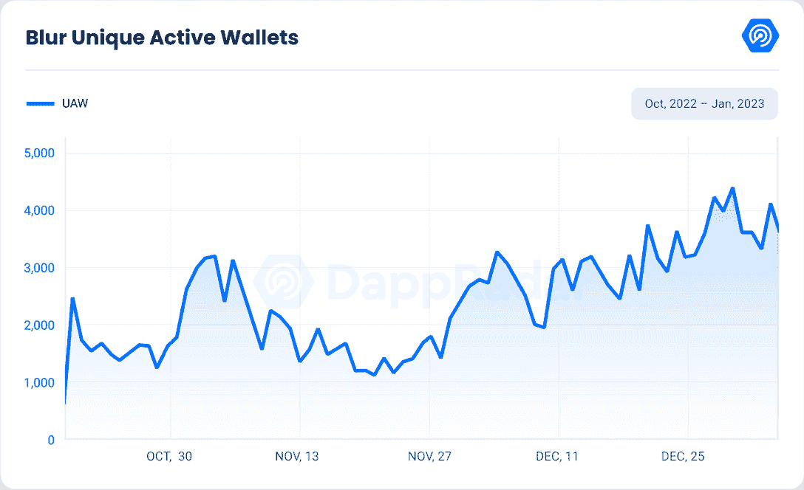
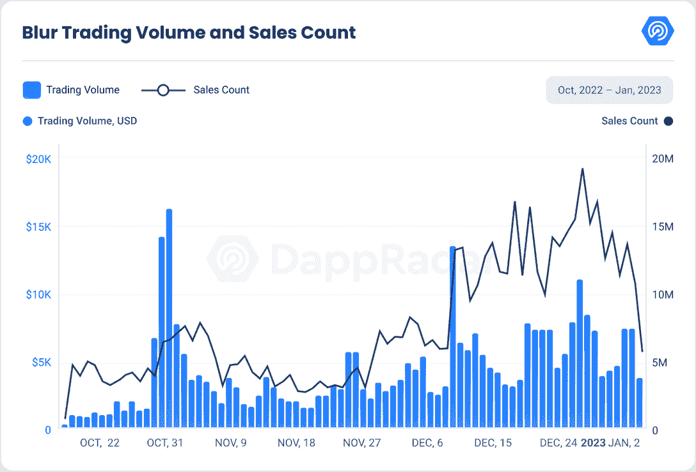

# 新的 Dapps 报告:模糊 NFT 交易量在多次空投中飙升

> 原文：<https://web.archive.org/web/https://dappradar.com/blog/new-dapps-report-blur-nft-trading-volume-spikes>

## 总部位于以太坊的 dapp blur 在创纪录的时间内飙升至 NFT 十大市场，仅三个月的交易量就达到 3.25 亿美元

**[模糊 NFT 市场](https://web.archive.org/web/20230125191230/https://dappradar.com/ethereum/marketplaces/blur)已经成为 NFT 行业的领导者，拥有实时聚合器和对创作者版税的坚定承诺。该市场的总交易额为 3.25 亿美元，目前在以太坊的 NFT 顶级市场排行榜上排名第二。**

Blur 背后的团队由来自麻省理工学院和 Citadel 等顶级组织的经验丰富的专业人士组成，他们成功填补了快速 NFT 聚合器市场的空白。除了在其平台上提供强制版税之外，Blur 还允许 NFTs 阻止零版税市场。

除了从 OpenSea、LooksRare 和 X2Y2 等领先市场聚集 NFT 房源，用户还可以在平台上本地列出他们的资产。与许多其他 NFT 市场不同，Blur 不收取交易佣金，这使得它成为销售非功能性交易的一个有吸引力的选择。该平台于 2022 年 3 月首次发布，并通过其推荐计划和封闭测试版测试迅速获得了强大的社交追随者。10 月 19 日，Blur 正式向公众推出，宣布两次空投其 BLUR token，巩固其作为 NFT 顶级市场的地位。

12 月 30 日，Blur [宣布](https://web.archive.org/web/20230125191230/https://twitter.com/blur_io/status/1608852940743405569?ref_src=twsrc%5Egoogle%7Ctwcamp%5Eserp%7Ctwgr%5Etweet)将在一月底进行第三次空投。

[Download the PDF version](//web.archive.org/web/20230125191230/https://wp.dappradar.com/wp-content/uploads/2023/01/dappradar.com-new-dapps-report-blur.pdf)

## 关键要点

*   Blur 在 NFT 行业取得了高度成功，自 10 月 19 日推出以来，截至 2022 年，交易量超过 3.01 亿美元(233，019 ETH)。在 2023 年的前 4 天，该平台已经积累了额外的 2400 万美元(18，491 ETH)和 40，915 次销售计数。
*   自推出以来，Blur 活动一直呈上升趋势，从 10 月到 1 月，其增长了 142%，平均每天达到 3，275 个独立活动钱包。
*   在过去的四个月中，Blur 上的平均销售价格稳步上升，尽管 FTX 崩溃，但 11 月份的最高价格达到了 819 美元和 0.63 ETH。在同样的趋势下，销售计数在 12 月达到最高值，为 354，491 辆，自 10 月以来增长了 649%。

## 内容

*   [尽管面临市场挑战，每日唯一活跃钱包数量仍快速增长](https://web.archive.org/web/20230125191230/https://dappradar.com/blog/new-dapps-report-blur-nft-trading-volume-spikes/#Chapter-1)
*   [NFT 交易量和销售额创历史新高](https://web.archive.org/web/20230125191230/https://dappradar.com/blog/new-dapps-report-blur-nft-trading-volume-spikes/#Chapter-2)
*   [高级 NFT 交易工具](https://web.archive.org/web/20230125191230/https://dappradar.com/blog/new-dapps-report-blur-nft-trading-volume-spikes/#Chapter-3)
*   [Blur 即将推出的治理令牌](https://web.archive.org/web/20230125191230/https://dappradar.com/blog/new-dapps-report-blur-nft-trading-volume-spikes/#Chapter-4)
*   《侠影》的匿名创始人
*   [最终想法](https://web.archive.org/web/20230125191230/https://dappradar.com/blog/new-dapps-report-blur-nft-trading-volume-spikes/#Final-thoughts)

## 尽管面临市场挑战，每日唯一活跃钱包数量仍快速增长

自 10 月 19 日启动以来，Blur 的 NFT 市场经历了令人印象深刻的活动，社区对此反应非常积极。该平台不仅成功吸引了现有交易者，还吸引了 NFT 市场的新交易者。

然而，根据行业趋势，该平台上的活动似乎受到了 11 月 FTX 局势的影响，在该月的最后两周出现了明显的下降趋势。11 月 8 日至 27 日期间，每日唯一活跃钱包数量下降了 38%。但局势平静下来后，平台上的活动开始再次呈上升趋势，并迅速攀升。11 月 27 日至 1 月 3 日期间，每日唯一活跃钱包增长了 191%。

总体而言，Blur 上的每日唯一活跃钱包持续增长，证明了该平台在 NFT 行业的成功。该平台在 FTX 事件后能够恢复并继续保持上升趋势，证明了其在市场中的弹性和受欢迎程度。

## NFT 交易量和销售额创纪录增长

自 2022 年 10 月 19 日推出以来，Blur 的交易量稳步增长。截至 2023 年 1 月 4 日，该平台已实现 3.24 亿美元的总交易量，在过去 30 天内在以太坊 NFT 市场中排名第二。

10 月 31 日，由于备受期待的艺术饕餮 NFT 造币厂，模糊看到了交易活动的高峰。这一活动吸引了大量交易者使用该平台，日交易量达到 1 300 万美元，日销售额达到 6 227 笔。

继 Art Gobblers mint 的兴奋之后，11 月份 NFT 在 Blur 上的交易活动出现了整合，日均交易量约为 300 万美元，日销售额约为 3000 英镑。总体而言，该月的总交易量为 1.148 亿美元，销售额为 136，153 笔，与 10 月相比，交易量增长了 500%，销售额增长了 185%。

12 月，这一上升趋势得以延续，Blur 实现了迄今为止最高的月度交易量，达到 1.6767 亿美元，创下了 354，491 笔的销售记录。截至 1 月的前四天，Blur 的交易量为 22，512，300.93 美元，销售额为 40，915 美元。这相当于令人印象深刻的日均 500 万美元的交易量和 10，229 笔交易。

值得考虑的是，Blur 目前的交易量可能受到正在进行的空投活动的影响。许多 NFT 交易者可能会利用模糊，以增加他们的模糊令牌分配。在 1 月份空投完成后，这些用户是否会继续使用该平台仍有待观察。尽管是一个相对较新的平台，但 Blur 在短时间内获得了大量的使用，似乎正在成为 Web3 生态系统中有价值和持久的一部分。

## 高级 NFT 交易工具

Blur 是一个 NFT 市场，旨在通过各种创新功能从竞争对手中脱颖而出。其中一个功能是该平台闪电般的待处理交易时间，在不到一秒的时间内显示 NFTs 上的待处理交易，每四秒更新一次列表。这使得模糊用户在 NFT 被其他人购买之前，在狙击 NFT 方面具有显著的优势。该平台的天然气优先预置还可以帮助用户通过首先处理他们的购买交易，在竞争中击败那些通过其他交易所或聚合商购买 NFT 的用户。此外，Blur 的合同比其他市场的合同更优化，用户可以节省高达 17%的油费。

Blur 的另一个广受好评的方面是其用户友好的界面，它清楚地显示了不同 NFT 性状的稀有程度，并允许用户看到特定属性的底价。这对于试图准确评估自己资产价值的用户，或者那些希望狙击价值被低估的非功能性资产的人来说，非常有帮助。

除了这些功能，Blur 还擅长帮助用户“扫地”的工具——即从给定的集合中购买多个价格最低的 NFT。该平台上的所有系列都有一个楼层深度图，显示在楼层上方不同间隔列出的 NFT 数量，这对于希望可视化其购买对市场的影响的用户来说很有帮助。当涉及到清扫 NFT 时，Blur 还包括许多生活质量更新，例如跳过有待定交易或被标记为可疑或被盗的 NFT。

这些功能虽然目前只适用于基于以太坊的 NFT，但已经受到了用户的广泛好评。模糊小组还暗示了未来在其他链上集成 NFT 的可能性。

## 侠影即将推出的治理令牌

该平台对其令牌结构和治理系统有些保密。尽管宣布将在 2023 年 1 月通过第三次空投推出模糊治理令牌，但最大供应量和种子投资者分配等细节尚未披露。尽管如此，Blur 已经确认发布令牌的事实使其在去中心化和社区参与方面领先于其主要竞争对手 OpenSea。第一次空投是[在 10 月 19 日](https://web.archive.org/web/20230125191230/https://twitter.com/blur_io/status/1582777817141370885?ref_src=twsrc%5Etfw%7Ctwcamp%5Etweetembed%7Ctwterm%5E1582777817141370885%7Ctwgr%5E8b9ae172c3362b002132fcd5693e6bc54b52a634%7Ctwcon%5Es1_&ref_url=https%3A%2F%2Fdecrypt.co%2F112414%2Fethereum-nft-marketplace-blur-launches-free-airdrop)发射的，当时平台开始运行。此空投适用于之前六个月内在以太坊上交易过 NFT 的所有钱包。

第二次空投是[于 11 月 30 日](https://web.archive.org/web/20230125191230/https://twitter.com/blur_io/status/1598017860236095489)宣布，面向 2022 年 12 月 5 日前在平台上市的所有交易者。护理包包含 BLUR 的令牌 Blur，符合条件的用户可以在 2022 年 12 月 5 日至 2023 年 1 月 3 日期间领取他们的包。

为了最大化他们的空投，用户被鼓励列出蓝筹股或更活跃的集合，使用 Blur 的所有列表工具，并在平台上放置至少三次扫描。将版税设定在 0.5%以上也能带来更好的空投效果。对平台的忠诚度将影响收到的护理包的稀有度，稀有度越高，代币越多。为了保持高水平的忠诚度，用户必须以与其他市场相同或更低的价格在 Blur 上列出他们的 NFT。

第三次空投是在 12 月 14 日宣布的，将针对在 Blur 上出价的交易者。优化奖励的建议策略是对高交易量的收藏进行投标，尽可能接近底价，持续时间最长。接受投标和不接受投标都没有好处。事实上，接受出价实际上会损害获得回报的机会，这就是为什么一些活跃的交易者倾向于反复出价和取消出价。模糊团队已经[证实](https://web.archive.org/web/20230125191230/https://mirror.xyz/blurdao.eth/BnVAt_z_6bEr9O4oLIFwyEjCmAGGb02jz8y3G7qJQhA)基于交易量对交易者没有额外的好处。

## 侠影的匿名创始人

2022 年 3 月，Blur 的种子轮取得了巨大成功，在领先的加密风险投资公司 Paradigm 的帮助下筹集了 1100 万美元。Paradigm 在投资成功的 NFT 项目方面有着良好的记录，如 OpenSea 和 Magic Eden，它参与 Blur 的资金是一个充满希望的迹象。这一轮也看到了 NFT 和加密社区的几个著名人物的参与，包括朋克 6529，Cozomo de' Medici，Zeneca 和 moon 霸王。

关于 Blur 有一点需要注意，它背后的团队选择了匿名，通过假名的在线角色进行交流，而不是透露他们的真实身份。虽然这在加密世界中并不罕见，但它确实产生了某种程度的不确定性，因为没有办法让团队对他们的行为负责。

尽管模糊团队是匿名的，但他们的投资者可能知道他们的身份，团队的质量可以从他们的专业背景中推断出来，包括在麻省理工学院、Citadel、五环资本、Twitch、Brex、Square 和 Y Combinator 的经验。此外，该项目的重点是将其激励机制与更广泛的 NFT 社区及其声誉良好的支持者的激励机制相结合，这表明它是一个值得信赖的项目。然而，对用户来说，在作出投资决定之前彻底研究任何项目总是很重要的

## 最后的想法

尽管目前加密货币市场经济低迷，但 Blur 背后的开发团队仍然致力于 Web3 和 NFT 市场的长期潜力。从技术角度来看，模糊优于其他 NFT 市场和聚合器，正如在艺术 Gobblers 造币活动期间所展示的那样。

虽然 Blur 提供的价值是毋庸置疑的，但它获得广泛采用的能力可能不太确定。虽然一个由专注的 NFT 交易员组成的核心社区可能会继续使用 Blur，但更新或更随意的 NFT 买家可能会更喜欢 OpenSea 等平台的简单性。随着加密货币和 NFTs 的采用增加，Blur 的用户群可能会增长。

然而，为了成功地与 OpenSea 这样的成熟平台竞争，Blur 需要找到一种方法来吸引专业交易者和更广泛的受众，同时保持其当前的功能水平。